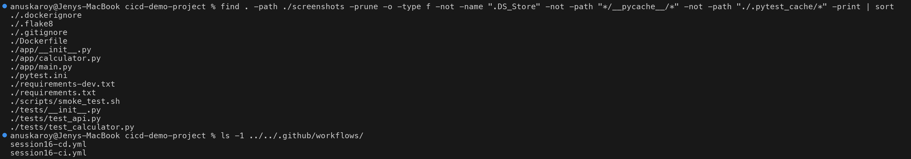
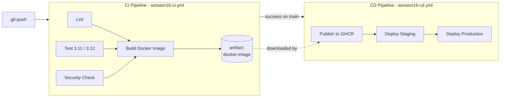
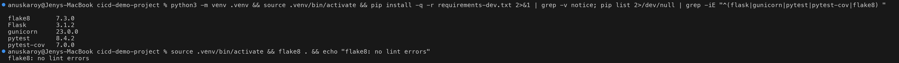
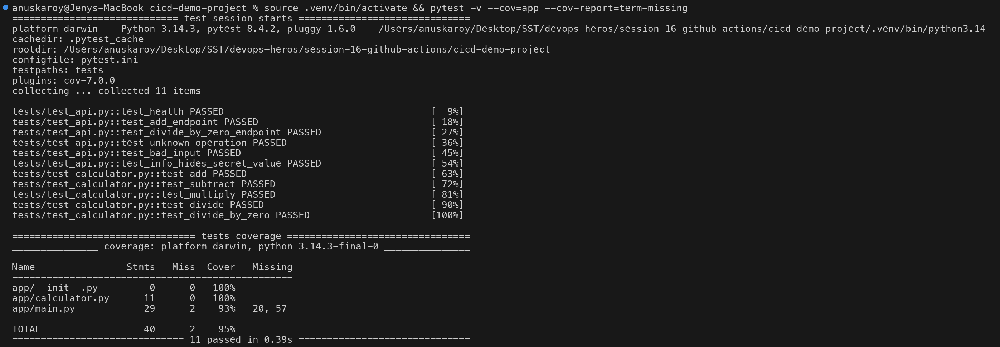
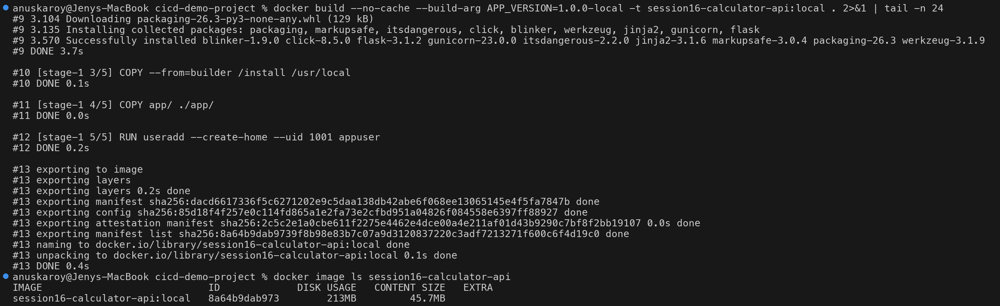
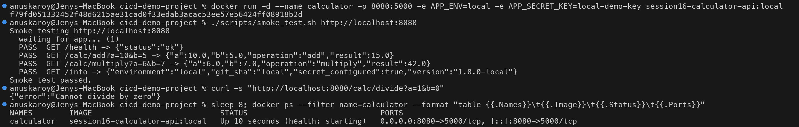
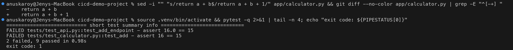

# Session 16 – CI/CD Demo Project with GitHub Actions

A small **Flask calculator REST API** shipped through a complete **CI/CD pipeline** built with
GitHub Actions: every push is linted, tested, security-checked and built into a Docker image (CI),
and every green build on `main` is published to GitHub Container Registry and deployed to
**staging → production** (CD).

Based on `session-16-github-actions/10-final-cicd-pipeline`, extended with a Dockerfile, a REST
API, a CD workflow, secrets and cross-workflow artifacts.

---

## 1. Project Structure

```text
devops-heros/
├── .github/workflows/
│   ├── session16-ci.yml          # CI pipeline  (lint → test → security → build)
│   └── session16-cd.yml          # CD pipeline  (publish → staging → production)
└── session-16-github-actions/cicd-demo-project/
    ├── app/
    │   ├── calculator.py         # business logic (pure functions)
    │   └── main.py               # Flask REST API
    ├── tests/
    │   ├── test_calculator.py    # unit tests
    │   └── test_api.py           # API tests (Flask test client)
    ├── scripts/smoke_test.sh     # post-deploy smoke test
    ├── Dockerfile                # multi-stage, non-root, healthcheck
    ├── requirements.txt          # runtime deps  (flask, gunicorn)
    ├── requirements-dev.txt      # CI deps       (pytest, pytest-cov, flake8)
    └── screenshots/
```

> GitHub only runs workflows from `.github/workflows/` at the **repository root**, so the two
> workflow files live there. They use `paths:` filters and `defaults.run.working-directory` so
> they only react to (and run inside) this project folder.



### API

| Endpoint | Description |
|---|---|
| `GET /health` | Liveness check (used by Docker `HEALTHCHECK` and smoke tests) |
| `GET /info` | Version, git SHA, environment, and whether the secret is configured |
| `GET /calc/<op>?a=&b=` | `op` = `add` \| `subtract` \| `multiply` \| `divide` |

---

## 2. CI vs CD

| | **Continuous Integration (CI)** | **Continuous Delivery / Deployment (CD)** |
|---|---|---|
| Question it answers | *Is this change correct?* | *Can we release it — and release it?* |
| Trigger | Every push / pull request | A successful CI build on `main` |
| Does | Lint, test, scan, build | Publish image, deploy, verify |
| Output | A tested **artifact** (Docker image) | A **running** application |
| In this project | `session16-ci.yml` | `session16-cd.yml` |

- **Continuous Delivery** – every green build is *ready* to deploy; a human may approve the release.
- **Continuous Deployment** – every green build is deployed automatically, no human step.

This project does **continuous deployment**. Adding *required reviewers* to the `production`
environment (Settings → Environments) turns it into **continuous delivery** without any YAML change.

---

## 3. The CI/CD Pipeline



**Build once, deploy many:** the CD pipeline does not rebuild the image. It downloads the exact
image CI built and tested (the `docker-image` artifact), pushes it to
`ghcr.io/jenyyy4/session16-calculator-api`, and deploys that image to both environments.

---

## 4. GitHub Actions Concepts — Where Each One Appears

### Workflow
A YAML file in `.github/workflows/`. This project has two, linked by the `workflow_run` event:

```yaml
# session16-ci.yml
on:
  push:          { branches: [main], paths: [...] }
  pull_request:  { branches: [main], paths: [...] }
  workflow_dispatch:            # manual "Run workflow" button

# session16-cd.yml
on:
  workflow_run:
    workflows: ["Session 16 - CI Pipeline"]
    types: [completed]
    branches: [main]
```

### Jobs
Independent units of work, each on a fresh runner. They run **in parallel** unless linked by `needs:`.

| Workflow | Job | Depends on |
|---|---|---|
| CI | `lint`, `test` (×2 matrix), `security-check` | – (run in parallel) |
| CI | `build` | `needs: [lint, test, security-check]` |
| CD | `publish` | `if:` CI concluded `success` |
| CD | `deploy-staging` | `needs: publish` |
| CD | `deploy-production` | `needs: [publish, deploy-staging]` |

### Steps
The ordered commands inside a job. A step either **uses** a reusable action or **runs** a shell command:

```yaml
steps:
  - name: Checkout source code
    uses: actions/checkout@v7          # reusable action
  - name: Run flake8
    run: flake8 .                       # shell command
```

### Runners
`runs-on: ubuntu-latest` — a GitHub-hosted Ubuntu VM, created fresh for every job and destroyed
afterwards (which is why every job checks out the code again). The `test` job uses a **matrix**
to fan out onto two runners, one per Python version:

```yaml
strategy:
  matrix:
    python-version: ["3.11", "3.12"]
```

A self-hosted runner would use `runs-on: self-hosted` instead.

### Secrets
| Secret | Type | Used for |
|---|---|---|
| `GITHUB_TOKEN` | automatic, per run | log in to GHCR, download artifacts from the CI run |
| `APP_SECRET_KEY` | repository secret (manual) | injected into the container at deploy time |

```yaml
permissions:          # least privilege for GITHUB_TOKEN
  contents: read
  actions: read       # read the CI run's artifacts
  packages: write     # push to ghcr.io

- name: Deploy container
  env:
    APP_SECRET_KEY: ${{ secrets.APP_SECRET_KEY }}   # passed via env, never echoed
  run: docker run -d ... -e APP_SECRET_KEY $IMAGE
```

Secrets are never written into the image or printed. The app's `/info` endpoint returns only
`"secret_configured": true/false`, and `test_info_hides_secret_value` checks that the value
never leaks.

### Artifacts
Files a job saves so they outlive its runner:

| Artifact | Produced by | Contents |
|---|---|---|
| `test-reports-py3.11`, `test-reports-py3.12` | CI `test` (uploaded even on failure: `if: always()`) | JUnit XML + coverage XML |
| `docker-image` | CI `build` | `image.tar.gz` + `build-info.txt` |

The CD workflow downloads `docker-image` **from a different workflow run**:

```yaml
- uses: actions/download-artifact@v8
  with:
    name: docker-image
    run-id: ${{ github.event.workflow_run.id }}
    github-token: ${{ secrets.GITHUB_TOKEN }}
```

### Build
A multi-stage `Dockerfile`: dependencies are installed in a `builder` stage and only the installed
packages and `app/` are copied into the final image, which runs as non-root `appuser` under
gunicorn with a `HEALTHCHECK`. CI stamps every image with build args:

```bash
docker build --build-arg APP_VERSION=1.0.${{ github.run_number }} \
             --build-arg GIT_SHA=${{ github.sha }} -t session16-calculator-api:${{ github.sha }} .
```

### Test
Three layers of testing guard the pipeline:

1. **Static analysis** – `flake8` (lint job)
2. **Unit + API tests** – 11 `pytest` tests, coverage report, on Python 3.11 and 3.12
3. **Smoke tests** – `scripts/smoke_test.sh` hits the *running container* in CI and again after
   each deployment

---

## 5. Run Locally

### Install dependencies and lint
```bash
cd session-16-github-actions/cicd-demo-project
python3 -m venv .venv && source .venv/bin/activate
pip install -r requirements-dev.txt
flake8 .
```


### Run the tests
```bash
pytest -v --cov=app --cov-report=term-missing
```


### Build the Docker image
```bash
docker build --build-arg APP_VERSION=1.0.0-local -t session16-calculator-api:local .
docker image ls session16-calculator-api
```


### Run the container and smoke test it
```bash
docker run -d --name calculator -p 8080:5000 \
  -e APP_ENV=local -e APP_SECRET_KEY=local-demo-key session16-calculator-api:local
./scripts/smoke_test.sh http://localhost:8080
curl -s "http://localhost:8080/calc/divide?a=1&b=0"
docker rm -f calculator
```
> On macOS, port 5000 is taken by the AirPlay Receiver, so the container is mapped to **8080**.



---

## 6. Pipeline Execution on GitHub

### One-time setup
```bash
# repository secret used by the CD pipeline
openssl rand -hex 24 | gh secret set APP_SECRET_KEY --repo jenyyy4/devops-heros
gh secret list --repo jenyyy4/devops-heros
```
The `staging` and `production` environments are created automatically the first time the CD
workflow runs.

### Trigger
```bash
git add .github/workflows/session16-*.yml session-16-github-actions/cicd-demo-project
git commit -m "session16: CI/CD demo project"
git push origin main          # → CI runs → on success, CD runs
```
Or trigger it manually: **Actions → Session 16 - CI Pipeline → Run workflow**, or
`gh workflow run session16-ci.yml`.

### Expected result
```text
Session 16 - CI Pipeline                    Session 16 - CD Pipeline
├── ✓ Lint (flake8)                         ├── ✓ Publish Image to GHCR
├── ✓ Test (Python 3.11)                    ├── ✓ Deploy to Staging
├── ✓ Test (Python 3.12)                    └── ✓ Deploy to Production
├── ✓ Security Check
└── ✓ Build Docker Image
      └── artifacts: docker-image, test-reports-py3.11, test-reports-py3.12
```

<!-- GITHUB-RUN-SCREENSHOTS -->

---

## 7. Failure Scenario — a Broken Test Stops the Pipeline

Break the logic in `app/calculator.py`:
```python
def add(a, b):
    return a + b + 1
```
Locally, `pytest` exits with code 1 — the same non-zero exit that fails the `test` job on GitHub:



Push it on a branch and run CI:
```bash
git checkout -b demo/failing-test
git commit -am "Break add()" && git push -u origin demo/failing-test
gh workflow run session16-ci.yml --ref demo/failing-test
```
Expected:
```text
✓ Lint (flake8)
✗ Test (Python 3.11)      test_add: assert 16 == 15, test_add_endpoint: assert 16.0 == 15
✗ Test (Python 3.12)
✓ Security Check
– Build Docker Image      skipped (needs: test)
CD Pipeline               not triggered (CI failed / not main)
```
`needs:` stops the build, and the CD `if:` condition (`workflow_run.conclusion == 'success'`)
means a failing commit is **never** published or deployed. Restore `return a + b` to fix it.

---

## 8. Concept Map

```text
CI/CD
├── CI  (session16-ci.yml)            Build + Test on every change
│   ├── lint            → flake8
│   ├── test            → pytest × matrix [3.11, 3.12]  → artifact: test-reports
│   ├── security-check  → sensitive files / hard-coded secrets
│   └── build           → docker build + smoke test      → artifact: docker-image
│
└── CD  (session16-cd.yml)            Deliver + Deploy every green main build
    ├── publish            → docker push ghcr.io/...      (GITHUB_TOKEN)
    ├── deploy-staging     → environment: staging         (APP_SECRET_KEY)
    └── deploy-production  → environment: production      (APP_SECRET_KEY)

GitHub Actions building blocks:
Workflow ─▶ Jobs ─▶ Steps (uses / run) ─▶ executed on Runners
                         └── read Secrets, produce/consume Artifacts
```

> **Note:** "Deploy" in this demo pulls the published image onto the GitHub runner, starts it with
> the environment's configuration and secret, and smoke-tests it. In a real project the same job
> would `ssh`/`kubectl`/`helm upgrade` against a server, Kubernetes cluster or cloud service. Only
> that one step changes; the pipeline structure stays the same.
