# Session 16: CI/CD Demo Project with GitHub Actions

A small **Flask calculator API** with a complete CI/CD pipeline on GitHub Actions. It's built on the ideas in [`10-final-cicd-pipeline`](../session-16-github-actions/10-final-cicd-pipeline/README.md) (test → security check → build → artifact) and extends them with Docker, a container registry and a real Kubernetes deployment.

- **Live repository:** https://github.com/MadaraUchiha-tech/cicd-demo
- **Pipeline runs:** https://github.com/MadaraUchiha-tech/cicd-demo/actions
- **Published image:** `ghcr.io/madarauchiha-tech/calculator-api` ([package page](https://github.com/MadaraUchiha-tech/cicd-demo/pkgs/container/calculator-api))

All screenshots in [`docs/screenshots/`](docs/screenshots/) are real captures: terminal windows on my Mac, and the GitHub pages in Chrome.

---

## 1. Architecture

```text
 Developer ──git push──▶ GitHub repo (main)
                              │
                              ▼
 ┌──────────────────────── CI workflow (ci.yml) ────────────────────────┐
 │  Lint (flake8) ─┐                                                    │
 │                 ├─▶ Test matrix (py 3.11 / 3.12 / 3.13) ─┐           │
 │  Security check ┴────────────────────────────────────────┴▶ Build    │
 │                                       Docker image + smoke test      │
 │                                       └─▶ artifact: image .tar.gz    │
 └──────────────────────────────────────────┬───────────────────────────┘
                                            │ workflow_run: completed + success
                                            ▼
 ┌──────────────────────── CD workflow (cd.yml) ────────────────────────┐
 │  Push image to GHCR (GITHUB_TOKEN) ─▶ Deploy to "staging" environment │
 │                                       kind cluster on the runner      │
 │                                       Secret from APP_SECRET_KEY      │
 │                                       kubectl apply + rollout status  │
 │                                       smoke test (version == SHA)     │
 └───────────────────────────────────────────────────────────────────────┘
```

## 2. Project layout

```text
cicd-demo/
├── app/
│   ├── calculator.py        # add / subtract / multiply / divide
│   └── main.py              # Flask API: /, /health, /calc/<op>?a=&b=
├── tests/                   # 11 pytest tests (unit + API)
├── k8s/
│   ├── deployment.yaml      # 2 replicas, probes, resources, IMAGE_PLACEHOLDER
│   └── service.yaml
├── .github/workflows/
│   ├── ci.yml               # CI pipeline
│   └── cd.yml               # CD pipeline
├── Dockerfile               # python:3.12-slim, gunicorn, non-root user, HEALTHCHECK
├── requirements.txt / requirements-dev.txt
└── docs/screenshots/
```

---

## 3. Concepts covered, and where they are in this project

| Concept | Where / how |
|---|---|
| **CI vs CD** | `ci.yml` = Continuous **Integration**: every push/PR is linted, tested and built automatically. `cd.yml` = Continuous **Delivery/Deployment**: only a *successful* CI run on `main` is published to a registry and deployed. |
| **CI/CD pipeline** | Two chained workflows. CD is triggered by `on: workflow_run: workflows: [CI], types: [completed]` and guarded by `if: github.event.workflow_run.conclusion == 'success'`. |
| **GitHub Actions** | YAML in `.github/workflows/`, using marketplace actions: `actions/checkout@v7`, `actions/setup-python@v7`, `actions/upload-artifact@v7`, `docker/login-action@v4`, `helm/kind-action@v1`. |
| **Workflow** | Triggers: `push` and `pull_request` to `main`, `workflow_dispatch` (manual button), `workflow_run` (CD after CI). |
| **Jobs** | CI: `lint`, `security-check`, `test` (matrix), `build`. CD: `push-image`, `deploy-staging`. `needs:` creates the order; jobs without `needs` run in **parallel** (lint and security check). |
| **Steps** | e.g. `test` = checkout → setup-python (with pip cache) → install → pytest → upload results. Each step is either `uses:` (an action) or `run:` (shell). |
| **Runners** | GitHub-hosted `ubuntu-latest` VMs. A **matrix** fans the test job out to 3 runners (Python 3.11 / 3.12 / 3.13) with `fail-fast: false`. A self-hosted runner would just change `runs-on: [self-hosted, linux]`. |
| **Secrets** | `secrets.GITHUB_TOKEN` (automatic, scoped by `permissions: packages: write`) logs in to GHCR. `secrets.APP_SECRET_KEY` (repository secret, set with `gh secret set`) is turned into a Kubernetes Secret. Both appear as `***` in logs. Deploy runs in a GitHub **environment** `staging`. |
| **Artifacts** | `test-results-py3.x` (JUnit XML + coverage XML) per matrix leg, and `calculator-api-image` (the built image as `.tar.gz` + `build-info.txt`). |
| **Build** | `docker build --build-arg APP_VERSION=<short-sha>`, then a container smoke test (`/health`, `/calc/add`) in CI. |
| **Test** | flake8 lint + 11 pytest tests with coverage, on 3 Python versions. |
| **Pipeline execution** | 4 CI runs and 4 CD runs, including a deliberately failing commit (section 5). |

---

## 4. Running it locally

```bash
python3 -m venv .venv && source .venv/bin/activate
pip install -r requirements-dev.txt
flake8 app tests
pytest -v --cov=app
docker build -t calculator-api:local .
docker run -d --rm -p 18080:8080 calculator-api:local
curl "localhost:18080/calc/add?a=2&b=3"
```

flake8 is clean and all 11 tests pass:

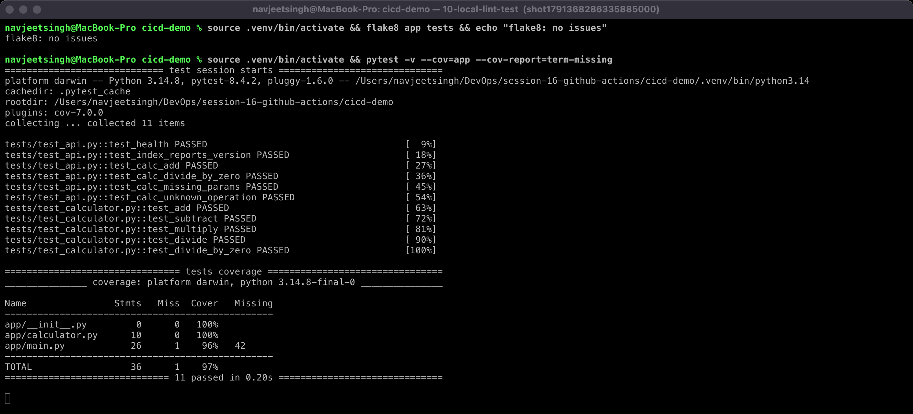

The Docker image builds and serves requests. `id` shows it runs as the non-root `appuser` (uid 10001), and dividing by zero returns a clean 400 error:

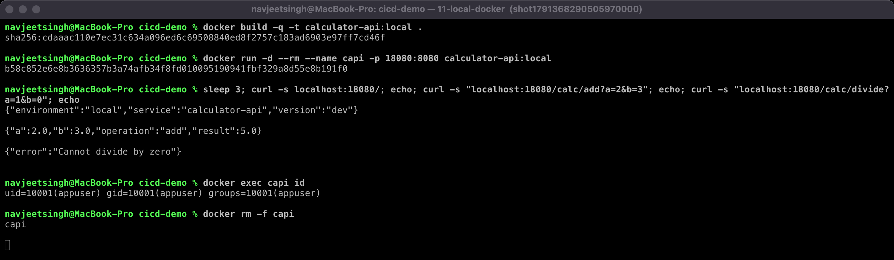

---

## 5. Pipeline execution

### Run history

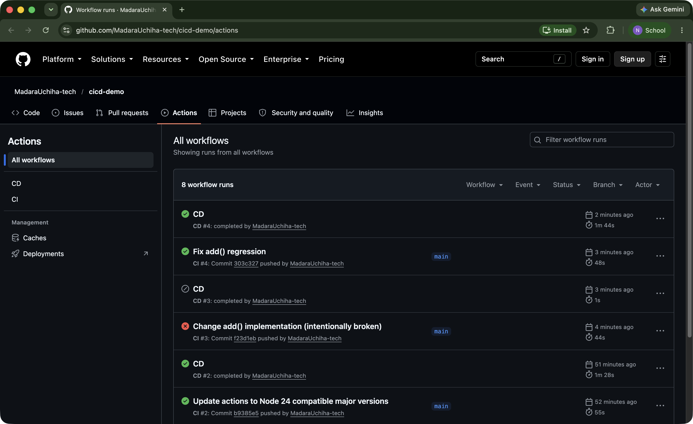

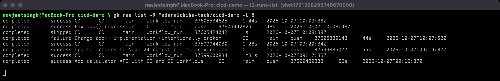

| Commit | CI | CD |
|---|---|---|
| `70c8534` Add calculator API with CI and CD workflows | ✅ | ✅ deployed |
| `b9385e5` Update actions to Node 24 compatible major versions (removed the Node 20 deprecation warnings from the first run) | ✅ | ✅ deployed |
| `f23d1eb` Change add() implementation (**intentionally broken**: `return a + b + 1`) | ❌ tests failed, **Build skipped** | ⏭ **skipped**, nothing deployed |
| `303c327` Fix add() regression | ✅ | ✅ deployed |

### Successful CI run

Lint and Security check run in parallel → 3-job test matrix → Build Docker image. 4 artifacts.

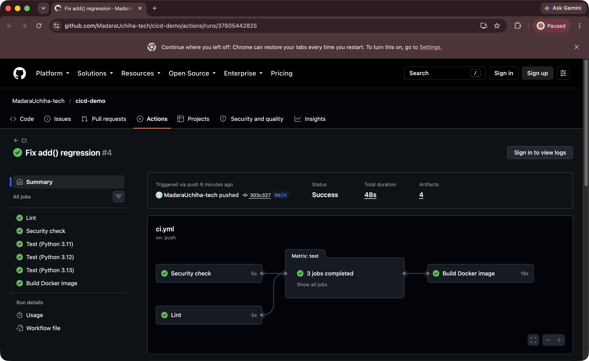

### Failure scenario: broken code is stopped by CI

`add()` was changed to `return a + b + 1`. The tests caught it (`assert 6 == 5`). Because `build` has `needs: [test, security-check]`, the image was never built:

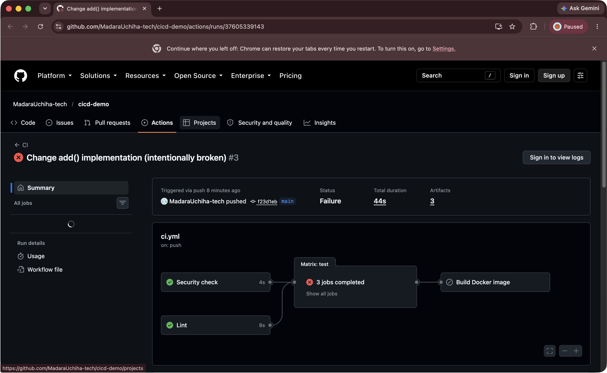

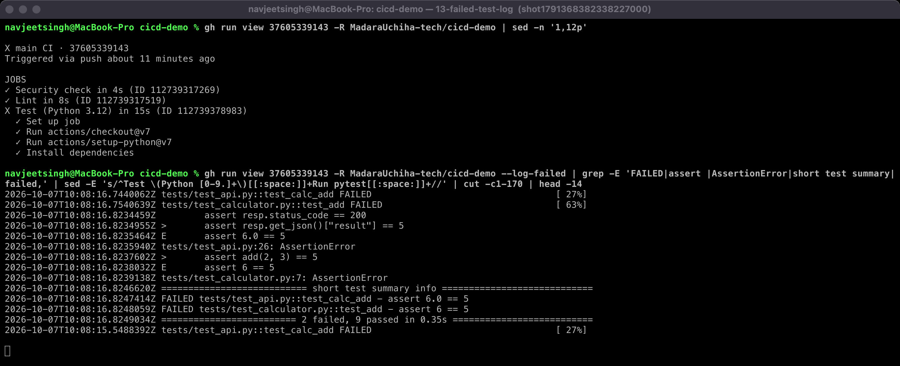

The CD workflow was still *triggered* by the completed CI run, but its `if:` condition saw `conclusion == failure`, so every job was **skipped**. The bad version never reached the registry or the cluster:

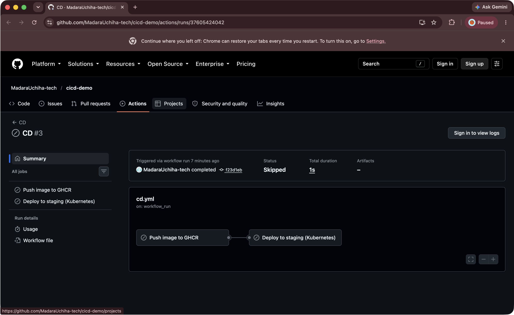

### Successful CD run: push + deploy

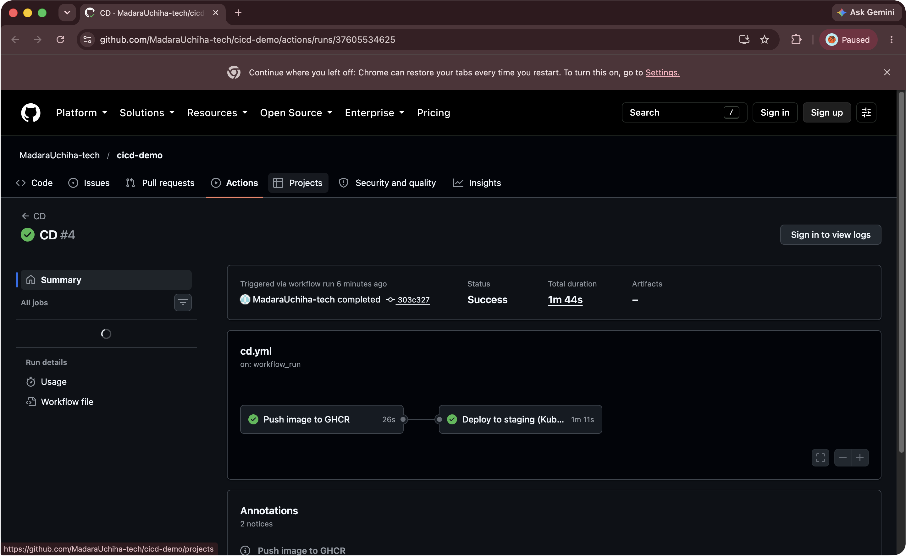

From the deploy job log:
- the repository secret is masked (`APP_SECRET_KEY: ***`)
- the Deployment rolls out 2/2 Pods running `ghcr.io/madarauchiha-tech/calculator-api:303c327`
- the smoke test confirms the running version equals the commit SHA

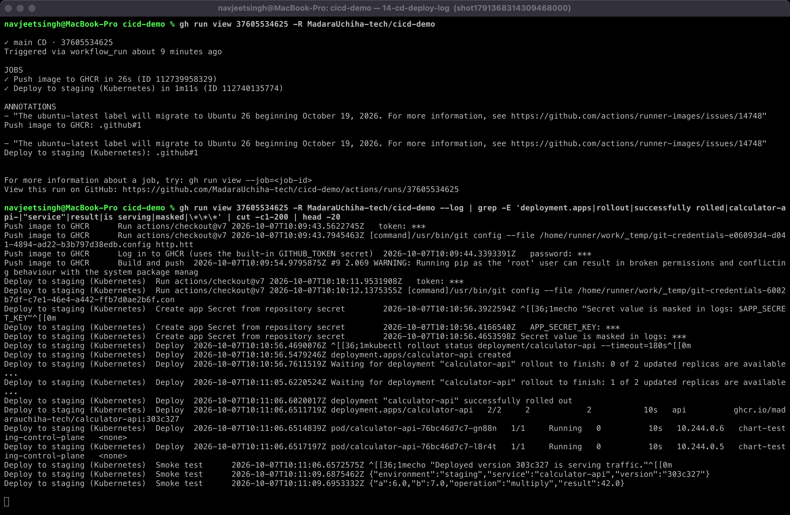

### Container registry (GHCR)

Every successful CD run pushes `:<short-sha>` and `:latest`:

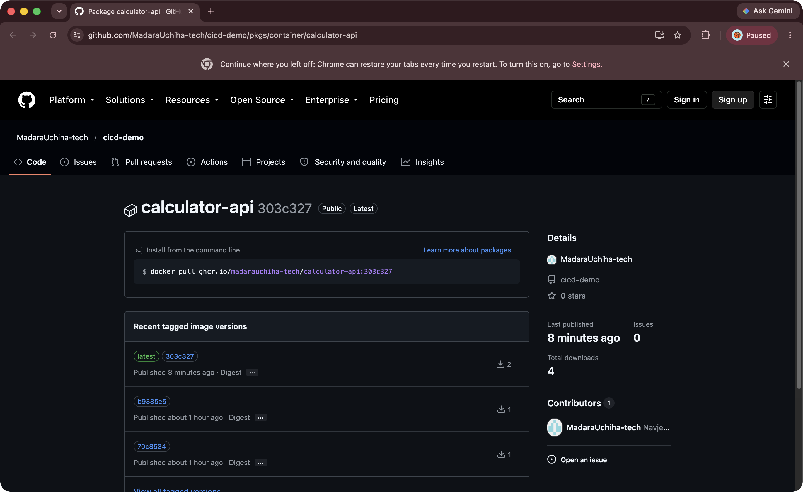

### Artifacts, secrets and environment

I downloaded the build artifact with `gh run download`. It contains the image tarball and `build-info.txt`. The page also shows the repository secret `APP_SECRET_KEY` and the `staging` environment that GitHub created on first deploy:

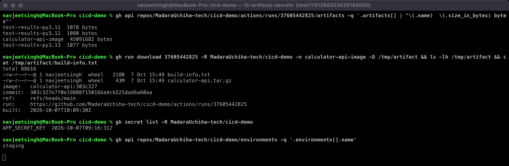

---

## 6. What I learned

- `needs:` is what turns independent jobs into a pipeline. A failing test job automatically skips everything downstream.
- Splitting CI and CD into two workflows (`workflow_run`) keeps PRs fast and safe: PRs only run CI and never get registry credentials or deploy.
- `workflow_run` fires on *completed*, not only on success, so the `conclusion == 'success'` check is essential. Without it, the broken commit would have been deployed.
- Tagging images with the commit SHA (and checking it in the smoke test) means you always know exactly which code is running.
- Secrets never appear in logs. GitHub masks them, and `GITHUB_TOKEN` permissions are kept to the minimum (`contents: read`, `packages: write` only where needed).
- Action versions matter: the first run warned that Node 20 actions are deprecated, so I bumped `checkout`, `setup-python`, `upload-artifact` and `login-action` to their current major versions.
