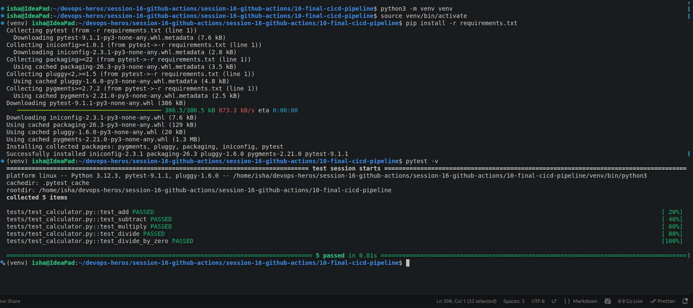
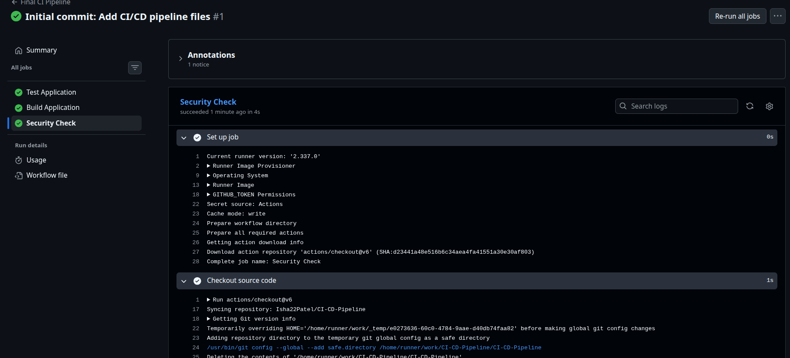
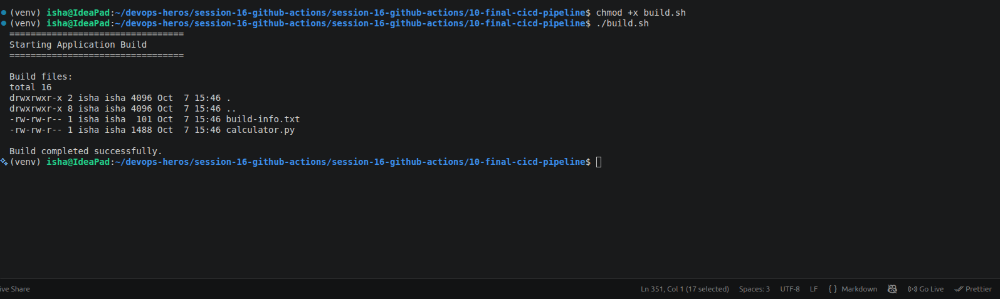
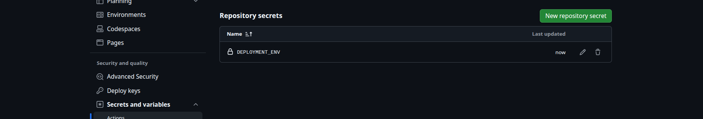
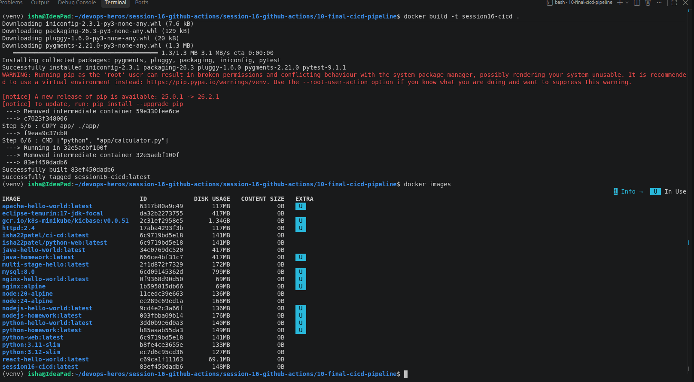
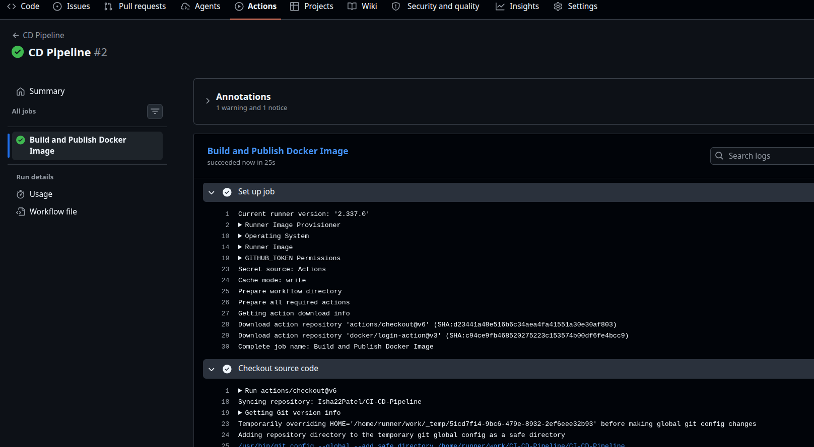
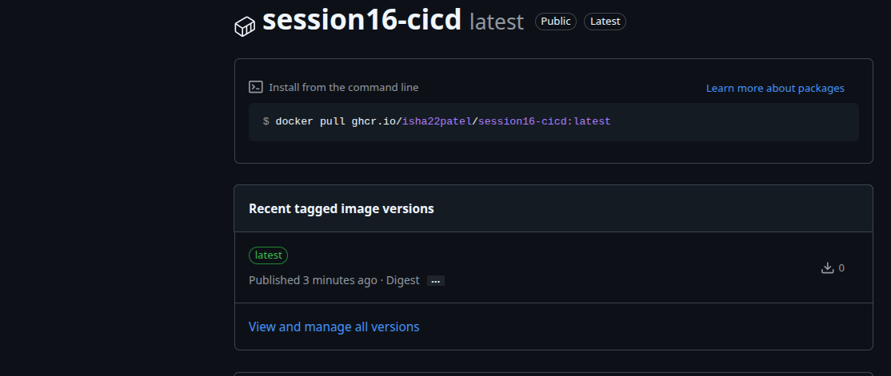
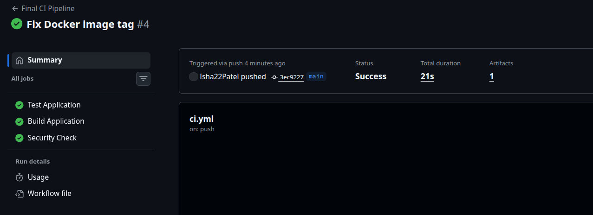
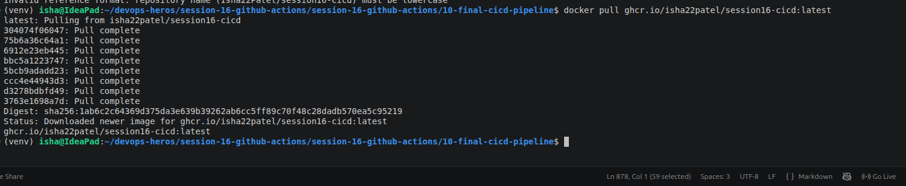

# Session 16: CI/CD & GitHub Actions

## 10 - Final CI/CD Pipeline

A complete CI/CD demo project using **GitHub Actions**, Python, Pytest, Docker, and GitHub Container Registry.

---

# 1. Objective

The objective of this project is to understand and demonstrate the fundamental concepts of **Continuous Integration (CI)** and **Continuous Delivery/Deployment (CD)** using GitHub Actions.

The project demonstrates:

- CI vs CD
- CI/CD pipeline
- GitHub Actions
- Workflows
- Jobs
- Steps
- Runners
- Secrets
- Artifacts
- Application build
- Automated testing
- Docker image creation
- Docker image publishing
- Pipeline execution
- Failure handling

---

# 2. Application Overview

The project uses a simple **Python Calculator application**.

The application supports basic arithmetic operations such as:

- Addition
- Subtraction
- Multiplication
- Division

The application source code is located in:

```text
app/calculator.py
```

Tests are located in:

```text
tests/test_calculator.py
```

---

# 3. Project Structure

```text
10-final-cicd-pipeline/
│
├── .github/
│   └── workflows/
│       ├── ci.yml
│       └── cd.yml
│
├── app/
│   ├── __init__.py
│   └── calculator.py
│
├── tests/
│   └── test_calculator.py
│
├── Dockerfile
├── .dockerignore
├── .gitignore
├── requirements.txt
├── build.sh
└── README.md
```

---

# 4. CI/CD Architecture

The overall pipeline is:

```text
                    Developer
                        │
                        │ git push
                        ▼
               ┌─────────────────┐
               │ GitHub Repository│
               └────────┬────────┘
                        │
                        ▼
               ┌─────────────────┐
               │  GitHub Actions │
               └────────┬────────┘
                        │
             ┌──────────┼──────────┐
             ▼          ▼          ▼
           TEST      SECURITY     BUILD
             │          │          │
             └──────────┼──────────┘
                        ▼
                    ARTIFACT
                        │
                        ▼
                   CI SUCCESS
                        │
                        ▼
               ┌─────────────────┐
               │   CD Pipeline   │
               └────────┬────────┘
                        │
                        ▼
                  Docker Build
                        │
                        ▼
                  Docker Image
                        │
                        ▼
                  Docker Push
                        │
                        ▼
             GitHub Container Registry
```

---

# 5. CI vs CD

## Continuous Integration (CI)

Continuous Integration automatically validates code whenever changes are pushed to the repository.

In this project, CI performs:

```text
Code Push
    ↓
Checkout
    ↓
Setup Python
    ↓
Install Dependencies
    ↓
Run Tests
    ↓
Security Check
    ↓
Build Application
    ↓
Upload Artifact
```

The purpose of CI is to identify errors early and make sure that new code does not break the application.

---

## Continuous Delivery / Deployment (CD)

CD takes the successfully validated application and prepares it for delivery or deployment.

In this project:

```text
CI Successful
      ↓
Docker Build
      ↓
Docker Image
      ↓
Docker Push
      ↓
GitHub Container Registry
```

The CD pipeline demonstrates automated delivery of the application as a Docker image.

---

# 6. GitHub Actions

**GitHub Actions** is used to automate the CI/CD pipeline.

The workflows are stored inside:

```text
.github/workflows/
```

This project contains two workflows:

```text
ci.yml
cd.yml
```

---

# 7. CI Workflow

The CI workflow is:

```text
.github/workflows/ci.yml
```

It performs:

```text
Checkout
    ↓
Setup Python
    ↓
Install Dependencies
    ↓
Run Tests
    ↓
Security Check
    ↓
Build
    ↓
Upload Artifact
```

---

# 8. Jobs

The CI workflow contains three main jobs:

1. `test`
2. `security`
3. `build`

The CD workflow contains:

4. `deploy`

The CI dependency flow is:

```text
test
  │
  ▼
security
  │
  ▼
build
```

The build job runs only after the required previous jobs succeed.

---

# 9. Test Job

The test job performs automated testing.

### Flow

```text
Checkout
    ↓
Setup Python
    ↓
Install Dependencies
    ↓
Run pytest
```

The workflow uses:

```yaml
pytest -v
```

to execute the test suite.

A successful test job indicates that the application is behaving as expected.

### Screenshot – Test Job



---

# 10. Security Check

The security job performs a basic classroom security check.

It searches for common sensitive files such as:

```text
.env
*.pem
*.key
```

This is only a **basic demonstration** and is not a complete security scanner.

If no sensitive files are found, the workflow reports:

```text
No sensitive files found.
```

### Screenshot – Security Check



---

# 11. Build Job

The build job runs after the required CI checks have succeeded.

The dependency relationship is implemented using:

```yaml
needs:
  - test
  - security
```

Therefore:

```text
Test → PASS
Security → PASS
       ↓
     Build
```

If a required job fails:

```text
Test → FAIL
       ↓
Build does not run
```

The build is performed using:

```bash
chmod +x build.sh
./build.sh
```

### Screenshot – Build Job



---

# 12. Artifact

The build process generates:

```text
build/
├── calculator.py
└── build-info.txt
```

The workflow uploads the build directory as an artifact named:

```text
calculator-build
```

Artifacts allow files generated during a GitHub Actions workflow to be stored and downloaded later.

### Screenshot – Build Artifact


---

# 13. Runner

All jobs use:

```yaml
runs-on: ubuntu-latest
```

This means GitHub provides a hosted Ubuntu environment for executing the workflow.

The runner performs tasks such as:

- Checking out source code
- Installing Python
- Installing dependencies
- Running tests
- Running security checks
- Building the application
- Building Docker images

---

# 14. Steps

A **step** is an individual operation inside a GitHub Actions job.

For example, the test job contains:

```text
Step 1 → Checkout source code
Step 2 → Setup Python
Step 3 → Install dependencies
Step 4 → Run pytest
```

Each step performs a specific operation.

---

# 15. Secrets

GitHub Actions provides a built-in secret called:

```text
GITHUB_TOKEN
```

It can be accessed using:

```yaml
${{ secrets.GITHUB_TOKEN }}
```

In this project, it is used to authenticate with GitHub Container Registry.

Secrets should not be hard-coded into source code or workflow files.

### Optional Repository Secret

A repository secret such as:

```text
DEPLOYMENT_ENV
```

can also be configured through:

```text
GitHub Repository
→ Settings
→ Secrets and variables
→ Actions
→ New repository secret
```

Example:

```text
Name: DEPLOYMENT_ENV
Value: production
```

### Screenshot – GitHub Secrets



---

# 16. Running the Application Locally

## Install Dependencies

Because modern Ubuntu/Debian systems protect the system Python environment, a virtual environment is recommended.

Create one:

```bash
python3 -m venv venv
```

Activate it:

```bash
source venv/bin/activate
```

Install dependencies:

```bash
pip install -r requirements.txt
```

---

## Run Application

```bash
python3 app/calculator.py
```

---

## Run Tests

```bash
pytest -v
```

Expected result:

```text
PASSED
PASSED
PASSED
...
```

---

## Build Application

```bash
chmod +x build.sh
./build.sh
```

Expected output directory:

```text
build/
├── calculator.py
└── build-info.txt
```

---

# 17. Docker

Docker is used to package the application and its dependencies into a portable container image.

The project contains:

```text
Dockerfile
```

The Docker build process is:

```text
Python Base Image
        ↓
Set Working Directory
        ↓
Install Dependencies
        ↓
Copy Application
        ↓
Start Application
```

---

# 18. Dockerfile

The Dockerfile uses a lightweight Python image.

Example:

```dockerfile
FROM python:3.12-slim

WORKDIR /app

COPY requirements.txt .

RUN pip install --no-cache-dir -r requirements.txt

COPY app/ ./app/

CMD ["python", "app/calculator.py"]
```

---

# 19. Build Docker Image

Run:

```bash
docker build -t session16-cicd .
```

Verify:

```bash
docker images
```

### Screenshot – Docker Build



---

# 20. Run Docker Container

Run:

```bash
docker run -it --rm session16-cicd
```

The calculator application should start inside the container.

---

# 21. CD Pipeline

The CD workflow is stored at:

```text
.github/workflows/cd.yml
```

The CD pipeline runs after the CI pipeline completes successfully.

The flow is:

```text
CI Success
    ↓
Checkout Source Code
    ↓
Docker Login
    ↓
Docker Build
    ↓
Docker Push
```

---

# 22. Docker Image Publishing

The CD pipeline builds an image using:

```bash
docker build \
  -t ghcr.io/${{ github.repository_owner }}/session16-cicd:latest .
```

The image is then pushed to:

```text
GitHub Container Registry
```

The image format is:

```text
ghcr.io/<github-username>/session16-cicd:latest
```

---

# 23. GitHub Container Registry

GitHub Container Registry, or GHCR, is used to store the Docker image produced by the CD pipeline.

The workflow authenticates using:

```yaml
username: ${{ github.actor }}
password: ${{ secrets.GITHUB_TOKEN }}
```

After successful execution, the Docker image becomes available in the repository's Packages section.

### Screenshot – CD Pipeline



### Screenshot – GitHub Container Registry



---

# 24. Pipeline Execution

The pipeline starts when code is pushed to GitHub.

Example:

```bash
git add .
git commit -m "Add final CI/CD pipeline"
git push origin main
```

The pipeline executes:

```text
Git Push
    ↓
GitHub Actions
    ↓
Test
    ↓
Security Check
    ↓
Build
    ↓
Artifact
    ↓
CI Success
    ↓
CD Pipeline
    ↓
Docker Build
    ↓
Docker Push
    ↓
GitHub Container Registry
```

### Screenshot – Complete CI Pipeline



---

# 25. Expected CI Pipeline

GitHub Actions should show:

```text
Final CI Pipeline

│
├── ✓ Test Application
│
├── ✓ Security Check
│
└── ✓ Build Application
       │
       └── ✓ Upload build artifact
```

All jobs should complete successfully.

---

# 26. Expected CD Pipeline

After successful CI execution:

```text
CD Pipeline

│
├── ✓ Checkout source code
│
├── ✓ Log in to GitHub Container Registry
│
├── ✓ Build Docker image
│
├── ✓ Push Docker image
│
└── ✓ Deployment summary
```

---

# 27. Failure Scenario

To demonstrate how CI/CD prevents broken code from progressing through the pipeline, the application can be intentionally broken.

For example, change:

```python
def add(a, b):
    return a + b
```

to:

```python
def add(a, b):
    return a + b + 1
```

Run the tests locally:

```bash
pytest
```

The test should fail.

---

# 28. Push the Broken Code

Commit and push:

```bash
git add .
git commit -m "Test CI failure"
git push
```

GitHub Actions will execute the pipeline.

Expected result:

```text
✗ Test Application
```

Because the build depends on successful CI checks:

```text
Test → FAIL
        ↓
Build does not proceed
```

This demonstrates the importance of automated testing in CI/CD.

---

# 29. Fix the Application

Restore the correct implementation:

```python
def add(a, b):
    return a + b
```

Run:

```bash
pytest -v
```

Then:

```bash
git add .
git commit -m "Fix application"
git push
```

Expected result:

```text
✓ Test Application
✓ Security Check
✓ Build Application
✓ Upload build artifact
```

The CD pipeline can then proceed after CI succeeds.

---

# 30. Verify Published Docker Image

The published image can be downloaded using:

```bash
docker pull ghcr.io/<github-username>/session16-cicd:latest
```

Run it:

```bash
docker run -it --rm ghcr.io/<github-username>/session16-cicd:latest
```

### Screenshot – Docker Pull



---

# 31. Git Commands

Initialize the repository:

```bash
git init
```

Add files:

```bash
git add .
```

Commit:

```bash
git commit -m "Add final CI/CD pipeline"
```

Set the main branch:

```bash
git branch -M main
```

Add remote:

```bash
git remote add origin https://github.com/YOUR_USERNAME/session16-cicd-github-actions.git
```

Push:

```bash
git push -u origin main
```

---

# 32. Complete Concept Map

```text
CI/CD
│
├── CI
│   │
│   ├── Test
│   ├── Security Check
│   ├── Build
│   └── Artifact
│
├── CD
│   │
│   ├── Docker Build
│   ├── Docker Image
│   └── Docker Push
│
└── GitHub Actions
    │
    ├── Workflow
    │
    ├── Jobs
    │   ├── Test
    │   ├── Security
    │   ├── Build
    │   └── Deploy
    │
    ├── Steps
    │
    ├── Runner
    │
    ├── Secrets
    │
    └── Artifacts
```

---

# 33. Learning Outcomes

This project demonstrates the following concepts:

1. Difference between CI and CD.
2. GitHub Actions workflows.
3. Workflow triggers.
4. Jobs and job dependencies.
5. Steps within jobs.
6. GitHub-hosted runners.
7. Automated testing with Pytest.
8. Basic security checking.
9. Application building.
10. GitHub Actions artifacts.
11. Docker containerization.
12. GitHub Actions secrets.
13. GitHub Container Registry.
14. Docker image publishing.
15. Pipeline failure handling.
16. End-to-end CI/CD execution.

---

# 34. Final Takeaway

The basic CI pipeline from the session is:

```text
git push
    ↓
GitHub Actions
    ↓
Test
    ↓
Security Check
    ↓
Build
    ↓
Artifact
```

The complete Session 16 pipeline extends it with CD:

```text
git push
    ↓
GitHub Actions
    ↓
┌─────────────────────────────┐
│            CI               │
│                             │
│ Test                        │
│   ↓                         │
│ Security Check              │
│   ↓                         │
│ Build                       │
│   ↓                         │
│ Artifact                    │
└──────────────┬──────────────┘
               │
               ▼
          CI SUCCESS
               │
               ▼
┌─────────────────────────────┐
│            CD               │
│                             │
│ Docker Build                │
│   ↓                         │
│ Docker Image                │
│   ↓                         │
│ Docker Push                 │
└──────────────┬──────────────┘
               │
               ▼
     GitHub Container Registry
```

The project demonstrates how **GitHub Actions can automatically test, validate, build, package, and deliver an application whenever code changes are pushed to the repository.**

---

## Final Pipeline Summary

> **git push → GitHub Actions → Test → Security Check → Build → Artifact → CI Success → Docker Build → Docker Push → GitHub Container Registry → Ready for Deployment**
