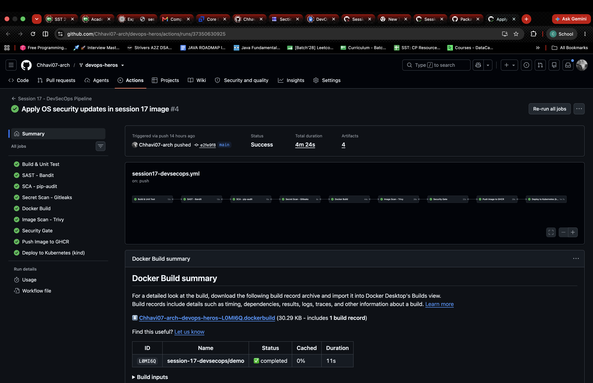
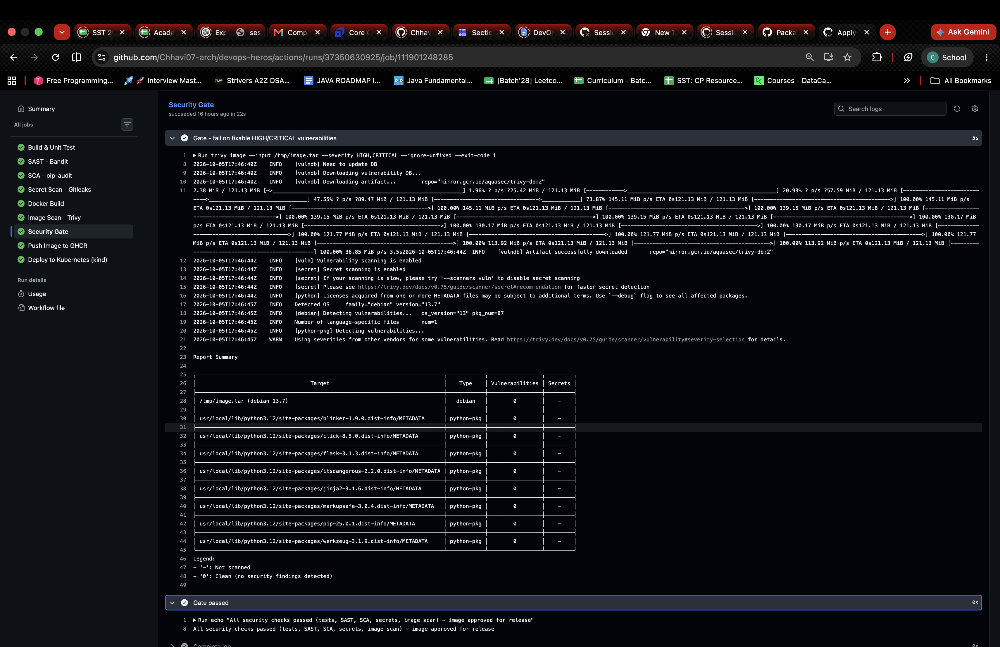
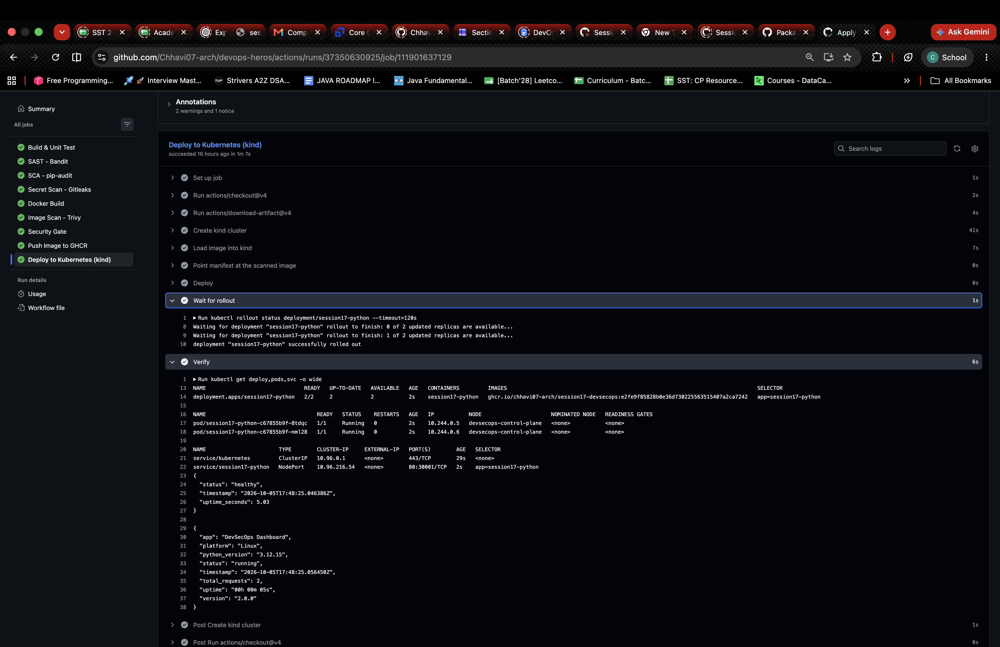

# Session 17 — Complete CI/CD & DevSecOps Pipeline (Homework)

**Name:** Chhavi Ahlawat
**Enrollment Number:** 24BCS10201
**Email:** chhavi.24bcs10201@sst.scaler.com

---

## Homework Tasks

| Task | Description | Status |
|---|---|---|
| 1 | App build + unit tests (pytest) | ✅ |
| 2 | SAST, SCA, secret scanning | ✅ |
| 3 | Docker build + container image scan | ✅ |
| 4 | Security gate before release | ✅ |
| 5 | Push image to container registry (GHCR) | ✅ |
| 6 | Deploy to Kubernetes | ✅ |

## Files

| Deliverable | Path |
|---|---|
| Application (Flask) + tests | [`demo/app/`](demo/app), [`demo/tests/`](demo/tests) |
| Dockerfile | [`demo/Dockerfile`](demo/Dockerfile) |
| K8s manifests | [`demo/k8s/`](demo/k8s) |
| GitHub Actions workflow + security tool config | [`.github/workflows/session17-devsecops.yml`](../.github/workflows/session17-devsecops.yml) |

> GitHub Actions only runs workflows from the repo-root `.github/workflows/`, so the pipeline lives there and runs with `working-directory: session-17-devsecops/demo`. It triggers on any push touching `session-17-devsecops/demo/**` or manually via **Run workflow**.

## Pipeline Flow

```
Code → Build & Unit Test → SAST → SCA → Secret Scan → Docker Build
     → Image Scan → Security Gate → Push Image (GHCR) → Deploy to K8s (kind)
```

Every stage is a separate job chained with `needs:` — if any job fails, everything after it is skipped, so a vulnerable image is never pushed or deployed.

| Stage | Tool | What it checks / gates |
|---|---|---|
| Build & Unit Test | `pytest` + `pytest-cov` | App compiles, 8 unit tests pass |
| SAST | Bandit | Insecure Python code; **fails on HIGH severity + HIGH confidence** (full report uploaded as artifact) |
| SCA | pip-audit | Known CVEs in `requirements*.txt`; **fails on any vulnerability** |
| Secret Scan | Gitleaks | Hard-coded keys/tokens/passwords in the app folder; **fails on any leak** |
| Docker Build | Buildx (`docker/build-push-action`) | Builds image once, passes it to later jobs as an artifact |
| Image Scan | Trivy | OS + Python package CVEs in the image (full report as artifact) |
| Security Gate | Trivy | **Fails on fixable HIGH/CRITICAL CVEs** (`--ignore-unfixed`) |
| Push Image | GHCR + `GITHUB_TOKEN` | Pushes `ghcr.io/chhavi07-arch/session17-devsecops:<sha>` and `:latest` |
| Deploy | kind + kubectl | Loads the scanned image, `kubectl apply -f k8s/`, `rollout status`, curls `/health` |

**Note on SAST findings:** Bandit reports `B201 flask debug=True` (HIGH severity, MEDIUM confidence), `B104` bind to `0.0.0.0` and `B311` use of `random`. `0.0.0.0` is required inside a container and `random` is not used for security, so those are accepted; `debug=True` should be turned off for production (e.g. read it from an env var).

## 1. Pipeline Run

All 9 jobs pass in order. Each security job (Bandit, pip-audit, Gitleaks, Trivy) blocks every job after it if it finds a problem.



## 2. Security Gate

The gate fails the pipeline on any HIGH/CRITICAL vulnerability that has a fix. On the first runs the gates did their job:
- **SCA (pip-audit)** flagged `pytest 8.4.2` (PYSEC-2026-1845), fixed by upgrading to `pytest 9.0.3`.
- **Trivy gate** flagged `libpcre2` CVE-2026-103111 (HIGH) in the base image, fixed by adding `apt-get upgrade` to the Dockerfile.



## 3. Push to GHCR + Deploy to Kubernetes

The image is pushed to `ghcr.io/chhavi07-arch/session17-devsecops`, loaded into a kind cluster, and deployed with `kubectl apply -f k8s/`.



## Run Locally (optional)
```bash
cd session-17-devsecops/demo
pip install -r requirements-dev.txt && pytest -v
pip install bandit pip-audit && bandit -r app && pip-audit -r requirements.txt
docker build -t session17-devsecops . && trivy image --severity HIGH,CRITICAL --ignore-unfixed session17-devsecops
```
