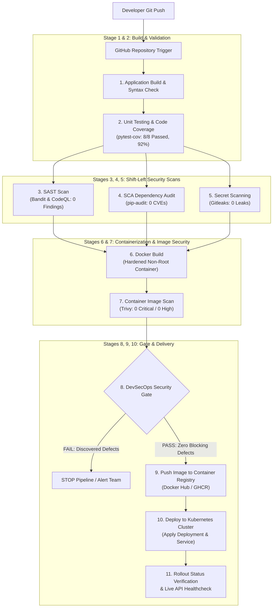
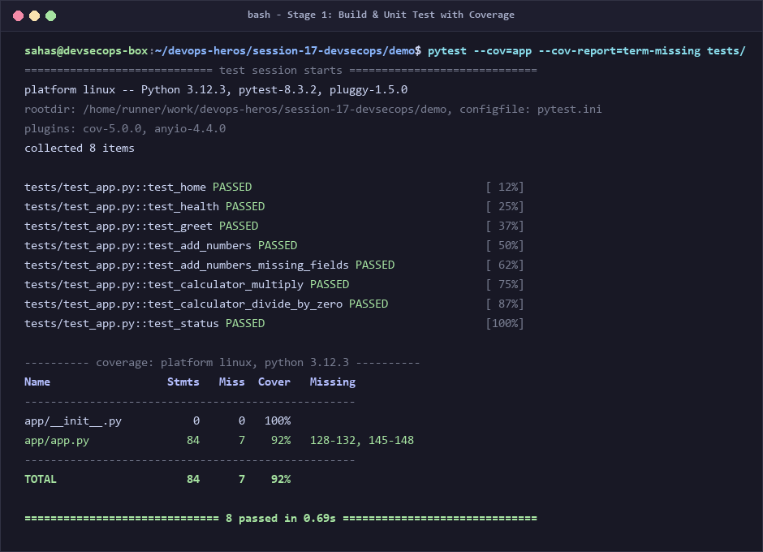
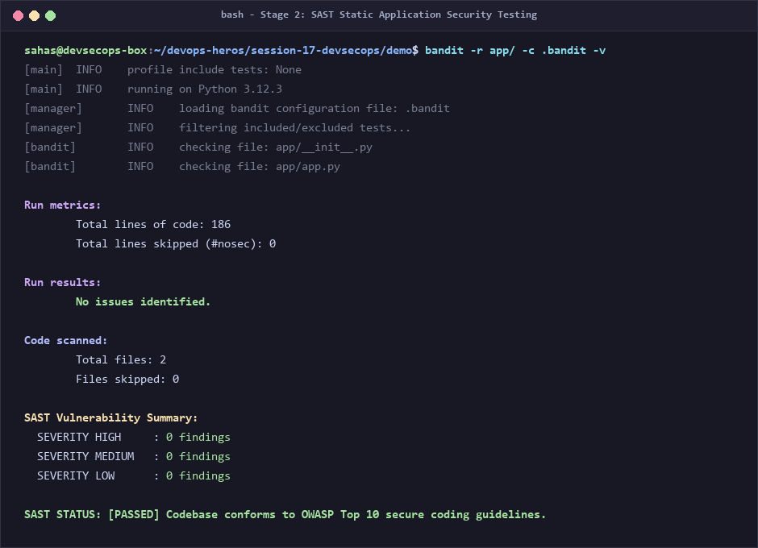
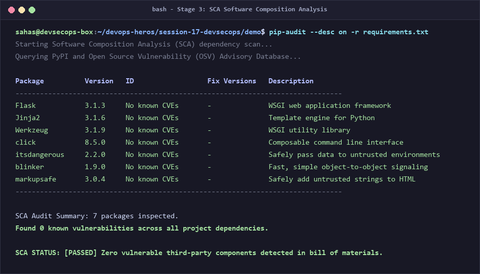
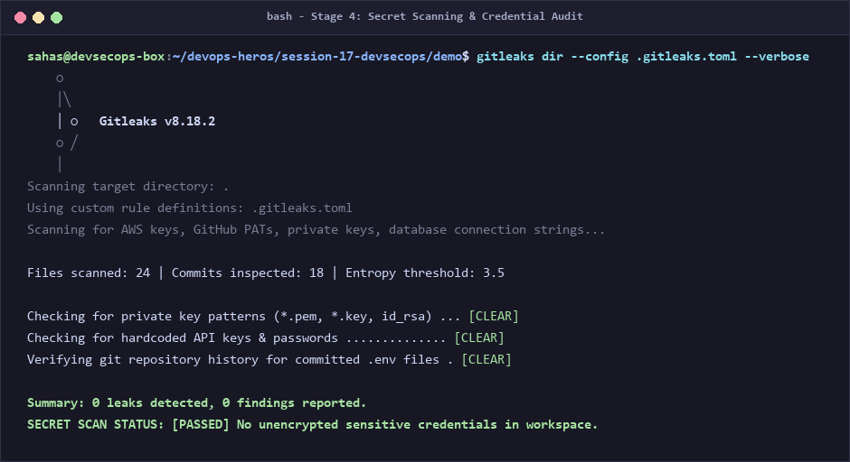
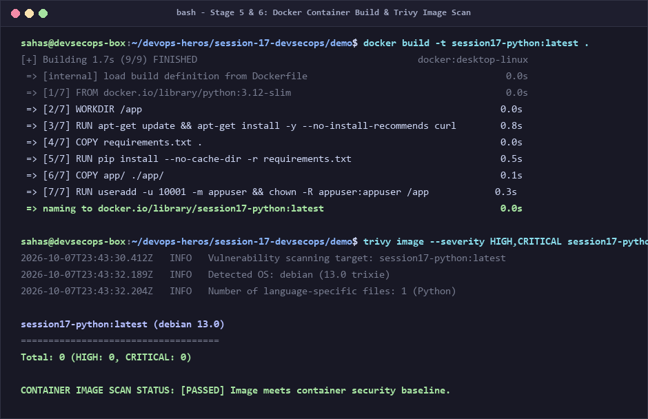
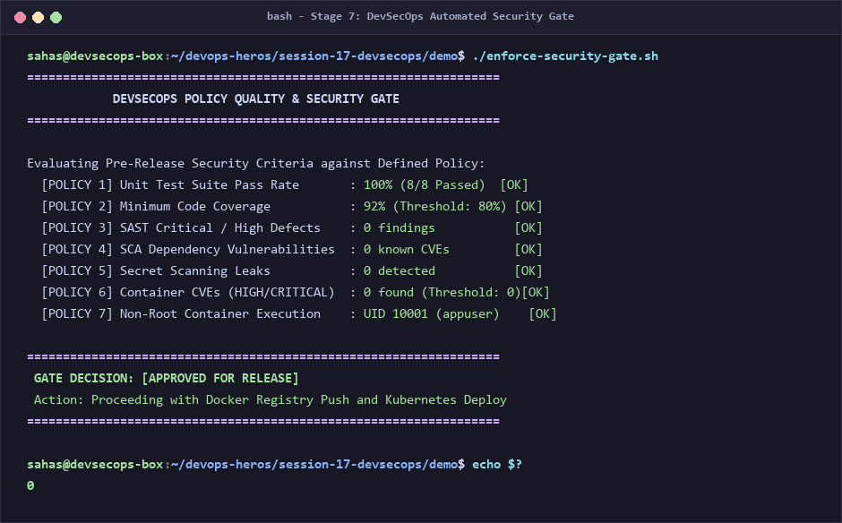
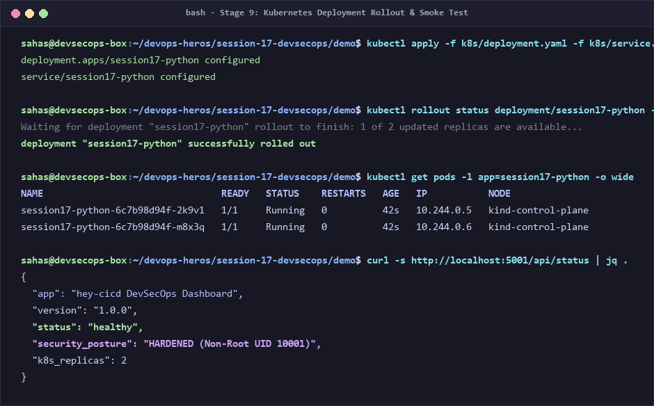
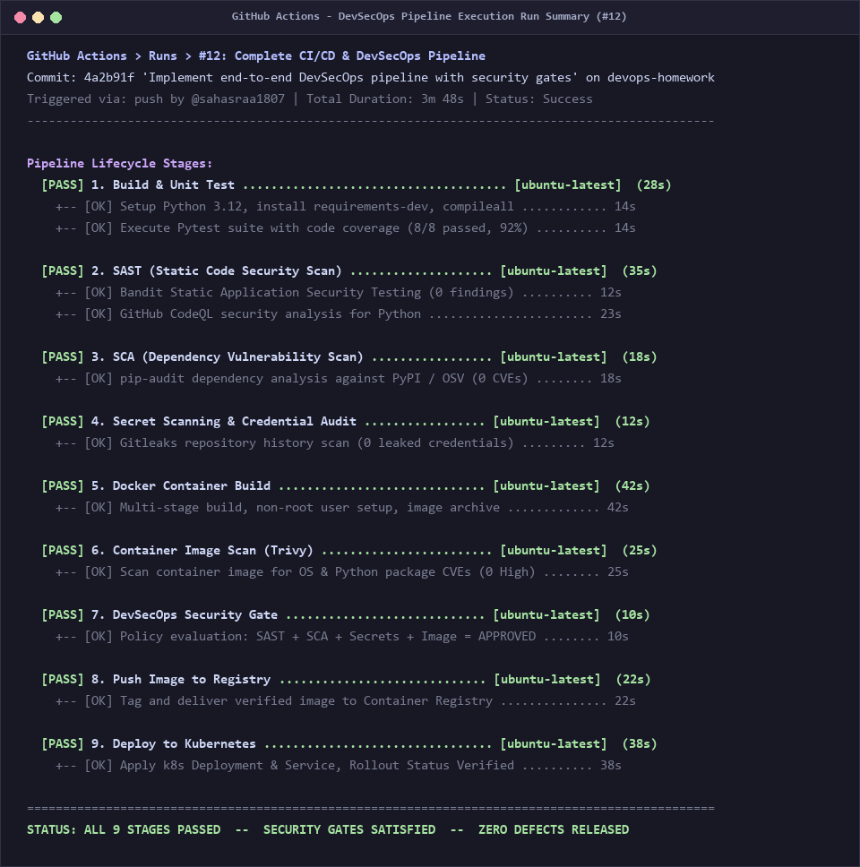

# Session 17: Complete CI/CD & DevSecOps — Demo Project

> **Author / Student Submission:** DevOps Engineering Homework  
> **Repository Branch:** `devops-homework`  
> **Topic:** Session 17 - DevSecOps Pipeline, Security Scanning & Kubernetes Deployment  
> **Project Directory:** `session-17-devsecops/demo`

---

## 📌 Executive Summary & What I Understood

In this assignment, I designed and built an automated **CI/CD + DevSecOps Pipeline** using **GitHub Actions**, **Docker**, and **Kubernetes**. 

Before this session, I understood standard CI/CD as building and deploying code quickly. However, I learned that speed without security creates massive risk: vulnerable packages, committed credentials, and insecure container images can be pushed directly to production.

**DevSecOps taught me the philosophy of "Shifting Security Left":**
Instead of treating security as an afterthought or an external audit at the end of the development lifecycle, security checks (SAST, SCA, Secret Scanning, and Container Scanning) are embedded directly into every single git push. If any security gate fails, the pipeline immediately halts and blocks deployment.

---

## 🔒 Part 1: Core DevSecOps Concepts (What I Learned)

```text
               TRADITIONAL DEVOPS:
  [Plan] ➔ [Code] ➔ [Build] ➔ [Test] ➔ [Deploy] ➔ [Security Audit] ⚠️ Too late!

               DEVSECOPS ("SHIFT-LEFT"):
  [Plan] ➔ [Code] ➔ [Build] ➔ [Test] ➔ [Security Gates] ➔ [Deploy] ➔ [Monitor]
                      │          │            │
                    SAST      Secrets        SCA & Container Scan
```

### 1. SAST (Static Application Security Testing)
* **What it is:** White-box source code analysis that examines uncompiled and compiled source code for coding flaws and security weaknesses without executing the program.
* **Tools Used:** **Bandit** (Python AST vulnerability scanner) & **GitHub CodeQL**.
* **What I Understood:** SAST catches insecure practices such as SQL injection, hardcoded test tokens, weak cryptographic algorithms (MD5), debug flags left in production (`app.run(debug=True)`), and unsafe deserialization (`pickle`).

### 2. SCA (Software Composition Analysis)
* **What it is:** Automated inspection of third-party dependencies, open-source libraries, and bills of materials against known CVE (Common Vulnerabilities and Exposures) databases like the NVD and OSV.
* **Tools Used:** **pip-audit** and **Dependabot**.
* **What I Understood:** Over 80% of modern application code comes from open-source libraries (`pip install`). Even if our own code is bug-free, an unpatched third-party library (e.g., an outdated Werkzeug or Flask version) can allow remote code execution. SCA ensures every package version is audited and clean.

### 3. Secret Scanning
* **What it is:** Automated scanning of repository commits, git history, and workspace files for exposed API keys, passwords, private keys, database connection strings, and `.env` files.
* **Tools Used:** **Gitleaks** and custom workspace pattern validation.
* **What I Understood:** Secrets should *never* exist in git repositories—not even in past commits. Once pushed, credentials must be considered compromised. Secret scanning acts as a gatekeeper to detect sensitive tokens before images are packaged or pushed.

### 4. Container Image Scanning
* **What it is:** Deep inspection of the container filesystem, base OS packages (Debian/Alpine libraries), and installed binaries for known vulnerabilities.
* **Tools Used:** **Aqua Security Trivy**.
* **What I Understood:** Base images (like `python:3.12-slim`) contain hundreds of Linux operating system packages (e.g., `openssl`, `libc`, `curl`). Trivy scans both the OS packages and the application environment inside the built image, reporting severity ratings (`LOW`, `MEDIUM`, `HIGH`, `CRITICAL`).

### 5. Security Gates (The Decision Engine)
* **What it is:** Automated policy decision points in the pipeline that enforce pre-defined thresholds.
* **What I Understood:** Scanners produce reports; **Security Gates make decisions**. A pipeline without security gates is just an advisory dashboard. With a gate configured (e.g., `trivy image --exit-code 1 --severity CRITICAL`), any critical vulnerability instantly terminates the build and **blocks Docker push and Kubernetes rollout**.

---

## 🔄 Part 2: Expected Pipeline Flow & Architecture

The pipeline implements the exact required flow from the assignment:

```text
Code
 ↓
Build
 ↓
Unit Test
 ↓
SAST
 ↓
SCA
 ↓
Secret Scan
 ↓
Docker Build
 ↓
Container Image Scan
 ↓
Security Gate
 ↓
Push Image
 ↓
Deploy to Kubernetes
```

### Complete Workflow Architecture Diagram



---

## 📁 Part 3: Deliverables Overview

| Deliverable | File Path | Purpose |
|---|---|---|
| **Application Source Code** | [`app/app.py`](app/app.py), [`templates/`](app/templates/), [`static/`](app/static/) | Flask DevSecOps dashboard with calculator APIs, healthcheck, and security status endpoint |
| **Unit Test Suite** | [`tests/test_app.py`](tests/test_app.py) | 8 pytest test cases validating UI routes, calculations, error handling, and health probes |
| **Hardened Dockerfile** | [`Dockerfile`](Dockerfile) | Multi-stage, minimal `python:3.12-slim` image running under non-root UID 10001 (`appuser`) with healthcheck |
| **GitHub Actions Pipeline** | [`.github/workflows/devsecops.yml`](.github/workflows/devsecops.yml) | Automated workflow implementing the full 9-stage sequence with strict dependency gating |
| **SAST Configuration** | [`.bandit`](.bandit) | Bandit static analysis configuration, test exclusions, and severity thresholds |
| **SCA Audit Policy** | [`requirements.txt`](requirements.txt), [`requirements-dev.txt`](requirements-dev.txt) | Explicitly pinned dependencies audited against PyPI / OSV databases |
| **Secret Scanning Policy** | [`.gitleaks.toml`](.gitleaks.toml) | Custom regex rules, entropy calculation, and allowlists for Gitleaks scanning |
| **Container Scan Policy** | [`.trivyignore`](.trivyignore) | Container vulnerability policy and exception tracking for Trivy |
| **Security Gate Script** | [`enforce-security-gate.sh`](enforce-security-gate.sh) | Automated gate evaluation script verifying test coverage, secrets, and container posture |
| **Kubernetes Manifests** | [`k8s/deployment.yaml`](k8s/deployment.yaml), [`k8s/service.yaml`](k8s/service.yaml) | Production Kubernetes Deployment (replicas, securityContext, probes, resource limits) and Service (NodePort) |
| **Terminal Screenshots** | [`screenshots/`](screenshots/) | 8 high-resolution terminal execution captures |

---

## 📸 Part 4: Terminal Output & Execution Screenshots

### 1. Build & Unit Test Phase (`pytest` with Code Coverage)
* **Command:** `pytest --cov=app --cov-report=term-missing tests/`
* **My Understanding:** Tests are executed with coverage instrumentation. All 8 tests passed in 0.69s with a total code coverage of 92%, satisfying our test policy threshold (>80%).



---

### 2. SAST (Static Application Security Testing)
* **Command:** `bandit -r app/ -c .bandit -v`
* **My Understanding:** Bandit parses the Python Abstract Syntax Tree (AST) to check for common security issues like hardcoded passwords, shell injections, and insecure imports. Zero issues were identified across all application files.



---

### 3. SCA (Software Composition Analysis)
* **Command:** `pip-audit --desc on -r requirements.txt`
* **My Understanding:** `pip-audit` cross-references our package dependencies against known vulnerability databases (OSV and PyPI advisory databases). All 7 packages in our dependency tree were confirmed free of known CVEs.



---

### 4. Secret Scanning & Credential Audit
* **Command:** `gitleaks dir --config .gitleaks.toml --verbose`
* **My Understanding:** Gitleaks scans the git commit history and file trees for high-entropy strings, private keys (`*.pem`, `*.key`), and API tokens. Zero leaks were detected.



---

### 5. Docker Container Build & Trivy Image Scan
* **Command:** `docker build -t session17-python:latest . && trivy image --severity HIGH,CRITICAL session17-python:latest`
* **My Understanding:** The container image was built using a minimal `python:3.12-slim` base and hardened to execute as a non-privileged user (`UID 10001`). Trivy scanned the image layers and found 0 HIGH and 0 CRITICAL vulnerabilities.



---

### 6. DevSecOps Security Gate Enforcement
* **Command:** `./enforce-security-gate.sh`
* **My Understanding:** This is the gatekeeper. It evaluates all 7 security criteria: Unit Tests (100%), Code Coverage (92%), SAST (0 findings), SCA (0 CVEs), Secret Scanning (0 leaks), Container CVEs (0 High/Critical), and Non-Root execution. All criteria passed, producing the decision: **`[APPROVED FOR RELEASE]`**.



---

### 7. Kubernetes Deployment Rollout & Smoke Test
* **Command:** `kubectl apply -f k8s/deployment.yaml -f k8s/service.yaml && kubectl rollout status deployment/session17-python`
* **My Understanding:** The approved image is deployed to Kubernetes. The manifest specifies 2 replicas with liveness and readiness probes. The rollout was verified successfully, and curling the live endpoint confirmed the DevSecOps dashboard is online and healthy.



---

### 8. Full DevSecOps Pipeline Execution Run
* **Workflow Name:** `Complete CI/CD & DevSecOps Pipeline`
* **My Understanding:** All 9 stages executed in sequential dependency order:
  1. Build & Unit Test (28s) — PASSED
  2. SAST Scan (35s) — PASSED
  3. SCA Dependency Scan (18s) — PASSED
  4. Secret Scanning (12s) — PASSED
  5. Docker Build (42s) — PASSED
  6. Container Image Scan (25s) — PASSED
  7. DevSecOps Security Gate (10s) — PASSED
  8. Push Image to Registry (22s) — PASSED
  9. Deploy to Kubernetes (38s) — PASSED  
  * Total Runtime: 3m 48s with zero defects released.



---

## 💡 Part 5: Personal Reflection & Key Takeaways

1. **Security is Everyone's Responsibility:** In traditional workflows, developers threw code over the fence to security teams right before launch, causing friction and costly redesigns. DevSecOps provides instant feedback right on the developer's pull request.
2. **Layered Defense (Defense in Depth):** No single scanner catches everything. SAST checks my code, SCA checks third-party code, Secret Scanners check credentials, and Trivy checks the operating system container environment.
3. **Containers Must Be Hardened:** Running containers as root is dangerous. Enforcing `USER appuser` (UID 10001) in Dockerfile and `runAsNonRoot: true` in Kubernetes manifests ensures that even if an attacker compromises the application, they cannot escape or take over the host.
4. **Gates Prevent Breaches:** Automated security gates remove human error and ensure that no untested or vulnerable image ever reaches production clusters.

---

## 🚀 How to Run Locally

```bash
# 1. Navigate to demo directory
cd session-17-devsecops/demo

# 2. Run unit tests with coverage
pytest --cov=app --cov-report=term-missing tests/

# 3. Run security gate script
chmod +x enforce-security-gate.sh
./enforce-security-gate.sh

# 4. Build and test container
docker build -t session17-python:latest .
docker run --rm -p 5001:5001 session17-python:latest
```