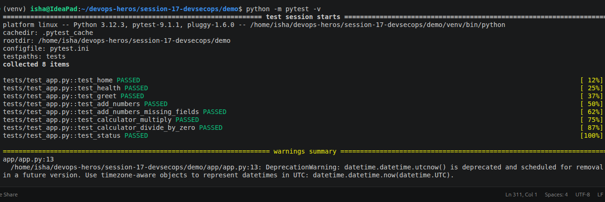
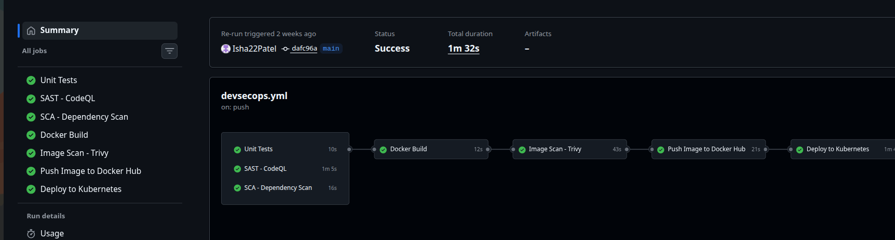
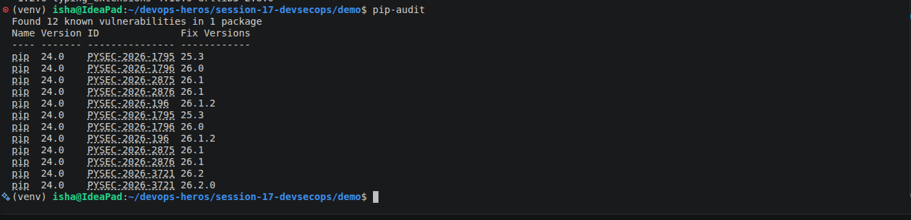
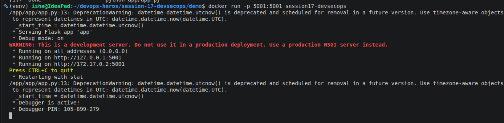
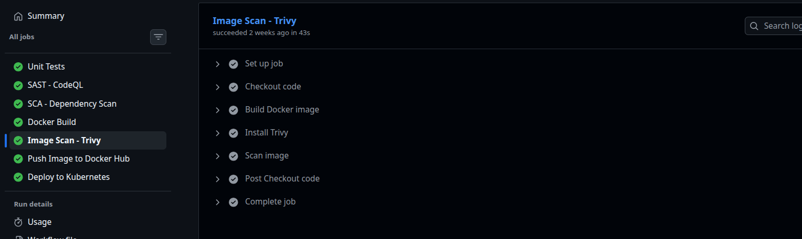
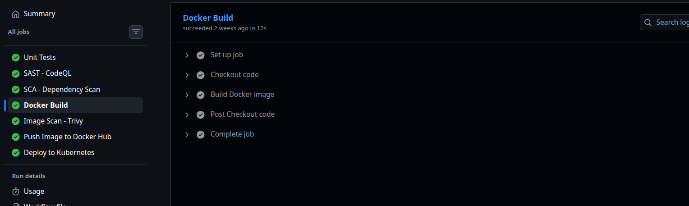
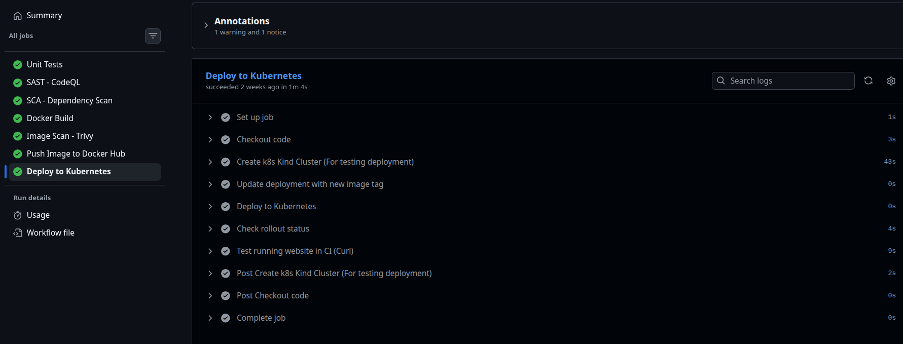
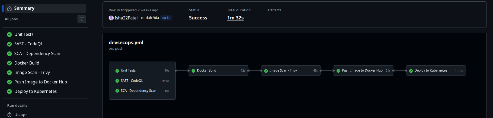

# Session 17: Complete CI/CD & DevSecOps

## DevSecOps Demo Project

This project demonstrates a complete **CI/CD + DevSecOps pipeline** using GitHub Actions.

The pipeline automatically builds, tests, scans, containerizes, security-validates, publishes, and deploys a Python Flask application to Kubernetes.

The project integrates security throughout the software delivery lifecycle instead of treating security as a separate final step.

---

# 1. Objective

The objective of this project is to understand and implement a complete **DevSecOps pipeline** that integrates application development, continuous integration, security checks, containerization, container security, image publishing, and Kubernetes deployment.

The pipeline covers:

### CI/CD

- Application build
- Unit testing
- Docker image build
- Container registry
- Kubernetes deployment

### Security

- SAST
- SCA
- Secret scanning
- Container image scanning
- Security gates

---

# 2. Expected DevSecOps Flow

The complete expected pipeline is:

```text
                         CODE
                           │
                           ▼
                         BUILD
                           │
                           ▼
                       UNIT TEST
                           │
                           ▼
                          SAST
                       (CodeQL)
                           │
                           ▼
                          SCA
                     (pip-audit)
                           │
                           ▼
                     SECRET SCAN
                      (Gitleaks)
                           │
                           ▼
                     DOCKER BUILD
                           │
                           ▼
                  CONTAINER IMAGE SCAN
                       (Trivy)
                           │
                           ▼
                    SECURITY GATE
                           │
                    ┌──────┴──────┐
                    │             │
                  FAIL           PASS
                    │             │
                    ▼             ▼
                   STOP       PUSH IMAGE
                                  │
                                  ▼
                          CONTAINER REGISTRY
                                  │
                                  ▼
                         KUBERNETES DEPLOY
                                  │
                                  ▼
                         ROLLOUT VERIFICATION
```

---

# 3. Architecture

```text
                         Developer
                             │
                             │ git push
                             ▼
                    ┌──────────────────┐
                    │ GitHub Repository│
                    └────────┬─────────┘
                             │
                             ▼
                    ┌──────────────────┐
                    │ GitHub Actions   │
                    └────────┬─────────┘
                             │
                             ▼
                         Application
                           Build
                             │
                             ▼
                         Unit Tests
                             │
                             ▼
                    ┌──────────────────┐
                    │      SAST        │
                    │     CodeQL       │
                    └────────┬─────────┘
                             │
                             ▼
                    ┌──────────────────┐
                    │       SCA        │
                    │   pip-audit      │
                    └────────┬─────────┘
                             │
                             ▼
                    ┌──────────────────┐
                    │  Secret Scan     │
                    │    Gitleaks      │
                    └────────┬─────────┘
                             │
                             ▼
                    ┌──────────────────┐
                    │   Docker Build   │
                    └────────┬─────────┘
                             │
                             ▼
                    ┌──────────────────┐
                    │ Container Scan   │
                    │     Trivy        │
                    └────────┬─────────┘
                             │
                             ▼
                    ┌──────────────────┐
                    │  Security Gate   │
                    └────────┬─────────┘
                             │
                             ▼
                    ┌──────────────────┐
                    │ Container       │
                    │ Registry (GHCR) │
                    └────────┬─────────┘
                             │
                             ▼
                    ┌──────────────────┐
                    │    Kubernetes    │
                    │    Deployment    │
                    └──────────────────┘
```

---

# 4. Application

The project uses a simple **Python Flask application**.

The application provides basic API functionality and is used to demonstrate the complete DevSecOps pipeline.

Application source code:

```text
app/
├── app.py
├── templates/
└── static/
```

Tests are located in:

```text
tests/
└── test_app.py
```

The application includes functionality such as:

- Homepage
- Health endpoint
- Greeting API
- Addition
- Multiplication
- Division
- Error handling
- Status information

---

# 5. Project Structure

```text
session-17-devsecops/
│
├── .github/
│   └── workflows/
│       └── devsecops.yml
│
├── app/
│   ├── app.py
│   ├── templates/
│   └── static/
│
├── tests/
│   └── test_app.py
│
├── k8s/
│   ├── deployment.yaml
│   └── service.yaml
│
├── Dockerfile
├── requirements.txt
├── .dockerignore
├── .gitignore
└── README.md
```

---

# 6. Technologies Used

| Technology | Purpose |
|---|---|
| Python | Application development |
| Flask | Web application framework |
| Pytest | Unit testing |
| Git | Version control |
| GitHub | Source code repository |
| GitHub Actions | CI/CD automation |
| CodeQL | SAST |
| pip-audit | SCA |
| Gitleaks | Secret scanning |
| Docker | Containerization |
| Trivy | Container image security scanning |
| GitHub Container Registry | Container image storage |
| Kubernetes | Application deployment |
| Kind | Local Kubernetes cluster in CI |

---

# 7. CI/CD and DevSecOps

Traditional CI/CD focuses primarily on:

```text
Build
  ↓
Test
  ↓
Deploy
```

DevSecOps integrates security throughout the pipeline:

```text
Build
  ↓
Test
  ↓
SAST
  ↓
SCA
  ↓
Secret Scan
  ↓
Container Scan
  ↓
Security Gate
  ↓
Deploy
```

This approach helps identify security vulnerabilities earlier in the development lifecycle.

---

# 8. Application Build

The first stage of the pipeline prepares the application.

The project contains:

```text
app/
requirements.txt
Dockerfile
tests/
```

The Python dependencies are installed using:

```bash
pip install -r requirements.txt
```

The application can be executed locally using:

```bash
python app/app.py
```

---

# 9. Unit Testing

Unit testing verifies that the application's functionality works correctly.

The project uses **Pytest**.

Run tests locally:

```bash
pytest -v
```

The test suite covers multiple application functions and endpoints.

Expected result:

```text
============================= test session starts =============================
...
PASSED
PASSED
PASSED
...
============================== tests passed ==================================
```

### Screenshot – Unit Tests



---

# 10. SAST – Static Application Security Testing

SAST analyzes application source code for potential security vulnerabilities without executing the application.

This project uses:

```text
CodeQL
```

CodeQL analyzes the application's source code and identifies security-related coding patterns.

The GitHub Actions workflow uses CodeQL to perform the analysis.

Pipeline stage:

```text
Source Code
     ↓
CodeQL Analysis
     ↓
Security Results
```

### Screenshot – SAST / CodeQL



---

# 11. SCA – Software Composition Analysis

SCA analyzes third-party dependencies used by the application.

This project uses:

```text
pip-audit
```

Run locally:

```bash
pip-audit
```

It checks Python packages against known vulnerability databases.

The pipeline should fail if dependency vulnerabilities that meet the configured security criteria are detected.

Pipeline:

```text
requirements.txt
       ↓
   pip-audit
       ↓
Dependency Vulnerability Results
```

### Screenshot – SCA



---

# 12. Secret Scanning

Secret scanning detects accidentally committed credentials or sensitive information.

This project uses:

```text
Gitleaks
```

Gitleaks searches the repository for patterns that resemble:

- API keys
- Passwords
- Access tokens
- Private keys
- Cloud credentials
- Other secrets

The pipeline should stop if a real secret is detected.

Example:

```text
Repository
    ↓
 Gitleaks
    ↓
Secret Found?
   /     \
 Yes      No
  ↓        ↓
 FAIL     PASS
``
---

# 13. Docker

Docker packages the application and its dependencies into a container image.

The project contains:

```text
Dockerfile
```

The Docker image allows the application to run consistently across environments.

---

# 14. Dockerfile

The Dockerfile uses Python as the base image.

Example:

```dockerfile
FROM python:3.12-slim

WORKDIR /app

COPY requirements.txt .

RUN pip install -r requirements.txt

COPY app ./app

EXPOSE 5001

CMD ["python", "app/app.py"]
```

---

# 15. Build Docker Image Locally

Build the image:

```bash
docker build -t session17-devsecops .
```

Verify:

```bash
docker images
```

Run:

```bash
docker run -p 5001:5001 session17-devsecops
```

The application should then be accessible on:

```text
http://localhost:5001
```

### Screenshot – Docker Build


---

# 16. Container Image Scanning

Building a Docker image is not enough.

The image itself may contain vulnerable operating-system packages or application dependencies.

This project uses:

```text
Trivy
```

Trivy scans the Docker image for known vulnerabilities.

Pipeline:

```text
Docker Image
     ↓
   Trivy
     ↓
Vulnerability Scan
```

The scan focuses on:

```text
HIGH
CRITICAL
```

severity vulnerabilities.

Example command:

```bash
trivy image \
  --severity HIGH,CRITICAL \
  --exit-code 1 \
  session17-devsecops:latest
```

The important option is:

```text
--exit-code 1
```

This causes the workflow to fail when vulnerabilities meeting the configured criteria are found.

### Screenshot – Trivy Container Scan



---

# 17. Security Gate

The security gate ensures that the application is not published or deployed when security checks fail.

The pipeline contains several security stages:

```text
SAST
  ↓
SCA
  ↓
Secret Scan
  ↓
Container Image Scan
  ↓
Security Gate
```

The security gate can be represented as:

```text
Security Checks
      │
      ▼
  All Passed?
   /       \
 No         Yes
 │           │
 ▼           ▼
STOP       Continue
             │
             ▼
        Push Image
```

If any required security check fails, later stages should not proceed.

---

# 18. Container Registry

After the security checks succeed, the Docker image is pushed to a container registry.

This project uses:

```text
GitHub Container Registry (GHCR)
```

The image follows this format:

```text
ghcr.io/<github-username>/session17-devsecops:<tag>
```

For this project:

```text
ghcr.io/isha22patel/session17-devsecops:<tag>
```

GitHub Actions authenticates using:

```yaml
username: ${{ github.actor }}
password: ${{ secrets.GITHUB_TOKEN }}
```

The workflow requires:

```yaml
permissions:
  contents: read
  packages: write
```

The image is pushed only after the security gate passes.

### Screenshot – Container Registry


---

# 19. Kubernetes

Kubernetes is used to deploy the containerized application.

The Kubernetes configuration is located in:

```text
k8s/
├── deployment.yaml
└── service.yaml
```

---

# 20. Kubernetes Deployment

The Deployment manages the application pods.

Example:

```yaml
apiVersion: apps/v1
kind: Deployment
metadata:
  name: session17-devsecops
spec:
  replicas: 2
  selector:
    matchLabels:
      app: session17-devsecops
  template:
    metadata:
      labels:
        app: session17-devsecops
    spec:
      containers:
        - name: app
          image: ghcr.io/isha22patel/session17-devsecops:latest
          ports:
            - containerPort: 5001
```

The Deployment ensures that the desired number of application pods are running.

---

# 21. Kubernetes Service

The Service exposes the application.

Example:

```yaml
apiVersion: v1
kind: Service
metadata:
  name: session17-devsecops
spec:
  selector:
    app: session17-devsecops
  ports:
    - port: 5001
      targetPort: 5001
  type: ClusterIP
```

The Service provides stable network access to the application pods.

---

# 22. Kubernetes Deployment in GitHub Actions

The pipeline creates a temporary Kubernetes cluster using:

```text
Kind
```

The workflow can use:

```yaml
uses: helm/kind-action@v1.10.0
```

Then Kubernetes manifests are applied:

```bash
kubectl apply -f k8s/deployment.yaml
kubectl apply -f k8s/service.yaml
```

The deployment is verified using:

```bash
kubectl rollout status deployment/session17-python
```

This confirms that Kubernetes successfully started the application.

### Screenshot – Kubernetes Deployment



---

# 23. Kubernetes Verification

Useful commands include:

```bash
kubectl get pods
```

```bash
kubectl get deployments
```

```bash
kubectl get services
```

```bash
kubectl rollout status deployment/session17-devsecops
```

Expected output should show the pods in the:

```text
Running
```

state.

Example:

```text
NAME                                  READY   STATUS    RESTARTS
session17-devsecops-xxxxx             1/1     Running   0
session17-devsecops-yyyyy             1/1     Running   0
```

---

# 24. GitHub Actions Workflow

The complete workflow is located at:

```text
.github/workflows/devsecops.yml
```

The workflow contains the following stages:

```text
1. Build
2. Unit Test
3. SAST
4. SCA
5. Secret Scan
6. Docker Build
7. Container Image Scan
8. Security Gate
9. Push Image
10. Deploy to Kubernetes
```

---

# 25. Complete Pipeline Flow

```text
┌───────────────────────┐
│        CODE           │
│      git push         │
└───────────┬───────────┘
            │
            ▼
┌───────────────────────┐
│        BUILD          │
└───────────┬───────────┘
            │
            ▼
┌───────────────────────┐
│      UNIT TEST        │
│        Pytest         │
└───────────┬───────────┘
            │
            ▼
┌───────────────────────┐
│         SAST          │
│        CodeQL         │
└───────────┬───────────┘
            │
            ▼
┌───────────────────────┐
│         SCA           │
│      pip-audit        │
└───────────┬───────────┘
            │
            ▼
┌───────────────────────┐
│     SECRET SCAN       │
│       Gitleaks        │
└───────────┬───────────┘
            │
            ▼
┌───────────────────────┐
│     DOCKER BUILD      │
└───────────┬───────────┘
            │
            ▼
┌───────────────────────┐
│  CONTAINER SCANNING   │
│        Trivy          │
└───────────┬───────────┘
            │
            ▼
┌───────────────────────┐
│    SECURITY GATE      │
└───────────┬───────────┘
            │
        ┌───┴───┐
        │       │
      FAIL     PASS
        │       │
        ▼       ▼
       STOP   PUSH IMAGE
                 │
                 ▼
        ┌─────────────────┐
        │      GHCR       │
        └────────┬────────┘
                 │
                 ▼
        ┌─────────────────┐
        │   Kubernetes    │
        │    Deploy       │
        └─────────────────┘
```

---

# 26. Security Gates

Security gates prevent vulnerable code or images from continuing through the pipeline.

The pipeline has security gates at multiple points.

### Gate 1 – SAST

```text
CodeQL
  ↓
Security issues?
  ↓
Fail / Continue
```

### Gate 2 – SCA

```text
pip-audit
  ↓
Dependency vulnerability?
  ↓
Fail / Continue
```

### Gate 3 – Secret Scan

```text
Gitleaks
  ↓
Secret detected?
  ↓
Fail / Continue
```

### Gate 4 – Container Scan

```text
Trivy
  ↓
HIGH/CRITICAL vulnerability?
  ↓
Fail / Continue
```

Only a pipeline that passes the required security gates is allowed to publish and deploy the image.

---

# 27. Failure Scenario

To demonstrate the security gate, the pipeline can be intentionally made to fail.

For example, a deliberately vulnerable dependency can be added to `requirements.txt`.

After pushing the change:

```bash
git add .
git commit -m "Test security gate"
git push
```

The security scanner should detect the issue.

Expected behavior:

```text
SCA
 ↓
FAIL
 ↓
Security Gate
 ↓
STOP
 ↓
Docker image is not published
```

The same principle applies to secret scanning and container image scanning.

---

# 28. Successful Pipeline

After fixing the issue, push the corrected code:

```bash
git add .
git commit -m "Fix security issue"
git push
```

Expected pipeline:

```text
✓ Build
✓ Unit Test
✓ SAST
✓ SCA
✓ Secret Scan
✓ Docker Build
✓ Container Image Scan
✓ Security Gate
✓ Push Image
✓ Deploy to Kubernetes
```

### Screenshot – Final Successful Pipeline



---

# 29. Why DevSecOps?

Traditional development often follows:

```text
Develop
   ↓
Test
   ↓
Deploy
   ↓
Security
```

DevSecOps changes this to:

```text
Develop
   ↓
Test
   ↓
Security
   ↓
Build
   ↓
Security
   ↓
Deploy
```

Security becomes part of the development and delivery process rather than a separate activity at the end.

---

# 30. Benefits

The implemented pipeline provides:

### Early vulnerability detection

Security problems are detected before deployment.

### Automated security checks

Security tools execute automatically.

### Consistent builds

Docker provides a reproducible application environment.

### Security gates

Vulnerable code and images can be prevented from progressing.

### Automated deployment

A successful image can automatically be deployed to Kubernetes.

### Traceability

Each pipeline execution is associated with a Git commit.

---

# 31. Complete DevSecOps Concept Map

```text
                         DEVSECOPS
                             │
          ┌──────────────────┼──────────────────┐
          │                  │                  │
          ▼                  ▼                  ▼
         CI                  SECURITY           CD
          │                  │                  │
          ├── Build         ├── SAST            ├── Push Image
          ├── Test          ├── SCA             └── Deploy
          └── Docker        ├── Secret Scan
                            └── Image Scan
                                  │
                                  ▼
                             Security Gate
```

---

# 32. Final Pipeline

```text
                    ┌─────────────┐
                    │    CODE     │
                    └──────┬──────┘
                           │
                           ▼
                    ┌─────────────┐
                    │    BUILD    │
                    └──────┬──────┘
                           │
                           ▼
                    ┌─────────────┐
                    │ UNIT TEST   │
                    └──────┬──────┘
                           │
                           ▼
                    ┌─────────────┐
                    │    SAST     │
                    │   CodeQL    │
                    └──────┬──────┘
                           │
                           ▼
                    ┌─────────────┐
                    │     SCA     │
                    │ pip-audit   │
                    └──────┬──────┘
                           │
                           ▼
                    ┌─────────────┐
                    │SECRET SCAN  │
                    │  Gitleaks   │
                    └──────┬──────┘
                           │
                           ▼
                    ┌─────────────┐
                    │DOCKER BUILD │
                    └──────┬──────┘
                           │
                           ▼
                    ┌─────────────┐
                    │IMAGE SCAN   │
                    │   Trivy     │
                    └──────┬──────┘
                           │
                           ▼
                    ┌─────────────┐
                    │SECURITY GATE│
                    └──────┬──────┘
                           │
                     ┌─────┴─────┐
                     │           │
                   FAIL         PASS
                     │           │
                     ▼           ▼
                    STOP      PUSH IMAGE
                                  │
                                  ▼
                         ┌────────────────┐
                         │      GHCR      │
                         └───────┬────────┘
                                 │
                                 ▼
                         ┌────────────────┐
                         │   Kubernetes   │
                         │    Deploy      │
                         └───────┬────────┘
                                 │
                                 ▼
                         ┌────────────────┐
                         │    VERIFY      │
                         │    ROLLOUT     │
                         └────────────────┘
```

---