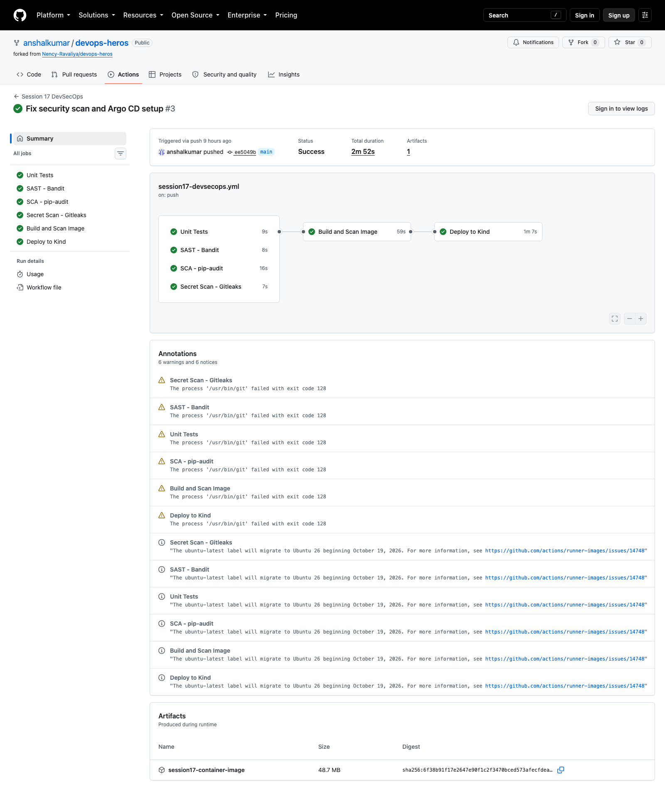

# Session 17 - Complete CI/CD and DevSecOps

I used the instructor's Flask demo as the application for this assignment. My aim was to make every security check part of the delivery path instead of running the tools separately and ignoring their result.

The application, tests, Dockerfile, and Kubernetes files are in [`demo/`](demo/). The active workflow is [`../.github/workflows/session17-devsecops.yml`](../.github/workflows/session17-devsecops.yml).

## Pipeline I built

```text
Python tests
    ├── Bandit SAST
    ├── pip-audit SCA
    └── Gitleaks secret scan
             ↓
        Docker build
             ↓
      Trivy image scan
             ↓
      GHCR push and artifact upload
             ↓
    Kind Kubernetes deploy
             ↓
       HTTP health check
```

After the security gates pass, the workflow pushes the tested image to GitHub Container Registry with both the commit SHA and `latest` tags. It also saves the same image as a downloadable workflow artifact. Authentication uses GitHub's short-lived `GITHUB_TOKEN`, so no registry password is committed.

## Security gates

| Check | What it catches | Gate used in the workflow |
|---|---|---|
| Bandit | Unsafe Python patterns | Medium or higher severity fails |
| pip-audit | Known vulnerable Python dependencies | Any reported vulnerability fails |
| Gitleaks | Accidentally committed credentials | Any verified finding fails |
| Trivy | Vulnerabilities in the built container | Fixed HIGH or CRITICAL findings fail |

If one of these jobs fails, the image artifact is not produced and the deployment job cannot start. That dependency is enforced with `needs`.

## Local checks

```bash
cd session-17-devsecops/demo
python3 -m venv .venv
source .venv/bin/activate
pip install -r requirements-dev.txt
pytest -q
bandit -r app
pip-audit -r requirements.txt

docker build -t session17-devsecops:local .
docker run --rm -d --name session17-demo -p 5001:5001 session17-devsecops:local
curl -fsS http://localhost:5001/health
docker stop session17-demo
```

The CI deployment uses a temporary Kind cluster, so it proves the manifests work without storing a personal kubeconfig in GitHub. The smaller folders contain my notes on the registry, Kubernetes deployment, SAST, SCA, secret scanning, image scanning, and security gates.

## Result

I ran the complete workflow on GitHub Actions. The test, security, container scan, registry push, and Kubernetes smoke-test jobs all passed.


