# Session 17 – Complete CI/CD & DevSecOps Pipeline

A small **Flask "DevSecOps Dashboard"** app shipped through a full **CI/CD + DevSecOps pipeline** on
GitHub Actions. Every change is built, unit-tested, scanned (SAST, SCA, secrets, container image,
IaC misconfigurations), and only if a **security gate** says *go* is the image pushed to
**GitHub Container Registry (GHCR)** and deployed to **Kubernetes**.

```
Code → Build → Unit Test → SAST → SCA → Secret Scan → Docker Build
     → Container Image Scan → Security Gate → Push Image → Deploy to Kubernetes
```

| | |
|---|---|
| Live workflow (run by GitHub) | [`.github/workflows/session17-devsecops.yml`](../../.github/workflows/session17-devsecops.yml) (repo root) |
| Reference copy in this folder | [`.github/workflows/devsecops.yml`](.github/workflows/devsecops.yml) (identical; GitHub ignores nested `.github`) |
| Successful pipeline run | [#37655701204](https://github.com/jenyyy4/devops-heros/actions/runs/37655701204): all 10 jobs green, commit `cb15a33` |
| Image | `ghcr.io/jenyyy4/session17-devsecops:<commit-sha>` |

---

## Table of Contents

1. [Project structure](#1-project-structure)
2. [The application](#2-the-application)
3. [Tools used at each stage](#3-tools-used-at-each-stage)
4. [The pipeline, stage by stage](#4-the-pipeline-stage-by-stage)
5. [Security tools configuration](#5-security-tools-configuration)
6. [Dockerfile](#6-dockerfile)
7. [Kubernetes manifests](#7-kubernetes-manifests)
8. [Pipeline output (GitHub Actions)](#8-pipeline-output-github-actions)
9. [Running every stage locally (with screenshots)](#9-running-every-stage-locally-with-screenshots)
10. [Security findings fixed in this project](#10-security-findings-fixed-in-this-project)
11. [Troubleshooting notes](#11-troubleshooting-notes)

---

## 1. Project structure

```text
devops-heros/
├── .github/workflows/
│   └── session17-devsecops.yml      # the pipeline GitHub actually runs
└── session-17-devsecops/demo/
    ├── app/
    │   ├── app.py                   # Flask app + JSON API
    │   ├── templates/index.html     # dashboard UI
    │   └── static/{css,js}/
    ├── tests/test_app.py            # 11 unit tests (pytest)
    ├── k8s/
    │   ├── namespace.yaml           # namespace with Pod Security "restricted"
    │   ├── deployment.yaml          # hardened Deployment (non-root, read-only FS, probes, limits)
    │   ├── service.yaml             # NodePort Service (30017)
    │   └── kustomization.yaml       # lets the pipeline pin the image tag to the commit SHA
    ├── .github/workflows/devsecops.yml   # reference copy of the pipeline
    ├── Dockerfile                   # multi-stage, Alpine, non-root, HEALTHCHECK, gunicorn
    ├── .dockerignore
    ├── bandit.yaml                  # SAST config
    ├── .gitleaks.toml               # secret-scanning config (+ custom rule)
    ├── trivy.yaml                   # image-scan gate policy
    ├── .trivyignore                 # accepted risks (empty)
    ├── requirements.txt             # runtime: Flask, gunicorn
    ├── requirements-dev.txt         # + pytest, pytest-cov
    ├── requirements-security.txt    # bandit, pip-audit
    └── screenshots/
```

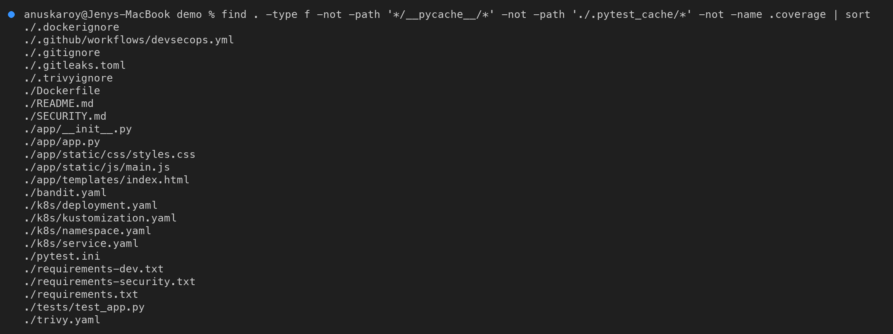

> GitHub only runs workflows from `.github/workflows/` at the **repository root**, so the pipeline
> lives there with a `paths:` filter (it only triggers on changes to this folder or to itself) and
> `defaults.run.working-directory: session-17-devsecops/demo`.

---

## 2. The application

| Method | Route | Description |
|---|---|---|
| `GET` | `/` | Dashboard UI |
| `GET` | `/health` | Liveness/readiness check (Docker `HEALTHCHECK`, K8s probes) |
| `GET` | `/api/status` | Version, **git SHA the image was built from**, uptime, request count |
| `GET` | `/api/greet/<name>` | Random greeting |
| `POST` | `/api/add` | `{"number1": 10, "number2": 20}` → `30` |
| `POST` | `/api/calculate` | `add` / `subtract` / `multiply` / `divide` / `power` / `modulo` |
| `POST` | `/api/pipeline/run` | Simulated pipeline run |

`GIT_SHA` is passed as a Docker build arg, so `GET /api/status` on a running Pod proves **which commit
is deployed**. The deploy job checks this.

Run it locally:

```bash
cd session-17-devsecops/demo
python3 -m venv .venv && source .venv/bin/activate
pip install -r requirements-dev.txt
FLASK_DEBUG=1 python app/app.py          # http://127.0.0.1:5001 (debug only when you ask for it)
pytest -v --cov=app --cov-fail-under=80
```

---

## 3. Tools used at each stage

| Stage | Tool | What it checks | Gate (fails the job when…) |
|---|---|---|---|
| Build | `pip` + `compileall` | deps install, code compiles, app imports | any error |
| Unit Test | **pytest + pytest-cov** | behaviour of every endpoint | a test fails **or coverage < 80 %** |
| SAST | **Bandit** (+ **CodeQL**) | insecure code patterns in *our* source | Bandit finds **MEDIUM+** severity with MEDIUM+ confidence |
| SCA | **pip-audit** | known CVEs in *third-party* packages (PyPI advisory DB / OSV) | **any** known vulnerability (`--strict`) |
| Secret Scan | **Gitleaks** | tokens, keys, passwords in files **and git history** | any secret found |
| Docker Build | Docker | image builds; container starts; `/health` answers; runs as non-root | any error |
| Image Scan | **Trivy** | OS + Python package CVEs in the image; Dockerfile & K8s misconfig | **HIGH/CRITICAL CVE with a fix available**, or HIGH/CRITICAL misconfig |
| Security Gate | `jq` over `needs.*.result` | did **every** previous check succeed? | any check not `success` |
| Push | Docker → **GHCR** | — | only on `main`, never on pull requests |
| Deploy | **kind** + `kubectl` + kustomize | rollout succeeds; Service answers; correct commit is live | rollout / smoke test fails |

**SAST vs SCA vs secrets vs image scanning:**

| Scan | Looks at | Example finding |
|---|---|---|
| SAST | code **we wrote** | `app.run(debug=True)` → remote code execution via the Werkzeug debugger |
| SCA | code **we import** | `Werkzeug 2.2.2` → PYSEC-2023-221 (fixed in 2.3.8) |
| Secret scan | credentials committed to Git | `ghp_…` GitHub token in `config.py` |
| Image scan | the whole **container filesystem** | `expat 2.4.1` in the base image → CVE-2022-22822 (CRITICAL) |

---

## 4. The pipeline, stage by stage

File: [`.github/workflows/session17-devsecops.yml`](../../.github/workflows/session17-devsecops.yml)

```
 ┌─────────┐   ┌───────────┐   ┌──────┐   ┌─────┐   ┌─────────────┐   ┌──────────────┐   ┌────────────┐
 │1. Build │──▶│2. Unit    │──▶│3.SAST│──▶│4.SCA│──▶│5. Secret    │──▶│6. Docker     │──▶│7. Image    │
 └─────────┘   │   Test    │   └──────┘   └─────┘   │   Scan      │   │   Build      │   │   Scan     │
               └───────────┘                        └─────────────┘   └──────────────┘   └─────┬──────┘
                                                                                                │
                      ┌──────────────────── needs: all 7, if: always() ◀───────────────────────┘
                      ▼
               ┌──────────────┐  pass  ┌──────────────┐        ┌───────────────────┐
               │8. Security   │───────▶│9. Push Image │───────▶│10. Deploy to      │
               │   Gate       │        │   (GHCR)     │        │    Kubernetes     │
               └──────┬───────┘        └──────────────┘        └───────────────────┘
                      │ fail
                      ▼
               ⛔ release blocked: nothing is pushed or deployed
```

**Triggers:** `push` to `main`, `pull_request` to `main` (path-filtered) and `workflow_dispatch`.
On pull requests stages 1–8 run, and 9–10 are skipped.

### Why each job `needs` the previous one

`needs:` makes the jobs run **in the exact order the assignment asks for**. When a job fails,
every job after it is **skipped**, so the pipeline stops at the first problem.

### Stage 8: the Security Gate

A scan *finds* problems. A **gate** *decides* what happens next. The gate job runs with `if: always()`
so it still runs, and reports, when an earlier job failed:

```yaml
security-gate:
  needs: [build, unit-test, sast, sca, secret-scan, docker-build, image-scan]
  if: always()
  steps:
    - env:
        RESULTS: ${{ toJSON(needs) }}
      run: |
        for job in build unit-test sast sca secret-scan docker-build image-scan; do
          result=$(echo "$RESULTS" | jq -r --arg j "$job" '.[$j].result')
          [ "$result" = "success" ] || failed=1
        done
        [ "$failed" = 1 ] && { echo "⛔ SECURITY GATE: FAILED — release blocked"; exit 1; }
        echo "✅ SECURITY GATE: PASSED — all checks green"
```

It also writes a ✅/❌ table to the run's **Summary** page. `push` needs `security-gate`, so a
failed gate means **no image in the registry and no deployment**.

### "Scan what you ship"

The image is built **once** in stage 6 and saved as an artifact (`docker save`). Stage 7 scans that
exact file, and stage 9 pushes that exact file. The pipeline never rebuilds between scanning and
pushing, so the image in GHCR is byte-for-byte the image Trivy approved.

### Stage 9: Push to GHCR

Login uses the built-in `GITHUB_TOKEN` (`permissions: packages: write`), so no extra secret is needed.
Each image is tagged with the **commit SHA** (immutable, traceable) and with `latest`.

### Stage 10: Deploy to Kubernetes

A GitHub-hosted runner cannot reach a minikube cluster on a laptop, so the job creates a throwaway
**kind** cluster on the runner. Then it:

1. pins the manifest to the image it just pushed: `kustomize edit set image …=ghcr.io/jenyyy4/session17-devsecops:<sha>`
2. creates a `ghcr-pull` image-pull secret from `GITHUB_TOKEN` (so it works even if the package is private)
3. runs `kubectl apply -k k8s/` and `kubectl rollout status`
4. runs a smoke test through the Service and checks that `/api/status` reports `"git_sha": "<this commit>"`

For a real cluster, replace the kind step with a kubeconfig from a secret
(`echo "${{ secrets.KUBE_CONFIG }}" | base64 -d > ~/.kube/config`).

---

## 5. Security tools configuration

| File | Tool | Policy |
|---|---|---|
| [`bandit.yaml`](bandit.yaml) | Bandit | scan `app/`, exclude `tests/`; **no skipped checks**; the gate runs with `-ll -ii` (MEDIUM+) |
| [`.gitleaks.toml`](.gitleaks.toml) | Gitleaks | Gitleaks' default ruleset **plus** a custom `session17-demo-api-key` rule; allowlists only `screenshots/`, `reports/` |
| [`trivy.yaml`](trivy.yaml) | Trivy | `severity: HIGH,CRITICAL`, `exit-code: 1`, `ignore-unfixed: true`, vuln + secret scanners |
| [`.trivyignore`](.trivyignore) | Trivy | accepted risks with owner/reason/expiry. **Currently empty.** |
| [`requirements-security.txt`](requirements-security.txt) | Bandit, pip-audit | pinned tool versions so results are reproducible |

**Why `ignore-unfixed: true`?** The gate should block things the team *can* act on. A HIGH CVE with no
upstream fix can't be fixed by upgrading. It still appears in the full report (uploaded as SARIF to
the repo's **Security → Code scanning** tab), but it doesn't block the release.

**SARIF uploads:** CodeQL, Bandit and Trivy results are uploaded to GitHub code scanning, so findings
show up in the Security tab and as annotations on pull requests.

**Pinned scanner versions** in the workflow: `aquasec/trivy:0.75.0`, `zricethezav/gitleaks:v8.30.1`,
`bandit==1.9.4`, `pip-audit==2.10.1`.

---

## 6. Dockerfile

```dockerfile
FROM python:3.12-alpine AS builder          # stage 1: build wheels
RUN pip wheel --wheel-dir /wheels -r requirements.txt

FROM python:3.12-alpine                     # stage 2: runtime
RUN apk upgrade --no-cache && adduser -S -u 10001 app ...   # patch OS packages, create user
RUN pip install --no-index /wheels/* && pip uninstall -y pip setuptools wheel
COPY --chown=app:app app ./app
USER 10001:10001                            # never root
HEALTHCHECK CMD python -c "...urlopen('http://127.0.0.1:5001/health')..."
CMD ["gunicorn", "--bind", "0.0.0.0:5001", "--workers", "2", "--worker-tmp-dir", "/tmp", "--no-control-socket", ...]
```

| Hardening | Why |
|---|---|
| Alpine base + `apk upgrade` | small attack surface; OS packages patched at build time. **0 HIGH/CRITICAL** CVEs |
| Multi-stage | build tooling stays out of the final image |
| `pip`/`setuptools` removed | they aren't needed at runtime, and they're extra packages for scanners to flag |
| `USER 10001` | not root (Trivy DS-0002); matches the K8s `runAsUser` |
| `HEALTHCHECK` | Docker reports `(healthy)` (Trivy DS-0026) |
| gunicorn instead of `app.run()` | Flask's dev server isn't for production. Binding `0.0.0.0` is done here, not in Python code |
| `--worker-tmp-dir /tmp` + `--no-control-socket` | works with `readOnlyRootFilesystem: true` (only `/tmp` is writable) |

---

## 7. Kubernetes manifests

| Manifest | Highlights |
|---|---|
| [`namespace.yaml`](k8s/namespace.yaml) | `devsecops` namespace labelled `pod-security.kubernetes.io/enforce: restricted`. The API server **rejects** any Pod that isn't hardened |
| [`deployment.yaml`](k8s/deployment.yaml) | 2 replicas, zero-downtime rolling update (`maxUnavailable: 0`), `runAsNonRoot`, UID/GID 10001, `seccompProfile: RuntimeDefault`, `allowPrivilegeEscalation: false`, `readOnlyRootFilesystem: true`, `capabilities.drop: [ALL]`, `automountServiceAccountToken: false`, CPU/memory requests + limits, readiness + liveness probes on `/health`, in-memory `emptyDir` for `/tmp` |
| [`service.yaml`](k8s/service.yaml) | NodePort `30017` → named port `http` (5001) |
| [`kustomization.yaml`](k8s/kustomization.yaml) | groups the three files; the pipeline overrides the image tag with the commit SHA |

`trivy config` reports **0** HIGH/CRITICAL misconfigurations for the Dockerfile and all manifests (see
[§9.6](#96-container-image-scan--trivy)). The original manifest had 18 findings.

Deploy manually:

```bash
kubectl apply -k k8s/                                # uses ghcr.io/jenyyy4/session17-devsecops:latest
kubectl -n devsecops rollout status deploy/session17-python
kubectl -n devsecops port-forward svc/session17-python 8080:80
curl localhost:8080/api/status
```

---

## 8. Pipeline output (GitHub Actions)

Run **[#37655701204](https://github.com/jenyyy4/devops-heros/actions/runs/37655701204)** was triggered
by the push of commit `cb15a33` to `main`. All **10 jobs passed** in about 8 minutes. The screenshots
below are the real job logs, fetched with `gh run view --job=<id> --log` and filtered with `grep`.

### 8.1 Run overview

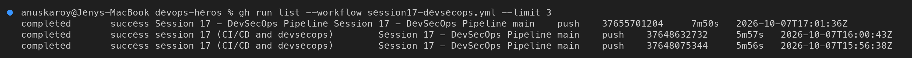

Every job is green, in the order the assignment asks for. The run produced three artifacts:
`docker-image` (the exact image that was scanned and pushed), `sast-reports` and `test-reports`.

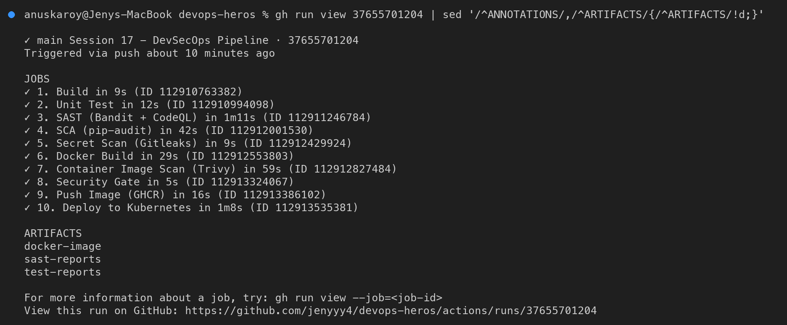

> The `ANNOTATIONS` block is filtered out of this screenshot. It only contains (a) the runner
> notice that `ubuntu-latest` moves to Ubuntu 26 on 19 Oct 2026, and (b) a post-job checkout warning
> `git … failed with exit code 128` (see [§11](#11-troubleshooting-notes)). Neither affects the result.

### 8.2 Stages 1–2: Build and Unit Test

The app compiles and imports (8 routes). 11/11 tests pass, and coverage is 86.79 % against the 80 % gate:

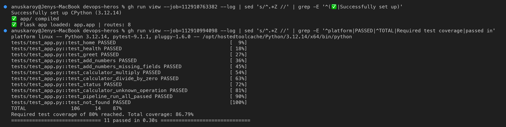

### 8.3 Stage 3: SAST

CodeQL and Bandit results are uploaded to GitHub code scanning (Security tab). The Bandit gate finds
**no issues** (0 Medium, 0 High):

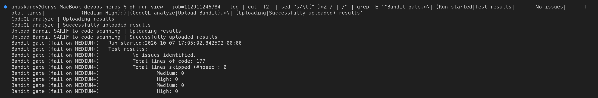

### 8.4 Stages 4–5: SCA and Secret Scan

pip-audit finds **no known vulnerabilities** in the runtime or dev dependencies. Gitleaks finds **no
leaks** in the working tree or in the project's git history:

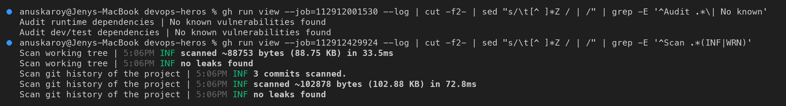

### 8.5 Stage 6: Docker Build

Multi-stage build tagged with the full commit SHA. The smoke test hits `/health` and `/api/status`
and shows the container runs as `uid=10001(app)`:

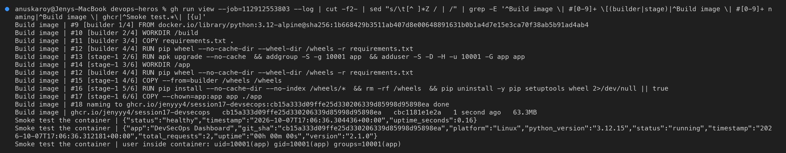

### 8.6 Stage 7: Container Image Scan

The image loaded from the stage-6 artifact has **0** HIGH/CRITICAL vulnerabilities under the
`trivy.yaml` gate policy:

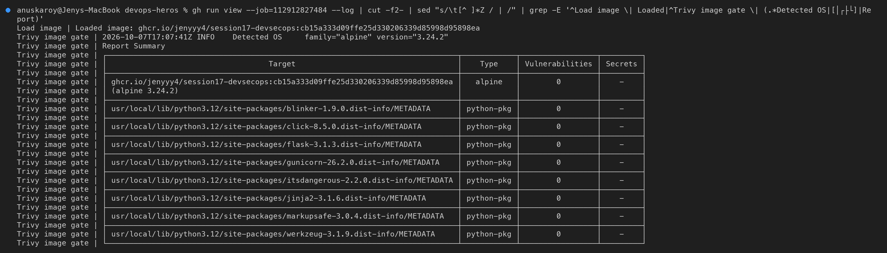

The Dockerfile and all Kubernetes manifests have **0** HIGH/CRITICAL misconfigurations:

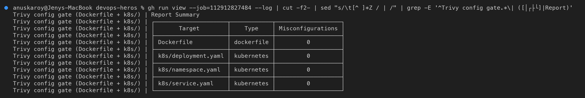

### 8.7 Stage 8: Security Gate

All seven checks report `success`, so the gate **passes** and the release may continue:

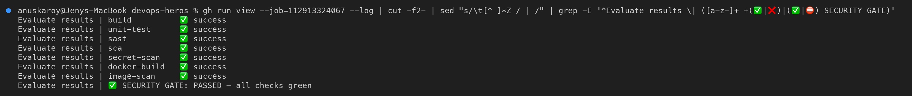

### 8.8 Stage 9: Push Image to GHCR

The same image (from the artifact, not rebuilt) is pushed as `:<sha>` and `:latest`. Both tags have
the same digest:

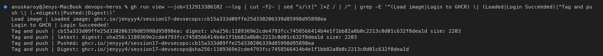

Checked from the laptop directly against the registry (anonymous, read-only):

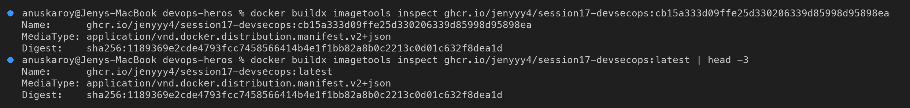

### 8.9 Stage 10: Deploy to Kubernetes

kind cluster on the runner → image pinned to the commit → `kubectl apply -k` → rollout → 2/2 Pods
`Running` with the GHCR image → smoke test through the Service confirms `git_sha` = the commit
that triggered the run:

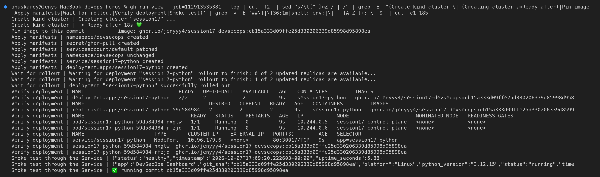

---

## 9. Running every stage locally (with screenshots)

Everything below was run on macOS (Apple Silicon) with Docker Desktop and minikube v1.39.0.
**Nothing had to be installed system-wide:** Bandit, pip-audit and pytest ran in a Python venv,
and Trivy and Gitleaks ran from their official Docker images. `trivy` in the screenshots is a small
wrapper script around `docker run aquasec/trivy:0.75.0` (shown at the top of screenshot 12).

### 9.1 Unit tests: pytest

```bash
python -m pytest -v --cov=app --cov-report=term-missing --cov-fail-under=80
```

11 tests pass with **87 %** coverage (gate: 80 %).

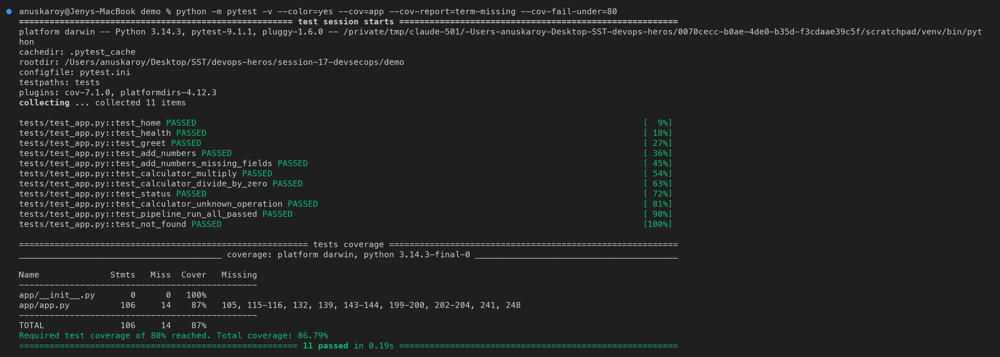

### 9.2 SAST: Bandit

**Before:** the original `app.py` (from the previous commit) fails the gate with a **HIGH** finding
(`B201 flask_debug_true`: the Werkzeug debugger allows arbitrary code execution) and a **MEDIUM**
finding (`B104` binding to all interfaces). Exit code `1` means the pipeline stops here.

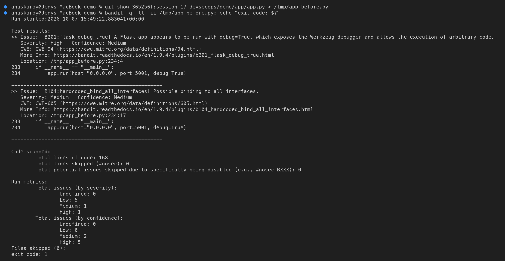

**After the fixes** (see [§10](#10-security-findings-fixed-in-this-project)): no issues at any
severity, exit code `0`.

```bash
bandit -c bandit.yaml -r app -ll -ii
```

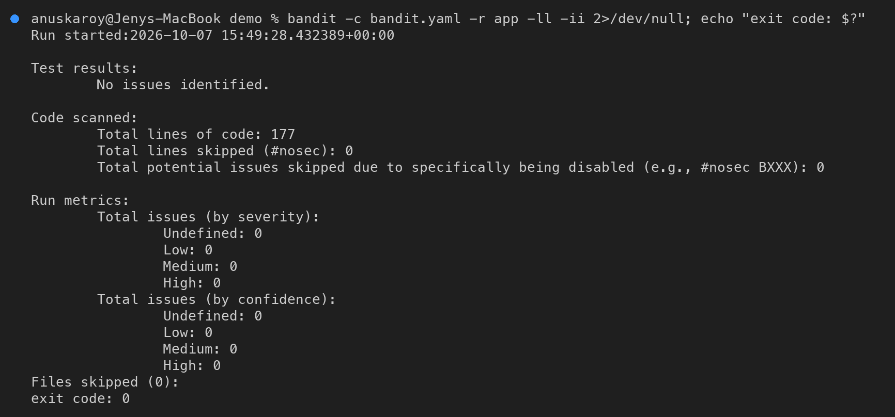

### 9.3 SCA: pip-audit

The project's runtime and dev dependencies have **no known vulnerabilities**:

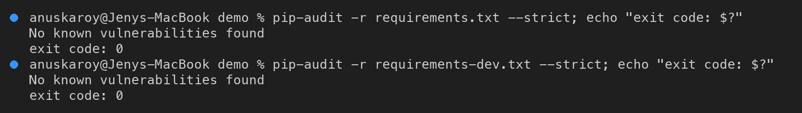

**Gate demo:** the same scan against an old `Flask 2.2.0 / Werkzeug 2.2.2` pin finds **23 known
vulnerabilities** and exits `1`. This is the result that blocks a dependency downgrade or a stale
lock file:

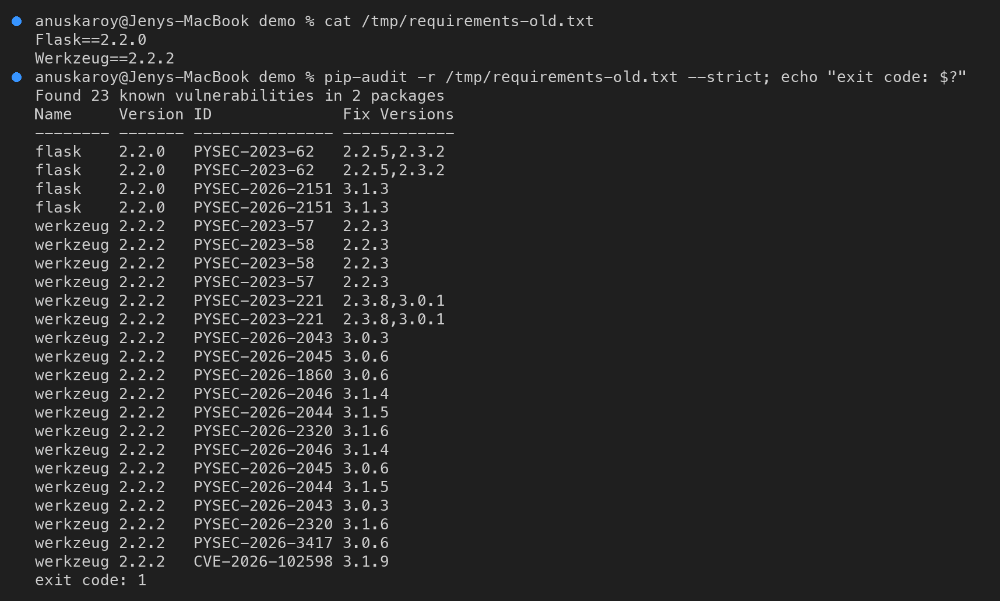

### 9.4 Secret scanning: Gitleaks

Clean scan of the project's working tree **and** of its git history (scoped to this folder with
`--log-opts`):

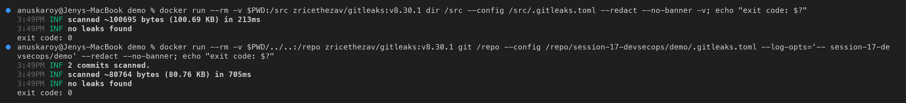

**Gate demo:** two **fake** tokens planted in a throw-away copy of the app (in `/tmp`, never
committed). Gitleaks catches the GitHub PAT with its built-in `github-pat` rule, and the
`DEMO_API_KEY` with the custom `session17-demo-api-key` rule from `.gitleaks.toml`. It redacts both
values and exits `1`:

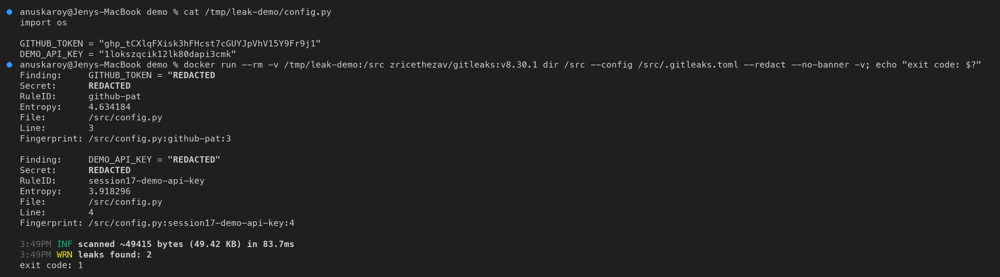

**Scanning the whole repository history** finds 11 hits. All of them are classroom demo
credentials in **session-12** Kubernetes Secret YAMLs and notes (base64 `db-secret.yaml` and
similar). This shows why the CI job scopes Gitleaks to this project. It also shows why secrets
deleted in a later commit **still leak**: Gitleaks reads every commit.

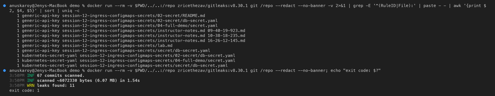

### 9.5 Docker build and run

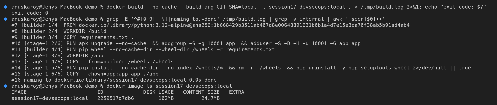

The container reports `(healthy)` through its `HEALTHCHECK`, runs as `uid=10001(app)`, and
`/api/status` shows the `git_sha` build arg:

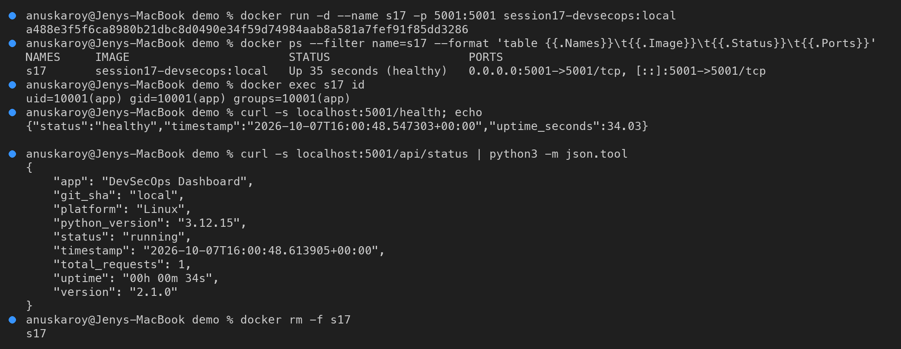

### 9.6 Container image scan: Trivy

**Our image** (`python:3.12-alpine`) against the gate policy in `trivy.yaml` has **0** HIGH/CRITICAL
vulnerabilities and exits `0`:

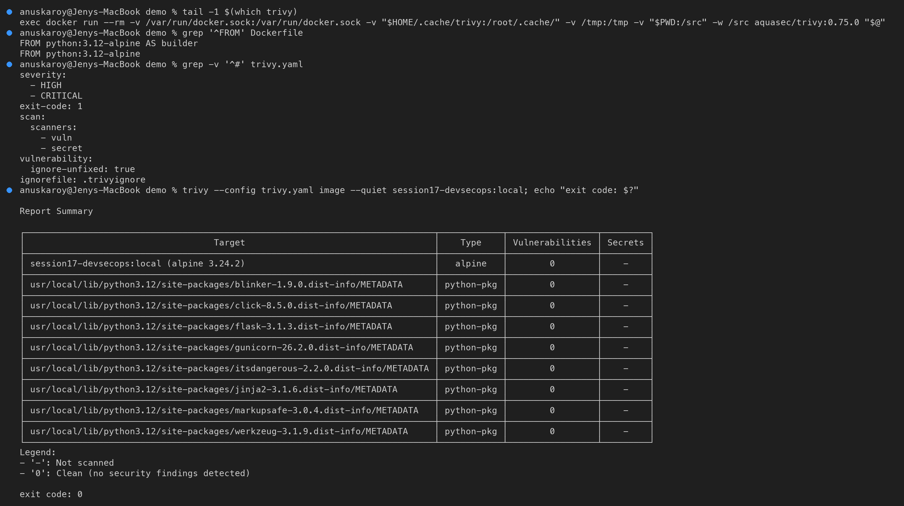

**Gate demo:** the same app built on an **outdated base image** (`python:3.10.0-alpine3.14`, without
`apk upgrade`) has **37 fixable vulnerabilities (29 HIGH, 8 CRITICAL)**. Trivy exits `1`, so the
security gate would block the push:

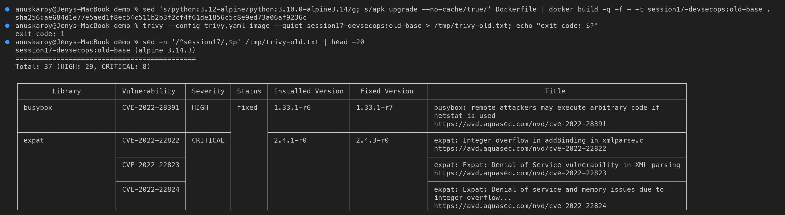

**Dockerfile and Kubernetes misconfiguration scan** (`trivy config`): the original Dockerfile ran as
root (DS-0002) and the original Deployment had no security context (KSV-0014, KSV-0118). The
hardened files have **0** HIGH/CRITICAL findings:

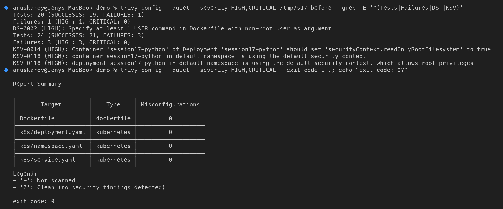

### 9.7 Deploy to Kubernetes (minikube)

A separate `session17` minikube cluster. The locally built image is loaded into the node, and the
manifests are applied with kustomize:

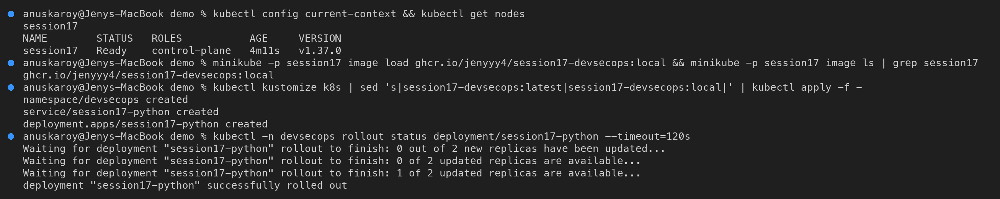

The namespace enforces the **restricted** Pod Security Standard. Both Pods are `Running` with 0
restarts, and the effective security context is visible on the Pod:

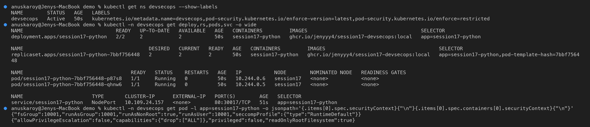

Smoke test through the Service:

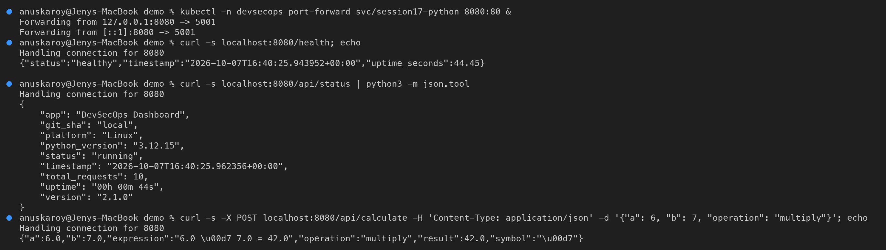

---

## 10. Security findings fixed in this project

| # | Found by | Finding (original project) | Fix |
|---|---|---|---|
| 1 | Bandit **B201 (HIGH)** | `app.run(debug=True)`: the Werkzeug debugger allows remote code execution | debug only when `FLASK_DEBUG=1`; production runs under **gunicorn** |
| 2 | Bandit **B104 (MEDIUM)** | `host="0.0.0.0"` hard-coded | default `127.0.0.1` via `HOST` env; the container binds through gunicorn's `--bind` |
| 3 | Bandit **B311 (LOW) ×5** | `random` module (not cryptographically secure) | `secrets.SystemRandom()` |
| 4 | Trivy **DS-0002 (HIGH)** | container ran as **root** | `USER 10001:10001` |
| 5 | Trivy **DS-0026** | no `HEALTHCHECK` | `HEALTHCHECK` on `/health` |
| 6 | Trivy **KSV-0014/0118 (HIGH)** + 16 more | Deployment had no security context, limits or namespace | hardened `deployment.yaml` + `restricted` namespace |
| 7 | Trivy image | Debian `python:3.12-slim` base: 44 HIGH CVEs at the first scan (later 0 after a Trivy DB update, see §11) | Alpine base with `apk upgrade`: **0**, and smaller (24.7 MB) |
| 8 | Python 3.12 deprecation | `datetime.utcnow()` deprecated | timezone-aware `datetime.now(timezone.utc)` |
| 9 | Pipeline design | the image was rebuilt three times (build, scan, push), so the pushed image wasn't the scanned one | build once → artifact → scan → push the **same** image |
| 10 | Pipeline design | pushed to the upstream author's Docker Hub account (`nensiravaliya28/hey-cicd`) | GHCR with `GITHUB_TOKEN`, image pinned to the **commit SHA** |

---

## 11. Troubleshooting notes

| Problem | Cause | Fix |
|---|---|---|
| Pods restarted once right after deploy; logs: `Control server error: [Errno 30] Read-only file system: '/home/app'` | gunicorn 26 opens a control socket under `$HOME`, but the root FS is read-only and the user has no home | `--no-control-socket` |
| `Readiness probe failed: context deadline exceeded` during start-up | default probe timeout is 1 s while two workers boot under a 250m CPU limit | `timeoutSeconds: 2` |
| A full-history Gitleaks scan of the repo fails | classroom Secret YAMLs from session 12 | the CI job scopes the history scan to `session-17-devsecops/demo` |
| The Trivy count for the old Debian image changed from 44 HIGH to 0 between two runs on the same day | Trivy updates its vulnerability DB; the first findings had status `affected` (no fixed version) | gate on **fixable** HIGH/CRITICAL (`ignore-unfixed`), and always pin the scanner version |
| CI annotation `The process '/usr/bin/git' failed with exit code 128` on most jobs | in its post-job cleanup, `actions/checkout` runs `git submodule foreach`, and the repo has a submodule entry for `session-16-github-actions/mini-project 10-33-34-265` with no `.gitmodules` | harmless warning (the jobs still succeed). Fixing it means removing that broken submodule entry in session 16 |
| A CI image doesn't run on the local minikube | CI builds `linux/amd64`, the laptop is `arm64` | locally, build the image and `minikube image load` it |
