# Session 17: Complete CI/CD & DevSecOps Demo Project

The **DevSecOps Dashboard** (Flask app from the session demo) with a complete CI/CD + DevSecOps pipeline on GitHub Actions. Security tools run as **gates**: a finding stops the pipeline before the image is pushed or deployed.

- **Live repository:** https://github.com/MadaraUchiha-tech/devsecops-demo
- **Pipeline runs:** https://github.com/MadaraUchiha-tech/devsecops-demo/actions
- **Image:** `ghcr.io/madarauchiha-tech/devsecops-dashboard` ([package](https://github.com/MadaraUchiha-tech/devsecops-demo/pkgs/container/devsecops-dashboard))
- **Security tool configuration and decisions:** [security/README.md](security/README.md)

All screenshots in [`docs/screenshots/`](docs/screenshots/) are real captures: terminal windows on my Mac, and GitHub pages in Chrome.

---

## 1. Pipeline flow

[`.github/workflows/devsecops.yml`](.github/workflows/devsecops.yml) implements exactly the expected flow. Each stage `needs:` the previous one:

```text
Code ─▶ 1 Build ─▶ 2 Unit Test ─▶ 3 SAST ─▶ 4 SCA ─▶ 5 Secret Scan ─▶ 6 Docker Build
        compile    pytest +       Bandit +   pip-audit   Gitleaks         docker build,
        + import   coverage≥70%   CodeQL     + Trivy fs  (full history)   image.tar artifact
                                                                             │
   10 Deploy to Kubernetes ◀─ 9 Push Image ◀─ 8 Security Gate ◀─ 7 Container Image Scan
   kind cluster, rollout,     GHCR, the exact   all checks must     Trivy: SARIF report +
   smoke test                 scanned image     be "success"        gate on fixable HIGH/CRITICAL
```

- **Security gate** (`if: always()`) evaluates every upstream result and writes a summary table. If anything isn't `success` it fails, and **push and deploy never run**.
- **Push** re-tags and pushes the *same* `image.tar` that Trivy scanned, never a rebuild, so what's deployed is exactly what was scanned.
- On **pull requests** the security stages run but push and deploy are skipped (`if: github.event_name != 'pull_request'`).

## 2. Project layout

```text
devsecops-demo/
├── app/                      # Flask app (dashboard UI + JSON APIs), served by gunicorn
├── tests/test_app.py         # 12 tests, 91% coverage (gate: 70%)
├── Dockerfile                # multi-stage, non-root, no pip/setuptools at runtime
├── k8s/deployment.yaml       # hardened securityContext, probes, limits
├── k8s/service.yaml
├── pyproject.toml            # Bandit config
├── .gitleaks.toml            # Gitleaks config
├── .trivyignore              # accepted CVEs (empty)
├── security/README.md        # tool / gate / decision documentation
└── .github/workflows/devsecops.yml
```

---

## 3. The story: the gates catching real problems

| # | Change | Result | Blocked at |
|---|---|---|---|
| 1 | Initial push of the session's app | ❌ | **SAST**: Bandit B201 `debug=True` (HIGH) + B104 bind `0.0.0.0` (MEDIUM) |
| 2 | Fix SAST findings | ❌ | **Container image scan**: 4 HIGH CVEs (msgpack, setuptools, urllib3 ×2) in the base image's pip/setuptools |
| 3 | Multi-stage Dockerfile without pip/setuptools | ✅ | Gate passed → pushed to GHCR → **deployed to Kubernetes** |
| PR #1 | Add `requests==2.25.0` | ❌ | **SCA**: pip-audit found 24 known vulnerabilities in 3 packages (requests and the old dependencies it pulls in) |
| PR #2 | Add payment settings with an API key | ❌ | **Secret scan**: Gitleaks `generic-api-key` |
| (push) | Commit with an AWS access key | ⛔ | **GitHub push protection** rejected the `git push` itself |

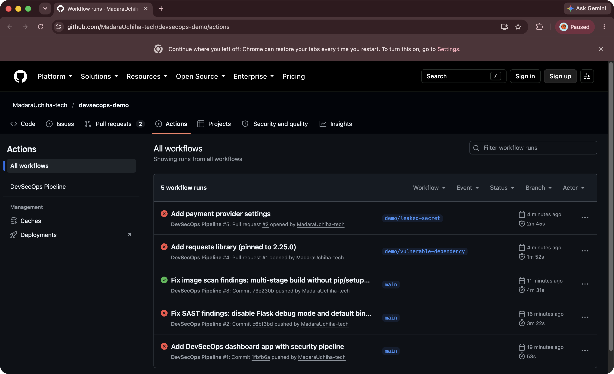

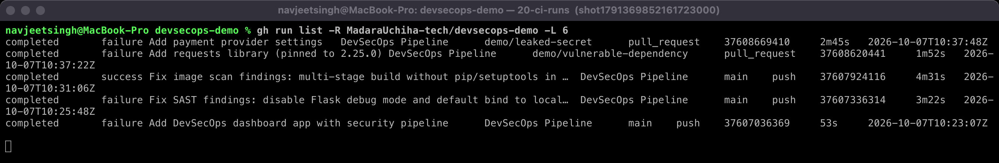

### Run 1: SAST blocks insecure code

The original app ended with `app.run(host="0.0.0.0", port=5001, debug=True)`. The Werkzeug debugger allows arbitrary code execution if it's reachable. Bandit failed the SAST job, and everything after it was skipped:

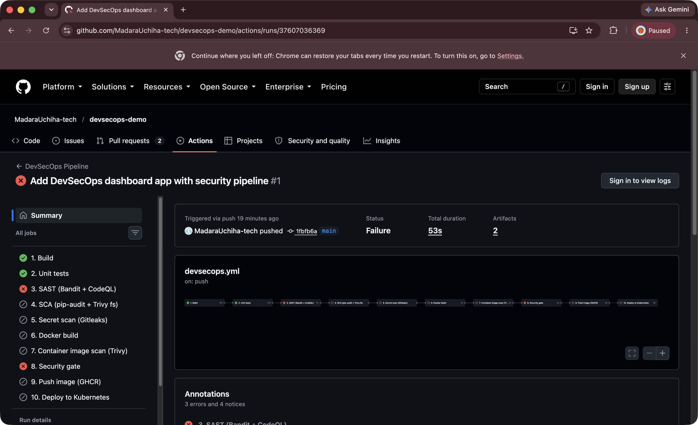

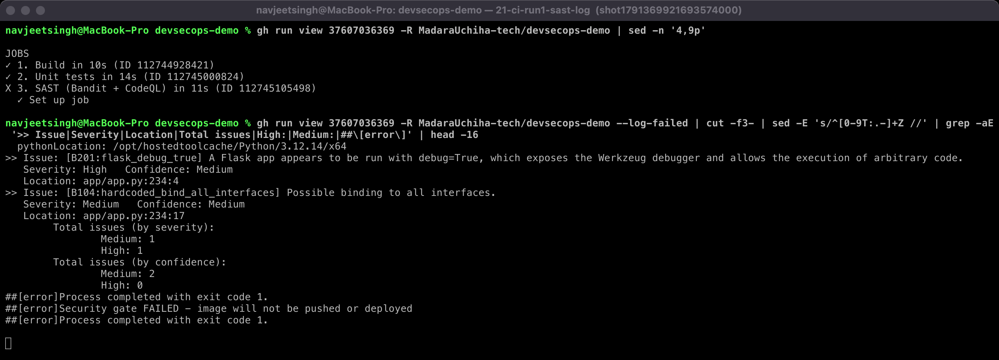

The same scan locally, before and after the fix (host and debug now come from environment variables, defaulting to `127.0.0.1` and off):

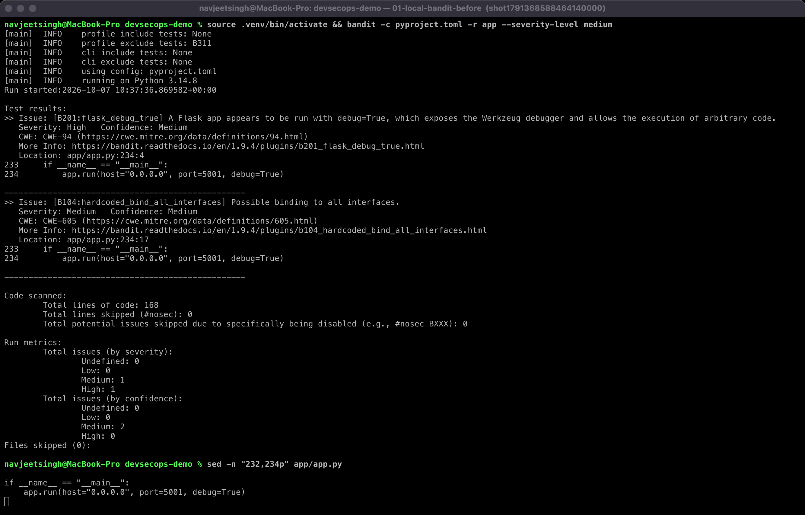

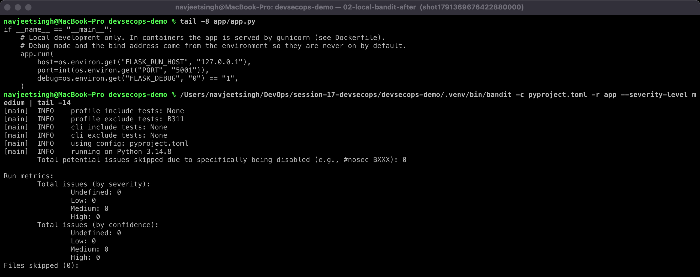

### Run 2: container image scan blocks a vulnerable image

Code, dependencies and secrets were all clean, but `python:3.12-slim` + `pip install --upgrade pip` shipped pip's vendored `msgpack 1.1.2` and `urllib3 2.7.0`, plus `setuptools 70.3.0`, with 4 fixable HIGH CVEs. The gate stopped the push:

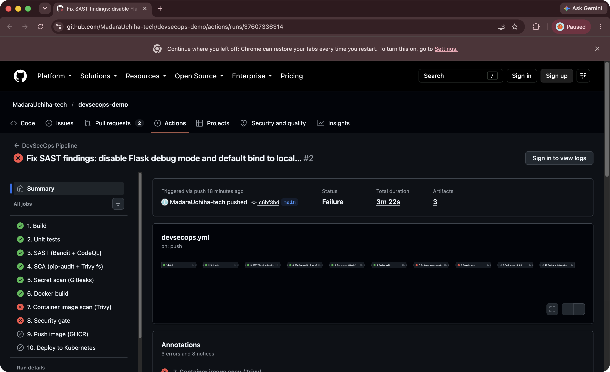

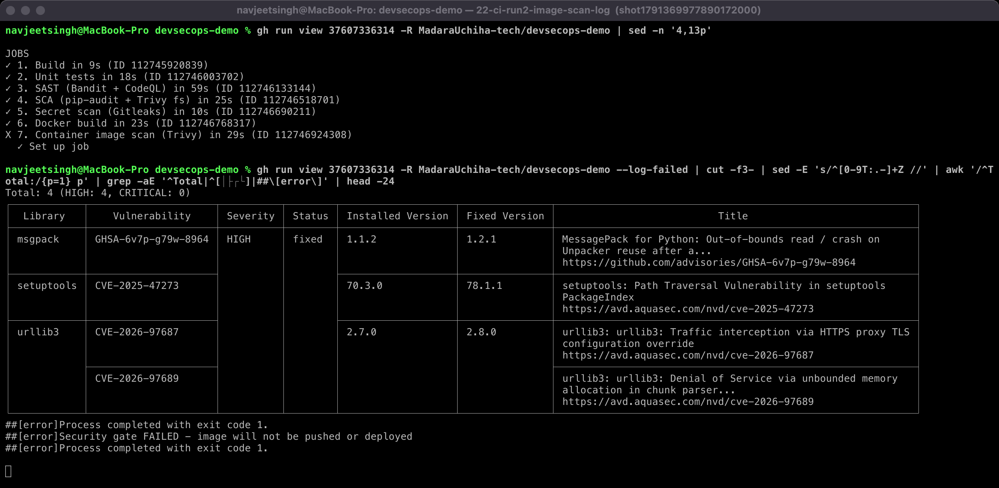

**Fix:** a multi-stage build. Dependencies are installed into `/opt/venv` in a builder stage, and the runtime stage has no `pip`, `setuptools` or `ensurepip`. The app doesn't need them at runtime, so the attack surface simply goes away. Local before/after with the same Trivy command:

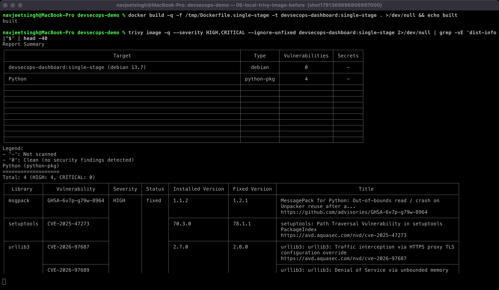

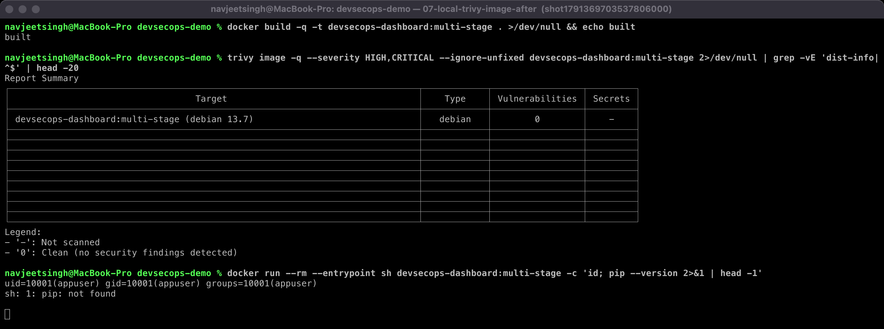

### Run 3: everything green → push → deploy

All 10 stages passed. The gate printed `Security gate PASSED`, the scanned image was pushed to GHCR, and it was deployed to a kind cluster (2/2 Pods Running, `/health` = healthy):

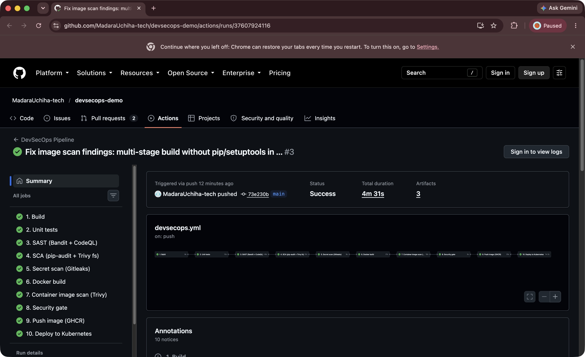

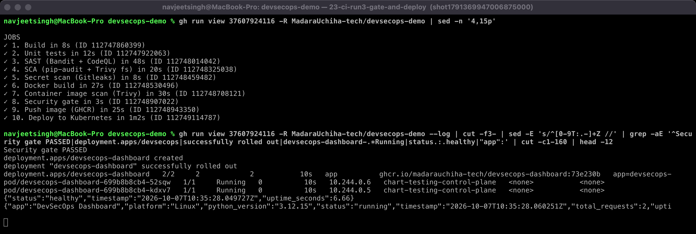

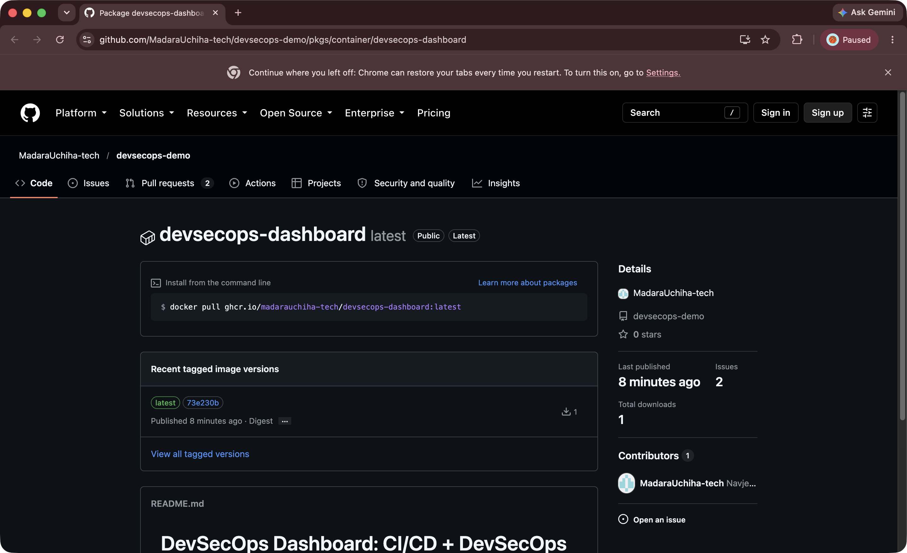

### PR #1: SCA blocks a vulnerable dependency

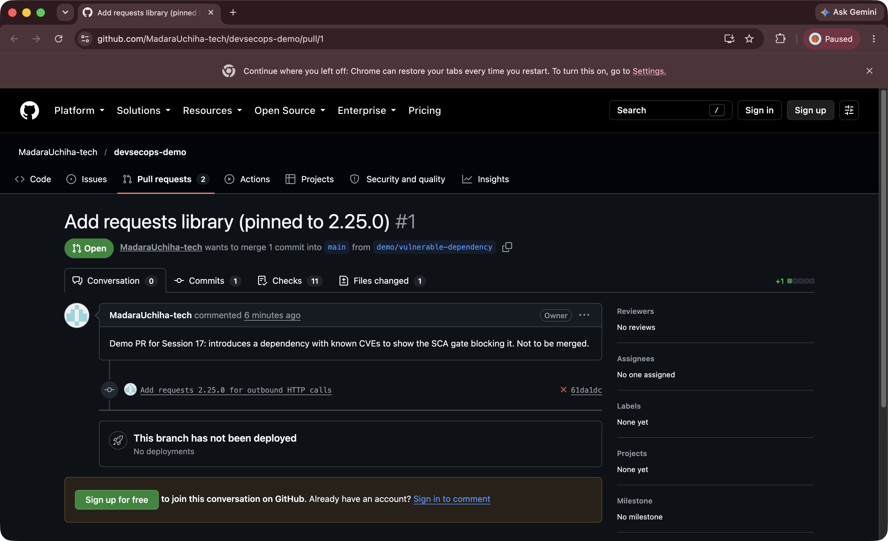

Locally, `pip-audit` is clean for `main` and reports the CVEs for the PR's requirements:

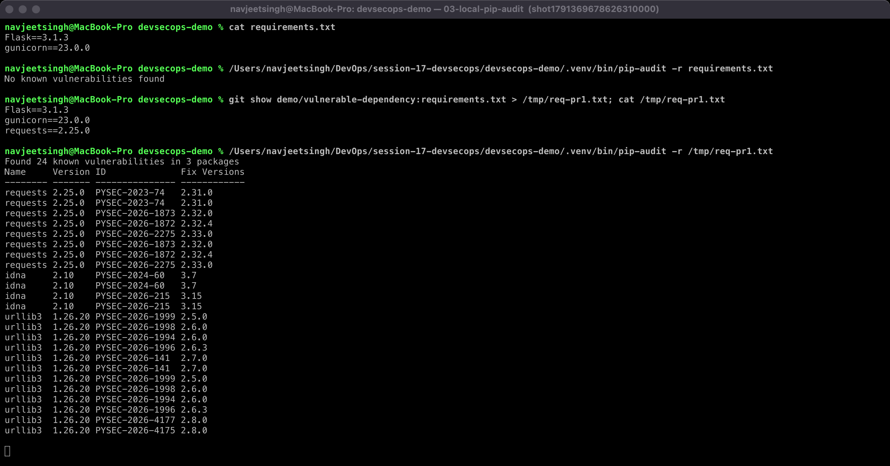

`trivy fs` on `main` (the second SCA tool) is also clean:

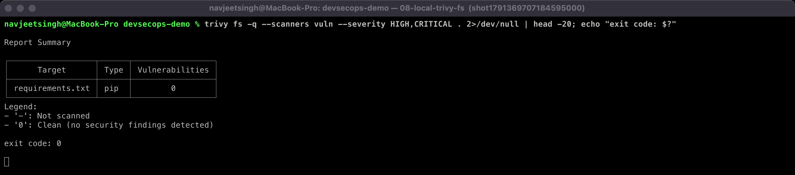

### PR #2: secret scan blocks a committed API key

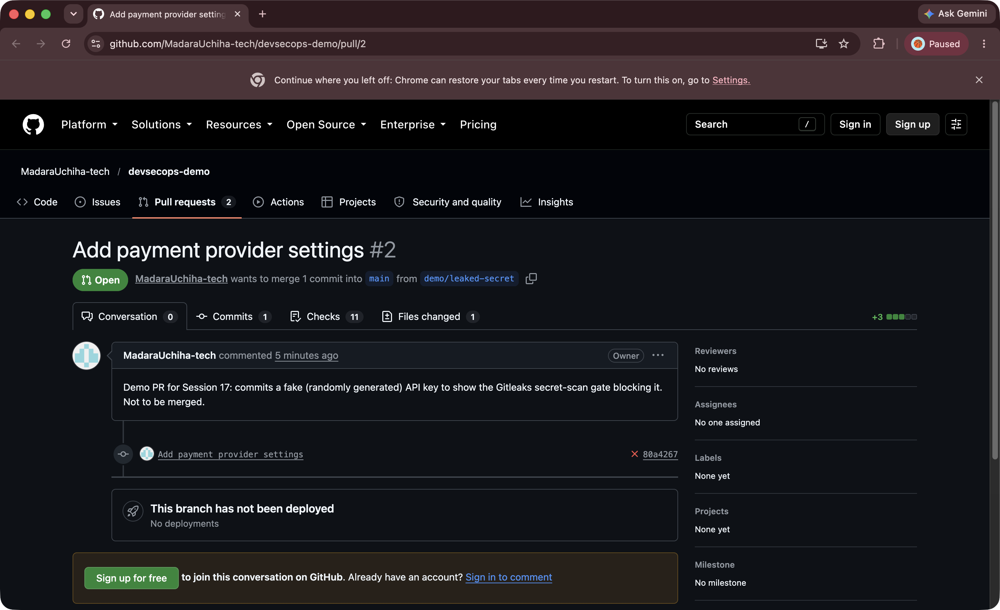

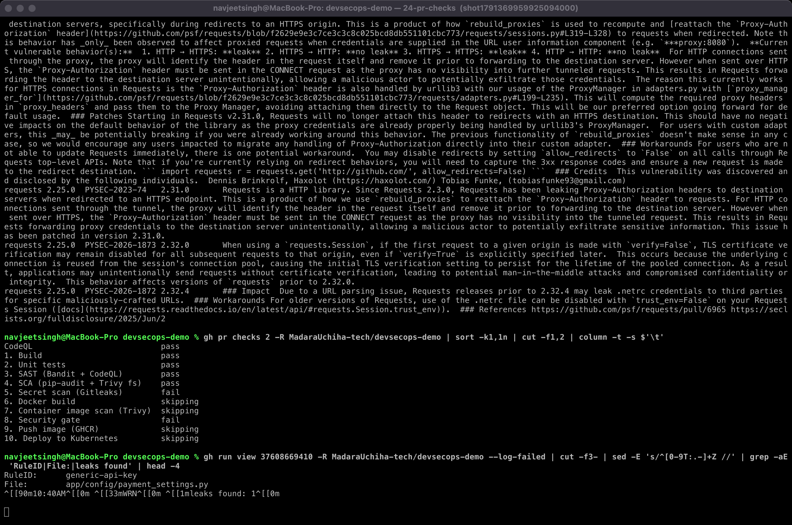

Gitleaks locally: clean on `main`, and one finding on the PR branch (the secret value is redacted):

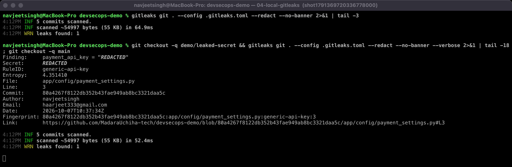

### GitHub push protection: a second secret-scanning layer

When I first tried PR #2 with a (randomly generated, fake) **AWS key pair**, GitHub itself refused the push (`GH013 … Push cannot contain secrets`), so it never reached the repository. I didn't bypass it. I used a generic API key for the pipeline demo instead. Push protection only knows provider-specific patterns, while Gitleaks also catches generic high-entropy secrets, so the two complement each other.

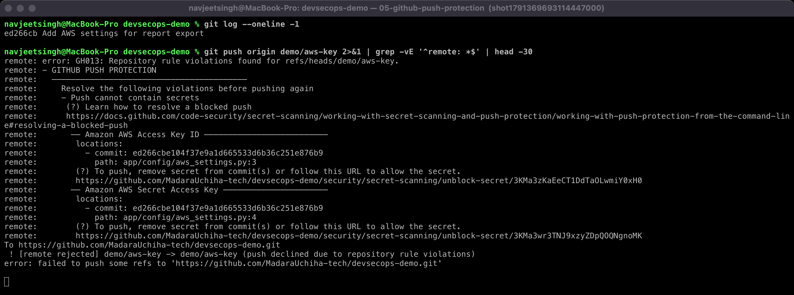

Both demo PRs are left open and unmerged, as evidence.

---

## 4. Unit tests

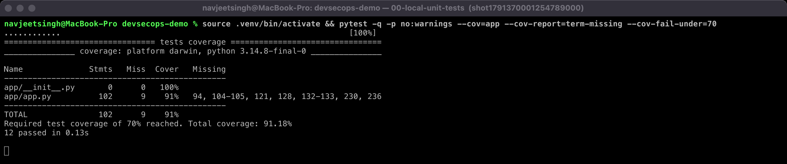

## 5. Kubernetes manifests

[`k8s/deployment.yaml`](k8s/deployment.yaml): 2 replicas; `runAsNonRoot` with uid 10001; `readOnlyRootFilesystem` with an `emptyDir` at `/tmp` for gunicorn; `allowPrivilegeEscalation: false`; `capabilities: drop: [ALL]`; `seccompProfile: RuntimeDefault`; readiness and liveness probes on `/health`; requests and limits. [`k8s/service.yaml`](k8s/service.yaml) is a ClusterIP on port 80 → 5001. The deploy job substitutes `IMAGE_PLACEHOLDER` with the pushed `ghcr.io/...:<sha>` image.

## 6. What I learned

- **Shift left, but gate at every layer.** Each scanner caught something different: insecure code (Bandit), base-image packaging debt (Trivy image), a vulnerable library (pip-audit) and a hard-coded secret (Gitleaks / push protection). No single tool would have caught all four.
- "My code is clean" isn't enough. Run 2 failed purely because of what the **base image** contained. Multi-stage builds and removing unneeded tooling are security controls.
- A gate is only meaningful if the artifact that passed it is the one that ships. That's why push uses the scanned `image.tar` instead of rebuilding.
- Thresholds are deliberate decisions: MEDIUM+ for Bandit, any vulnerability for pip-audit, fixable HIGH/CRITICAL for images. Each exception (B311, `ignore-unfixed`) is documented in [security/README.md](security/README.md).
