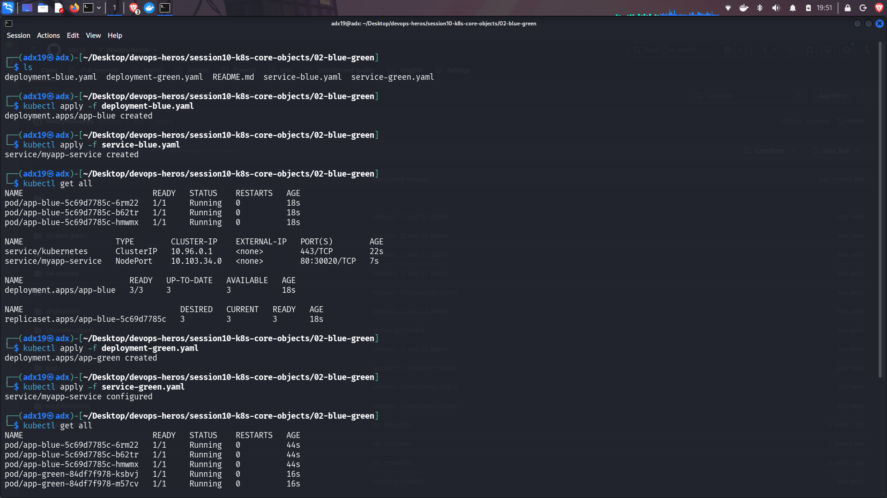
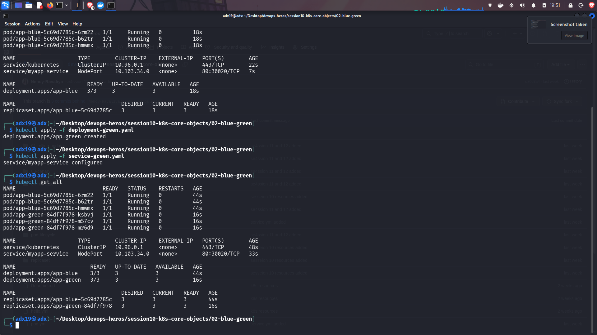

## Blue-Green Deployment

1. **Blue Environment:** The Blue version is the currently deployed version of the application and serves the existing traffic.

2. **Green Environment:** A new version is deployed separately as the Green environment, allowing it to be tested without affecting the Blue version.

3. **Switching Traffic:** Once the Green version is ready, traffic can be switched from Blue to Green. This allows a new version to be released with minimal downtime and makes it possible to switch back to Blue if problems occur.

**Images for the same are given below.**

---

# Screenshots:

