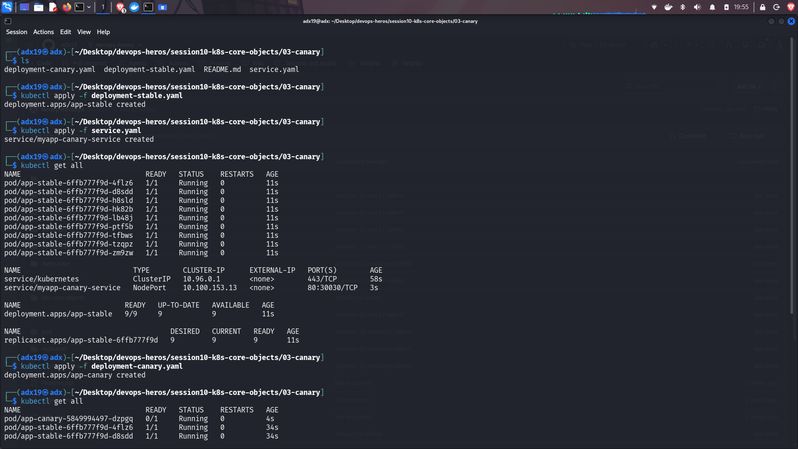
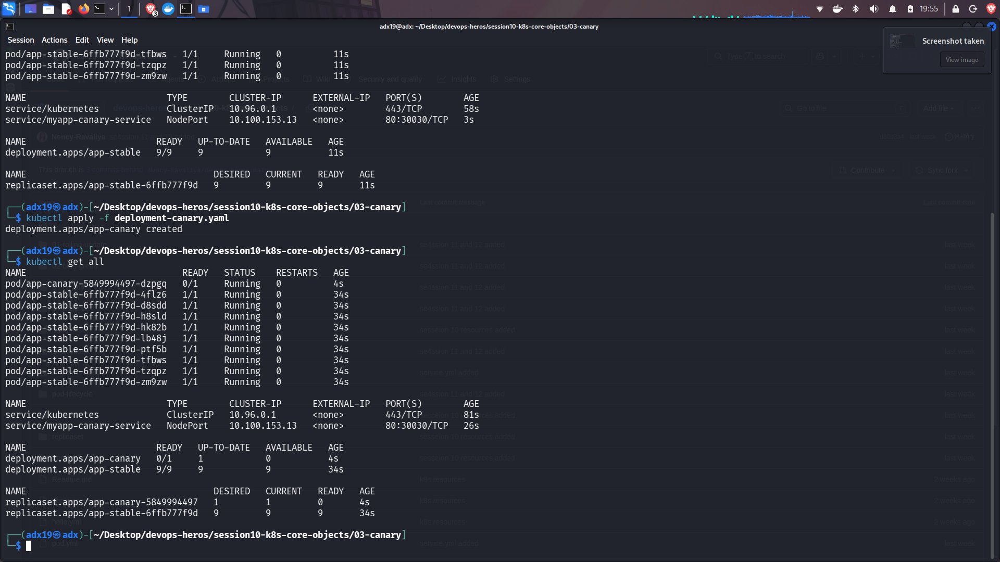

## Canary Deployment

1. **Stable Version:** The stable version is the current, tested version of the application that continues serving most of the traffic.

2. **Canary Version:** A new version is deployed alongside the stable version and receives only a portion of the traffic, allowing the new version to be tested with real traffic.

3. **Gradual Release:** If the canary version works correctly, its traffic can gradually be increased until it becomes the main version. If problems occur, traffic can be kept on or returned to the stable version.

**Images for the same are given below.**

---

# Screenshots:

