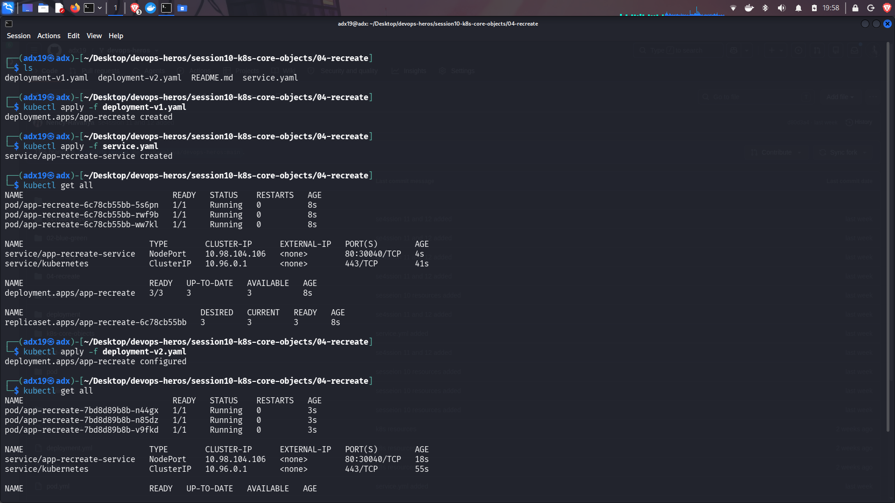
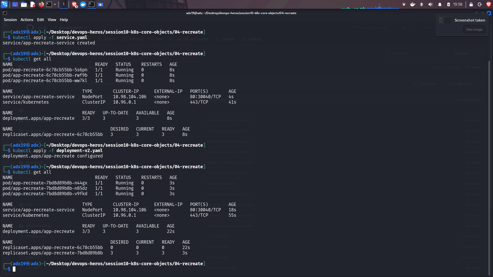

## Recreate Deployment

1. **Stop Existing Pods:** The Recreate strategy first terminates all the existing Pods running the old version.

2. **Create New Pods:** After the old Pods are stopped, Kubernetes creates new Pods using the updated version of the Deployment.

3. **Temporary Downtime:** Since the old Pods are stopped before the new Pods start, there can be a period of downtime during the update. This strategy is useful when multiple versions of an application should not run at the same time.

**Images for the same are given below.**

---

# Screenshots:

