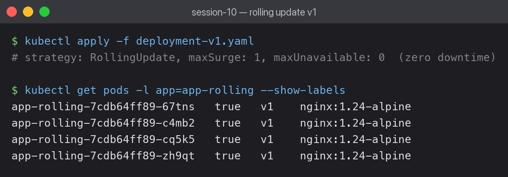
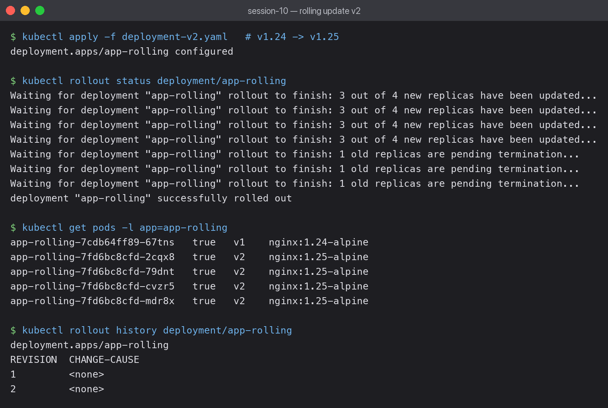

# 01 — Rolling Update

The default Deployment strategy. Pods are replaced gradually, so the app stays available
throughout the update.

## Starting state: 4 pods on v1



```text
app-rolling-7cdb64ff89-67tns   v1    nginx:1.24-alpine
app-rolling-7cdb64ff89-c4mb2   v1    nginx:1.24-alpine
app-rolling-7cdb64ff89-cq5k5   v1    nginx:1.24-alpine
app-rolling-7cdb64ff89-zh9qt   v1    nginx:1.24-alpine
```

The strategy settings that control the rollout:

```yaml
strategy:
  type: RollingUpdate
  rollingUpdate:
    maxSurge: 1          # at most 1 pod ABOVE the desired count
    maxUnavailable: 0    # never drop below the desired count -> zero downtime
```

## The rollout



```bash
kubectl apply -f deployment-v2.yaml
kubectl rollout status deployment/app-rolling
```

```text
Waiting for deployment "app-rolling" rollout to finish: 3 out of 4 new replicas have been updated...
Waiting for deployment "app-rolling" rollout to finish: 1 old replicas are pending termination...
deployment "app-rolling" successfully rolled out
```

Mid-rollout there were **5 pods**, not 4:

```text
app-rolling-7cdb64ff89-67tns   v1    nginx:1.24-alpine   <- old, terminating
app-rolling-7fd6bc8cfd-2cqx8   v2    nginx:1.25-alpine
app-rolling-7fd6bc8cfd-79dnt   v2    nginx:1.25-alpine
app-rolling-7fd6bc8cfd-cvzr5   v2    nginx:1.25-alpine
app-rolling-7fd6bc8cfd-mdr8x   v2    nginx:1.25-alpine
```

That fifth pod is `maxSurge: 1` in action. Because `maxUnavailable: 0`, Kubernetes must
add a new pod *before* removing an old one — capacity never drops below 4.

Note the pod-template-hash changed from `7cdb64ff89` to `7fd6bc8cfd`. Each template version
gets its own ReplicaSet, which is what makes rollback possible.

## Rollback


```bash
kubectl rollout history deployment/app-rolling
```

```text
REVISION  CHANGE-CAUSE
1         <none>
2         <none>
```

```bash
kubectl rollout undo deployment/app-rolling
```

```text
deployment.apps/app-rolling rolled back
deployment "app-rolling" successfully rolled out
```

```text
app-rolling-7cdb64ff89-jqm7b   v1    nginx:1.24-alpine
app-rolling-7cdb64ff89-kpktw   v1    nginx:1.24-alpine
app-rolling-7cdb64ff89-n7kj2   v1    nginx:1.24-alpine
app-rolling-7cdb64ff89-vc2q8   v1    nginx:1.24-alpine
```

Back on v1 without editing a single YAML file. The old ReplicaSet was kept at 0 replicas and
simply scaled back up — the hash `7cdb64ff89` is the same one from before the update.

`kubectl rollout undo` also printed a warning worth knowing:

```text
Warning: resource deployments/app-rolling was previously managed with 'kubectl apply'.
Rolling back will not update the last-applied-configuration annotation.
```

So the cluster is on v1 but the stored "last applied" config still says v2. The next
`kubectl apply` of the v2 file would roll forward again. In a real workflow you would revert
the YAML in git rather than rely on `undo`.

## What I learned

- `CHANGE-CAUSE` is `<none>` unless you annotate the deployment; `--record` is deprecated.
- `maxUnavailable: 0` guarantees capacity but makes the rollout slower, since it can never
  free a slot first — it must always add before removing.
- Both versions serve traffic simultaneously during the rollout, so the app must tolerate
  running two versions at once (matters for database migrations).
