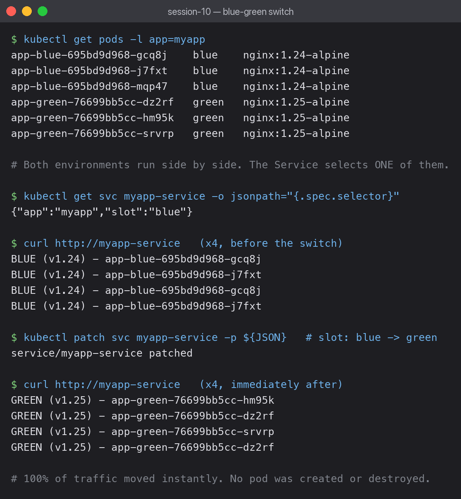

# 02 — Blue-Green Deployment

Two complete environments run side by side. The Service points at one of them, and
switching versions means repointing the Service — not replacing any pods.



## Both environments running at once

```bash
kubectl apply -f deployment-blue.yaml -f deployment-green.yaml -f service-blue.yaml
kubectl get pods -l app=myapp
```

```text
app-blue-695bd9d968-gcq8j    blue    nginx:1.24-alpine
app-blue-695bd9d968-j7fxt    blue    nginx:1.24-alpine
app-blue-695bd9d968-mqp47    blue    nginx:1.24-alpine
app-green-76699bb5cc-dz2rf   green   nginx:1.25-alpine
app-green-76699bb5cc-hm95k   green   nginx:1.25-alpine
app-green-76699bb5cc-srvrp   green   nginx:1.25-alpine
```

Six pods for a three-pod app — **double the resources** for the duration. That is the cost
of this strategy.

## The Service selects one slot

```bash
kubectl get svc myapp-service -o jsonpath='{.spec.selector}'
```

```text
{"app":"myapp","slot":"blue"}
```

The `slot` label is what makes this work. Both deployments carry `app: myapp`, but only blue
carries `slot: blue`, so the Service's endpoints resolve to the blue pods alone.

## Traffic before the switch

Each pod was given an identifiable page first:

```bash
for i in 1 2 3 4; do kubectl exec bg-client -- curl -s http://myapp-service; done
```

```text
BLUE (v1.24) - app-blue-695bd9d968-gcq8j
BLUE (v1.24) - app-blue-695bd9d968-j7fxt
BLUE (v1.24) - app-blue-695bd9d968-gcq8j
BLUE (v1.24) - app-blue-695bd9d968-j7fxt
```

## The switch

```bash
kubectl patch svc myapp-service -p '{"spec":{"selector":{"app":"myapp","slot":"green"}}}'
```

```text
service/myapp-service patched
```

## Traffic immediately after

```text
GREEN (v1.25) - app-green-76699bb5cc-hm95k
GREEN (v1.25) - app-green-76699bb5cc-dz2rf
GREEN (v1.25) - app-green-76699bb5cc-srvrp
GREEN (v1.25) - app-green-76699bb5cc-dz2rf
```

**100% of traffic moved instantly.** No pod was created, destroyed or restarted — only the
Service's endpoint list was recalculated.

## Rollback is the same operation

Patching `slot` back to `blue` returns all traffic to the old version just as fast. The blue
pods were never touched, so there is no startup delay — this is the fastest rollback of any
strategy, which is the main reason to accept the doubled resource cost.

## Blue-green vs rolling update

| | Rolling update | Blue-green |
|---|---|---|
| Pods needed | N + maxSurge | 2N |
| Both versions serving at once | yes, briefly | no |
| Switch speed | gradual | instant |
| Rollback speed | another rollout | instant |
| Test new version before traffic | no | yes |

The ability to test green fully while blue still serves production is the real advantage.
With a rolling update, the new version is taking live traffic the moment it is ready.

## What I learned

- Blue-green is a **label** trick, not a special Kubernetes feature — the Service selector
  is doing all the work.
- In-flight requests to blue still complete after the patch; existing connections are not
  severed, only new ones are routed to green.
- The switch is atomic from the Service's point of view, but a shared database still has to
  be compatible with both versions.
