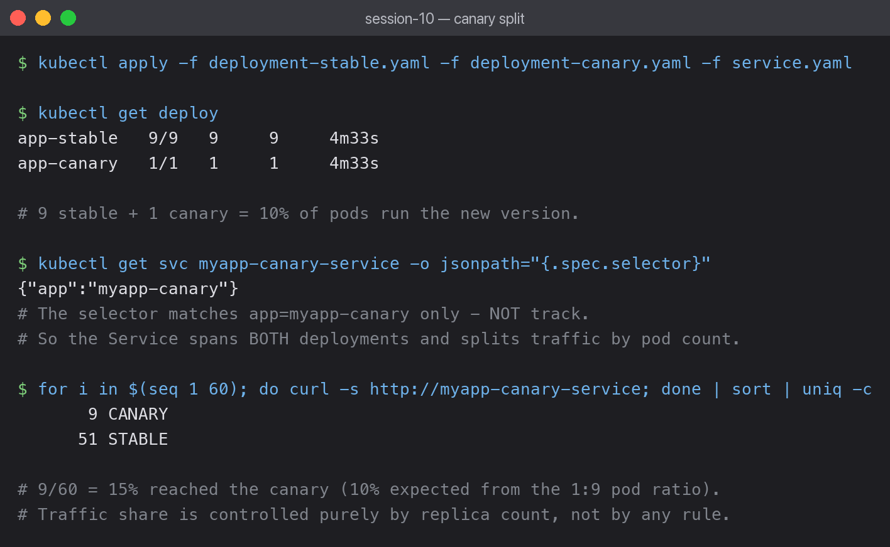

# 03 — Canary Deployment

A small share of traffic goes to the new version while the rest stays on the stable one.
If the canary misbehaves, only a fraction of users are affected.



## 9 stable + 1 canary

```bash
kubectl apply -f deployment-stable.yaml -f deployment-canary.yaml -f service.yaml
kubectl get deploy
```

```text
app-stable   9/9   9   9   4m33s
app-canary   1/1   1   1   4m33s
```

Ten pods total, one running the new version — a 10% canary.

## The selector is deliberately loose

```bash
kubectl get svc myapp-canary-service -o jsonpath='{.spec.selector}'
```

```text
{"app":"myapp-canary"}
```

This is the key difference from blue-green. There, the selector included `slot` so it matched
exactly one deployment. Here it matches **only** `app`, and both deployments carry that label:

```text
app-canary-596b65bf66-4qldw   app=myapp-canary, track=canary, version=v2
app-stable-b74f6f677-6qhgj    app=myapp-canary, track=stable, version=v1
```

So all 10 pods are endpoints of the same Service, and kube-proxy spreads traffic across them.

## Measured traffic split

Each pod was tagged, then 60 requests were sent:

```bash
for i in $(seq 1 60); do kubectl exec bg-client -- curl -s http://myapp-canary-service; done \
  | sort | uniq -c
```

```text
   9 CANARY
  51 STABLE
```

**9 of 60 = 15%** reached the canary, against 10% predicted by the 1:9 pod ratio.

The gap is sampling noise — kube-proxy picks a backend at random per connection, so a
60-request sample will not land exactly on the expected ratio. Over thousands of requests it
converges on 10%.

## Traffic share is controlled by replica count

There is no percentage setting anywhere. To move from 10% to 25%:

```bash
kubectl scale deployment app-canary --replicas=3
kubectl scale deployment app-stable --replicas=9
```

3 of 12 pods = 25%. This is the main limitation: fine-grained splits need many pods.
A 1% canary would need 99 stable pods. Real percentage-based routing needs an ingress
controller or a service mesh, which can split by weight regardless of pod count.

## Promoting or aborting

- **Promote:** scale the canary up and the stable deployment down, or update stable to the
  new image and delete the canary.
- **Abort:** `kubectl scale deployment app-canary --replicas=0`. Traffic returns to stable
  in seconds without touching the Service.

## Canary vs blue-green

| | Blue-green | Canary |
|---|---|---|
| Traffic to new version | 0% then 100% | small %, increased gradually |
| Extra pods needed | 2N | N + a few |
| Blast radius if broken | everyone, at once | only the canary share |
| Split granularity | n/a | limited by pod count |

## What I learned

- The looseness of the Service selector is the entire mechanism.
- Canary needs monitoring to be meaningful — sending 10% of traffic to a new version is only
  useful if you are watching its error rate against the stable one.
- Because both versions share a Service, sessions are not sticky: the same user can hit
  stable on one request and canary on the next.
