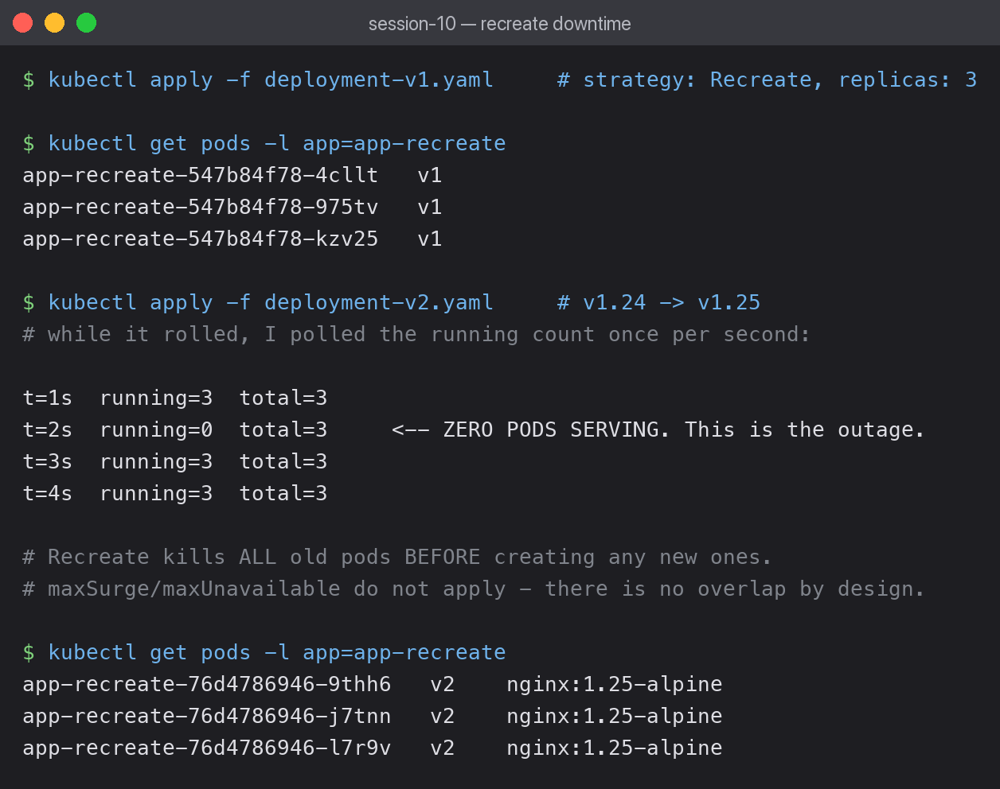

# 04 — Recreate Strategy

All old pods are terminated **before** any new pod is created. This guarantees the two
versions never run at the same time — and guarantees downtime.



```yaml
strategy:
  type: Recreate
```

That is the whole configuration. `maxSurge` and `maxUnavailable` do not apply, because there
is no overlap to control.

## Catching the outage

Starting from 3 pods on v1, I applied v2 and polled the running count once per second:

```bash
kubectl apply -f deployment-v2.yaml &
for i in $(seq 1 14); do
  R=$(kubectl get pods -l app=app-recreate --no-headers | grep -c ' Running')
  T=$(kubectl get pods -l app=app-recreate --no-headers | wc -l)
  echo "t=${i}s  running=${R}  total=${T}"
  sleep 1
done
```

```text
t=1s  running=3  total=3
t=2s  running=0  total=3     <-- ZERO PODS SERVING. This is the outage.
t=3s  running=3  total=3
t=4s  running=3  total=3
```

**At t=2s the running count hit 0.** Every old pod was gone and the new ones had not become
ready yet. Any request arriving in that window fails.

The outage was about a second here because nginx starts almost instantly and the image was
already cached. A real application with a 30-second startup would be down for 30 seconds.

## After the rollout

```text
app-recreate-76d4786946-9thh6   v2    nginx:1.25-alpine
app-recreate-76d4786946-j7tnn   v2    nginx:1.25-alpine
app-recreate-76d4786946-l7r9v   v2    nginx:1.25-alpine
```

All three replaced, and at no point did a v1 and a v2 pod serve traffic together.

## Why choose a strategy that causes downtime

That guarantee is the reason. Recreate is correct when the two versions genuinely cannot
coexist:

- **Incompatible database migrations** — v2's schema change breaks v1, so v1 must be fully
  stopped before v2 starts.
- **Exclusive resources** — a `ReadWriteOnce` volume that only one pod can mount, or an app
  that takes a global lock.
- **Single-replica stateful apps** where a rolling update is impossible anyway.

For a normal stateless web app, Recreate is the wrong choice — rolling update gives the same
result with no outage.

## All four strategies compared

| Strategy | Downtime | Extra pods | Versions coexist | Rollback |
|---|---|---|---|---|
| Rolling update | none | +maxSurge | yes, briefly | another rollout |
| Blue-green | none | 2N | no | instant |
| Canary | none | N + a few | yes, by design | scale canary to 0 |
| **Recreate** | **yes** | none | **never** | another outage |

Recreate is the only one with downtime, and the only one that needs no extra capacity.

## What I learned

- The downtime window is bounded by how long the new pods take to become ready, not by how
  long the old ones take to stop.
- A readiness probe does not prevent the outage — it only affects when traffic resumes.
- Catching this required polling during the rollout. Checking before and after would have
  shown 3 pods both times and hidden the entire effect.
