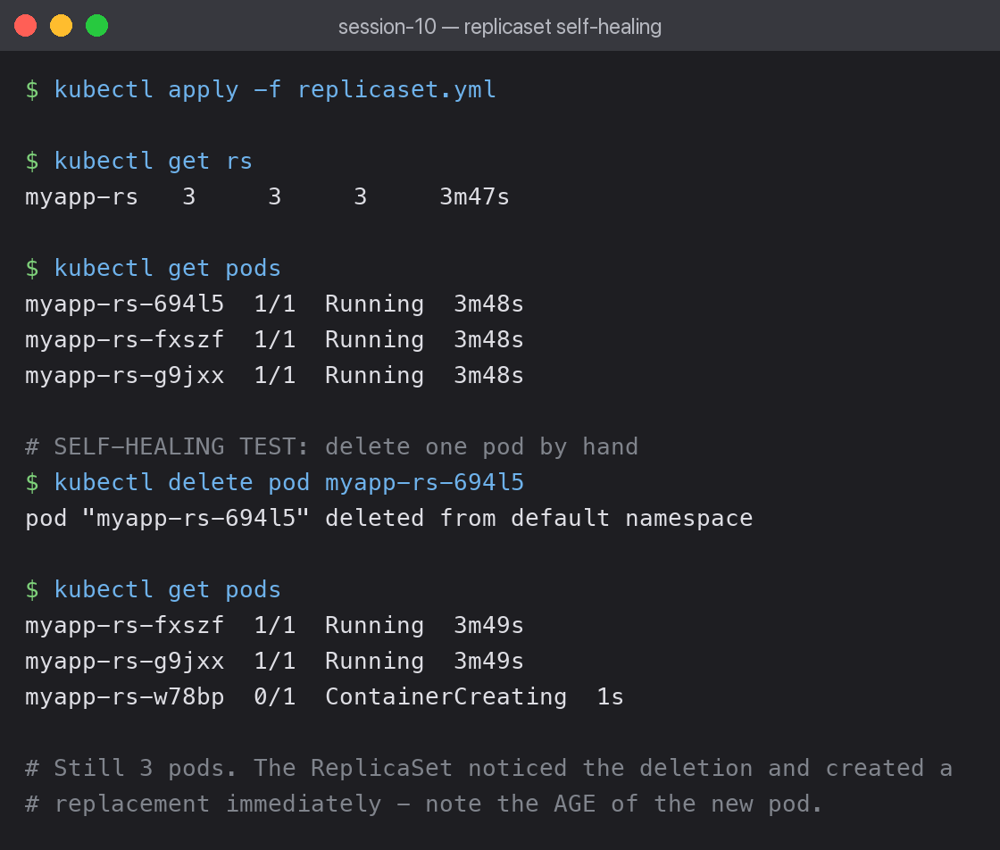

# Core Objects — Pod, ReplicaSet, Deployment, DaemonSet, StatefulSet



## The hierarchy

```
Deployment  ->  ReplicaSet  ->  Pod  ->  Container
```

Each layer adds one capability:

| Object | Adds | Use it for |
|---|---|---|
| Pod | smallest deployable unit | almost never directly |
| ReplicaSet | keeps N copies alive | almost never directly |
| Deployment | rolling updates + rollback history | stateless apps (the default) |
| DaemonSet | one pod per node | log collectors, monitoring agents |
| StatefulSet | stable names + stable storage | databases, clustered systems |

## ReplicaSet self-healing, demonstrated

```bash
kubectl get rs
```

```text
myapp-rs   3     3     3     3m47s
```

Three pods running. I deleted one by hand:

```bash
kubectl delete pod myapp-rs-694l5
```

```text
pod "myapp-rs-694l5" deleted
```

```bash
kubectl get pods
```

```text
myapp-rs-fxszf  1/1  Running            3m49s
myapp-rs-g9jxx  1/1  Running            3m49s
myapp-rs-w78bp  0/1  ContainerCreating  1s     <- replacement, 1 second old
```

Still three pods. The ReplicaSet controller compares desired state (3) against actual (2) and
creates a replacement immediately. The new pod's age of **1s** next to the others' 3m49s is
the proof.

This is the reconciliation loop that underpins all of Kubernetes: declare what you want, and
a controller continuously works to make reality match.

## Why you use a Deployment, not a ReplicaSet

A ReplicaSet keeps pods alive but cannot update them — changing the image does nothing to
running pods. A Deployment manages ReplicaSets on your behalf: one per template version,
which is what makes rolling updates and `kubectl rollout undo` possible.

You can see this in the pod names. `app-rolling-7cdb64ff89-...` and
`app-rolling-7fd6bc8cfd-...` are two different ReplicaSets created by one Deployment —
covered in [../01-rolling-update/](../01-rolling-update/).

## What I learned

- Deleting a pod managed by a controller does not remove it — it triggers a replacement.
  To actually remove them, delete the controller.
- DaemonSets take no `replicas` field; the node count decides how many pods run.
- StatefulSets need a headless Service for stable per-pod DNS
  (demonstrated in session 11's headless notes).
