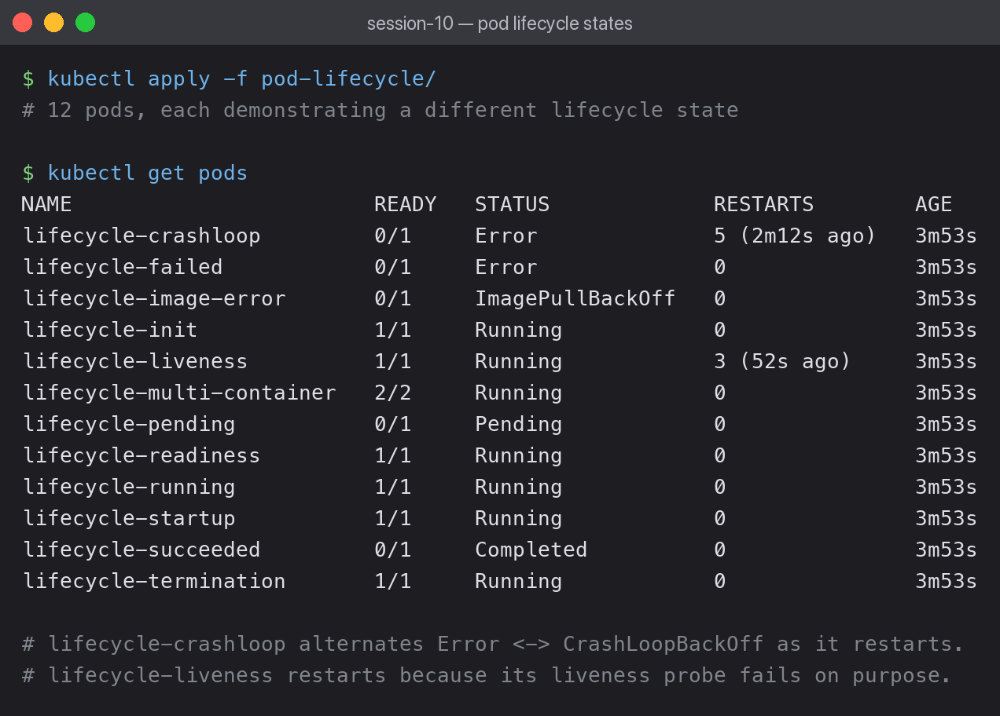
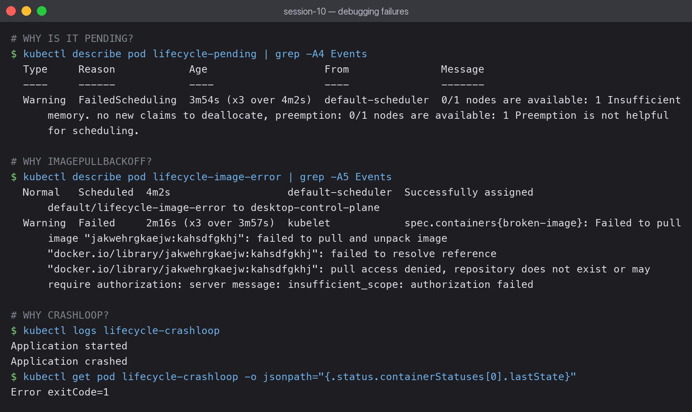
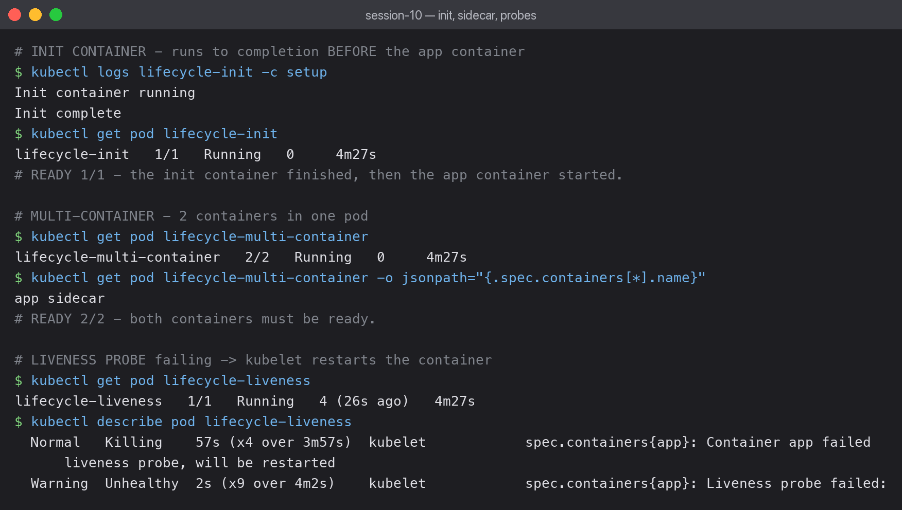

# Pod Lifecycle — all 12 states

Twelve pods were applied at once, each engineered to land in a different state.
Several are **supposed** to fail — that is the point of the exercise.



```bash
kubectl apply -f pod-lifecycle/
kubectl get pods
```

```text
NAME                        READY   STATUS             RESTARTS        AGE
lifecycle-crashloop         0/1     Error              5 (2m12s ago)   3m53s
lifecycle-failed            0/1     Error              0               3m53s
lifecycle-image-error       0/1     ImagePullBackOff   0               3m53s
lifecycle-init              1/1     Running            0               3m53s
lifecycle-liveness          1/1     Running            4 (26s ago)     3m53s
lifecycle-multi-container   2/2     Running            0               3m53s
lifecycle-pending           0/1     Pending            0               3m53s
lifecycle-readiness         1/1     Running            0               3m53s
lifecycle-running           1/1     Running            0               3m53s
lifecycle-startup           1/1     Running            0               3m53s
lifecycle-succeeded         0/1     Completed          0               3m53s
lifecycle-termination       1/1     Running            0               3m53s
```

## The five phases

| Phase | Meaning | Pod here |
|---|---|---|
| Pending | accepted, but not yet scheduled or still pulling | `lifecycle-pending` |
| Running | bound to a node, at least one container running | `lifecycle-running` |
| Succeeded | all containers exited 0, will not restart | `lifecycle-succeeded` |
| Failed | at least one container exited non-zero | `lifecycle-failed` |
| Unknown | node unreachable | not reproducible here |

`CrashLoopBackOff` and `ImagePullBackOff` are **not phases** — they are container states
inside a pod that is still `Pending` or `Running`. That distinction confused me at first.

## Diagnosing each failure



### Pending — why is it not scheduled?

```bash
kubectl describe pod lifecycle-pending | grep -A4 Events
```

```text
Warning  FailedScheduling  0/1 nodes are available: 1 Insufficient memory.
```

The pod requests more memory than any node can offer, so the scheduler cannot place it.
`describe` gives the exact reason — `kubectl get` only shows `Pending`.

### ImagePullBackOff — why can it not start?

```text
Failed to pull image "jakwehrgkaejw:kahsdfgkhj": pull access denied,
repository does not exist or may require authorization
```

A deliberately nonsense image name. In production the same error usually means a typo in
the tag, or a private registry with no `imagePullSecret`.

### CrashLoopBackOff — why does it keep restarting?

```bash
kubectl logs lifecycle-crashloop
```

```text
Application started
Application crashed
```

```text
lastState: Error exitCode=1
```

`kubectl logs` shows the app's own output; `lastState.terminated.exitCode` gives the exit
code. The pod alternates between `Error` and `CrashLoopBackOff` as the kubelet backs off —
the delay doubles each time (10s, 20s, 40s… capped at 5 min), which is why the status
flickers between the two.

## Probes, init containers and sidecars



### Init container

```bash
kubectl logs lifecycle-init -c setup
```

```text
Init container running
Init complete
```

The init container ran to completion **before** the app container started. The pod shows
`1/1` because init containers are not counted in the ready total once finished. This is the
standard way to wait for a dependency or prepare a volume.

### Multi-container pod

```text
lifecycle-multi-container   2/2   Running
containers: app sidecar
```

`2/2` means both containers must be ready for the pod to be ready. They share the same
network namespace, so they reach each other on `localhost`.

### Liveness probe

```text
Warning  Unhealthy  Liveness probe failed:
Normal   Killing    Container app failed liveness probe, will be restarted
```

The probe fails on purpose, so the kubelet restarts the container over and over — the
restart counter climbed to 4 while I watched.

**Liveness vs readiness** — the distinction that finally made sense:

- **Liveness** failing → container is **restarted**. Use for deadlocks.
- **Readiness** failing → pod is **removed from Service endpoints** but left running.
  Use for "temporarily busy, do not send traffic".
- **Startup** → disables the other two until the app has booted, so slow starters are not
  killed prematurely.

Getting these backwards is a classic production incident: a liveness probe with too short a
timeout will restart a perfectly healthy app that is merely slow.

## Note on this cluster

The manifests use `nginx:1.27`, which failed to pull here — the local registry mirror
returned `500 Internal Server Error` for any uncached image:

```text
unexpected status from HEAD request to http://registry-mirror:1273/v2/library/nginx/manifests/1.27
```

That is a cluster infrastructure problem, not a manifest problem. I ran the pods with
`nginx:1.25-alpine` (already cached) to get the lifecycle states demonstrated. The committed
YAML is unchanged.
