# Pod lifecycle

## 01-running
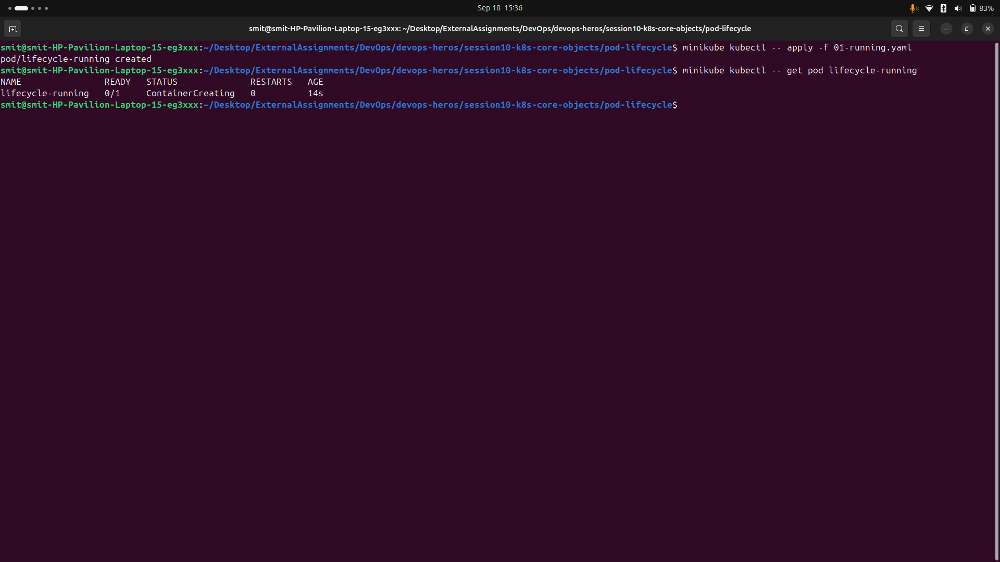

## 02-pending
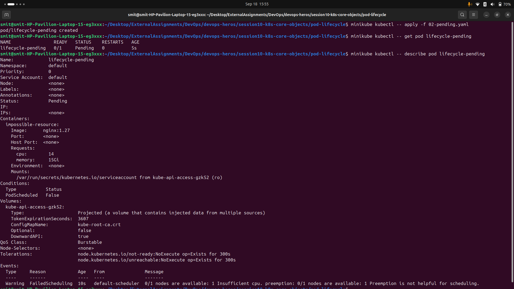

## 03-succeeded
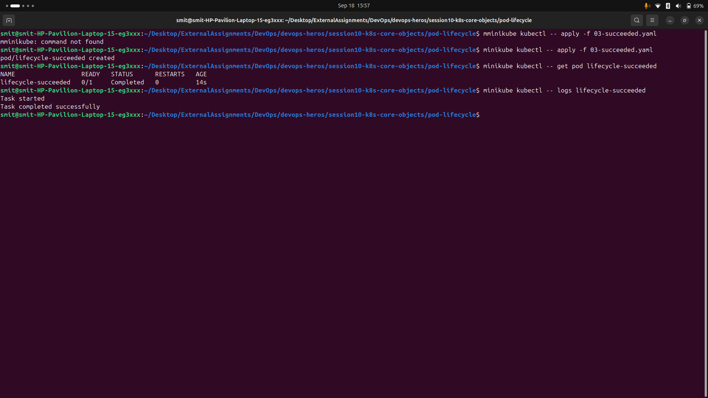

## 04-failed
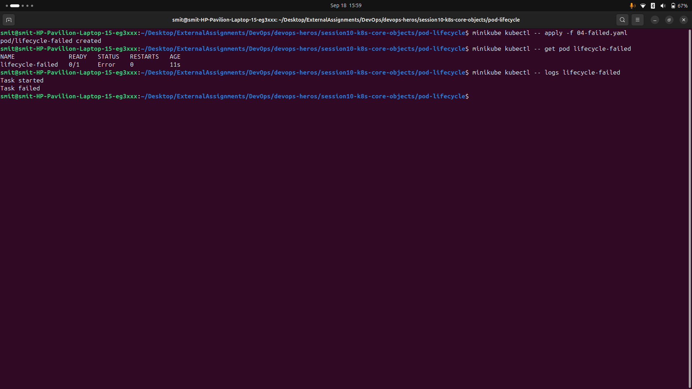

## 05-crashloopback
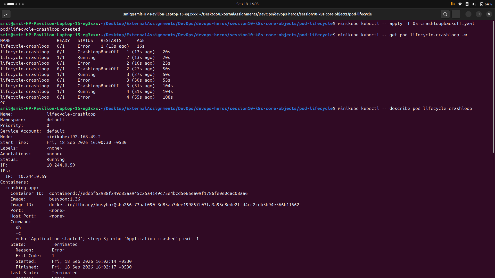
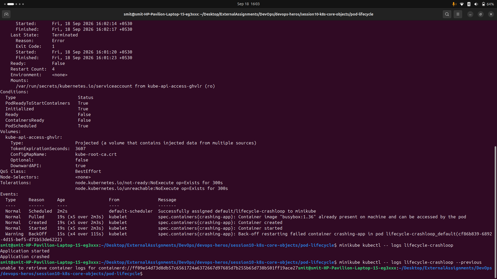

## 06-imagepullback
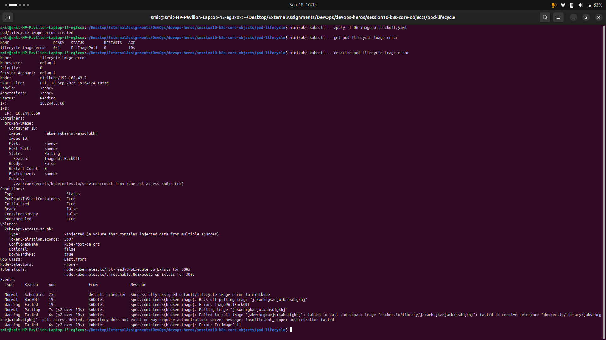

## 07-readniess
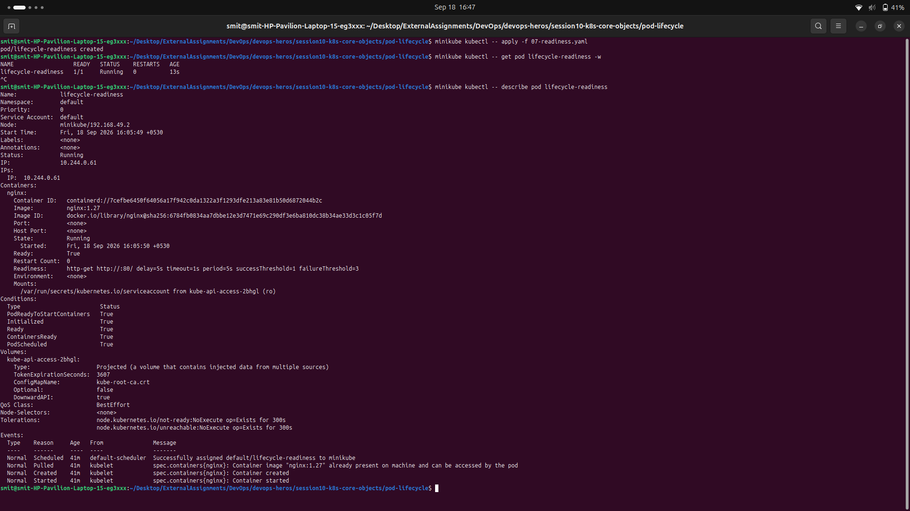

## 08-liveness
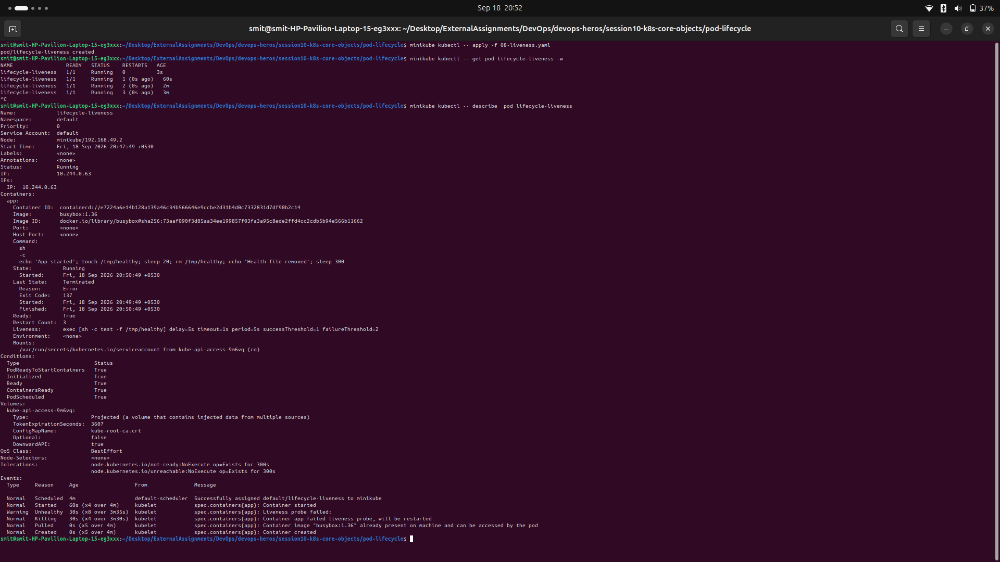

## 09-startup
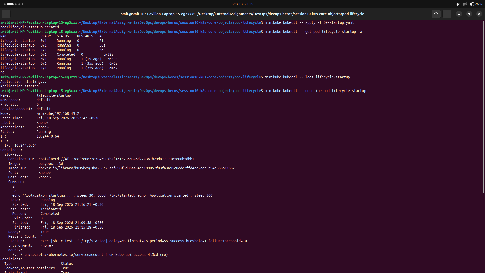
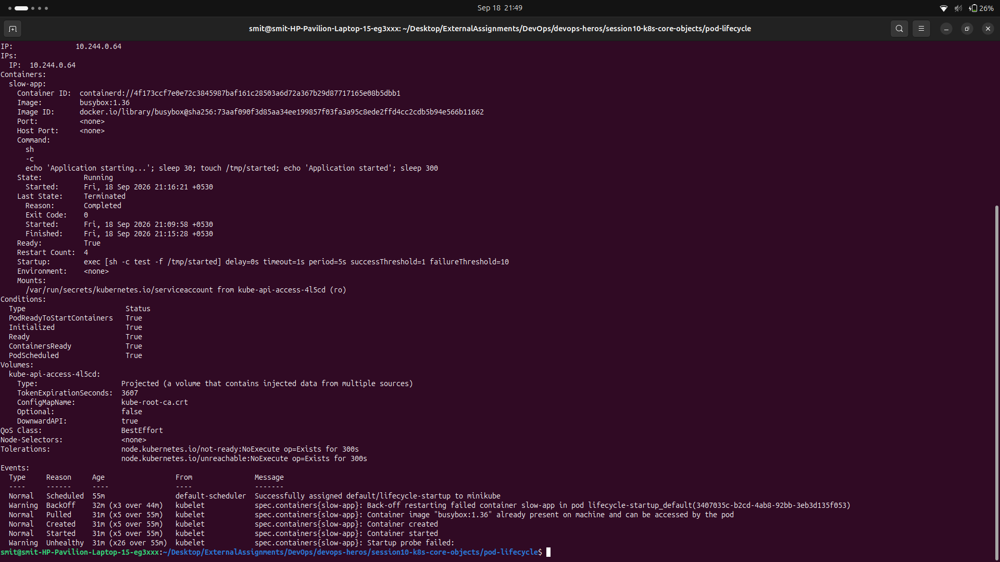

## 10-init
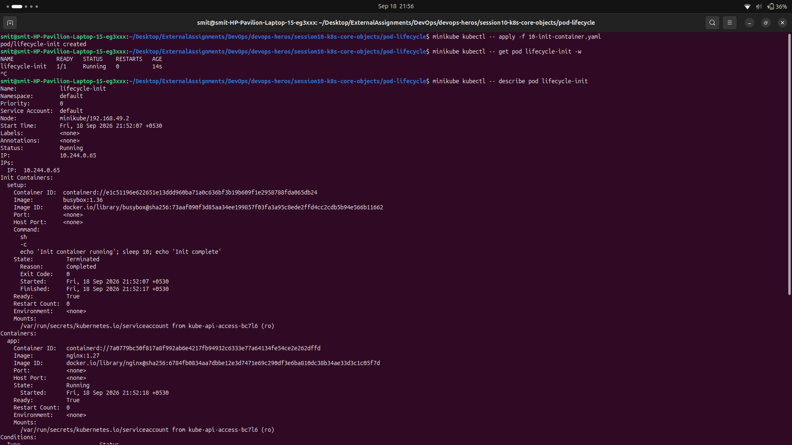
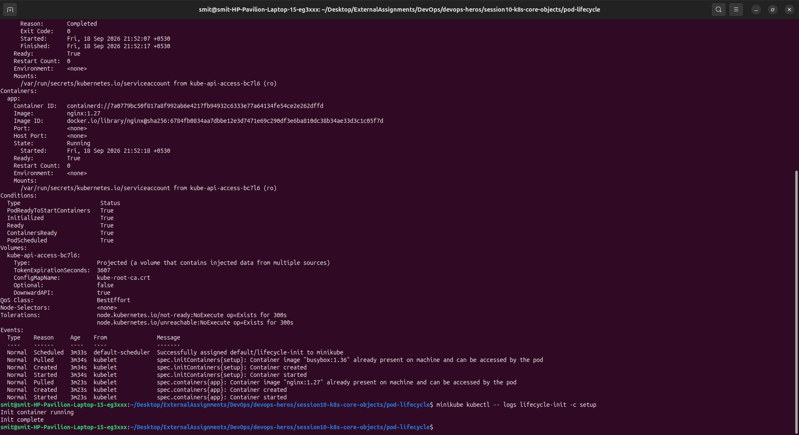

## 11-multi
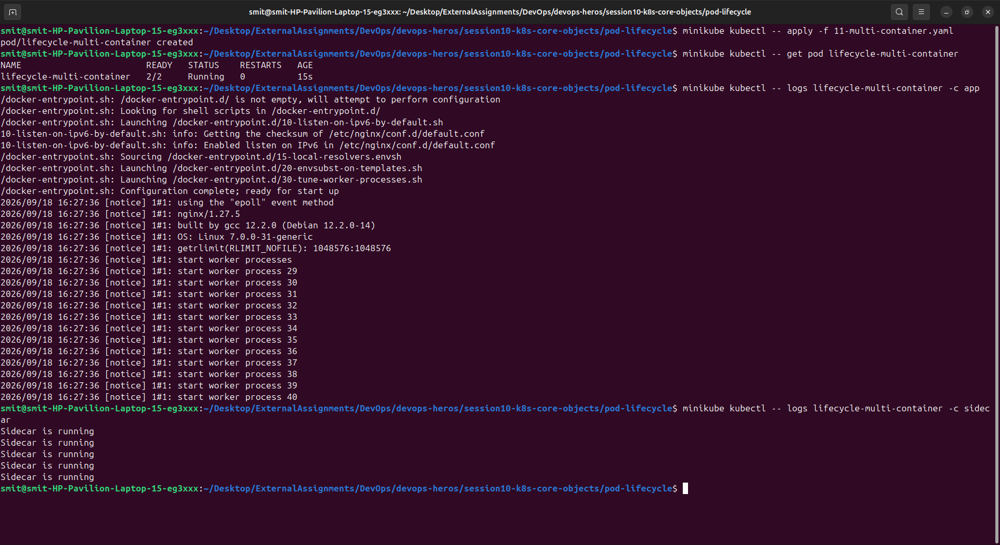

## 12-termination
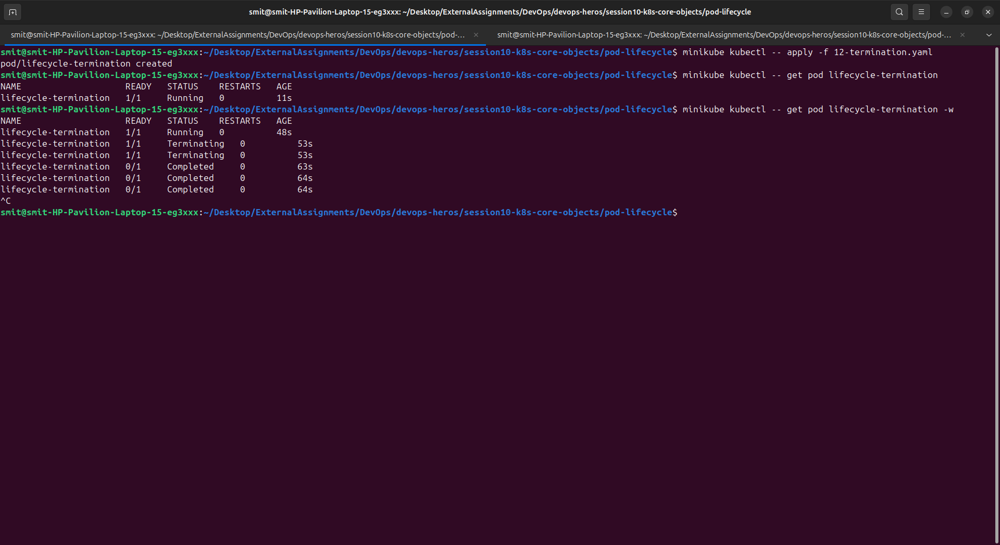