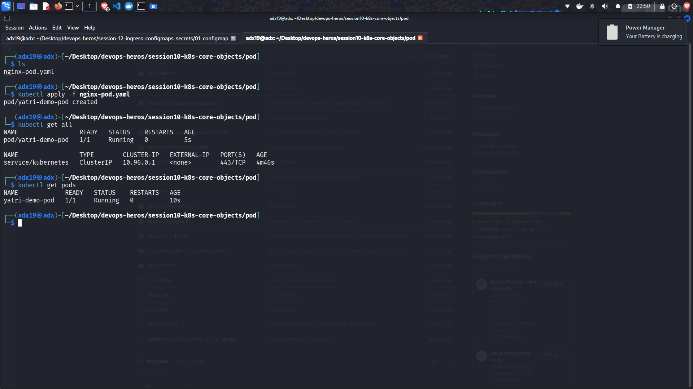
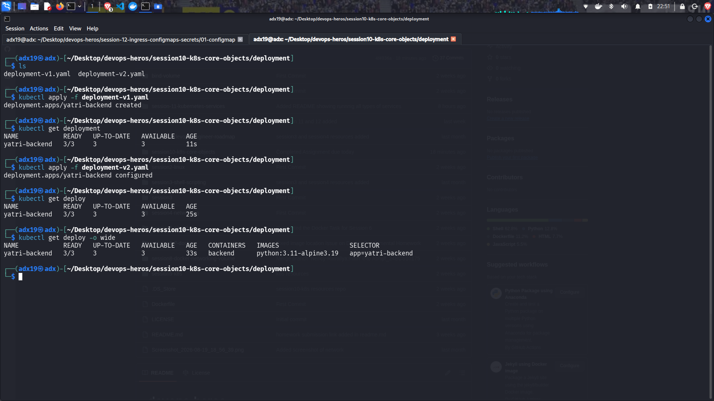
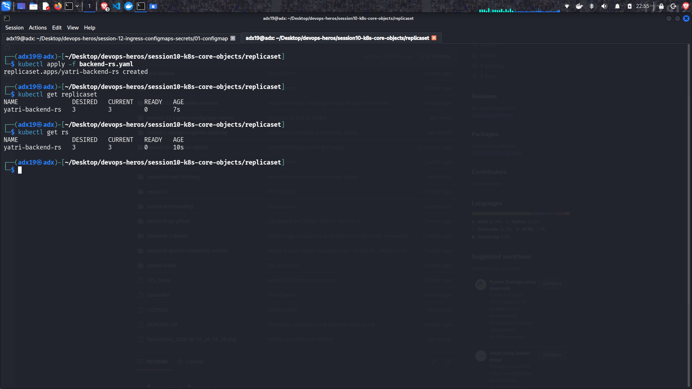

# Kubernetes Fundamentals:

## Pods:
The smallest deployable unit in Kubernetes that runs one or more containers.

## Deployment:
A Kubernetes object that manages the deployment, scaling, updating, and rollback of Pods.

## ReplicaSet:
A Kubernetes object that ensures a specified number of identical Pods are running at all times.

**Images of these running are given below**

---

# Screenshots:

## Pod:

## Deployment:

## Replicaset:

