# Session 10: Kubernetes Core Objects, Pod Lifecycle & Deployment Strategies

All labs executed on a **2-node Minikube cluster** (`minikube` control-plane + `minikube-m02` worker),
Kubernetes **v1.37.0**, containerd **2.3.4**, on macOS arm64.

> **Notes on manifest changes to `k8s-core-objects/statefulset.yml`** (everything else runs as provided):
>
> 1. **`mysql:5.7` → `mysql:8.0`.** The 5.7 tag publishes **no arm64 image** and fails on Apple Silicon
>    with `no match for platform in manifest: not found`. 8.0 ships a native `linux/arm64/v8` build.
> 2. **Added a `readinessProbe`** (`mysqladmin ping`). The original manifest has no probe, so under
>    `podManagementPolicy: OrderedReady` a pod counts as Ready the moment its container starts — about
>    one second, long before MySQL accepts connections. All three pods therefore launched within ~1s of
>    each other and the ordered startup guarantee, while technically honoured, was invisible. The probe
>    makes readiness mean "MySQL is actually accepting connections", so the sequential behaviour this
>    task is meant to demonstrate becomes observable (see Task 6).

---

## Task 1: Cluster Health Verification & Baseline Environment Checks

**Description:** Verify the control plane, DNS and node readiness before deploying any workloads.

```bash
kubectl version --output=yaml
kubectl cluster-info
kubectl get nodes -o wide
```

**Output:**

```
Kubernetes control plane is running at https://127.0.0.1:53105
CoreDNS is running at https://127.0.0.1:53105/api/v1/namespaces/kube-system/services/kube-dns:dns/proxy

NAME           STATUS   ROLES           AGE   VERSION   INTERNAL-IP    EXTERNAL-IP   OS-IMAGE                         KERNEL-VERSION            CONTAINER-RUNTIME
minikube       Ready    control-plane   94s   v1.37.0   192.168.49.2   <none>        Debian GNU/Linux 12 (bookworm)   7.0.12-linuxkit (arm64)   containerd://2.3.4
minikube-m02   Ready    <none>          74s   v1.37.0   192.168.49.3   <none>        Debian GNU/Linux 12 (bookworm)   7.0.12-linuxkit (arm64)   containerd://2.3.4
```

**Screenshots:**

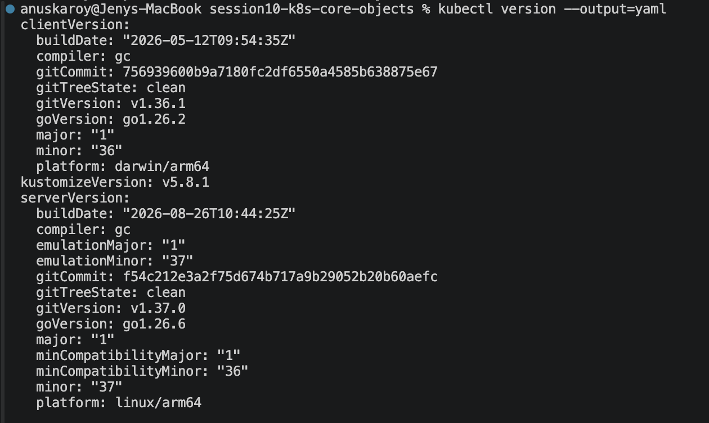
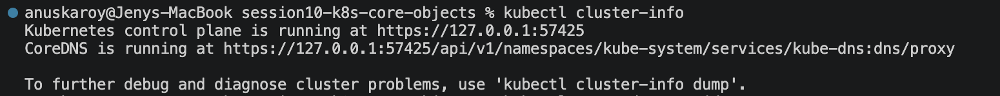
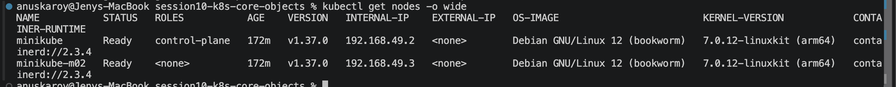

---

## Task 2: Standard Pod Deployment, Inspection & Teardown (`pod.yml`)

**Description:** Deploy a standalone Nginx Pod declaring the 4 mandatory top-level fields
(`apiVersion`, `kind`, `metadata`, `spec`), inspect its IP and node placement, read its logs, then delete it.

```bash
kubectl apply -f pod.yml
kubectl get pods
kubectl get pods -o wide
kubectl logs nginx-pod
kubectl delete -f pod.yml
```

**Output:**

```
pod/nginx-pod created

NAME        READY   STATUS    RESTARTS   AGE
nginx-pod   1/1     Running   0          20s

NAME        READY   STATUS    RESTARTS   AGE   IP           NODE           NOMINATED NODE   READINESS GATES
nginx-pod   1/1     Running   0          20s   10.244.1.3   minikube-m02   <none>           <none>

/docker-entrypoint.sh: Configuration complete; ready for start up
2026/09/20 11:56:16 [notice] 1#1: using the "epoll" event method
2026/09/20 11:56:16 [notice] 1#1: nginx/1.31.6
2026/09/20 11:56:16 [notice] 1#1: built by gcc 14.2.0 (Debian 14.2.0-19)

pod "nginx-pod" deleted from default namespace
No resources found in default namespace.
```

The scheduler placed the Pod on the **worker** node `minikube-m02` and the CNI assigned it Pod IP
`10.244.1.3` from that node's subnet.

**Screenshots:**


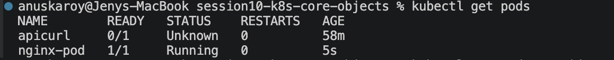
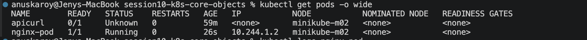
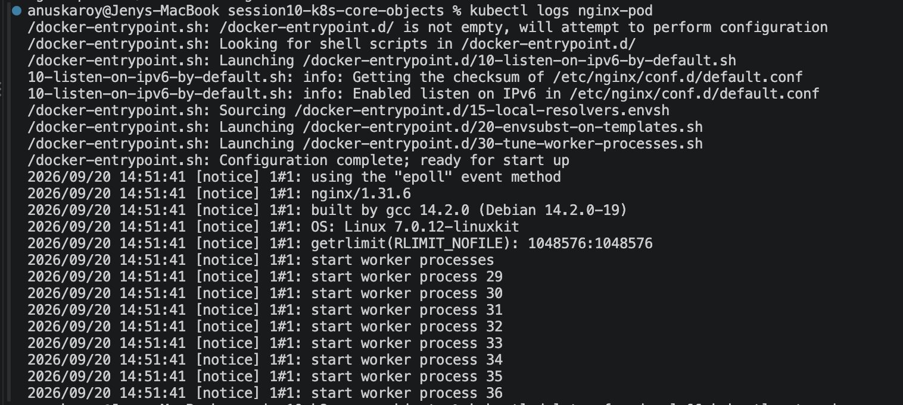
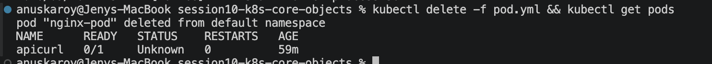

---

## Task 3: Error State Simulation — `ErrImagePull` & `ImagePullBackOff`

**Description:** Reference a non-existent image tag and observe the container state transition from
`ErrImagePull` into the exponential-backoff `ImagePullBackOff` loop.

```bash
kubectl apply -f pod-lifecycle/06-imagepullbackoff.yaml
kubectl get pods
kubectl describe pod lifecycle-image-error | grep -A 10 Events:
```

**Output:**

```
pod/lifecycle-image-error created

# after 15s — first pull attempt has failed
NAME                    READY   STATUS         RESTARTS   AGE
lifecycle-image-error   0/1     ErrImagePull   0          16s

# after 64s — kubelet has backed off
NAME                    READY   STATUS             RESTARTS   AGE
lifecycle-image-error   0/1     ImagePullBackOff   0          64s
```

```
Events:
  Type     Reason     Age                From               Message
  ----     ------     ----               ----               -------
  Normal   Scheduled  46s                default-scheduler  Successfully assigned default/lifecycle-image-error to minikube-m02
  Normal   Pulling    27s (x2 over 45s)  kubelet            Pulling image "jakwehrgkaejw:kahsdfgkhj"
  Warning  Failed     23s (x2 over 43s)  kubelet            Failed to pull image "jakwehrgkaejw:kahsdfgkhj": failed to resolve reference "docker.io/library/jakwehrgkaejw:kahsdfgkhj": pull access denied, repository does not exist or may require authorization: server message: insufficient_scope: authorization failed
  Warning  Failed     23s (x2 over 43s)  kubelet            Error: ErrImagePull
  Normal   BackOff    10s (x2 over 42s)  kubelet            Back-off pulling image "jakwehrgkaejw:kahsdfgkhj"
  Warning  Failed     10s (x2 over 42s)  kubelet            Error: ImagePullBackOff
```

**Why the API object exists but the container does not:** `kubectl apply` only asks the **API server** to
validate and persist the Pod object in **etcd** — which succeeds, because the manifest is syntactically valid
and the image name is only a string at that point. The failure happens later and in a different component:
the **scheduler** assigns the Pod to a node, then that node's **kubelet** asks containerd to pull the image
and *that* is what fails. So the Pod exists (`kubectl get pod` returns it) with `phase: Pending`, while its
container never starts. The kubelet retries with exponential backoff (10s, 20s, 40s … capped at 5 min),
which is the state reported as `ImagePullBackOff`.

**Screenshots:**


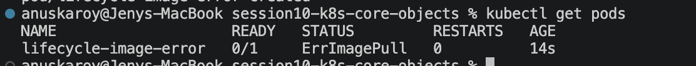
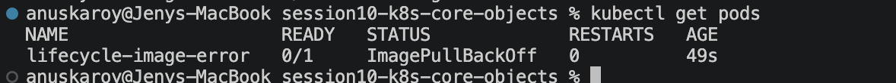
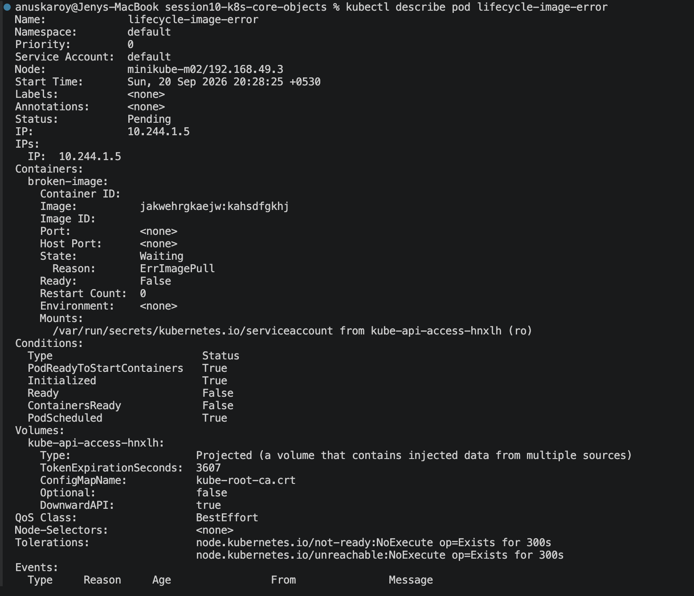
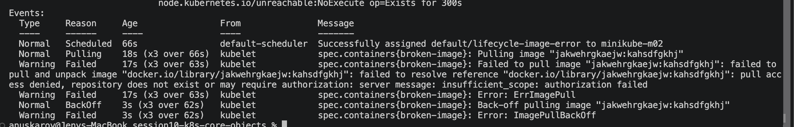

---

## Task 4: Capturing Transient Pod Lifecycle Stages (`hello.yml`)

**Description:** Run a short-lived `busybox` batch container with `restartPolicy: Never` and capture every
lifecycle phase in real time.

> The `Running` phase for this Pod lasts **~2 seconds**, so polling with `kubectl get pods` misses it.
> The watch (`-w`) must be started **before** `kubectl apply` to capture the full sequence.

```bash
# Terminal 1 — start the watch FIRST
kubectl get pods -w

# Terminal 2
kubectl apply -f hello.yml
```

**Output (Terminal 1):**

```
hello-pod   0/1   Pending             0     0s
hello-pod   0/1   Pending             0     0s
hello-pod   0/1   ContainerCreating   0     0s
hello-pod   0/1   ContainerCreating   0     0s
hello-pod   1/1   Running             0     2s
hello-pod   0/1   Completed           0     2s
hello-pod   0/1   Completed           0     3s
```

```bash
kubectl logs hello-pod
kubectl get pod hello-pod -o jsonpath='{.status.phase} {.status.containerStatuses[0].state.terminated.exitCode}'
```

```
Hello Kubernetes

Succeeded  exitCode=0
```

| Stage | What is happening |
| --- | --- |
| `Pending` | Object accepted by the API server; scheduler has not yet bound it to a node |
| `ContainerCreating` | kubelet is pulling the image and configuring the network namespace |
| `Running` | The `echo` process is executing |
| `Completed` (phase `Succeeded`) | Process exited 0; `restartPolicy: Never` means it is not restarted |

**Screenshots:**

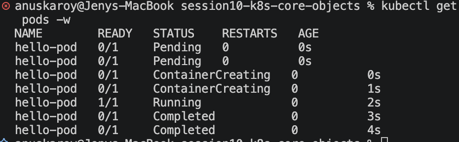

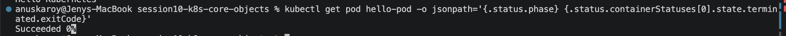

---

## Task 5: Exhaustive Pod Lifecycle States & Probes Lab (`pod-lifecycle/`)

All 12 manifests in `pod-lifecycle/` were applied and observed.

### 5.1 Basic phases — `01-running.yaml`, `03-succeeded.yaml`, `04-failed.yaml`

```bash
kubectl apply -f 01-running.yaml -f 03-succeeded.yaml -f 04-failed.yaml
kubectl get pods
```

```
NAME                  READY   STATUS      RESTARTS   AGE
lifecycle-failed      0/1     Error       0          31s
lifecycle-running     1/1     Running     0          31s
lifecycle-succeeded   0/1     Completed   0          31s

lifecycle-running      phase=Running
lifecycle-succeeded    phase=Succeeded exit=0
lifecycle-failed       phase=Failed    exit=1
```

Both batch pods use `restartPolicy: Never`; the only difference is the exit code, which decides
`Succeeded` vs `Failed`.

### 5.2 `02-pending.yaml` — Unschedulable Pod

Requests `9Gi` of memory, which no node can satisfy.

```
NAME                READY   STATUS    RESTARTS   AGE
lifecycle-pending   0/1     Pending   0          12s

Events:
  Type     Reason            Age   From               Message
  Warning  FailedScheduling  12s   default-scheduler  0/2 nodes are available: 2 Insufficient memory. preemption: 0/2 nodes are available: 2 Preemption is not helpful for scheduling.
```

The Pod object exists in etcd but the **scheduler** cannot bind it to any node, so it stays `Pending` forever.

### 5.3 `05-crashloopbackoff.yaml` — Crash Loop & Exponential Backoff

```
lifecycle-crashloop   0/1   Pending             0            0s
lifecycle-crashloop   0/1   ContainerCreating   0            0s
lifecycle-crashloop   1/1   Running             0            1s
lifecycle-crashloop   0/1   Error               0            5s
lifecycle-crashloop   1/1   Running             1 (1s ago)   5s
lifecycle-crashloop   0/1   Error               1 (5s ago)   9s
lifecycle-crashloop   0/1   CrashLoopBackOff    1 (12s ago)  20s
lifecycle-crashloop   1/1   Running             2 (12s ago)  20s
lifecycle-crashloop   0/1   Error               2 (16s ago)  24s
lifecycle-crashloop   0/1   CrashLoopBackOff    2 (24s ago)  47s
lifecycle-crashloop   1/1   Running             3 (24s ago)  47s
lifecycle-crashloop   0/1   Error               3 (28s ago)  51s
```

```
Last State:     Terminated
  Reason:       Error
  Exit Code:    1
```

```bash
kubectl logs lifecycle-crashloop
```
```
Application started
Application crashed
```

The **backoff doubling is directly visible** in the restart timestamps — restart 1 after ~12s,
restart 2 after ~24s, restart 3 after a further ~23s. Kubernetes alternates the reported status between
`Error` (container just died) and `CrashLoopBackOff` (kubelet waiting before the next attempt).

### 5.4 `07-readiness.yaml` — Running ≠ Ready

```
lifecycle-readiness   0/1   Running   0   1s     <-- process is up, but NOT receiving traffic
lifecycle-readiness   1/1   Running   0   6s     <-- readiness probe passed, now in Service endpoints
```

With `initialDelaySeconds: 5`, the container is `Running` at 1s but only becomes **Ready** at 6s.
A Service would not route traffic to this Pod during that 5-second gap.

### 5.5 `08-liveness.yaml` — Self-Healing Restart

The container deletes its own health file after 20s, so the liveness probe starts failing.

```
t+05s  lifecycle-liveness   0/1   Pending   0            0s
t+10s  lifecycle-liveness   1/1   Running   0            5s
...
t+60s  lifecycle-liveness   1/1   Running   0            56s
t+65s  lifecycle-liveness   1/1   Running   1 (0s ago)   61s     <-- RESTARTS incremented
```

```
Events:
  Warning  Unhealthy  36s (x2 over 41s)  kubelet  Liveness probe failed:
  Normal   Killing    36s                kubelet  Container app failed liveness probe, will be restarted
  Normal   Pulled     6s (x2 over 66s)   kubelet  Container image "busybox:1.36" already present on machine
  Normal   Created    6s (x2 over 66s)   kubelet  Container created
  Normal   Started    6s (x2 over 66s)   kubelet  Container started
```

With `failureThreshold: 2` and `periodSeconds: 5`, two consecutive failures (~10s) trigger the restart.
**This is automated self-healing** — no human intervention.

### 5.6 `09-startup.yaml` — Protecting a Slow-Starting Application

The app needs 30s to bootstrap; the startup probe allows `10 × 5s = 50s` before giving up.

```
t+10s  lifecycle-startup   0/1   Running   0   6s      <-- started, not yet Ready
t+35s  lifecycle-startup   0/1   Running   0   31s     <-- still bootstrapping, NOT killed
t+40s  lifecycle-startup   1/1   Running   0   36s     <-- startup probe finally passed
```

```
Startup:  exec [sh -c test -f /tmp/started] delay=0s timeout=1s period=5s successThreshold=1 failureThreshold=10
```

Without a startup probe, a liveness probe would have killed this container repeatedly during its slow boot,
creating an unbreakable crash loop.

### 5.7 `10-init-container.yaml` — Sequential Prerequisite Setup

```
t+04s  lifecycle-init   0/1   Init:0/1   0   0s     <-- app container has NOT started
t+08s  lifecycle-init   0/1   Init:0/1   0   4s
t+12s  lifecycle-init   0/1   Init:0/1   0   8s
t+16s  lifecycle-init   1/1   Running    0   12s    <-- init finished, app starts
```

```bash
kubectl logs lifecycle-init -c setup
```
```
Init container running
Init complete
```

The `Init:0/1` status means "0 of 1 init containers complete". The main container is blocked until the init
container exits 0 — the standard pattern for waiting on a database or fetching config.

### 5.8 `11-multi-container.yaml` — App + Logging Sidecar

```
NAME                        READY   STATUS    RESTARTS   AGE
lifecycle-multi-container   2/2     Running   0          25s

app      image=nginx:1.27
sidecar  image=busybox:1.36
```

```bash
kubectl logs lifecycle-multi-container -c sidecar
```
```
Sidecar is running
Sidecar is running
Sidecar is running
```

`READY 2/2` = both containers ready. They share the Pod's network namespace and can reach each other on
`localhost` — the basis of the sidecar pattern (log shippers, service-mesh proxies).

### 5.9 `12-termination.yaml` — Graceful Shutdown via SIGTERM

The container traps `SIGTERM` and performs a 10-second cleanup before exiting.

```bash
time kubectl delete -f 12-termination.yaml
```
```
pod "lifecycle-termination" deleted from default namespace
--> deletion took 11 seconds (terminationGracePeriodSeconds: 20, trap sleeps 10)
```

Deletion took **11 seconds instead of being instant**, proving Kubernetes sent `SIGTERM`, waited for the
handler to finish, and never needed the `SIGKILL` that would have arrived at the 20s grace deadline.

**Screenshots:**

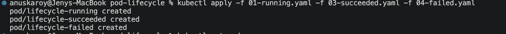
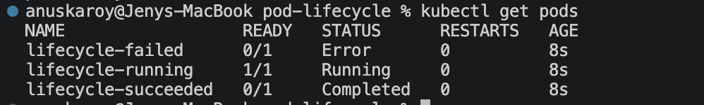
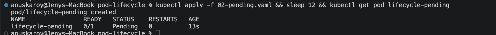
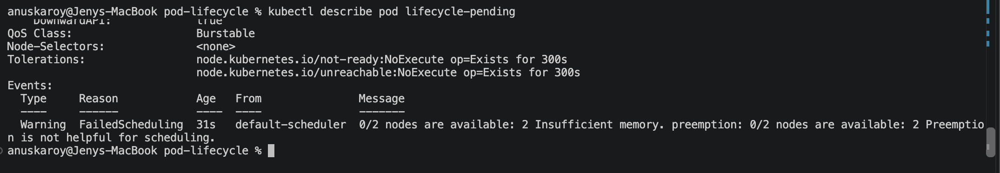
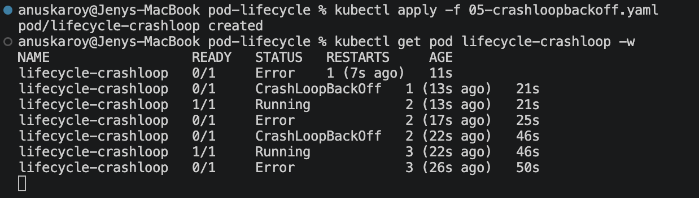

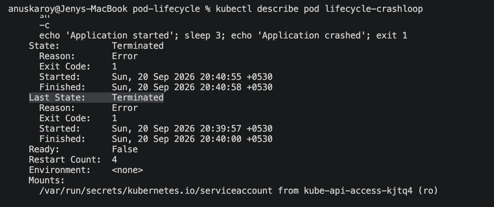
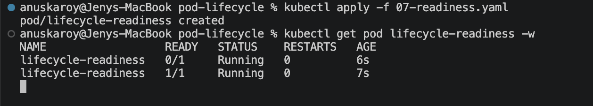
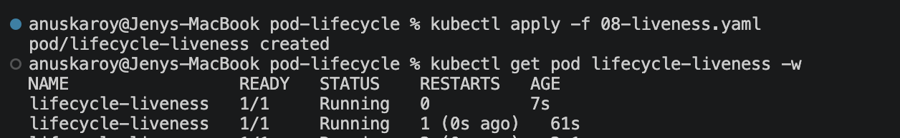
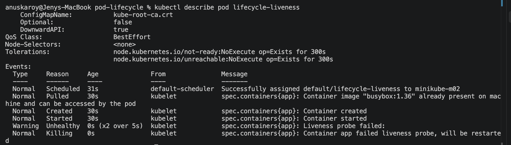
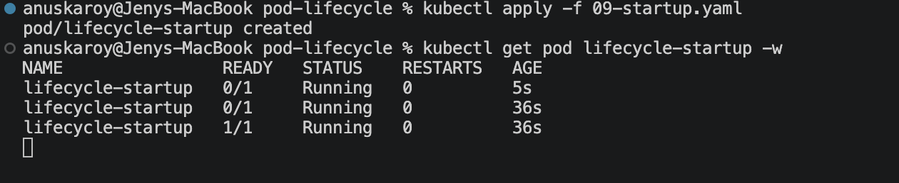
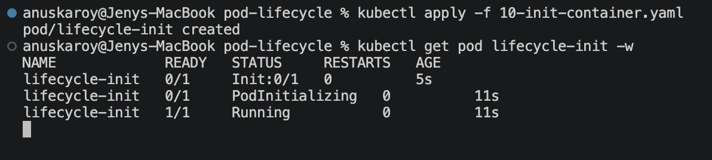
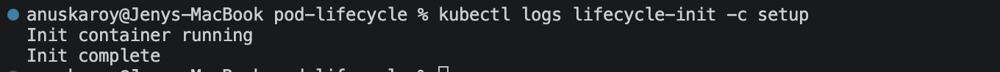
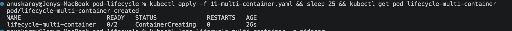

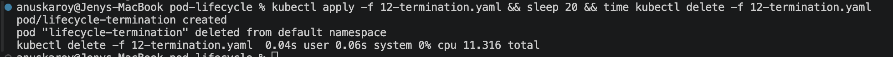

---

## Task 6: Core Controller Objects (ReplicaSet & StatefulSet)

### Part A — ReplicaSet Self-Healing (`replicaset.yml`)

```bash
kubectl apply -f replicaset.yml
kubectl get rs nginx-rs
kubectl get pods -l app=nginx -o wide
```

```
NAME       DESIRED   CURRENT   READY   AGE
nginx-rs   3         3         3       20s

NAME             READY   STATUS    RESTARTS   AGE   IP            NODE           NOMINATED NODE   READINESS GATES
nginx-rs-7rpmq   1/1     Running   0          20s   10.244.1.24   minikube-m02   <none>           <none>
nginx-rs-dvxtr   1/1     Running   0          20s   10.244.0.4    minikube       <none>           <none>
nginx-rs-pcppn   1/1     Running   0          20s   10.244.1.23   minikube-m02   <none>           <none>
```

**Self-healing test — manually delete one pod:**

```bash
kubectl delete pod nginx-rs-7rpmq
kubectl get pods -l app=nginx
```

```
pod "nginx-rs-7rpmq" deleted from default namespace

# immediately — a replacement is ALREADY being created
NAME             READY   STATUS              RESTARTS   AGE
nginx-rs-dvxtr   1/1     Running             0          22s
nginx-rs-jn4wk   0/1     ContainerCreating   0          2s     <-- new pod, new random name
nginx-rs-pcppn   1/1     Running             0          22s

# 18s later — desired count of 3 restored
NAME             READY   STATUS    RESTARTS   AGE
nginx-rs-dvxtr   1/1     Running   0          40s
nginx-rs-jn4wk   1/1     Running   0          20s
nginx-rs-pcppn   1/1     Running   0          40s
```

The ReplicaSet controller noticed `actual (2) != desired (3)` within ~2 seconds and created a replacement
with a **brand-new random name** — replicas are interchangeable and disposable.

### Part B — StatefulSet Ordinal Identity (`k8s-core-objects/statefulset.yml`)

```bash
kubectl apply -f k8s-core-objects/statefulset.yml
```

**Sequential ordinal startup** — each pod must be Ready before the next is created. With the
`readinessProbe` added (see the note at the top of this file), "Ready" means MySQL is actually
accepting connections, so the ordering is observable in a `kubectl get pods -l app=mysql -w` watch:

```
mysql-0   0/1   Pending             0s
mysql-0   0/1   ContainerCreating   0s
mysql-0   0/1   Running             1s
mysql-0   1/1   Running            11s     <-- mysql-0 Ready; only now is mysql-1 created
mysql-1   0/1   Pending             0s
mysql-1   0/1   ContainerCreating   0s
mysql-1   1/1   Running            11s     <-- same gate before mysql-2
mysql-2   0/1   Pending             0s
mysql-2   1/1   Running            11s
```

Without the probe this same watch shows all three pods appearing within about one second of each
other: the guarantee still holds, but nothing observable distinguishes it from parallel startup.

```
NAME    READY   AGE
mysql   3/3     3m21s

NAME      READY   STATUS    RESTARTS   AGE     IP            NODE
mysql-0   1/1     Running   0          3m21s   10.244.1.28   minikube-m02
mysql-1   1/1     Running   0          2m43s   10.244.0.5    minikube
mysql-2   1/1     Running   0          2m1s    10.244.1.29   minikube-m02

NAME                               STATUS   VOLUME                                     CAPACITY   ACCESS MODES   STORAGECLASS   AGE
mysql-persistent-storage-mysql-0   Bound    pvc-851f696c-d1a7-480d-9e6e-a4333075ac9b   5Gi        RWO            standard       3m21s
mysql-persistent-storage-mysql-1   Bound    pvc-1be42fe2-1a63-4619-acae-debda70f1406   5Gi        RWO            standard       2m43s
mysql-persistent-storage-mysql-2   Bound    pvc-76a7b00e-18d0-4c0b-aa49-e3cb9da2249b   5Gi        RWO            standard       2m1s
```

**Identity invariance test — delete `mysql-1`:**

```
pod "mysql-1" deleted from default namespace

NAME      READY   STATUS    RESTARTS   AGE
mysql-0   1/1     Running   0          4m4s
mysql-1   1/1     Running   0          40s     <-- SAME name, not a new random one
mysql-2   1/1     Running   0          2m44s

# the PVC was never deleted — same UUID, age kept climbing
mysql-persistent-storage-mysql-1   Bound   pvc-1be42fe2-1a63-4619-acae-debda70f1406   5Gi   RWO   standard   3m26s
```

The StatefulSet recreated the **identical ordinal name** and rebound it to the **same PersistentVolumeClaim**
(`pvc-1be42fe2…`), so the pod came back with its data intact. This is the key contrast with a Deployment,
where a deleted pod returns under a completely new random name with no storage affinity.

**Screenshots:**


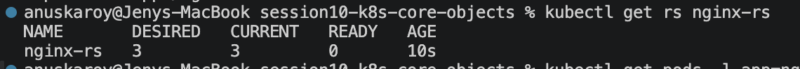
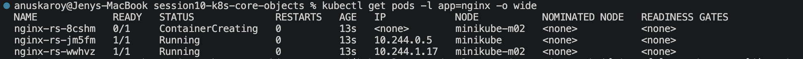
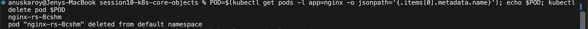

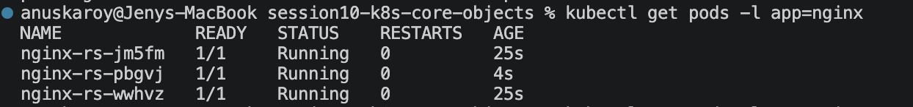

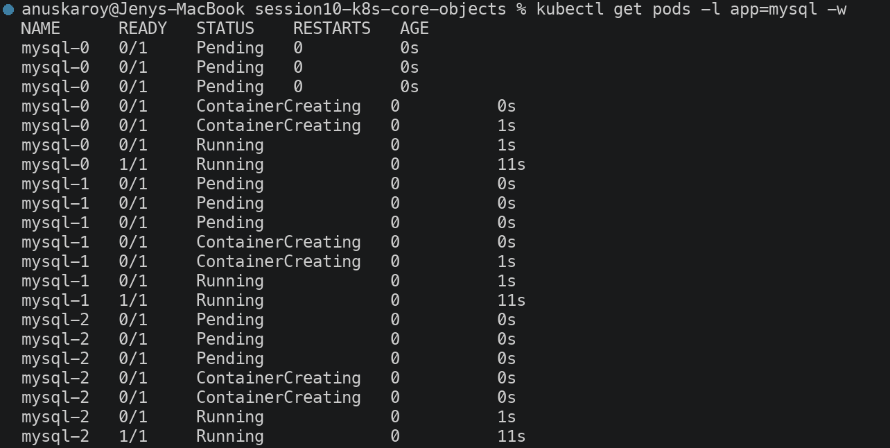
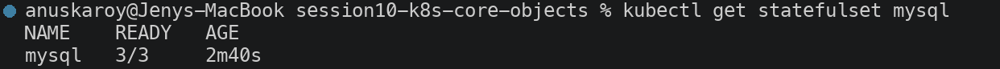

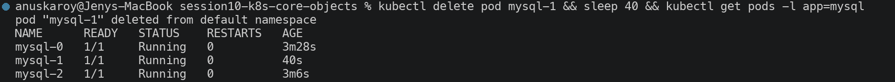
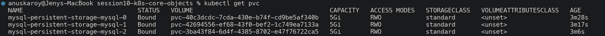

---

## Task 7: DaemonSet — One Pod Per Node

```bash
kubectl apply -f k8s-core-objects/deamonset.yml
kubectl get ds node-exporter
kubectl get pods -l app=node-exporter -o wide
```

```
NAME            DESIRED   CURRENT   READY   UP-TO-DATE   AVAILABLE   NODE SELECTOR   AGE
node-exporter   2         2         2       2            2           <none>          36s

NAME                  READY   STATUS    RESTARTS   AGE   IP            NODE           NOMINATED NODE   READINESS GATES
node-exporter-c7tjh   1/1     Running   0          36s   10.244.0.7    minikube       <none>           <none>
node-exporter-ddkrb   1/1     Running   0          36s   10.244.1.30   minikube-m02   <none>           <none>

node-exporter-c7tjh -> minikube
node-exporter-ddkrb -> minikube-m02
```

`DESIRED = 2` was never specified in the manifest — the DaemonSet controller derived it from the
**number of eligible nodes**. Exactly one pod landed on each node. If a third node joined the cluster,
a third pod would be scheduled automatically; this is why DaemonSets are used for node-level agents
(log collectors, metrics exporters, CNI plugins, security agents).

**Screenshots:**


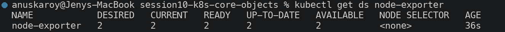


---

## Task 8: Rolling Updates & Instant Rollback (`01-rolling-update/`)

**Configuration:** `replicas: 4`, `maxSurge: 1`, `maxUnavailable: 0`.

```bash
kubectl apply -f deployment-v1.yaml -f service.yaml
kubectl rollout status deployment/app-rolling
```

```
NAME                           READY   STATUS    RESTARTS   AGE   LABELS
app-rolling-86d7d44d5b-j6kgn   1/1     Running   0          18s   app=app-rolling,pod-template-hash=86d7d44d5b,version=v1
app-rolling-86d7d44d5b-nlp2q   1/1     Running   0          18s   app=app-rolling,pod-template-hash=86d7d44d5b,version=v1
app-rolling-86d7d44d5b-q5qz4   1/1     Running   0          18s   app=app-rolling,pod-template-hash=86d7d44d5b,version=v1
app-rolling-86d7d44d5b-rjjzv   1/1     Running   0          18s   app=app-rolling,pod-template-hash=86d7d44d5b,version=v1
```

**Trigger the update to v2:**

```bash
kubectl apply -f deployment-v2.yaml
kubectl rollout status deployment/app-rolling
```

```
Waiting for deployment "app-rolling" rollout to finish: 1 out of 4 new replicas have been updated...
Waiting for deployment "app-rolling" rollout to finish: 2 out of 4 new replicas have been updated...
Waiting for deployment "app-rolling" rollout to finish: 3 out of 4 new replicas have been updated...
Waiting for deployment "app-rolling" rollout to finish: 1 old replicas are pending termination...
deployment "app-rolling" successfully rolled out
```

**Pod churn during the rollout** (`kubectl get pods -w`) — note the strict ordering:

```
app-rolling-56bff6d88c-vk67m   0/1   ContainerCreating   0     0s      <-- NEW v2 pod created first (surge)
app-rolling-56bff6d88c-vk67m   1/1   Running             0     24s     <-- becomes READY
app-rolling-86d7d44d5b-j6kgn   1/1   Terminating         0     58s     <-- ONLY THEN is an old pod removed
app-rolling-56bff6d88c-hz85z   0/1   Pending             0     0s      <-- next new pod
app-rolling-56bff6d88c-hz85z   1/1   Running             0     15s
app-rolling-86d7d44d5b-q5qz4   1/1   Terminating         0     74s
```

Because `maxUnavailable: 0`, Kubernetes **never** removes an old pod until its replacement is Ready.
Because `maxSurge: 1`, at most 5 pods (4 + 1) exist at any instant.

**Continuous availability check** — an in-cluster prober polling the Service every 0.3s throughout:

```
 156 VERSION: v1
  36 VERSION: v2
   2 [OUTAGE]
-----------------
 194 total samples -> 192 served successfully (98.97%)
```

The v1/v2 responses interleave as the pod mix shifts. The 2 failed samples are **not a service-level
outage** — the Service had ≥4 healthy endpoints at every moment. They are individual connections that
landed on a pod that was already mid-termination: `nginx` exits immediately on `SIGTERM` without draining
in-flight connections. In production this is solved with a `preStop` hook (`sleep 5`) so the pod stops
receiving new traffic before the process exits.

**Rollout history and rollback:**

```bash
kubectl rollout history deployment/app-rolling
kubectl rollout undo deployment/app-rolling
```

```
REVISION  CHANGE-CAUSE
4         <none>
5         <none>

deployment.apps/app-rolling rolled back
deployment "app-rolling" successfully rolled out

NAME                           READY   STATUS    RESTARTS   AGE   LABELS
app-rolling-86d7d44d5b-69vqr   1/1     Running   0          26s   app=app-rolling,pod-template-hash=86d7d44d5b,version=v1
app-rolling-86d7d44d5b-g8glk   1/1     Running   0          13s   app=app-rolling,pod-template-hash=86d7d44d5b,version=v1
app-rolling-86d7d44d5b-nfmxh   1/1     Running   0          19s   app=app-rolling,pod-template-hash=86d7d44d5b,version=v1
app-rolling-86d7d44d5b-x6wlr   1/1     Running   0          9s    app=app-rolling,pod-template-hash=86d7d44d5b,version=v1

StrategyType:           RollingUpdate
RollingUpdateStrategy:  0 max unavailable, 1 max surge
```

All 4 pods are back on `version=v1`, reusing the original ReplicaSet hash `86d7d44d5b` — a rollback is
just a scale-up of the previous ReplicaSet, which is why it is near-instant.

**Screenshots:**

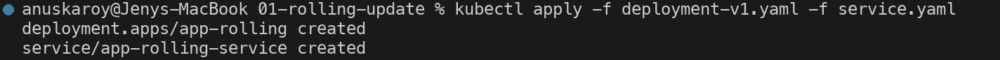
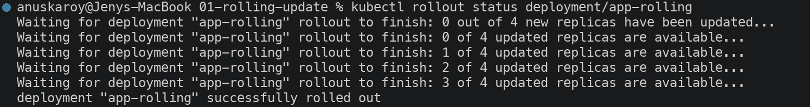
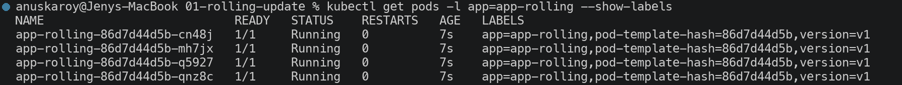
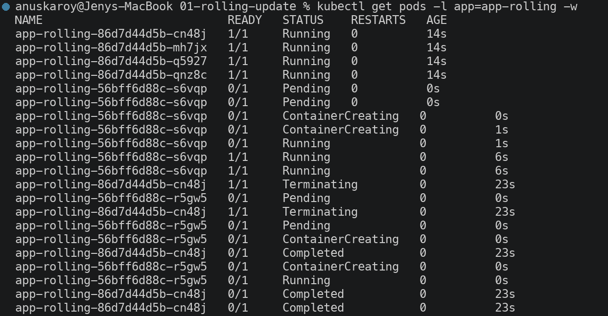

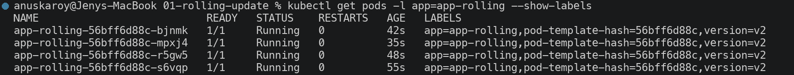
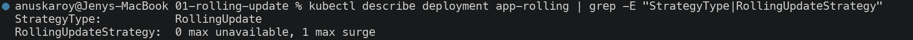
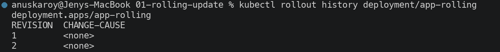
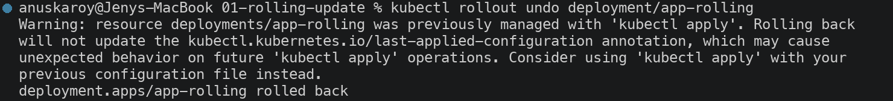
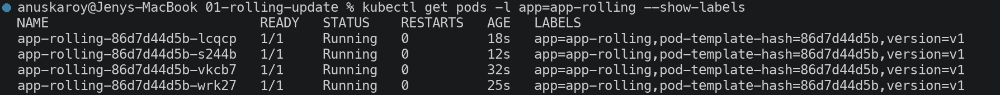

---

## Task 9: Real-World Troubleshooting Drills (`troubleshooting/`)

### Drill 1 — Broken Image Halts a Rollout

A healthy 3-replica deployment is running, then a manifest with a non-existent image tag is applied.

```bash
kubectl apply -f broken-image.yaml
kubectl rollout status deployment/yatri-backend --timeout=45s
```

```
deployment.apps/yatri-backend configured
Waiting for deployment "yatri-backend" rollout to finish: 1 out of 3 new replicas have been updated...
error: timed out waiting for the condition          <-- rollout STALLS (exit code 1)
```

```
NAME                             READY   STATUS             RESTARTS   AGE
yatri-backend-77dbb657cd-d7sfx   0/1     ImagePullBackOff   0          45s     <-- broken surge pod
yatri-backend-856477d48-55vqc    1/1     Running            0          70s     <-- old pods UNTOUCHED
yatri-backend-856477d48-hldf5    1/1     Running            0          70s
yatri-backend-856477d48-vf46d    1/1     Running            0          70s

NAME            READY   UP-TO-DATE   AVAILABLE   AGE
yatri-backend   3/3     1            3           70s
```

**Diagnosis:** `READY 3/3` and `AVAILABLE 3` but `UP-TO-DATE 1` is the signature of a stalled rollout.
`maxUnavailable: 0` means Kubernetes refuses to terminate any healthy old pod until the new one becomes
Ready — which never happens. **The failed deployment caused zero user impact**; the application kept
serving from the 3 original pods.

```
Warning  Failed  kubelet  Failed to pull image "yatri-backend:non-existent-tag-v999": ... pull access denied, repository does not exist or may require authorization
```

**Recovery:**

```bash
kubectl rollout undo deployment/yatri-backend
```
```
deployment.apps/yatri-backend rolled back
deployment "yatri-backend" successfully rolled out

NAME                             READY   STATUS        RESTARTS   AGE
yatri-backend-77dbb657cd-d7sfx   0/1     Terminating   0          57s     <-- broken pod removed
yatri-backend-856477d48-55vqc    1/1     Running       0          82s
yatri-backend-856477d48-hldf5    1/1     Running       0          82s
yatri-backend-856477d48-vf46d    1/1     Running       0          82s
```

### Drill 2 — Immutable Selector Mismatch

`selector-mismatch.yaml` declares `selector.matchLabels.app: correct-app-name` but
`template.metadata.labels.app: wrong-app-name`.

```bash
kubectl apply -f selector-mismatch.yaml
```

```
The Deployment "selector-error-demo" is invalid: spec.template.metadata.labels: Invalid value: {"app":"wrong-app-name"}: `selector` does not match template `labels`
```

```bash
kubectl get deployment selector-error-demo
```
```
Error from server (NotFound): deployments.apps "selector-error-demo" not found
```

**Diagnosis:** this is rejected **synchronously by the API server's validation webhook** — unlike Drill 1,
the object is never written to etcd at all, so there is no partial state to clean up. A Deployment's
`selector` is how it finds the pods it owns; if the template produces pods the selector cannot match,
the Deployment would create pods forever and never recognise them.

**Fix — make the template label match the selector:**

```bash
sed 's/app: wrong-app-name/app: correct-app-name/' selector-mismatch.yaml > selector-fixed.yaml
kubectl apply -f selector-fixed.yaml
```

```
19c19
<         app: wrong-app-name
---
>         app: correct-app-name

deployment.apps/selector-error-demo created

NAME                  READY   UP-TO-DATE   AVAILABLE   AGE
selector-error-demo   1/1     1            1           19s

NAME                                   READY   STATUS    RESTARTS   AGE
selector-error-demo-54996d6787-nxkjx   1/1     Running   0          19s
```

> Note: `spec.selector` is **immutable after creation**. On an existing Deployment this error cannot be
> fixed by editing — the Deployment must be deleted and recreated.

**Screenshots:**

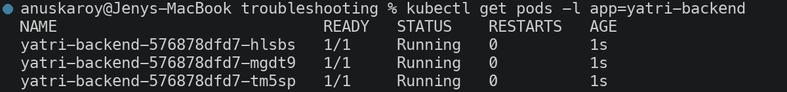

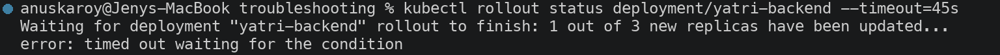
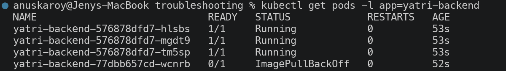
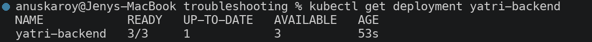
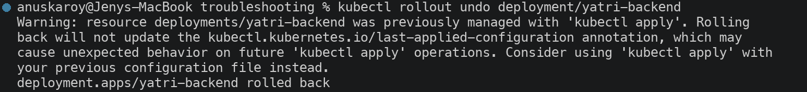


---

## Task 10: Theoretical & Architectural Writeup

### 1. The 4 Ports Clarified

```
Client Browser ──► [nodePort: 30010]      Host/Node IP, range 30000-32767
                          │
                          ▼
                   [port: 80]             Service ClusterIP (virtual IP, cluster-internal)
                          │
                          ▼
                   [targetPort: 80]       Port on the Pod the Service forwards to
                          │
                          ▼
                   [containerPort: 80]    Port the process listens on inside the container
```

| Port | Scope | Purpose |
| --- | --- | --- |
| `containerPort` | Pod spec | Documents the port the application process listens on. **Purely informational** — it does not open or restrict anything; a process is reachable on any port it binds, declared or not. |
| `targetPort` | Service | The Pod-side port the Service forwards traffic to. Must match where the app actually listens. May be a named port. |
| `port` | Service | The port the Service itself exposes on its ClusterIP. This is what in-cluster clients connect to (`http://my-service:80`). |
| `nodePort` | Service (`NodePort`/`LoadBalancer`) | A static port opened on **every** node's IP, range `30000–32767`. External traffic to `<any-node-ip>:30010` is forwarded to the Service. |

### 2. Labels vs. Selectors

| | Labels | Selectors |
| --- | --- | --- |
| **What** | Key-value metadata **attached to** objects | A **query** that matches objects by their labels |
| **Example** | `app: nginx`, `env: prod`, `slot: blue` | `selector: { app: nginx }`, `matchLabels: { slot: blue }` |
| **Direction** | Passive — describes the object | Active — finds objects |
| **Used by** | Any object | Services (to find endpoint Pods), Deployments/ReplicaSets (to find owned Pods), `kubectl -l` |

Observed in this session: the blue-green Service changed *nothing* about the Pods — it only changed its
**selector** from `slot: blue` to `slot: green`, and traffic moved instantly to a different set of
already-running, already-labelled Pods.

### 3. The 4 Deployment Strategies

| Strategy | Mechanism | Downtime | Capacity Cost | Rollback Speed |
| --- | --- | --- | --- | --- |
| **RollingUpdate** | Replaces pods incrementally, governed by `maxSurge`/`maxUnavailable` | None | ~1.25x (with `maxSurge: 1` on 4 replicas) | Minutes (another rolling update) |
| **Recreate** | Terminates **all** old pods, then creates new ones | **Yes — deliberate** | 1x | Minutes, with downtime again |
| **Blue-Green** | Two full environments; Service selector flips between them | None | **2x** (both run simultaneously) | **Instant** (flip selector back) |
| **Canary** | Small subset of new version alongside stable; ratio controlled by replica counts | None | ~1.1x | **Instant** (scale canary to 0) |

*When to use which:* RollingUpdate is the default for stateless apps. Recreate is required when two
versions cannot coexist (incompatible DB schema, exclusive file locks). Blue-Green suits high-risk releases
needing instant rollback and full pre-cutover testing. Canary is for validating a release against real
production traffic before committing.

### 4. `maxSurge` vs `maxUnavailable` Math

For `replicas: 4`, `maxSurge: 1`, `maxUnavailable: 0` (the configuration used in Task 8):

- **Maximum pods during rollout:** `4 + maxSurge(1) = 5`
- **Minimum available pods:** `4 - maxUnavailable(0) = 4` → **100% capacity guaranteed throughout**

Percentages round differently in each direction — `maxSurge` rounds **up**, `maxUnavailable` rounds **down**:

| Config (replicas: 10) | Max pods | Min available | Effect |
| --- | --- | --- | --- |
| `maxSurge: 25%`, `maxUnavailable: 25%` (default) | `10 + 3 = 13` | `10 - 2 = 8` | Fast, tolerates 20% capacity loss |
| `maxSurge: 1`, `maxUnavailable: 0` | `11` | `10` | Safest, slowest, needs spare capacity |
| `maxSurge: 0`, `maxUnavailable: 1` | `10` | `9` | No extra capacity needed, but runs degraded |

`maxSurge: 0` **and** `maxUnavailable: 0` together is rejected — it would make progress impossible.

### 5. Resource Requests vs. Limits, and Memory Units

| | Requests | Limits |
| --- | --- | --- |
| **Used by** | **kube-scheduler** — to choose a node | **kubelet / Linux cgroups** — at runtime |
| **Meaning** | Guaranteed minimum; reserved on the node | Hard ceiling the container cannot exceed |
| **CPU exceeded** | N/A (can burst above request) | **Throttled** — slowed, not killed (CPU is compressible) |
| **Memory exceeded** | N/A | **OOMKilled** — terminated (memory is incompressible) |

Task 5.2 demonstrated the scheduling half: a `9Gi` **request** that no node could satisfy left the Pod
permanently `Pending` with `FailedScheduling: Insufficient memory` — the pod never started, because
requests are evaluated *before* placement.

**Units — decimal (SI) vs. binary (IEC):**

| Notation | Value | |
| --- | --- | --- |
| `1G` | 1,000,000,000 bytes | 10⁹ — decimal |
| `1Gi` | 1,073,741,824 bytes | 2³⁰ — binary |
| `1M` | 1,000,000 bytes | 10⁶ |
| `1Mi` | 1,048,576 bytes | 2²⁰ |

`1Gi` is ~7.4% larger than `1G`. Kubernetes accepts both, but `Mi`/`Gi` are conventional because they match
how the kernel actually accounts memory. **CPU:** `1` = one full core, `1000m` = 1 core, `100m` = 0.1 core.

---

## Task 11: Blue-Green Deployment & Instant Selector Cutover (`02-blue-green/`)

**Deploy both environments simultaneously (6 pods):**

```bash
kubectl apply -f deployment-blue.yaml -f deployment-green.yaml
kubectl get pods -l app=myapp --show-labels
```

```
NAME                        READY   STATUS    RESTARTS   AGE   LABELS
app-blue-5c69d7785c-984l5   1/1     Running   0          7s    app=myapp,pod-template-hash=5c69d7785c,slot=blue,version=v1
app-blue-5c69d7785c-rhddt   1/1     Running   0          7s    app=myapp,pod-template-hash=5c69d7785c,slot=blue,version=v1
app-blue-5c69d7785c-xgx9x   1/1     Running   0          7s    app=myapp,pod-template-hash=5c69d7785c,slot=blue,version=v1
app-green-84df7f978-f8nzt   1/1     Running   0          7s    app=myapp,pod-template-hash=84df7f978,slot=green,version=v2
app-green-84df7f978-jjsvs   1/1     Running   0          7s    app=myapp,pod-template-hash=84df7f978,slot=green,version=v2
app-green-84df7f978-k8t7m   1/1     Running   0          7s    app=myapp,pod-template-hash=84df7f978,slot=green,version=v2
```

**Route traffic to Blue:**

```bash
kubectl apply -f service-blue.yaml
kubectl describe svc myapp-service | grep Selector
kubectl get endpoints myapp-service
```

```
Selector:                 app=myapp,slot=blue

NAME            ENDPOINTS                                      AGE
myapp-service   10.244.0.19:80,10.244.1.69:80,10.244.1.70:80   0s
```

Only the **3 blue pod IPs** are in the endpoint list, even though 6 pods are running.

**THE SWITCH — flip the selector to Green:**

```bash
kubectl apply -f service-green.yaml
kubectl describe svc myapp-service | grep Selector
kubectl get endpoints myapp-service
```

```
service/myapp-service configured
Selector:                 app=myapp,slot=green

NAME            ENDPOINTS                                      AGE
myapp-service   10.244.0.20:80,10.244.1.71:80,10.244.1.72:80   59s     <-- different IPs = green pods
```

**Live traffic trace** (in-cluster prober polling every 0.3s across the cutover *and* the rollback):

```
sample   1: BLUE ENVIRONMENT
sample 114: GREEN ENVIRONMENT      <-- cutover: instant, single transition point
sample 230: BLUE ENVIRONMENT       <-- rollback: instant, single transition point

totals: 151 BLUE + 116 GREEN = 267 requests, 0 failures
```

**This is the defining property of blue-green:** 113 consecutive BLUE responses, then 116 consecutive
GREEN, then back to BLUE — with **exactly one transition point in each direction and no mixed-version
window at all**. Compare with the rolling update in Task 8, where v1 and v2 interleaved for ~90 seconds.

The cutover is instant because both environments were **already running and warm**; the only change is
which label the Service selects. Rollback is equally instant for the same reason — the cost is running
double capacity (6 pods for a 3-pod application).

**Screenshots:**


---

## Task 12: Canary Deployment & Pod-Ratio Traffic Splitting (`03-canary/`)

Both Deployments share the label `app: myapp-canary`, so a **single Service** selects pods from both.
Traffic share is therefore governed purely by the **ratio of pod counts**.

**Deploy 9 stable + 1 canary:**

```bash
kubectl apply -f deployment-stable.yaml -f service.yaml
kubectl apply -f deployment-canary.yaml
```

```
NAME         READY   UP-TO-DATE   AVAILABLE   AGE
app-stable   9/9     9            9           13s
app-canary   1/1     1            1           6s

NAME                          READY   STATUS    RESTARTS   AGE   LABELS
app-canary-5849994497-fwljg   1/1     Running   0          6s    app=myapp-canary,track=canary,version=v2
app-stable-6ffb777f9d-2gqk9   1/1     Running   0          13s   app=myapp-canary,track=stable,version=v1
... (8 more stable pods)

endpoint count: 10          <-- all 10 pods in ONE service pool
```

**Traffic distribution — 200 requests at a 9:1 pod ratio:**

```
  11 CANARY v2      (5.5%)
 189 STABLE v1      (94.5%)
```

**Shift to 30% — scale canary up, stable down:**

```bash
kubectl scale deployment app-canary --replicas=3
kubectl scale deployment app-stable --replicas=7
```

```
NAME         READY   UP-TO-DATE   AVAILABLE   AGE
app-stable   7/7     7            7           2m1s
app-canary   3/3     3            3           114s
```

**Traffic distribution — 200 requests at a 7:3 pod ratio:**

```
  55 CANARY v2      (27.5%)
 145 STABLE v1      (72.5%)
```

**Rollback — abort the canary:**

```bash
kubectl scale deployment app-canary --replicas=0
kubectl scale deployment app-stable --replicas=9
```

```
NAME         READY   UP-TO-DATE   AVAILABLE   AGE
app-stable   9/9     9            9           3m51s
app-canary   0/0     0            0           3m44s

endpoint count: 9

# 60 verification requests after rollback:
  60 STABLE v1      (100%)
```

**Observed vs. theoretical:** the 9:1 ratio produced 5.5% canary traffic rather than exactly 10%, and the
7:3 ratio produced 27.5% rather than 30%. `kube-proxy` selects endpoints **randomly per connection**, not
via strict round-robin, so at 200 samples the observed share fluctuates around the expected value. The
important result is the **clear proportional response**: 5.5% → 27.5% → 0% as the pod ratio changed.

This also shows the main limitation of pod-ratio canarying: traffic share is quantised by replica count
(1 of 10 pods ≈ 10% granularity). Finer control — or routing by header, cookie or user ID — requires an
ingress controller or service mesh that splits at Layer 7.

**Screenshots:**


---

## Task 13: Recreate Strategy & Downtime Demonstration (`04-recreate/`)

```bash
kubectl apply -f deployment-v1.yaml -f service.yaml
kubectl describe deployment app-recreate | grep StrategyType
```

```
NAME                            READY   STATUS    RESTARTS   AGE
app-recreate-6c78cb55bb-4vsn6   1/1     Running   0          1s
app-recreate-6c78cb55bb-kmfgr   1/1     Running   0          1s
app-recreate-6c78cb55bb-p8mbp   1/1     Running   0          1s

StrategyType:       Recreate
```

**Trigger the update while polling the Service every 0.25s:**

```bash
kubectl apply -f deployment-v2.yaml
```

**Traffic trace — the outage is captured:**

```
sample   1-130: VERSION: v1
sample 131-132: [OUTAGE] connection refused / 0 pods alive     <-- DELIBERATE DOWNTIME
sample 133+   : VERSION: v2 (UPGRADED)

totals: 130 v1 + 29 v2 + 2 OUTAGE
```

**Pod transitions — the mechanism behind the outage:**

```
app-recreate-6c78cb55bb-4vsn6   1/1   Terminating   0   36s     ┐
app-recreate-6c78cb55bb-kmfgr   1/1   Terminating   0   36s     ├─ ALL v1 pods terminate together
app-recreate-6c78cb55bb-p8mbp   1/1   Terminating   0   36s     ┘
app-recreate-6c78cb55bb-kmfgr   0/1   Completed     0   36s     ┐
app-recreate-6c78cb55bb-p8mbp   0/1   Completed     0   36s     ├─ ALL fully stopped...
app-recreate-6c78cb55bb-4vsn6   0/1   Completed     0   36s     ┘
app-recreate-7bd8d89b8b-5dm8x   0/1   Pending       0   0s      ┐
app-recreate-7bd8d89b8b-f8pv9   0/1   Pending       0   0s      ├─ ...ONLY THEN are v2 pods created
app-recreate-7bd8d89b8b-558h8   0/1   Pending       0   0s      ┘
app-recreate-7bd8d89b8b-f8pv9   1/1   Running       0   1s
app-recreate-7bd8d89b8b-558h8   1/1   Running       0   1s
app-recreate-7bd8d89b8b-5dm8x   1/1   Running       0   1s
```

**This is the exact inverse of Task 8's rolling update.** There, a new pod reached `Running` *before* any
old pod terminated. Here, all three old pods reach `Completed` *before* the first new pod even enters
`Pending` — so for a brief window the Service has **zero endpoints** and connections are refused.

The measured outage was ~0.5s only because `nginx` starts almost instantly; a real application with a
30-second boot time would produce a 30-second outage. Recreate is chosen deliberately when two versions
**must not** run concurrently — incompatible database migrations, exclusive file locks, or singleton
licence constraints.

**Rollback:**

```bash
kubectl rollout history deployment/app-recreate
kubectl rollout undo deployment/app-recreate
```

```
REVISION  CHANGE-CAUSE
1         <none>
2         <none>

deployment.apps/app-recreate rolled back
deployment "app-recreate" successfully rolled out

NAME                            READY   STATUS    RESTARTS   AGE
app-recreate-6c78cb55bb-5kkwp   1/1     Running   0          0s
app-recreate-6c78cb55bb-8kn8z   1/1     Running   0          0s
app-recreate-6c78cb55bb-m4m5f   1/1     Running   0          0s
```

Note the rollback incurs the **same downtime again** — it is another Recreate transition.

**Screenshots:**


---

## Summary

| # | Task | Status |
| --- | --- | --- |
| 1 | Cluster health verification | Completed |
| 2 | Pod deployment, inspection & teardown | Completed |
| 3 | `ErrImagePull` / `ImagePullBackOff` simulation | Completed |
| 4 | Transient lifecycle stages (`hello.yml`) | Completed |
| 5 | 12-manifest lifecycle & probes lab | Completed |
| 6 | ReplicaSet self-healing + StatefulSet ordinals | Completed |
| 7 | DaemonSet — one pod per node | Completed |
| 8 | Rolling update & rollback | Completed |
| 9 | Troubleshooting drills (broken image, selector mismatch) | Completed |
| 10 | Theoretical & architectural writeup | Completed |
| 11 | Blue-green cutover | Completed |
| 12 | Canary traffic splitting | Completed |
| 13 | Recreate downtime demonstration | Completed |

### Strategy Comparison — Measured Results

| Strategy | Requests sampled | Failures | Transition behaviour |
| --- | --- | --- | --- |
| **RollingUpdate** | 194 | 2 (in-flight on terminating pods) | v1/v2 interleaved for ~90s |
| **Blue-Green** | 267 | 0 | Single instant cutover, no mixed window |
| **Canary** | 460 | 0 | Proportional: 5.5% → 27.5% → 0% |
| **Recreate** | 161 | 2 consecutive (~0.5s) | Full outage between versions |

---

## Resources

- [Course reference repository](https://github.com/Nency-Ravaliya/Kubernetes)
- [K8s core objects notes](https://github.com/Nency-Ravaliya/Kubernetes/blob/main/core-objects.md)
