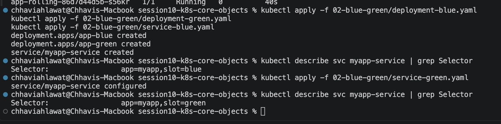
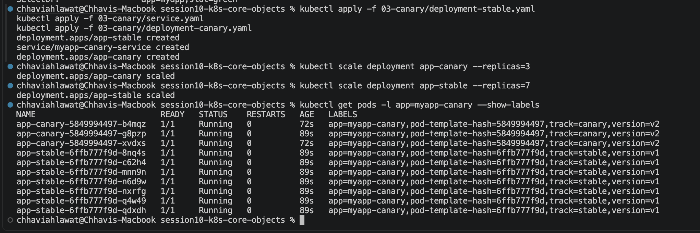
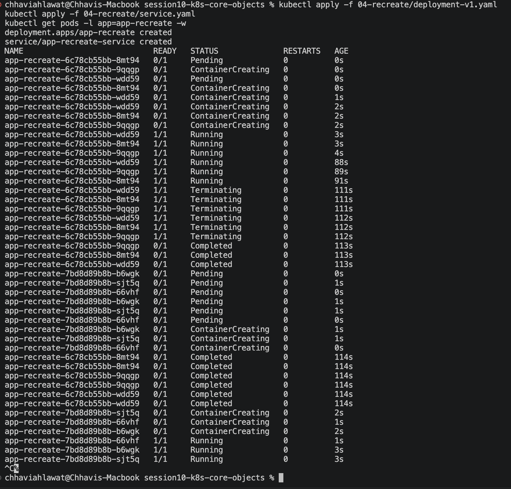

# Session 10: Kubernetes Pods, ReplicaSets & Deployments

This document covers hands-on implementation of the **4 Kubernetes Deployment Strategies** and the **Kubernetes Pod Lifecycle**.

---

## Task 1: Deployment Strategies

Kubernetes provides multiple deployment strategies to release new application versions without unexpected outages.

| Strategy | Zero Downtime? | Resource Overhead | Rollback Speed | Best Use Case |
|---|---|---|---|---|
| **Rolling Update** | Yes | Low (~25% extra) | Moderate | Default production deployments |
| **Blue-Green** | Yes | High (2x full capacity) | Instant | Critical apps requiring instant rollback |
| **Canary** | Yes | Low | Fast | Testing new features on real user subset |
| **Recreate** | No | Zero | Slow | Development, non-backward-compatible schema changes |

---

### 01. Rolling Update Deployment
* **Concept:** Incremental rollout where old pods are gradually replaced by new pods (controlled by `maxSurge` and `maxUnavailable`).
* **Directory:** [`01-rolling-update/`](file:///home/akshanshsinha/DevOps/devops-heros/session10-k8s-core-objects/01-rolling-update)
* **Execution Commands:**
  ```bash
  # 1. Apply Initial Deployment
  kubectl apply -f 01-rolling-update/deployment.yaml

  # 2. Check rollout status
  kubectl rollout status deployment/rolling-deployment

  # 3. Update application image to trigger rolling update
  kubectl set image deployment/rolling-deployment app=nginx:1.25

  # 4. Observe old and new pods during transition
  kubectl get pods -l app=rolling-app -w
  ```
* **Screenshot Evidence:**
  <!-- Add screenshot:  -->

---

### 02. Blue-Green Deployment
* **Concept:** Both versions exist simultaneously in the cluster; a Service selector switches user traffic instantly from Blue (v1) to Green (v2).
* **Directory:** [`02-blue-green/`](file:///home/akshanshsinha/DevOps/devops-heros/session10-k8s-core-objects/02-blue-green)
* **Execution Commands:**
  ```bash
  # 1. Deploy Blue Version (v1) and Active Service
  kubectl apply -f 02-blue-green/blue-deployment.yaml
  kubectl apply -f 02-blue-green/service.yaml

  # 2. Deploy Green Version (v2) in background
  kubectl apply -f 02-blue-green/green-deployment.yaml

  # 3. Switch Service selector from Blue to Green
  kubectl patch service app-service -p '{"spec":{"selector":{"version":"green"}}}'

  # 4. Verify traffic points to Green version
  kubectl get endpoints app-service
  ```
* **Screenshot Evidence:**
  <!-- Add screenshot:  -->

---

### 03. Canary Deployment
* **Concept:** Directing a small percentage of traffic (e.g., 10-25%) to a new "Canary" version while the stable version serves the rest.
* **Directory:** [`03-canary/`](file:///home/akshanshsinha/DevOps/devops-heros/session10-k8s-core-objects/03-canary)
* **Execution Commands:**
  ```bash
  # 1. Deploy Primary / Stable version (e.g., 4 replicas)
  kubectl apply -f 03-canary/stable-deployment.yaml

  # 2. Deploy Canary version (e.g., 1 replica) sharing the same Service label
  kubectl apply -f 03-canary/canary-deployment.yaml
  kubectl apply -f 03-canary/service.yaml

  # 3. Test endpoint traffic distribution (1 in 5 requests hitting canary)
  kubectl get pods -l app=canary-demo --show-labels
  ```
* **Screenshot Evidence:**
  <!-- Add screenshot:  -->

---

### 04. Recreate Deployment
* **Concept:** All existing pods are completely terminated first before any new pods are scheduled.
* **Directory:** [`04-recreate/`](file:///home/akshanshsinha/DevOps/devops-heros/session10-k8s-core-objects/04-recreate)
* **Execution Commands:**
  ```bash
  # 1. Deploy initial version with strategy.type=Recreate
  kubectl apply -f 04-recreate/deployment.yaml

  # 2. Trigger update
  kubectl set image deployment/recreate-deployment app=nginx:alpine

  # 3. Observe old pods terminating before new ones start
  kubectl get pods -w
  ```
* **Screenshot Evidence:**
  <!-- Add screenshot:  -->

---

## Task 2: Kubernetes Pod Lifecycle

A Pod moves through distinct lifecycle phases:

```text
[ Pending ] ---> [ ContainerCreating ] ---> [ Running ] ---> [ Succeeded ]
      |                                           |
      v                                           v
  [ Failed ] <------------------------------ [ CrashLoopBackOff ]
```

1. **Pending:** Pod accepted by cluster, but containers not yet created (waiting on scheduling, image pulling, or PVC binding).
2. **Running:** Pod bound to a node, and at least one container is running or starting.
3. **Succeeded:** All containers terminated successfully with exit code 0 (common in Jobs).
4. **Failed:** At least one container terminated in failure (non-zero exit code).
5. **CrashLoopBackOff:** Container repeatedly starts, crashes, and restarts with exponential backoff delay.

### Practical Steps for Each YAML File
Directory: [`pod-lifecycle/`](file:///home/akshanshsinha/DevOps/devops-heros/session10-k8s-core-objects/pod-lifecycle)

1. Apply manifest:
   ```bash
   kubectl apply -f pod-lifecycle/<yaml-file>.yaml
   ```
2. Check Pod status and events:
   ```bash
   kubectl get pods
   kubectl describe pod <pod-name>
   kubectl logs <pod-name>
   ```
3. Document observations and attach screenshot.

* **Screenshot Evidence:**
  <!-- Add screenshot:  -->