- https://github.com/Nency-Ravaliya/Kubernetes 

- k8s core objects: https://github.com/Nency-Ravaliya/Kubernetes/blob/main/core-objects.md 


# Session 10 – Kubernetes Core Objects

## Overview

This session focuses on Kubernetes core objects and how they manage application workloads. The practical work includes checking cluster health, creating and inspecting Pods, understanding Pod lifecycle states, working with controllers, performing rolling updates, and observing common Kubernetes errors.

## Objectives

- Check Kubernetes cluster and node health.
- Create, inspect, and delete Pods.
- Understand Pod lifecycle states.
- Explore readiness, liveness, and startup probes.
- Work with ReplicaSets, StatefulSets, and DaemonSets.
- Perform Deployment rolling updates.
- Understand common Kubernetes errors and troubleshooting.

## Environment

- OS: Windows 11
- Shell: PowerShell
- Kubernetes Cluster: Minikube
- kubectl Client Version: v1.34.1
- Kubernetes Server Version: v1.37.0

Note: A client/server version skew warning was observed during the practical.

---

## 1. Cluster Health

### Commands Used

```powershell
kubectl version --output=yaml
kubectl cluster-info
kubectl get nodes -o wide
```

### Observation

The Minikube node was in the `Ready` state. The cluster information was accessible, and the control plane and CoreDNS were running.

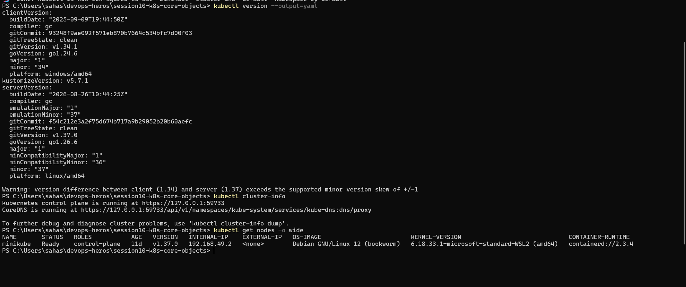

---

## 2. Basic Nginx Pod

### Commands Used

```powershell
kubectl apply -f pod.yml
kubectl get pods
kubectl get pod -o wide
kubectl logs <pod-name>
kubectl delete -f pod.yml
```

### Observation

Created an Nginx Pod, checked its status and details, viewed its logs, and deleted it after verification.

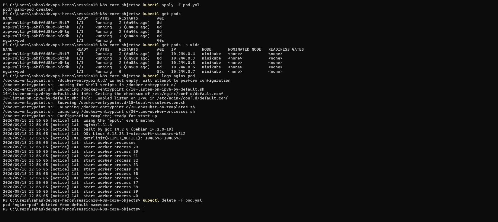

---

## 3. ImagePullBackOff and ErrImagePull

### Commands Used

```powershell
kubectl apply -f <broken-pod-manifest>.yaml
kubectl get pods
kubectl describe pod <pod-name>
kubectl delete -f <broken-pod-manifest>.yaml
```

### Observation

An invalid container image caused Kubernetes to fail while pulling the image. The Pod entered `ErrImagePull` and `ImagePullBackOff`.

This helped demonstrate how Kubernetes reports container image errors.

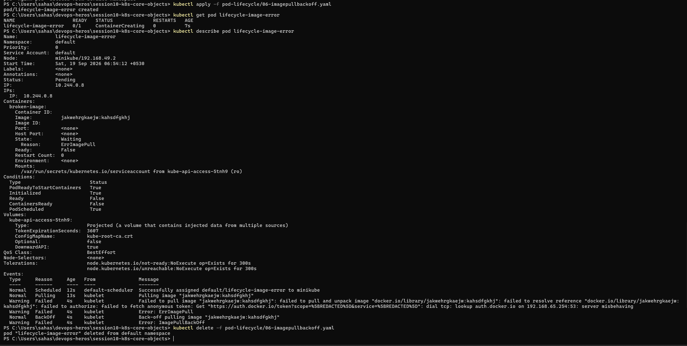

---

## 4. Pod Lifecycle

### Commands Used

```powershell
kubectl apply -f hello.yml
kubectl get pods
kubectl logs hello-pod
kubectl delete -f hello.yml
```

### Observation

The `hello-pod` executed its task and reached the `Completed` state. Its logs displayed `Hello Kubernetes`.

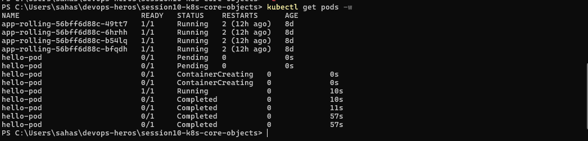

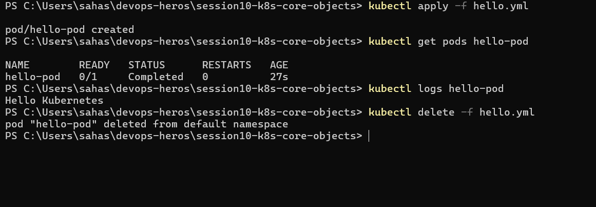

---

## 5. Pod Lifecycle Scenarios

Different manifests inside the `pod-lifecycle` directory were used to understand Pod states and container health checks.

### 5.1 Pending Pod

A Pod can remain in the `Pending` state while Kubernetes schedules it or prepares the required resources.

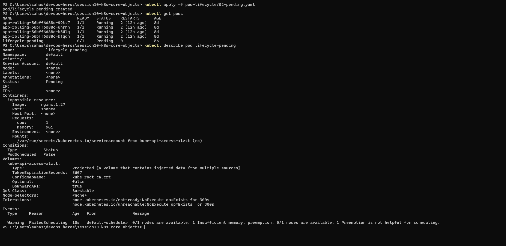

### 5.2 CrashLoopBackOff

CrashLoopBackOff occurs when a container repeatedly fails and Kubernetes attempts to restart it.

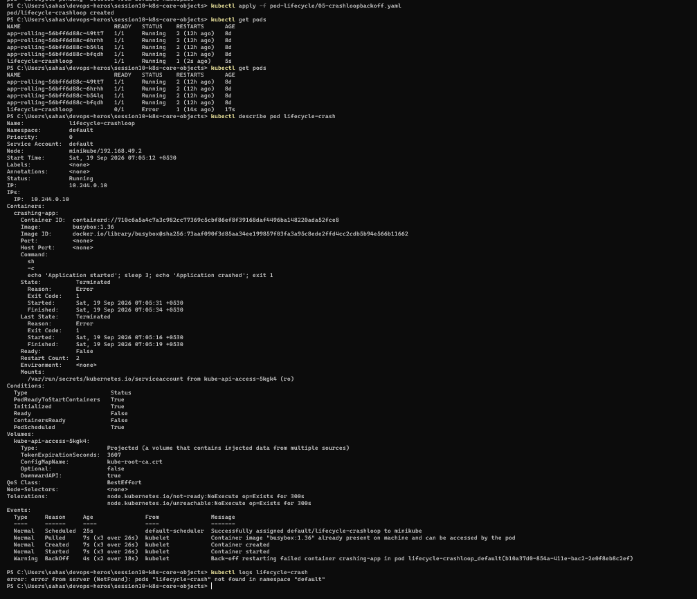

### 5.3 Readiness Probe

A readiness probe checks whether a container is ready to receive traffic. If it fails, the Pod is not considered ready to receive Service traffic.

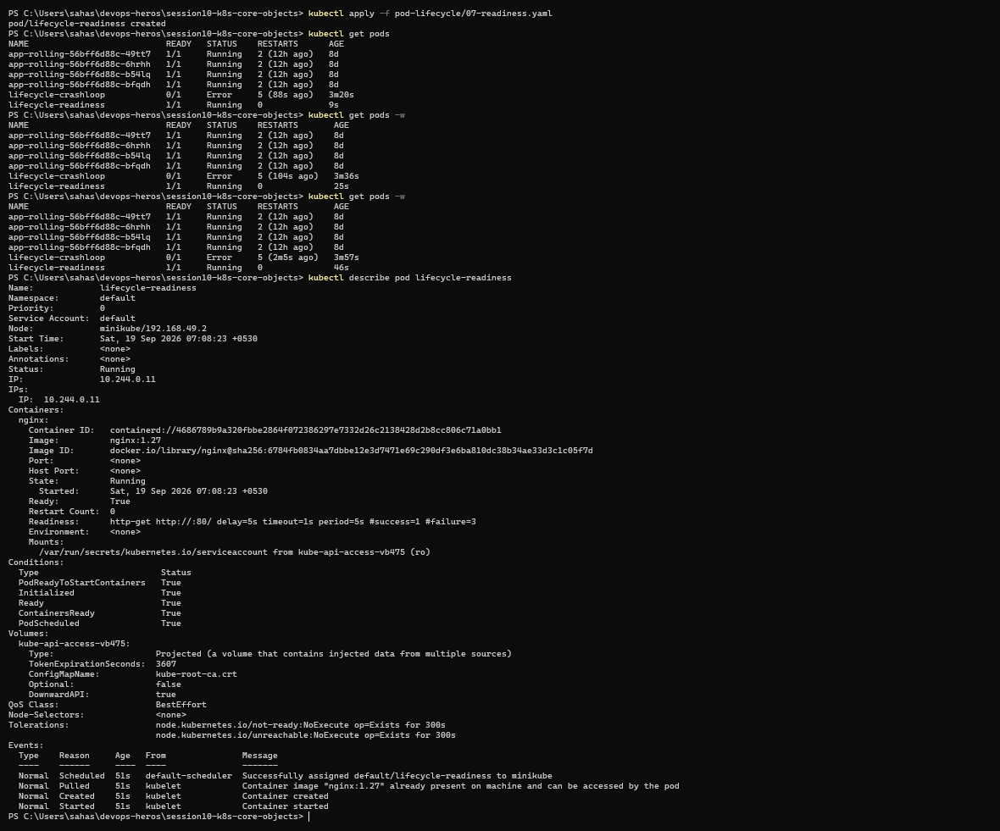

### 5.4 Liveness Probe

A liveness probe checks whether a container is healthy. Repeated failures can cause Kubernetes to restart the container.

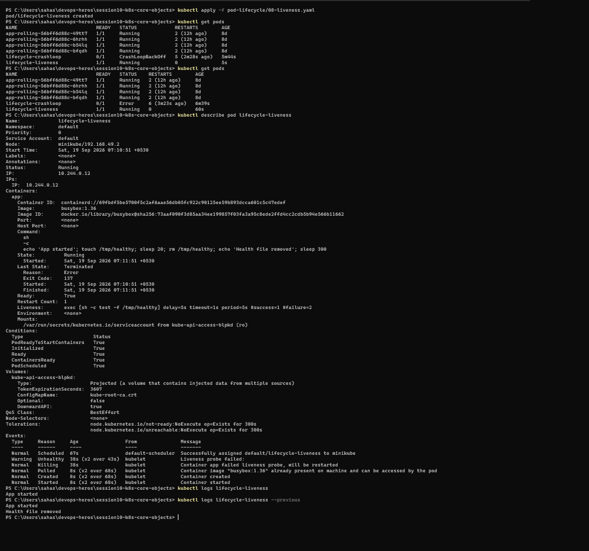

### 5.5 Additional Probe/Lifecycle Practical

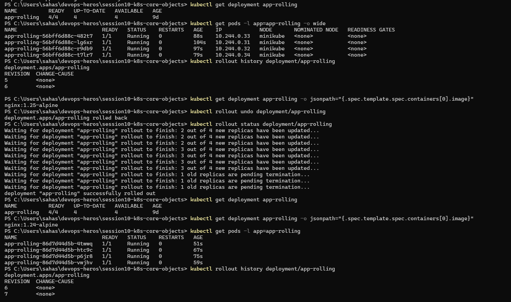

### 5.6 Startup Probe

A startup probe checks whether an application has completed its startup process.

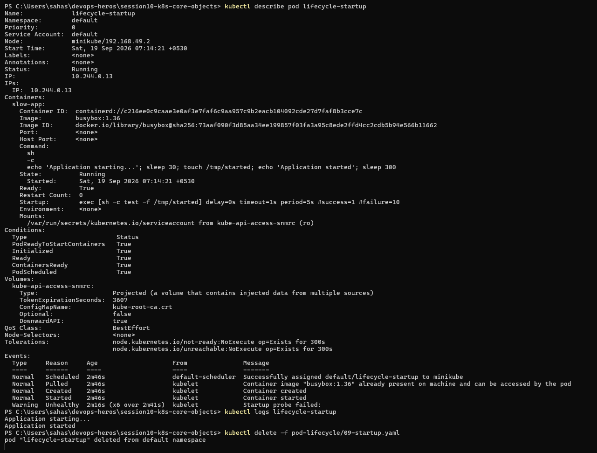

### 5.7 Init Container

Init containers run before the main application containers and can be used to complete initialization tasks.

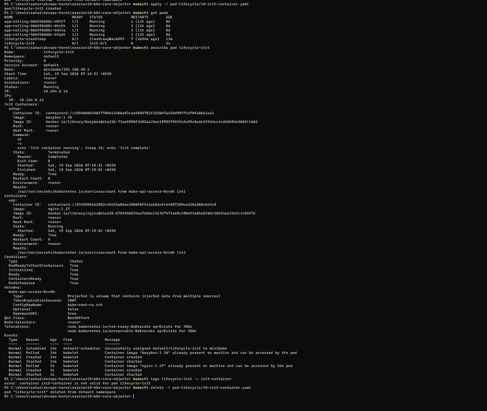

### 5.8 Multi-Container Pod

A multi-container Pod can run multiple containers within the same Pod. Containers can be inspected individually using the `-c` option.

Commands used:

```powershell
kubectl logs lifecycle-multi-container -c app
kubectl logs lifecycle-multi-container -c sidecar
kubectl get pod lifecycle-multi-container
kubectl delete -f pod-lifecycle/11-multi-container.yaml
```

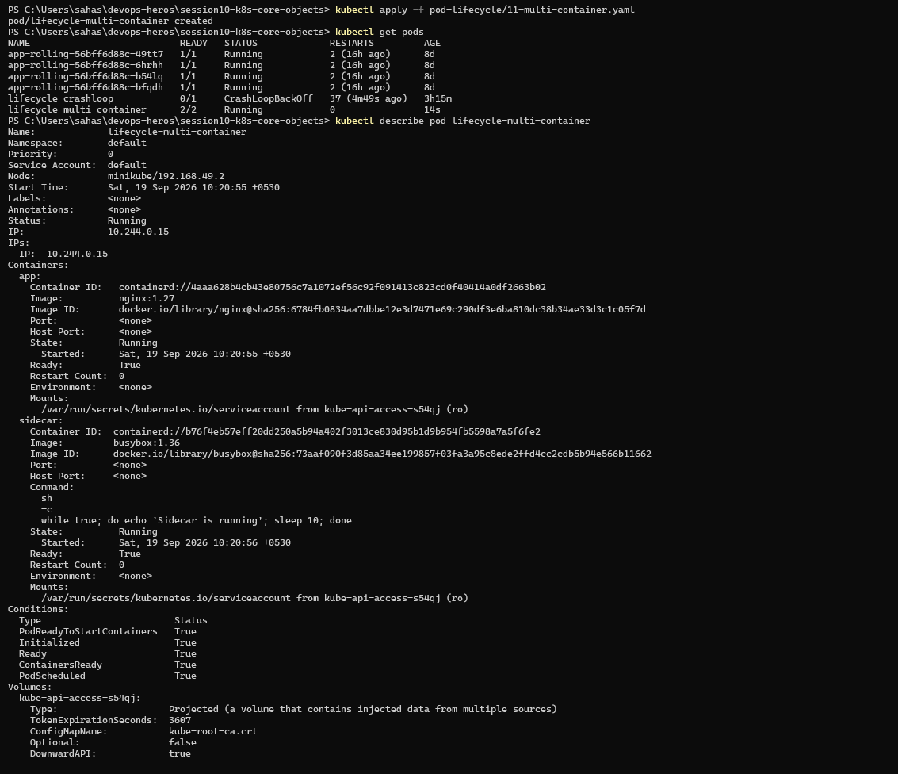

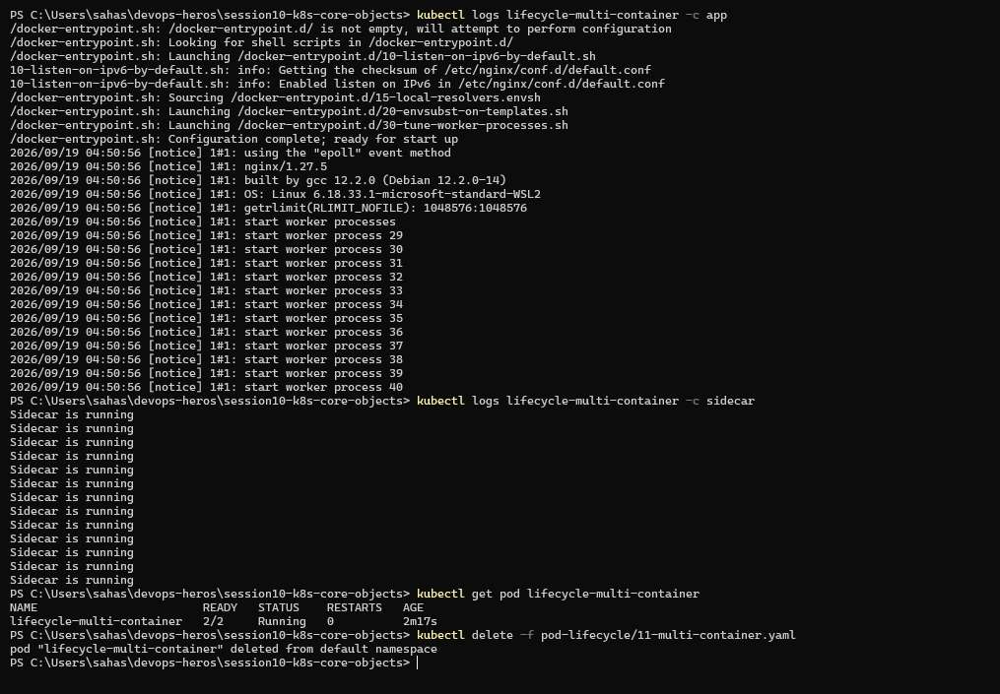

### 5.9 Pod Termination

Observed the termination behavior of a Pod with a configured termination grace period.

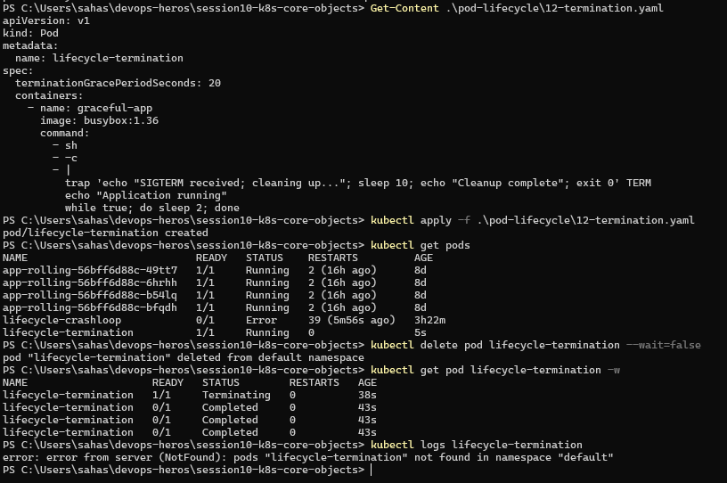

---

## 6. ReplicaSet and StatefulSet

### 6.1 ReplicaSet

Created a ReplicaSet named `nginx-rs` with three replicas.

When one Pod was deleted, the ReplicaSet automatically created a replacement Pod to maintain the desired replica count.

### 6.2 StatefulSet

Deployed a MySQL StatefulSet with three replicas and a headless Service.

The StatefulSet created the following Pods:

- mysql-0
- mysql-1
- mysql-2

All three Pods reached the `Running` state, and their PersistentVolumeClaims were `Bound`.

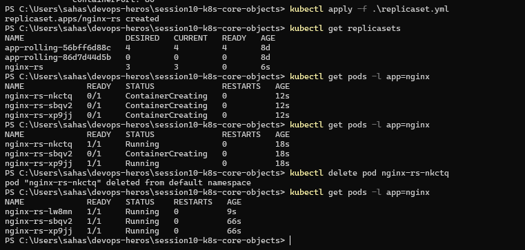

.png)

---

## 7. DaemonSet

Created a DaemonSet named `node-logging-agent`.

### Observation

The Minikube cluster had one eligible node, so the DaemonSet created one Pod on that node.

The Pod reached the `Running` state, and its logs displayed the metrics-collection message.

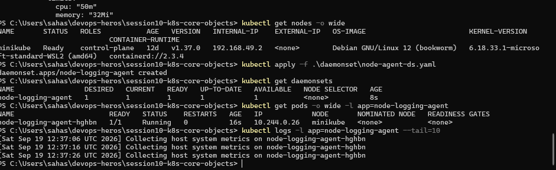

---

## 8. Deployment Rolling Update

The `app-rolling` Deployment was used to practice a rolling update.

The application image was updated from:

- `nginx:1.24-alpine`
- `nginx:1.25-alpine`

### Commands Used

```powershell
kubectl apply -f .\01-rolling-update\deployment-v1.yaml
kubectl apply -f .\01-rolling-update\service.yaml
kubectl rollout status deployment/app-rolling
kubectl apply -f .\01-rolling-update\deployment-v2.yaml
kubectl rollout status deployment/app-rolling
kubectl rollout history deployment/app-rolling
```

### Observation

The rolling update completed successfully, and the new Pods were running with the updated image.

The Deployment rollout history was also inspected.

### Rollback

The rollback commands to verify recovery are:

```powershell
kubectl rollout undo deployment/app-rolling
kubectl rollout status deployment/app-rolling
kubectl get deployment app-rolling
kubectl get deployment app-rolling -o jsonpath="{.spec.template.spec.containers[0].image}"
```

Note: The rolling update to v2 was confirmed. Rollback verification is not claimed here because a successful rollback result was not confirmed.

---

## 9. Troubleshooting - Broken Image Deployment

The intentionally broken manifest `troubleshooting/broken-image.yaml` was applied to observe a Deployment failure.

The manifest used the invalid image:

`yatri-backend:non-existent-tag-v999`

### Commands Used

```powershell
kubectl apply -f .\troubleshooting\broken-image.yaml
kubectl get deployment yatri-backend
kubectl get pods -l app=yatri-backend
```

### Observation

The Deployment was created with `0/3` ready replicas.

The Pods entered `ErrImagePull`, and one later showed `ImagePullBackOff`, because Kubernetes could not pull the invalid image.

This demonstrated how an invalid image can prevent a Deployment from becoming healthy.


Note: The broken-image troubleshooting exercise was started, but the fix/rollback and selector-mismatch exercise were left incomplete.

---

## 10. Summary

In this session, I practiced Kubernetes cluster inspection, Pod operations, Pod lifecycle states, health probes, workload controllers, and Deployment rolling updates.

I also observed how invalid container images cause `ErrImagePull` and `ImagePullBackOff`.

The session helped me understand how Kubernetes manages workloads, maintains desired replica counts, and reports common application deployment issues.

Some remaining troubleshooting and advanced Deployment exercises are left for a future continuation.

---

## Screenshots

All practical screenshots are stored in the `screenshots/` directory.

The screenshot paths in this README are relative to the Session 10 folder.