# Session 10 — Kubernetes Core Objects & Deployment Strategies

Documentation and practical lab report for **Session 10: Kubernetes Core Objects** in the local DevOps learning workspace.

---

## 1. Overview & Objectives

In this session, we explored the core building blocks of Kubernetes architecture and various workload deployment strategies. The lab covers workload primitives (Pods, ReplicaSets, Deployments, DaemonSets, StatefulSets), Pod lifecycle phases, multi-container pattern execution, and progressive delivery deployment strategies (Rolling Update, Blue-Green, Canary, Recreate).

### Local Environment Setup
- **OS**: macOS (Apple Silicon - M-series)
- **Local Kubernetes Cluster**: Minikube v1.39.0
- **Kubernetes Version**: v1.37.0
- **Container Runtime**: Docker Desktop / Containerd
- **CLI Tools**: `kubectl`, `minikube`

---

## 2. Core Workload Objects

### 2.1 Pod (`Pod`)
A **Pod** is the smallest deployable unit in Kubernetes. It encapsulates one or more containers sharing storage, network namespaces, and operational specifications.

- **Manifest**: [pod.yml](pod.yml)
- **Commands Executed**:
  ```bash
  kubectl apply -f pod.yml
  kubectl get pods -o wide
  ```
- **Observed Result**: Single `nginx-pod` transitioned to `1/1 Running`.
- **Evidence**:
  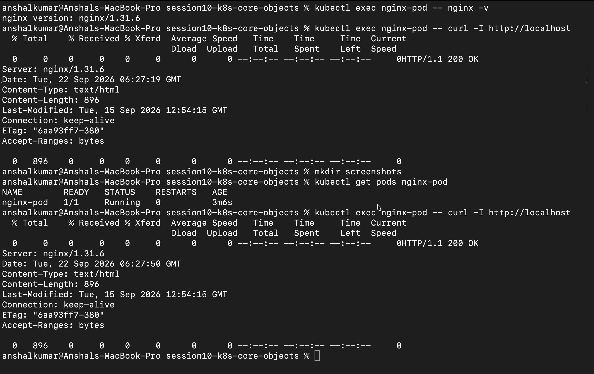

---

### 2.2 ReplicaSet (`ReplicaSet`)
A **ReplicaSet** maintains a stable set of replica Pods running at any given time, guaranteeing availability and self-healing.

- **Manifest**: [replicaset.yml](replicaset.yml)
- **Commands Executed**:
  ```bash
  kubectl apply -f replicaset.yml
  kubectl get rs nginx-rs
  # Self-healing test: Manual pod deletion
  kubectl delete pod <pod-name>
  kubectl get pods -l app=nginx
  ```
- **Observed Result**: 
  - Initial state spawned 3 replicas.
  - Upon manual deletion of one pod, the ReplicaSet controller immediately instantiated a replacement pod to restore desired capacity of 3.
- **Evidence**:
  - Initial ReplicaSet state:
    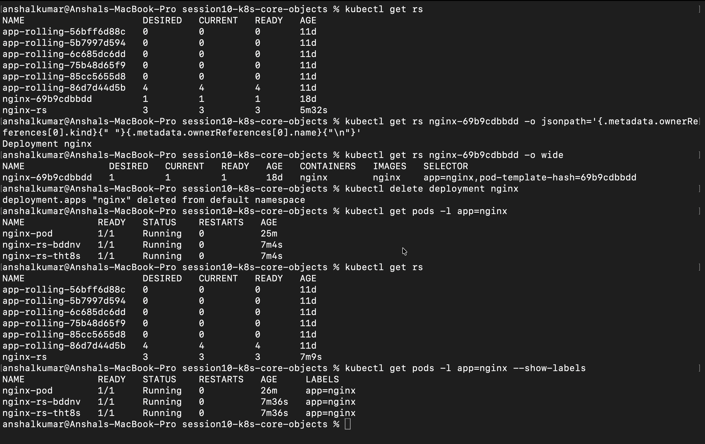
  - Self-Healing Verification:
    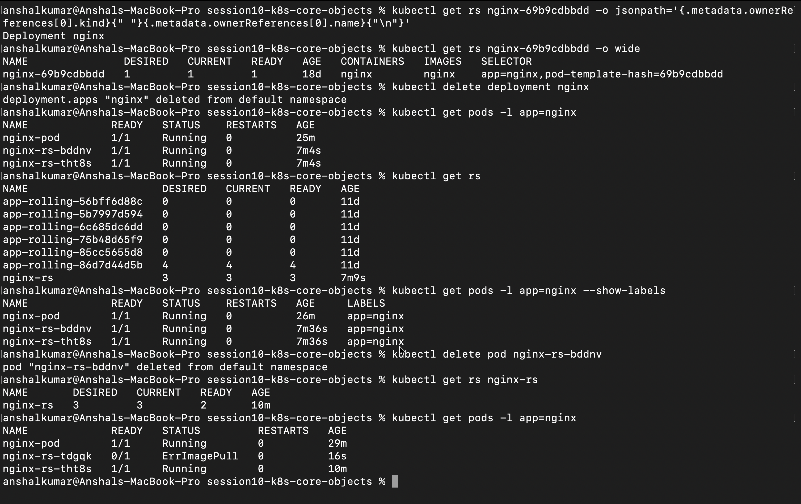

---

### 2.3 Deployment (`Deployment`)
A **Deployment** provides declarative updates for Pods and ReplicaSets. It manages rollout versions, revisions, and automated rollback capabilities.

- **Manifest**: [deployment.yml](deployment.yml)
- **Commands Executed**:
  ```bash
  kubectl apply -f deployment.yml
  kubectl get deployment nginx-deployment
  kubectl get pods -l app=nginx-deployment
  ```
- **Observed Result**: Created `nginx-deployment` with 3 replicas using `imagePullPolicy: IfNotPresent` and local `nginx:1.25`.
- **Evidence**:
  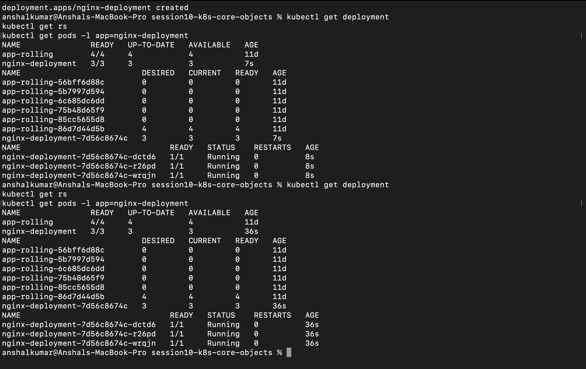

---

### 2.4 Multi-Container Pod
Demonstrates the sidecar pattern where multiple containers co-exist in a single Pod, sharing localhost networking and volumes.

- **Manifest**: [k8s-core-objects/pod.yml](k8s-core-objects/pod.yml)
- **Containers**:
  1. `app` (Nginx web server)
  2. `logger` (Busybox streaming synthetic log messages every 5 seconds)
- **Commands Executed**:
  ```bash
  kubectl apply -f k8s-core-objects/pod.yml
  kubectl get pod mypod
  kubectl logs mypod -c logger
  ```
- **Observed Result**: Pod `mypod` reached `2/2 Running`.
- **Evidence**:
  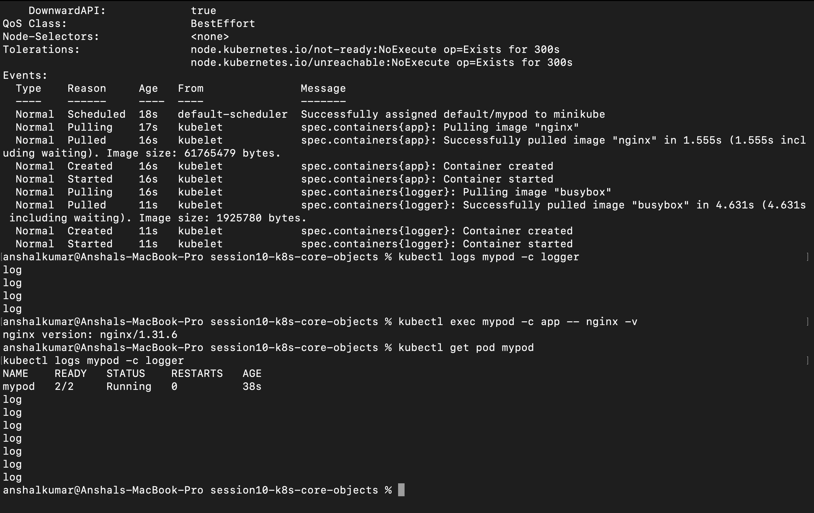

---

### 2.5 DaemonSet (`DaemonSet`)
A **DaemonSet** ensures that all (or some) Nodes run a copy of a Pod. Commonly used for node monitoring agents, log collectors, or storage daemons.

- **Manifest**: [k8s-core-objects/daemonset.yml](k8s-core-objects/daemonset.yml)
- **Workload**: Prometheus `node-exporter` running on port 9100.
- **Commands Executed**:
  ```bash
  kubectl apply -f k8s-core-objects/daemonset.yml
  kubectl get daemonset node-exporter
  kubectl get pods -l app=node-exporter
  ```
- **Observed Result**: One instance of `node-exporter` automatically scheduled on the Minikube single-node cluster (`1/1 Ready`).
- **Evidence**:
  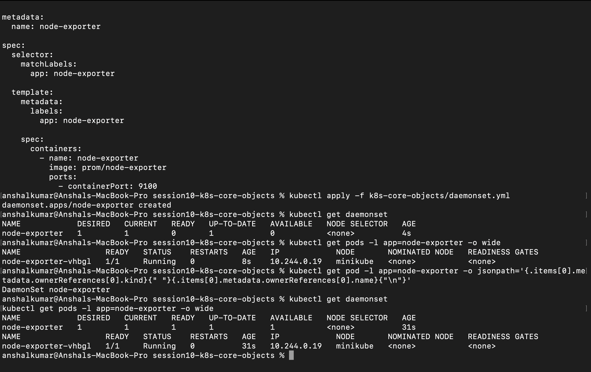

---

### 2.6 StatefulSet (`StatefulSet`)
A **StatefulSet** manages stateful applications, providing sticky network identities and ordered deployment/scaling.

- **Manifest**: [statefulset.yml](statefulset.yml)
- **Commands Executed**:
  ```bash
  kubectl apply --dry-run=client -f statefulset.yml
  ```
- **Observed Result**: Manifest syntax verified via client dry-run.
- **Evidence**:
  - `MISSING EVIDENCE — screenshot still required`

---

## 3. Pod Lifecycle & Health Probes

### Official Pod Phases
1. **Pending**: Pod accepted by cluster, but container image creation or scheduling is in progress.
2. **Running**: Pod bound to node; all containers created; at least one container is running or starting.
3. **Succeeded**: All containers in the Pod terminated successfully with exit code 0.
4. **Failed**: All containers terminated, with at least one container failing (non-zero exit code).
5. **Unknown**: Pod state cannot be obtained by API server (network partition).

### Probes Overview
- **Readiness Probe**: Determines if container is ready to accept user traffic.
- **Liveness Probe**: Determines if container needs to be restarted by kubelet.
- **Startup Probe**: Postpones readiness and liveness checks while container boots.

- **Evidence**:
  - `MISSING EVIDENCE — screenshot still required`

---

## 4. Deployment Strategies

### 4.1 Rolling Update Strategy
Increments new pods while terminating old ones a few at a time, guaranteeing zero service downtime throughout the release lifecycle.

- **Manifests**:
  - [01-rolling-update/deployment.yaml](01-rolling-update/deployment.yaml)
  - [01-rolling-update/service.yaml](01-rolling-update/service.yaml)
- **Key Strategy Parameters**: `maxSurge: 1` (1 extra pod allowed temporarily during rollout), `maxUnavailable: 0` (capacity never drops below desired 4 replicas).

#### Rollout Workflow (v1 → v2)
1. **Initial v1 Deployment**: Deployed `app-rolling` with 4 replicas running `nginx:1.24-alpine` and exposed the workload via NodePort service `app-rolling-service` on port `30010`.
2. **v2 Rollout Execution**: Triggered an inline rolling update to `nginx:1.25` using `kubectl set image deployment/app-rolling web=nginx:1.25`.
3. **Zero-Downtime Transition**: Kubernetes brought up a single new v2 surge pod (`maxSurge: 1`), waited for readiness, and incrementally terminated old v1 pods one-by-one while maintaining 100% service availability (`maxUnavailable: 0`).
4. **Service Endpoint Binding**: Verified `app-rolling-service` continuously routed traffic across available pod endpoints throughout the update window.

- **Commands Executed**:
  ```bash
  kubectl apply -f 01-rolling-update/deployment.yaml
  kubectl apply -f 01-rolling-update/service.yaml
  kubectl set image deployment/app-rolling web=nginx:1.25
  kubectl rollout status deployment/app-rolling
  kubectl get pods -l app=app-rolling -o wide
  kubectl get svc app-rolling-service
  ```
- **Observed Result**: Successful transition to `nginx:1.25` with 4/4 pods healthy and service exposed cleanly.
- **Evidence**:
  - Rollout Completion:
    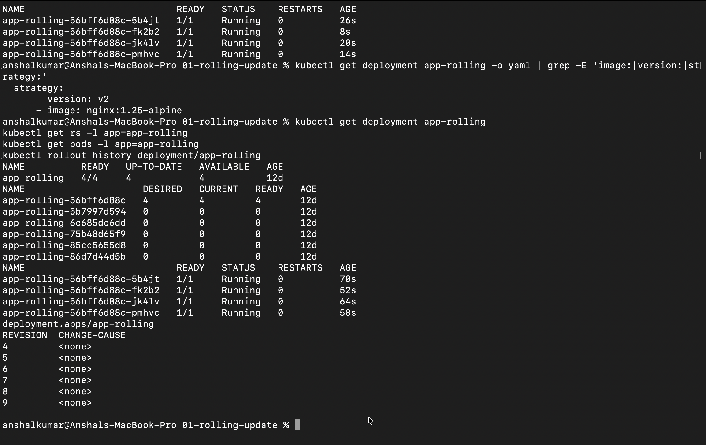
  - Service Status & Endpoint Routing:
    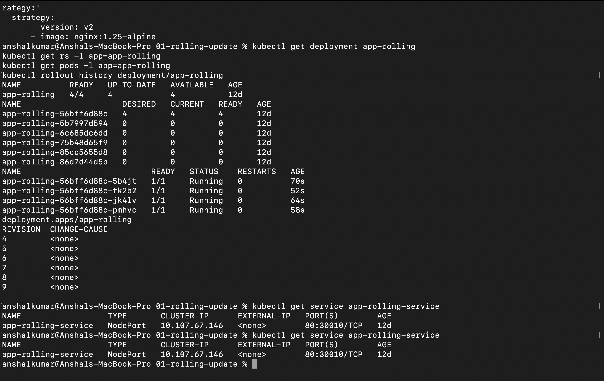

---

### 4.2 Blue-Green Deployment Strategy
Maintains two identical environments (Blue=Live, Green=New). Switch traffic via Service label selector update.

- **Manifests**:
  - [02-blue-green/deployment-blue.yaml](02-blue-green/deployment-blue.yaml)
  - [02-blue-green/deployment-green.yaml](02-blue-green/deployment-green.yaml)
  - [02-blue-green/service.yaml](02-blue-green/service.yaml)
- **Cutover Command**:
  ```bash
  kubectl set selector service app-blue-green-service version=green
  ```
- **Observed Result**: Service selector updated to `version=green`, shifting NodePort `30020` traffic to the Green pods.
- **Evidence**:
  - 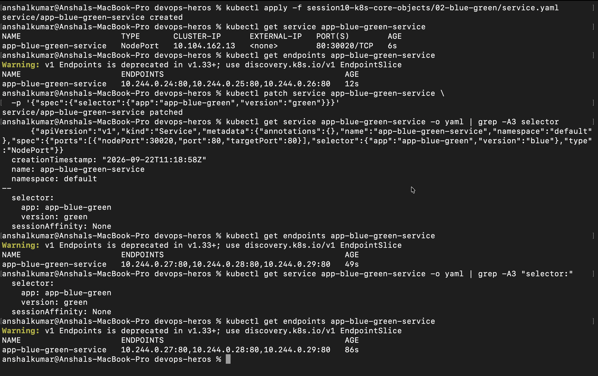

---

### 4.3 Canary Deployment Strategy

Runs a small number of Pods from a new release alongside the stable release so the new version can be exposed to a limited portion of traffic.

- **Manifests**:

  - [03-canary/deployment-stable.yaml](03-canary/deployment-stable.yaml)

  - [03-canary/deployment-canary.yaml](03-canary/deployment-canary.yaml)

  - [03-canary/service.yaml](03-canary/service.yaml)

- **Workload Distribution**: 9 Stable pods (`track=stable`) : 1 Canary pod (`track=canary`).

- **Service Selector**: The Service selects `app=app-canary`, which includes both stable and canary Pods.

- **Observed Result**:
  - Stable Deployment: `9/9` ready.
  - Canary Deployment: `1/1` ready.
  - Service exposed 10 total endpoints, corresponding to the 9 stable and 1 canary Pods.

- **Evidence**:

  - 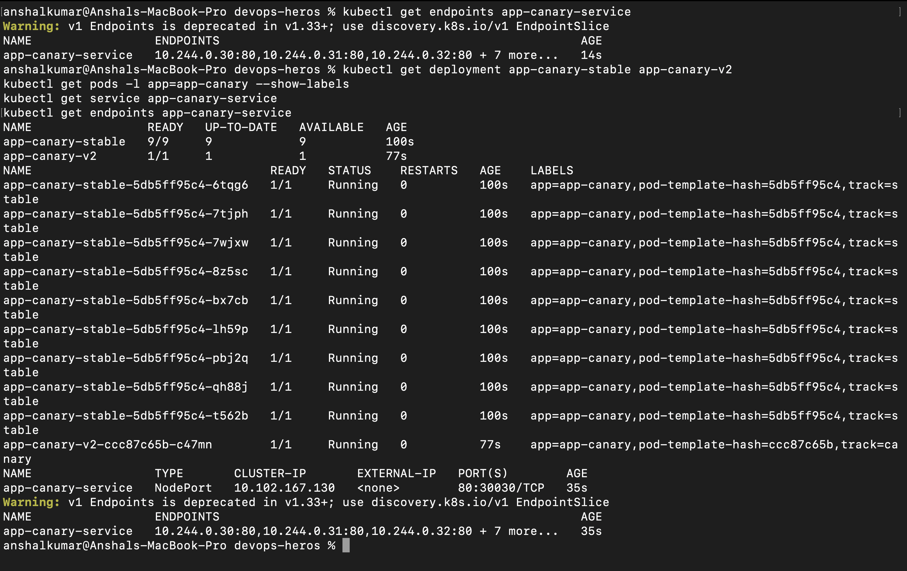

> **Note:** The 9:1 Pod ratio is used as an approximate traffic distribution model for this lab. A Kubernetes Service does not guarantee an exact 90/10 request split.

---

### 4.4 Recreate Deployment Strategy

Terminates the existing Pods before creating Pods for the new version. This can create a temporary period with no available Pods during the update.

- **Manifests**:

  - [04-recreate/deployment-v1.yaml](04-recreate/deployment-v1.yaml)

  - [04-recreate/deployment-v2.yaml](04-recreate/deployment-v2.yaml)

- **Strategy**: `Recreate`

- **Version Change**:

  - v1: `nginx:1.24-alpine`

  - v2: `nginx:1.25-alpine`

- **Observed Result**:

  - v1 initially ran 3 Pods with `pod-template-hash=5b89644bcf`.

  - After applying v2, the v1 Pods were replaced by 3 new Pods with `pod-template-hash=cd586d694`.

  - Final Deployment state: `3/3` ready and `3/3` available.

- **Evidence**:

  - 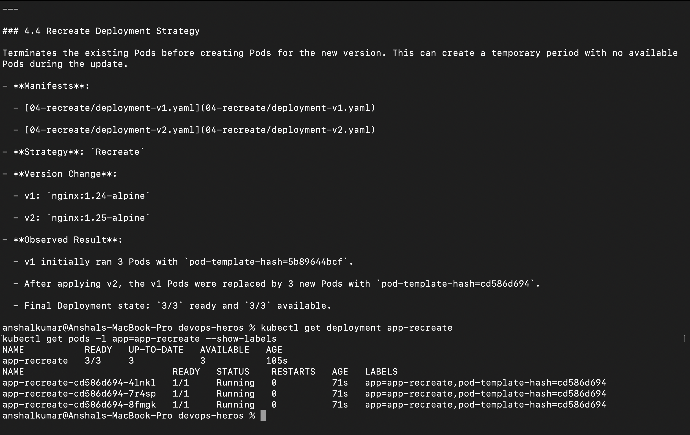

> **Note:** The captured evidence shows the old and new Pod sets before/after the update, but does not capture the brief interval during which the old Pods had terminated and the new Pods had not yet become ready.


---

## 5. Troubleshooting & Issues Resolved

| Issue Encountered | Root Cause | Resolution |
| :--- | :--- | :--- |
| `429 Too Many Requests` (Docker Hub Rate Limit) | Exceeded anonymous Docker Hub pull rate limits during image updates. | Modified manifests to set `imagePullPolicy: IfNotPresent` and use local images cached inside Minikube (`nginx:1.25`, `nginx:1.27-alpine`, `busybox`, `prom/node-exporter`). |
| Missing Evidence Markers | New deployment strategy manifests were created and dry-run validated, but terminal screenshots were not yet captured. | Formally annotated missing evidence with `MISSING EVIDENCE — screenshot still required` to maintain strict reporting accuracy without fabricating images. |

---

## 6. Implementation & Evidence Checklist

| Concept / Strategy | Manifest Created | Cluster Dry-Run / Deployed | Screenshot Evidence | Status |
| :--- | :---: | :---: | :---: | :--- |
| **Pod** | Yes (`pod.yml`) | Deployed | [pod-running.png](screenshots/pod-running.png) | Completed |
| **ReplicaSet** | Yes (`replicaset.yml`) | Deployed | [replicaset-before.png](screenshots/replicaset-before.png), [replicaset-self-healing.png](screenshots/replicaset-self-healing.png) | Completed |
| **Deployment** | Yes (`deployment.yml`) | Deployed | [deployment-running.png](screenshots/deployment-running.png) | Completed |
| **Multi-Container Pod** | Yes (`k8s-core-objects/pod.yml`) | Deployed | [multi-container-pod.png](screenshots/multi-container-pod.png) | Completed |
| **DaemonSet** | Yes (`k8s-core-objects/daemonset.yml`) | Deployed | [daemonset-running.png](screenshots/daemonset-running.png) | Completed |
| **StatefulSet** | Yes (`statefulset.yml`) | Dry-Run Verified | Pending Screenshot | Manifest Ready / Screenshot Pending |
| **Pod Lifecycle** | Documented | N/A | Pending Screenshot | Concept Documented / Screenshot Pending |
| **Rolling Update** | Yes (`01-rolling-update/`) | Deployed (`app-rolling`) | [rolling-update-complete.png](screenshots/rolling-update-complete.png), [rolling-update-service.png](screenshots/rolling-update-service.png) | Completed |
| **Blue-Green** | Yes (`02-blue-green/`) | Deployed (`app-blue`/`app-green`) | [blue-green-cutover.png](screenshots/blue-green-cutover.png) | Completed |
| **Canary** | Yes (`03-canary/`) | Deployed (`9:1`) | [canary-9-1.png](screenshots/canary-9-1.png) | Completed |
| **Recreate** | Yes (`04-recreate/`) | Deployed (`v1->v2`) | [recreate-v1-v2.png](screenshots/recreate-v1-v2.png) | Completed |