### Task 1: Cluster Health Verification & Baseline Environment Checks

- **Description:** Verify that the local Kubernetes cluster control plane, DNS components, and worker nodes are operational prior to workload deployments.
- **Commands to Run:**
    
    ```bash
    # Check Kubernetes client and server versions
    kubectl version --output=yaml
    
    # Check control plane and CoreDNS status
    kubectl cluster-info
    
    # Verify all nodes are in Ready status
    kubectl get nodes -o wide
    ```
    
- **Output:**
    

---

### Task 2: Standard Pod Deployment, Extended Inspection & Teardown (`pod.yml`)

- **Description:** Create an individual Pod running Nginx, inspect its labels, runtime IP, node assignment, and container logs, then cleanly delete it.

- **Commands to Run:**
    
    ```bash
    # Deploy Nginx pod
    kubectl apply -f pod.yml
    
    # Verify Pod readiness (1/1 Running)
    kubectl get pods
    
    # Inspect IP address and assigned worker node
    kubectl get pods -o wide
    
    # Inspect live container logs
    kubectl logs nginx-pod
    
    # Delete pod and confirm termination
    kubectl delete -f pod.yml
    kubectl get pods
    ```
    
- **Screenshot**


---

### Task 3: Error State Simulation — `ErrImagePull` & `ImagePullBackOff`

- **Description:** Demonstrate Kubernetes error handling when pulling a non-existent container image, observing the exponential backoff loop.

- **Commands to Run:**
    
    ```bash
    # Apply broken image manifest
    kubectl apply -f pod-lifecycle/06-imagepullbackoff.yaml
    
    # Observe failure state
    kubectl get pods lifecycle-image-error
    
    # Inspect failure events recorded by the Kubelet
    kubectl describe pod lifecycle-image-error | grep -A 10 Events:
    
    # Clean up
    kubectl delete -f pod-lifecycle/06-imagepullbackoff.yaml
    ```
    
- **Screenshot**


---

### Task 4: Capturing Transient Pod Lifecycle Stages (`hello.yml`)

- **Description:** Deploy a batch execution container (`busybox`) configured with `restartPolicy: Never` and capture all three lifecycle states in real time.

- **Commands to Run:**
    
    ```bash
    # In Terminal 1: Watch pods continuously
    kubectl get pods -w
    
    # In Terminal 2: Apply batch job
    kubectl apply -f hello.yml
    
    # Rapidly observe states:
    # Stage 1: ContainerCreating (runtime pulling image & configuring netns)
    # Stage 2: Running (process executing)
    # Stage 3: Completed (process terminated with exit code 0)
    kubectl get pods hello-pod
    
    # Verify exit code and logs
    kubectl logs hello-pod
    kubectl delete -f hello.yml
    ```
    
- **Screenshot**


---

### Task 5: Exhaustive Pod Lifecycle States & Probes Lab (`pod-lifecycle/`)

- **Description:** Navigate to `session10-k8s-core-objects/pod-lifecycle/` and validate core lifecycle states, health checks, multi-container pods, and graceful termination.
- **Commands to Run:**
    
    ```bash
    cd session10-k8s-core-objects/pod-lifecycle/
    
    # 1. Pending State (Unschedulable due to impossible memory request)
    kubectl apply -f 02-pending.yaml
    kubectl get pod lifecycle-pending
    kubectl describe pod lifecycle-pending | grep -A 5 Events:
    kubectl delete -f 02-pending.yaml
    
    # 2. CrashLoopBackOff (Container exit code 1 restart loop)
    kubectl apply -f 05-crashloopbackoff.yaml
    kubectl get pod lifecycle-crashloop -w
    kubectl logs lifecycle-crashloop --previous
    kubectl delete -f 05-crashloopbackoff.yaml
    
    # 3. Readiness Probe (Validating Running != Ready)
    kubectl apply -f 07-readiness.yaml
    kubectl get pod lifecycle-readiness
    kubectl delete -f 07-readiness.yaml
    
    # 4. Liveness Probe (Automated restart on health failure)
    kubectl apply -f 08-liveness.yaml
    # Watch for 25-30s until RESTARTS increments to 1
    kubectl get pod lifecycle-liveness -w
    kubectl delete -f 08-liveness.yaml
    
    # 5. Startup Probe (Handling slow bootstrap without premature liveness death)
    kubectl apply -f 09-startup.yaml
    kubectl get pod lifecycle-startup
    kubectl delete -f 09-startup.yaml
    
    # 6. Init Container (Sequential setup completion prior to app start)
    kubectl apply -f 10-init-container.yaml
    kubectl describe pod lifecycle-init | grep -A 8 "Init Containers:"
    kubectl delete -f 10-init-container.yaml
    
    # 7. Multi-Container Pod (Main App + Logging Sidecar)
    kubectl apply -f 11-multi-container.yaml
    kubectl get pod lifecycle-multi-container
    kubectl logs lifecycle-multi-container -c sidecar
    kubectl delete -f 11-multi-container.yaml
    
    # 8. Graceful Termination (SIGTERM trap handling)
    kubectl apply -f 12-termination.yaml
    kubectl delete -f 12-termination.yaml
    ```
    
- **Screenshots to Attach:**

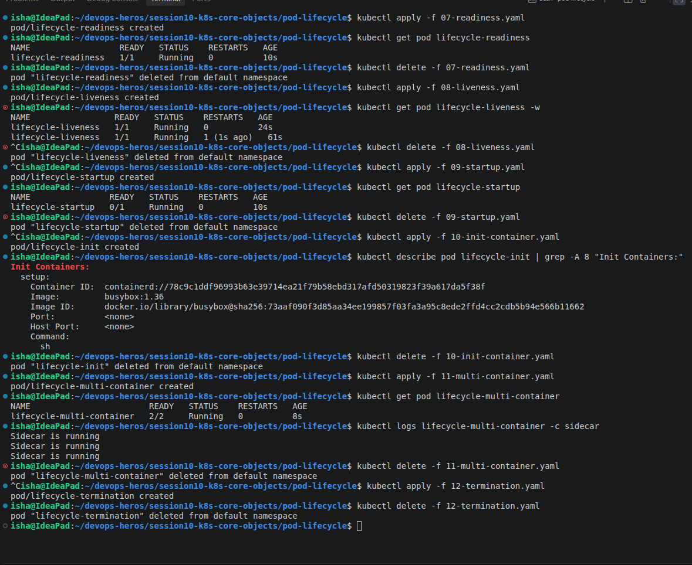

---

### Task 6: Core Controller Objects Exploration (ReplicaSet & StatefulSet)

- **Description:** Deploy self-healing stateless replication via a ReplicaSet and predictable stateful storage via a StatefulSet.
- **Commands to Run:**
    
    #### Part A: ReplicaSet
    
    ```bash
    # Deploy ReplicaSet
    kubectl apply -f session10-k8s-core-objects/replicaset.yml
    kubectl get rs nginx-rs
    kubectl get pods -l app=nginx
    
    # Test Self-Healing: Delete 1 pod manually
    POD_NAME=$(kubectl get pods -l app=nginx -o jsonpath='{.items[0].metadata.name}')
    kubectl delete pod $POD_NAME
    
    # Verify ReplicaSet instantly created a new pod to maintain desired count: 3
    kubectl get pods -l app=nginx
    kubectl delete -f session10-k8s-core-objects/replicaset.yml
    ```
    
    #### Part B: StatefulSet
    
    ```bash
    # Deploy StatefulSet
    kubectl apply -f session10-k8s-core-objects/k8s-core-objects/statefulset.yml
    kubectl get statefulset mysql
    
    # Notice ordinal names: mysql-0, mysql-1, mysql-2
    kubectl get pods -l app=mysql
    kubectl delete -f session10-k8s-core-objects/k8s-core-objects/statefulset.yml
    ```
    
- **Screenshot**
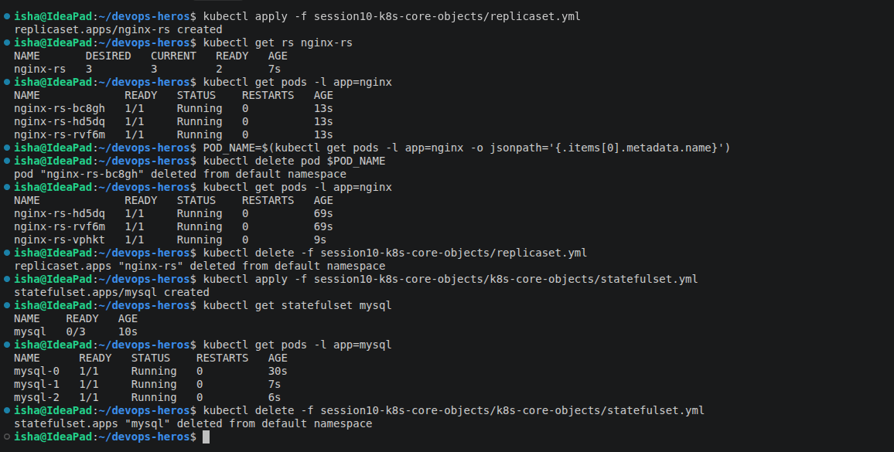

---

### Task 7: DaemonSet Architecture & Host Agent Deployment

- **Description:** Deploy a host agent DaemonSet (`node-exporter` or `node-agent-ds.yaml`), demonstrating that exactly one pod runs on each eligible cluster node.
- **Commands to Run:**
    
    ```bash
    # Deploy DaemonSet
    kubectl apply -f session10-k8s-core-objects/k8s-core-objects/deamonset.yml
    
    # Verify DaemonSet status
    kubectl get ds node-exporter
    
    # Inspect pod distribution across nodes
    kubectl get pods -l app=node-exporter -o wide
    kubectl delete -f session10-k8s-core-objects/k8s-core-objects/deamonset.yml
    ```
    
- **Screenshot**
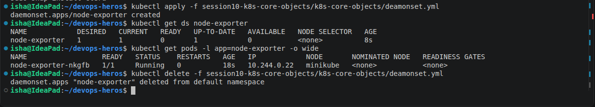    

---

### Task 8: Deployment Upgrades, Rolling Updates & Instant Rollbacks

- **Description:** Demonstrate declarative zero-downtime rolling updates using `maxSurge: 1` and `maxUnavailable: 0`, and execute an immediate rollback.
- **Commands to Run:**
    
    ```bash
    cd session10-k8s-core-objects/01-rolling-update/
    
    # 1. Deploy Version 1
    kubectl apply -f deployment-v1.yaml
    kubectl apply -f service.yaml
    kubectl rollout status deployment/app-rolling
    
    # 2. Trigger Rolling Update to Version 2
    kubectl apply -f deployment-v2.yaml
    
    # 3. Track rollout progress
    kubectl rollout status deployment/app-rolling
    kubectl get pods -l app=app-rolling --show-labels
    
    # 4. Check rollout history
    kubectl rollout history deployment/app-rolling
    
    # 5. Execute Rollback to previous revision
    kubectl rollout undo deployment/app-rolling
    kubectl rollout status deployment/app-rolling
    
    # Cleanup
    kubectl delete -f service.yaml -f deployment-v1.yaml
    ```
    
- **Screenshot**
    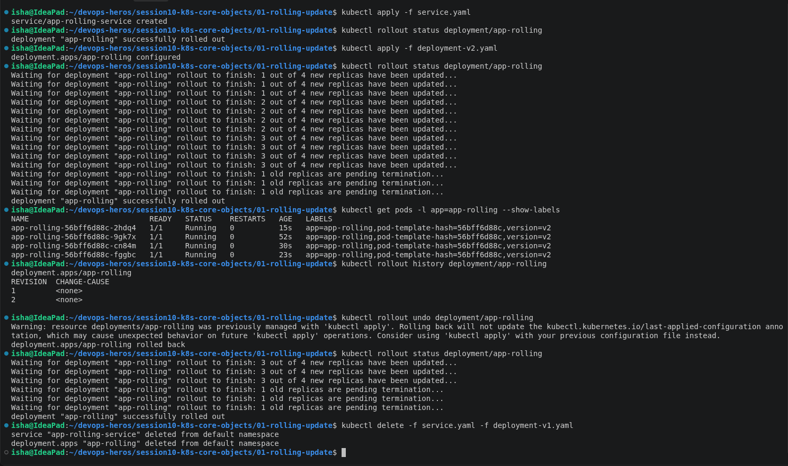

---

### Task 9: Real-World Troubleshooting Scenarios Lab (`troubleshooting/`)

- **Description:** Resolve an in-flight rollout failure caused by an unresolvable image tag, and debug an API server rejection caused by an immutable selector label mismatch.
- **Commands to Run:**
    
    #### Drill 1: Broken Image Rollout Failure
    
    ```bash
    cd session10-k8s-core-objects/troubleshooting/
    
    # Trigger broken deployment rollout
    kubectl apply -f broken-image.yaml
    
    # Notice rollout stalls because new pod cannot pull image
    kubectl rollout status deployment/yatri-backend --timeout=30s
    kubectl get pods -l app=yatri-backend
    
    # Recover by undoing the broken revision
    kubectl rollout undo deployment/yatri-backend
    kubectl delete -f broken-image.yaml
    ```
    
    #### Drill 2: Immutable Selector Mismatch Rejection
    
    ```bash
    # Attempt to apply invalid selector manifest
    kubectl apply -f selector-mismatch.yaml
    # Expected Error: The Deployment "selector-error-demo" is invalid:
    # spec.template.metadata.labels: Invalid value: ... doesn't match selector
    ```
    
    *Fix:* Edit `selector-mismatch.yaml` so `spec.template.metadata.labels.app` matches `spec.selector.matchLabels.app`, then re-apply successfully.
    
- **Screenshot**
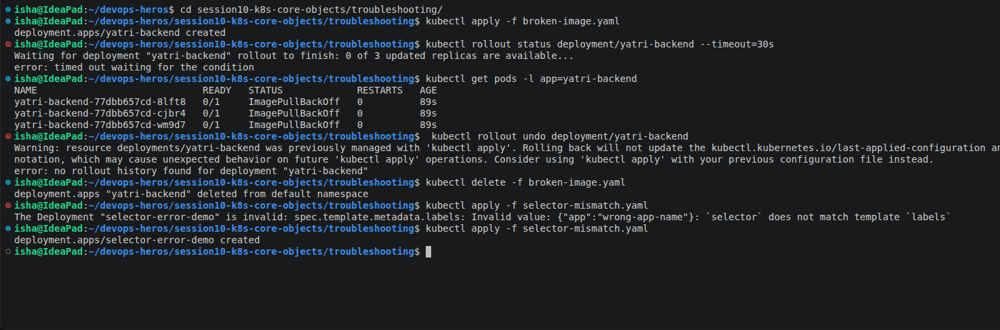
---

### Task 10: Theoretical & Architectural Conceptual Writeup

- **Description:** Provide technical writeups addressing core Kubernetes architectural interview questions directly in your `README.md`.


This task focuses on some of the Kubernetes concepts that are easy to mix up when working with Pods, Services, and Deployments.

The main topics covered are:

- Kubernetes ports
- Labels and selectors
- Deployment strategies
- `maxSurge` and `maxUnavailable`
- Resource requests and limits
- GB vs GiB

---

## 1. Understanding the Four Kubernetes Ports

There are four different ports that are commonly used when working with Kubernetes:

- `containerPort`
- `targetPort`
- `port`
- `nodePort`

Understanding the difference between them is important because each one belongs to a different part of the communication flow.

### containerPort

`containerPort` represents the port that the application inside the container is using.

For example:

```yaml
ports:
  - containerPort: 8080
```
  
Here, the application inside the container is expected to be listening on port 8080.

One important thing to note is that simply specifying containerPort does not expose the application outside the Pod. It mainly describes the port used by the container.

### targetPort

`targetPort` is the port on the Pod where the Kubernetes Service sends the traffic.

For example:

```yaml
port: 80
targetPort: 8080
```

In this case, a request sent to the Service on port 80 is forwarded to port 8080 on the selected Pod.

### port

`port` is the port exposed by the Kubernetes Service itself.

For example:

```yaml
port: 80
targetPort: 8080
```

The Service listens on port 80, while the actual application is running on port 8080 inside the Pod.

### nodePort

`nodePort` exposes a Service through a port on the Kubernetes nodes.

For example:

```yaml
type: NodePort

ports:
  - port: 80
    targetPort: 8080
    nodePort: 30080
```

The Service can then be accessed through:

<NodeIP>:30080

NodePort normally uses ports in the `30000-32767` range.

### Port Flow

A simple way to understand the relationship is:

```text
Client
    |
    | nodePort
    v
Kubernetes Node
    |
    | port
    v
Service
    |
    | targetPort
    v
Pod
    |
    | containerPort
    v
Application
```

## 2. Labels vs. Selectors

Labels and selectors are closely related, but they serve different purposes.

### Labels

Labels are key-value pairs attached to Kubernetes objects.

```yaml
labels:
    app: nginx
    environment: production
```

Labels provide information that can be used to identify and organize resources. A Pod could have labels such as:

```text
app=nginx
environment=production
```

### Selectors

Selectors find Kubernetes objects based on their labels.

```yaml
selector:
    matchLabels:
        app: nginx
```

This selector matches Pods that have the label `app=nginx`. Services also use selectors to decide which Pods should receive traffic.

### Labels and Selectors Together

For example:

```text
Pod 1 -> app=nginx
Pod 2 -> app=nginx
Pod 3 -> app=redis

             Service
                    |
                    | selector: app=nginx
                    |
            -------------
            |           |
        Pod 1       Pod 2
```

The Service ignores Pod 3 because its label does not match the selector.

| Term | Meaning |
| --- | --- |
| Label | Information attached to an object |
| Selector | Rule used to find matching objects |

Matching labels and selectors are important. If a Deployment selector does not match the labels in its Pod template, Kubernetes rejects the Deployment.

## 3. Deployment Strategies

Different deployment strategies can be used depending on how we want to introduce a new version of an application.

The four strategies covered here are:

- RollingUpdate
- Recreate
- Blue-Green
- Canary

### 3.1 RollingUpdate

A RollingUpdate gradually replaces the old version with the new version.

```text
v1  v1  v1  v1
v2  v1  v1  v1
v2  v2  v1  v1
v2  v2  v2  v1
v2  v2  v2  v2
```

The entire application does not have to be stopped at once.

### 3.2 Recreate

With the Recreate strategy, Kubernetes removes the existing version before starting the new version.

```text
v1  v1  v1
            |
     No Pods
            |
v2  v2  v2
```

There can be a period where the application has no running Pods. Recreate can therefore cause downtime, but it is useful when running both versions at the same time is not appropriate.

### 3.3 Blue-Green Deployment

In a Blue-Green deployment, two complete versions of the application are maintained:

- Blue: current version
- Green: new version

Initially, the Service can point to Blue. Once Green is ready, the Service selector can be changed to point to Green:

```text
User -> Service -> Blue
User -> Service -> Green
```

Both environments exist at the same time, and traffic is switched between them. Switching back is as simple as changing the Service selector again. The trade-off is that both environments require resources while they are running.

### 3.4 Canary Deployment

A Canary deployment introduces the new version to only a smaller part of the workload initially.

```text
Initial:  9 Pods -> v1, 1 Pod -> v2
Later:    7 Pods -> v1, 3 Pods -> v2
```

The Service can select both versions, allowing some traffic to reach the new version. If the new version behaves correctly, more Pods can gradually be added to it.

## 4. `maxSurge` vs. `maxUnavailable`

`maxSurge` and `maxUnavailable` are settings used by the RollingUpdate deployment strategy.

Suppose a Deployment has:

```yaml
replicas: 4
strategy:
    type: RollingUpdate
    rollingUpdate:
        maxSurge: 1
        maxUnavailable: 0
```

### `maxSurge`

`maxSurge` controls how many additional Pods can temporarily be created above the desired number of replicas.

```text
replicas = 4
maxSurge = 1
Maximum Pods = 4 + 1 = 5
```

### `maxUnavailable`

`maxUnavailable` controls how many Pods are allowed to be unavailable during the rollout.

```text
replicas = 4
maxUnavailable = 0
Minimum available = 4
```

This configuration aims to maintain the full desired capacity while the new version is being rolled out.

## 5. Resource Requests vs. Limits

Kubernetes allows us to specify CPU and memory requirements for containers.

### Resource Requests

A resource request tells Kubernetes how much CPU or memory the container needs when the scheduler decides where to place the Pod.

### Resource Limits

A resource limit defines the maximum amount of a resource that the container is allowed to use.

The complete configuration could look like this:

```yaml
resources:
    requests:
        cpu: "250m"
        memory: "128Mi"
    limits:
        cpu: "500m"
        memory: "256Mi"
```

In this example:

| Resource | Request | Limit |
| --- | --- | --- |
| CPU | `250m` | `500m` |
| Memory | `128Mi` | `256Mi` |

The scheduler uses requests when placing the Pod, while limits cap resource usage.

## 6. GB vs. GiB

GB and GiB are different units because one uses decimal measurement and the other uses binary measurement.

| Unit | Definition |
| --- | --- |
| GB | `1,000,000,000` bytes |
| GiB | $2^{30}$ bytes = `1,073,741,824` bytes |

Therefore, `1 GB` is not equal to `1 GiB`. Kubernetes commonly uses binary units such as `Mi` and `Gi`.

For example:

```yaml
memory: "512Mi"
```

This value is specified in mebibytes.

---

### Task 11: Blue-Green Deployment Execution & Instant Selector Cutover

- **Description:** Deploy the Blue and Green deployments side-by-side. Validate that traffic is initially 100% Blue, flip the Service label selector to point to Green, observe the instantaneous change in `Endpoints`, and execute an immediate rollback.

- **Commands to Run:**
    
    ```bash
    cd session10-k8s-core-objects/02-blue-green/
    
    # 1. Deploy both environments side-by-side (6 pods total)
    kubectl apply -f deployment-blue.yaml
    kubectl apply -f deployment-green.yaml
    
    # 2. Verify both Blue and Green pods are Running
    kubectl get pods -l app=myapp --show-labels
    
    # 3. Route live traffic to Blue (v1)
    kubectl apply -f service-blue.yaml
    kubectl describe svc myapp-service | grep Selector
    kubectl get endpoints myapp-service
    
    # 4. Test live traffic — verify Blue responds
    curl http://192.168.49.2:30020
    
    # 5. THE SWITCH: Flip traffic to Green (v2) instantly
    kubectl apply -f service-green.yaml
    
    # 6. Verify selector and endpoints updated immediately to Green pods
    kubectl describe svc myapp-service | grep Selector
    kubectl get endpoints myapp-service
    
    # 7. Test live traffic — verify Green now responds
    curl http://192.168.49.2:30020

    # 8. Instant Rollback: Flip selector back to Blue
    kubectl apply -f service-blue.yaml
    curl http://192.168.49.2:30020    
    # Cleanup
    kubectl delete -f service-blue.yaml -f deployment-blue.yaml -f deployment-green.yaml
    ```
    
- **Screenshot**
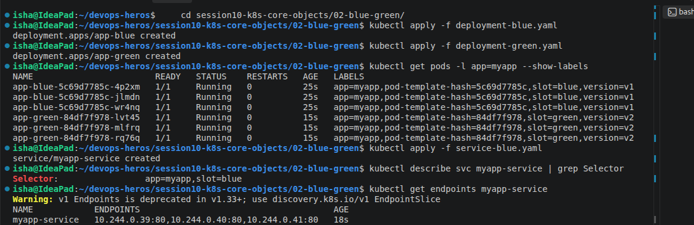
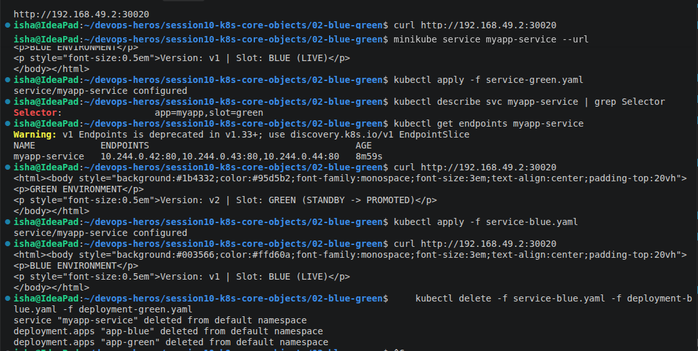
  
---

### Task 12: Canary Deployment Execution & Pod-Ratio Traffic Splitting

- **Description:** Deploy a 9-replica stable deployment and a 1-replica canary deployment under the same Service. Run a curl loop to capture the approximate 10% canary traffic ratio, scale the canary to increase traffic share, and execute a rollback by scaling the canary to zero.

- **Commands to Run:**
    
    ```bash
    cd session10-k8s-core-objects/03-canary/
    
    # 1. Deploy Stable baseline (9 pods = 90%) and Service
    kubectl apply -f deployment-stable.yaml
    kubectl apply -f service.yaml
    kubectl rollout status deployment/app-stable
    
    # 2. Deploy Canary release (1 pod = 10%)
    kubectl apply -f deployment-canary.yaml
    kubectl rollout status deployment/app-canary
    
    # 3. Verify total pool has 10 pods (9 stable + 1 canary)
    kubectl get pods -l app=myapp-canary --show-labels
    
    # 4. Verify the Service endpoints list contains all 10 pod IPs
    kubectl get endpoints myapp-canary-service
    
    # 5. Run traffic test loop (20 requests) to verify ~10% canary hits
    for i in $(seq 1 20); do curl -s <http://localhost:30030> | grep -o "STABLE v1\|CANARY v2"; done
    # (On Minikube use: curl -s <http://$>(minikube ip):30030 | grep -o "STABLE v1\|CANARY v2")
    
    # 6. Increase Canary traffic to 30% (scale canary to 3, stable to 7)
    kubectl scale deployment app-canary --replicas=3
    kubectl scale deployment app-stable --replicas=7
    kubectl get endpoints myapp-canary-service
    
    # 7. Rollback: Abort canary release by scaling canary to 0
    kubectl scale deployment app-canary --replicas=0
    kubectl scale deployment app-stable --replicas=9
    
    # Verify 100% of traffic is returned to stable
    for i in $(seq 1 5); do curl -s <http://localhost:30030> | grep -o "STABLE v1\|CANARY v2"; done
    
    # Cleanup
    kubectl delete -f service.yaml -f deployment-canary.yaml -f deployment-stable.yaml
    ```
    
- **Screenshot**
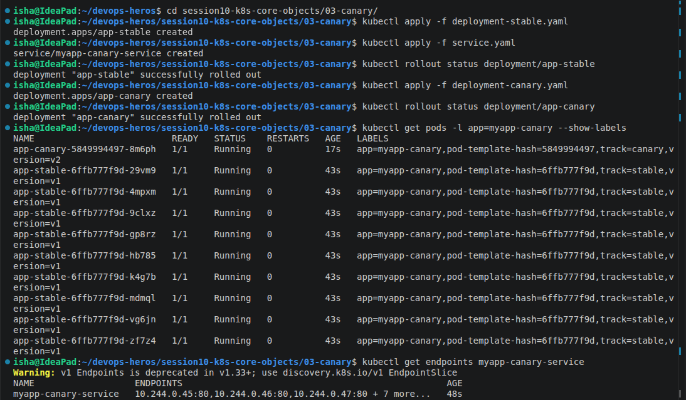
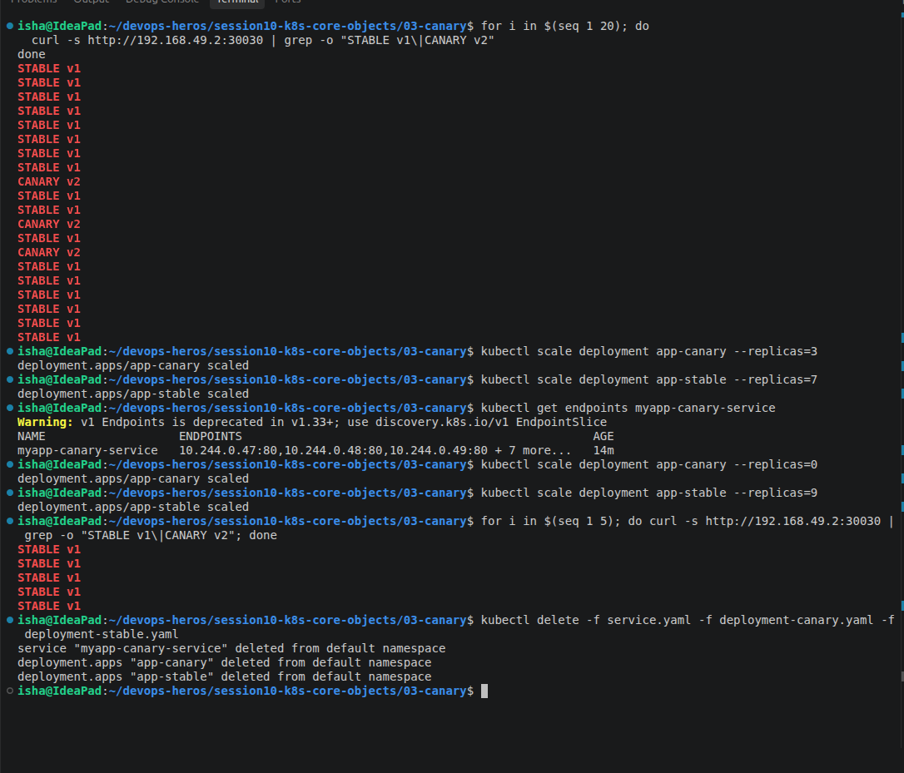

---

### Task 13: Recreate Deployment Execution & Downtime Outage Demonstration

- **Description:** Deploy an application with `strategy.type: Recreate`. Stream live requests during an update to observe and capture the intentional downtime window where 0 pods exist between v1 termination and v2 creation.

- **Commands to Run:**
    
    ```bash
    cd session10-k8s-core-objects/04-recreate/
    
    # 1. Deploy Version 1 and NodePort Service
    kubectl apply -f deployment-v1.yaml
    kubectl apply -f service.yaml
    kubectl rollout status deployment/app-recreate
    
    # 2. Verify 3 v1 pods are running
    kubectl get pods -l app=app-recreate
    
    # 3. Open Terminal 1 to watch pod state changes in real time
    kubectl get pods -l app=app-recreate -w
    
    # 4. Open Terminal 2 and start a continuous curl polling loop
    while true; do curl -s --connect-timeout 1 <http://localhost:30040> | grep -o 'VERSION: [^<]*' || echo "[OUTAGE] Connection refused / 0 pods alive"; sleep 0.5; done
    # (On Minikube use port 30040 with $(minikube ip))
    
    # 5. In Terminal 3: Trigger the Recreate update to v2
    kubectl apply -f deployment-v2.yaml
    
    # 6. Observe the curl loop output in Terminal 2 switch from v1 -> [OUTAGE] -> v2
    
    # 7. Check rollout history and test rollback
    kubectl rollout history deployment/app-recreate
    kubectl rollout undo deployment/app-recreate
    kubectl rollout status deployment/app-recreate
    
    # Cleanup
    kubectl delete -f service.yaml -f deployment-v2.yaml
    ```
    
- **Screenshot**
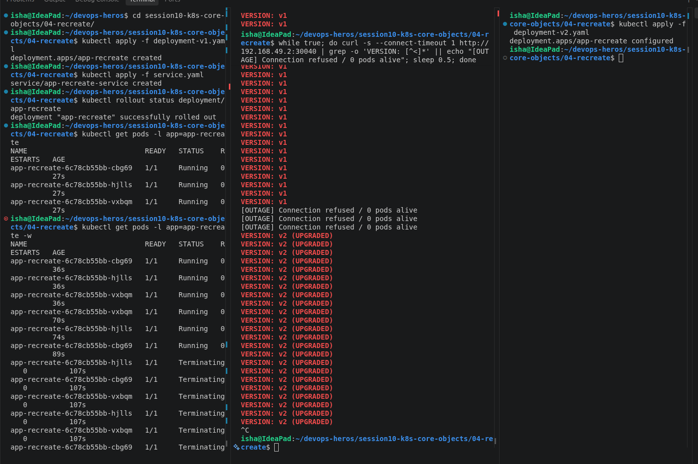
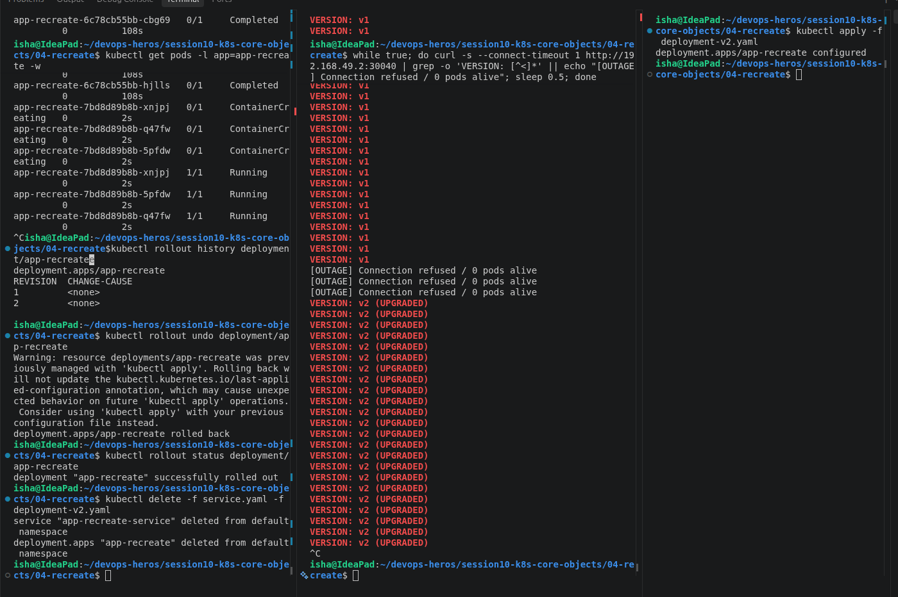
---
