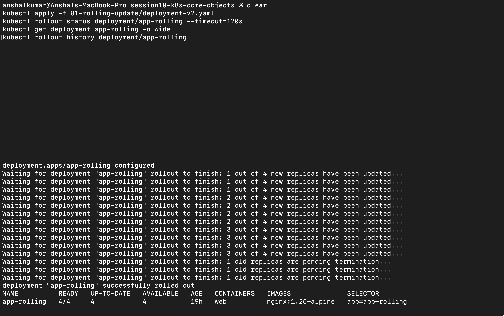
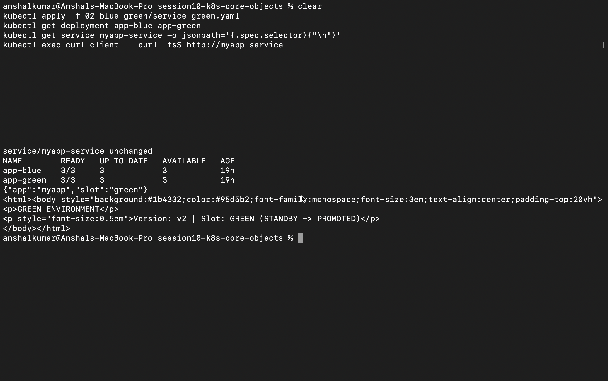
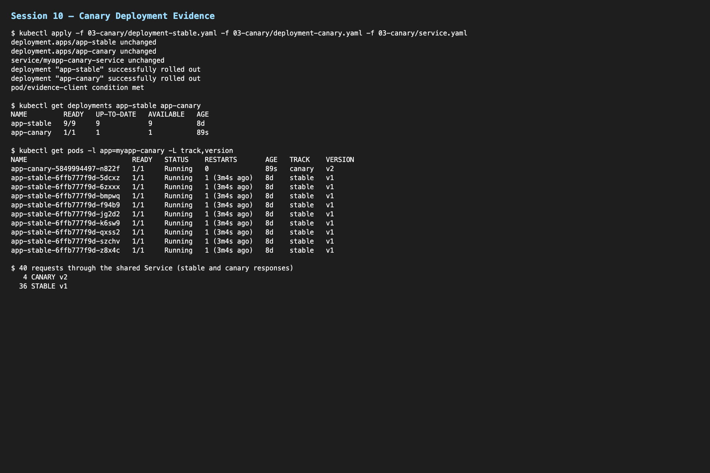
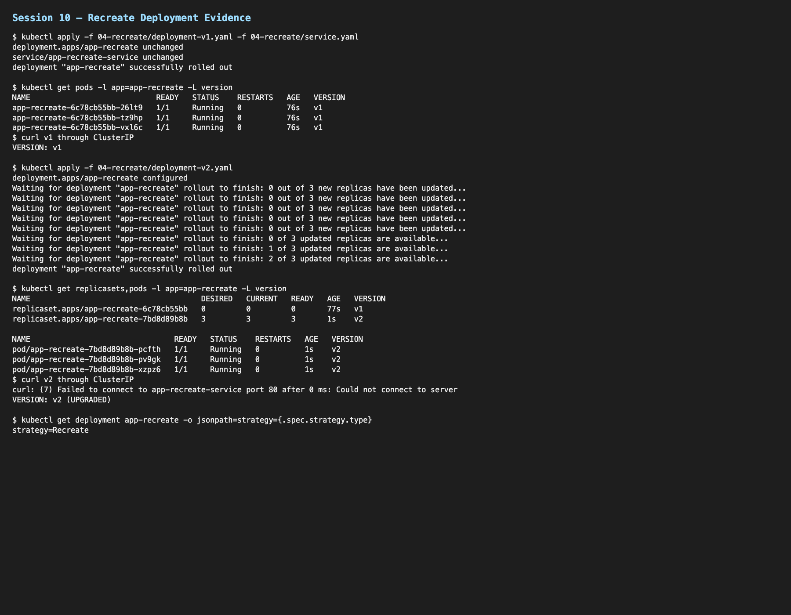
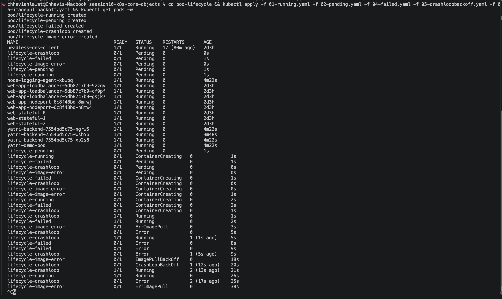

# Session 10 - Kubernetes Workloads and Deployment Strategies

I used Minikube to run the four deployment strategies from the assignment. Each strategy has its own folder with the YAML and commands I used.

| Exercise | Files | What I observed |
|---|---|---|
| Rolling update | [`01-rolling-update/`](01-rolling-update/) | Kubernetes replaced four Pods gradually and kept the Deployment available. [Screenshot](screenshots/rolling-update.png) |
| Blue-green | [`02-blue-green/`](02-blue-green/) | Both versions ran together. Changing the Service selector from blue to green switched the response. [Screenshot](screenshots/blue-green-routing.png) |
| Canary | [`03-canary/`](03-canary/) | I ran nine stable Pods and one canary Pod behind one Service. Out of 40 requests, 36 reached v1 and 4 reached v2. [Screenshot](screenshots/canary-deployment.png) |
| Recreate | [`04-recreate/`](04-recreate/) | The old ReplicaSet went to zero before the three v2 Pods started. [Screenshot](screenshots/recreate-deployment.png) |

The canary result was close to the intended 90/10 split. It also showed me that this method distributes requests approximately; a small sample will not always be exactly 90/10.

The Recreate test briefly returned a connection failure while the old Pods were gone and the new Pods were starting. That was expected and made the downtime difference from RollingUpdate clear.

I also ran the examples in [`pod-lifecycle/`](pod-lifecycle/). They covered Running, Pending, Completed, Error, ImagePullBackOff, init-container, and multi-container Pods. The combined result is in [`pod-lifecycle.png`](screenshots/pod-lifecycle.png).

The additional core object examples are in [`k8s-core-objects/`](k8s-core-objects/).

## Screenshots from my run

The following screenshots show the actual rollout and routing results for each strategy.

### Rolling update

### Blue-green switch

### Canary traffic

### Recreate strategy

### Pod lifecycle examples

