# Session 10 — Kubernetes Deployment Strategies

## 1. Rolling Update

Deploy `v1`, then roll out `v2` pod-by-pod with zero downtime, and roll back with
`kubectl rollout undo`.

**Deploying v1 and exposing the Service**

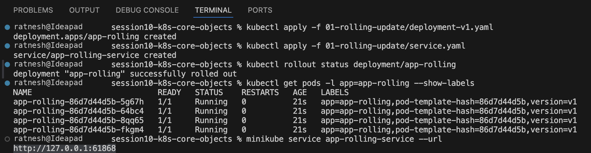

**v1 serving traffic in the browser**

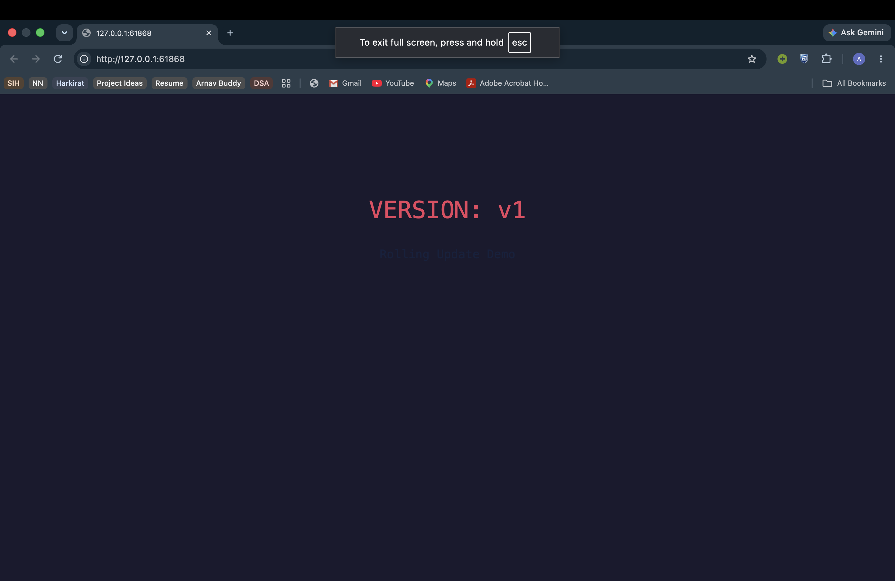

**Rolling out v2, checking history and rolling back**

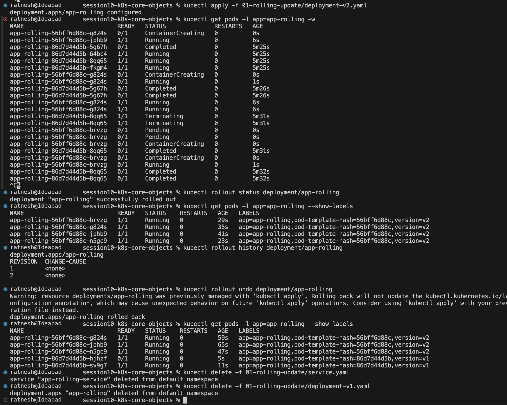

## 2. Blue-Green

Run `blue` (v1) and `green` (v2) side by side and switch traffic by changing the
Service selector from `slot=blue` to `slot=green`.

**Both environments running and the Service selector switch**

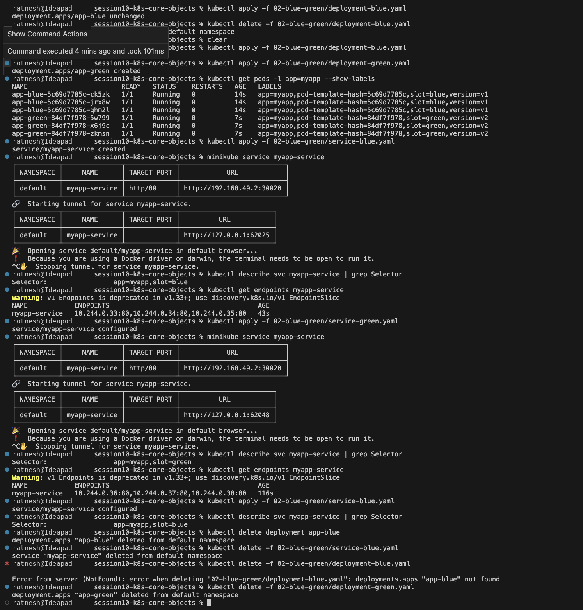

**Blue environment (live)**

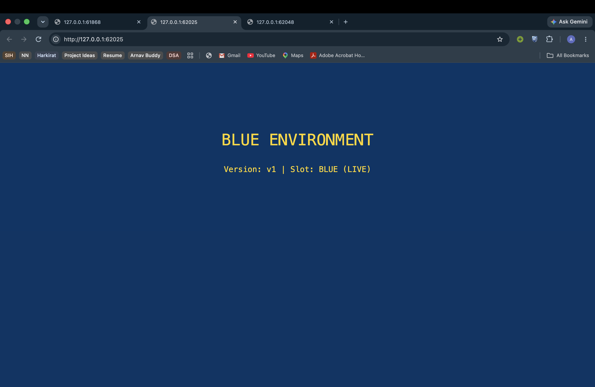

**Green environment (after promotion)**

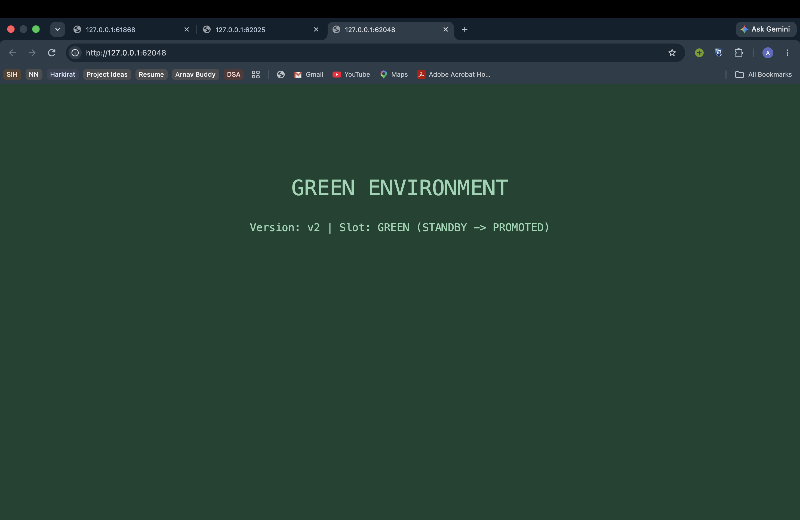

## 3. Canary

Send a small share of traffic to `v2` by scaling the canary Deployment up and the
stable Deployment down behind a single Service.

**Canary rollout and progressive scaling**

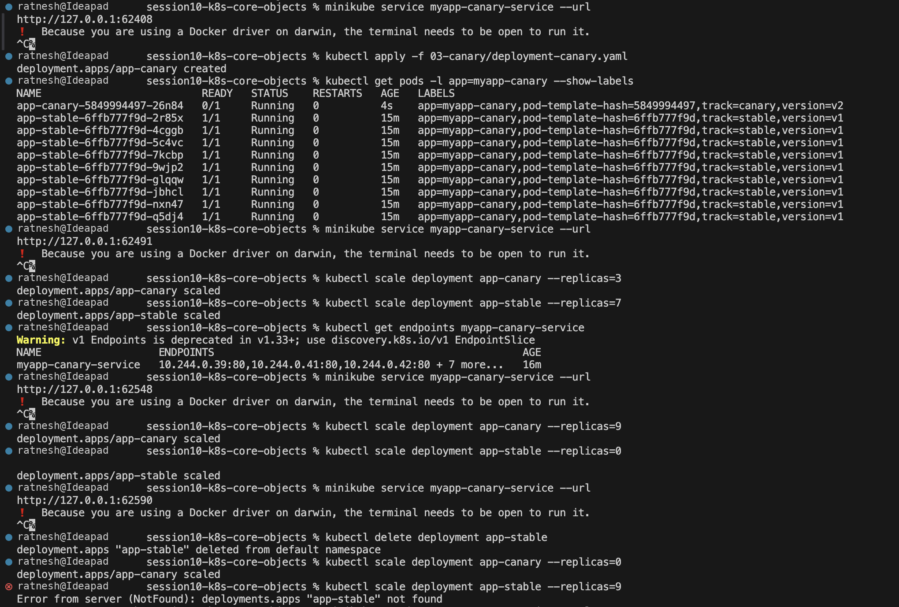

## 4. Recreate

Terminate every old pod before any new pod starts — simple, but with downtime
during the switch.

**All v1 pods terminated before v2 pods are created**

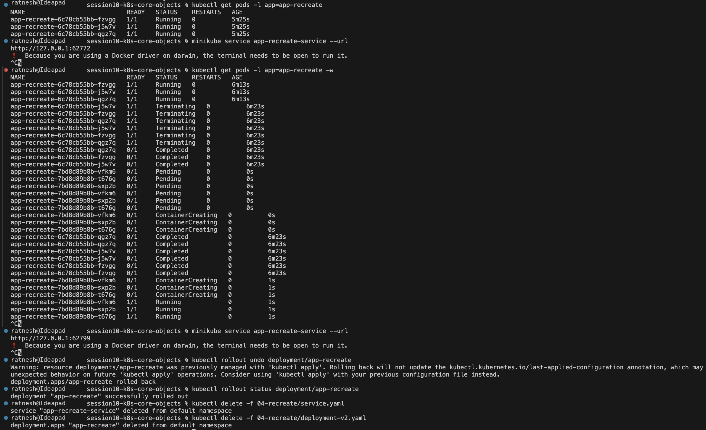

**Applying the v2 manifest**

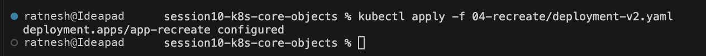

**Before the update (v1)**

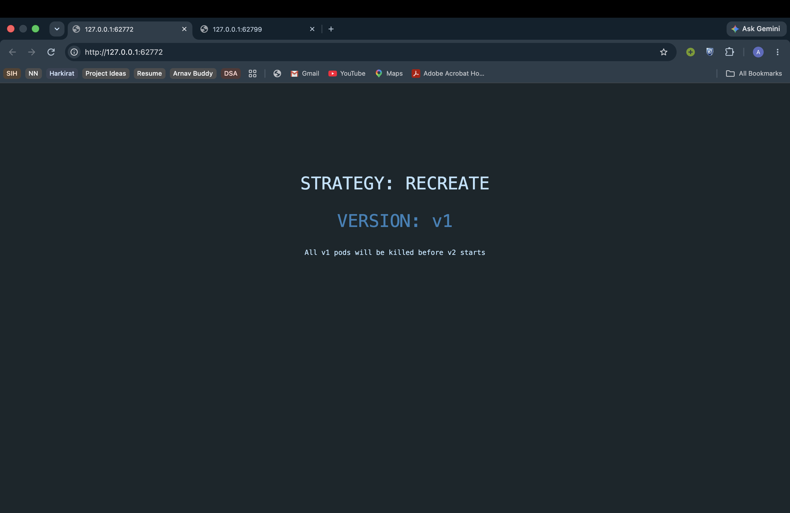

**After the update (v2)**

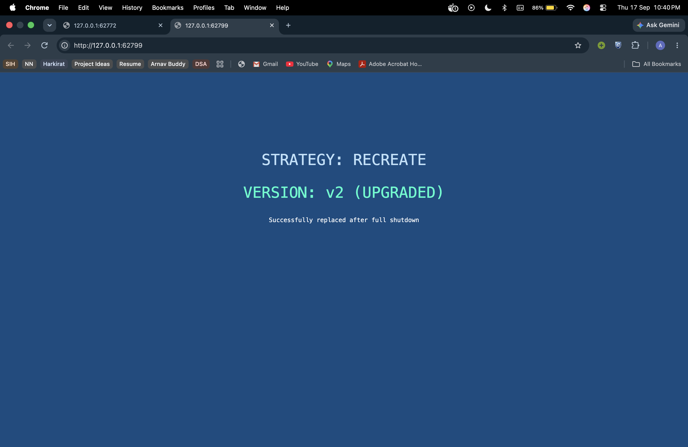
