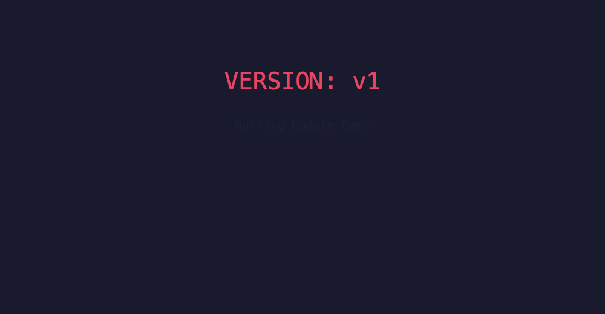
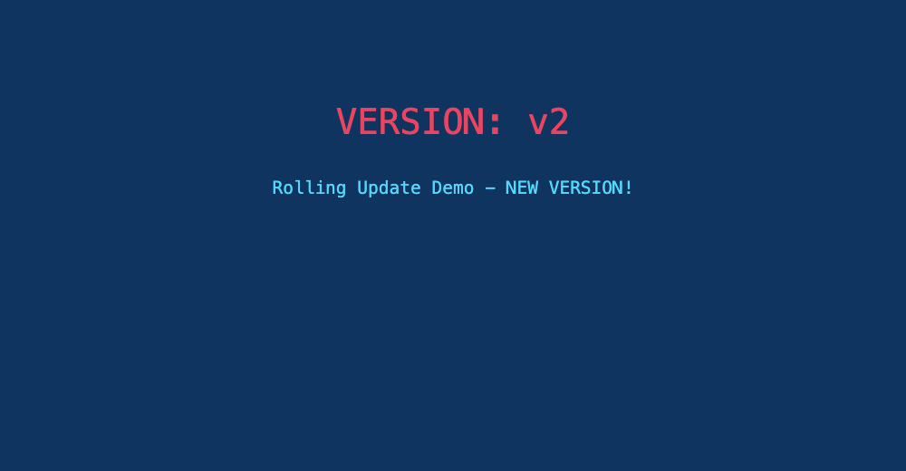
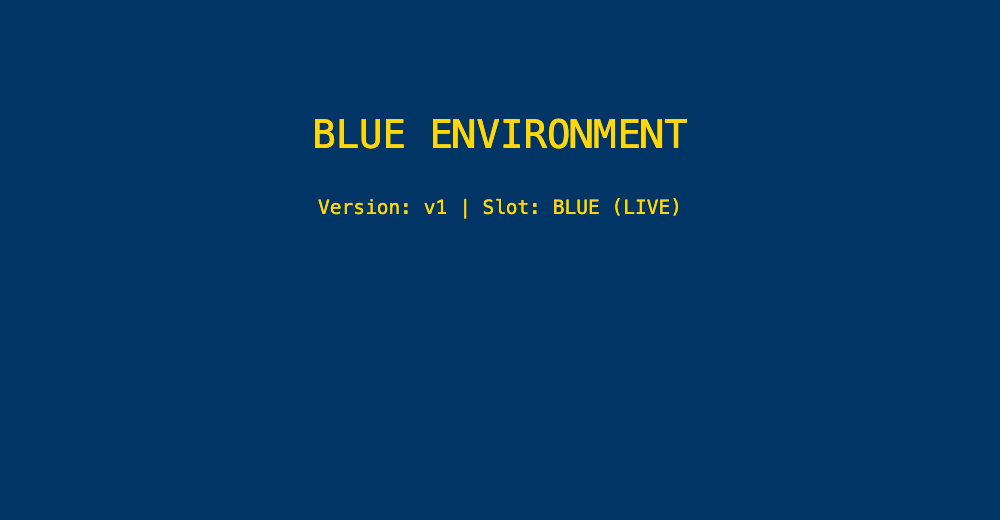
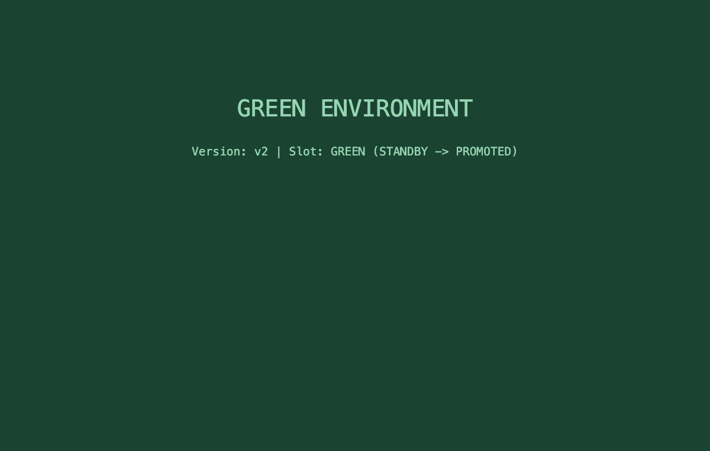
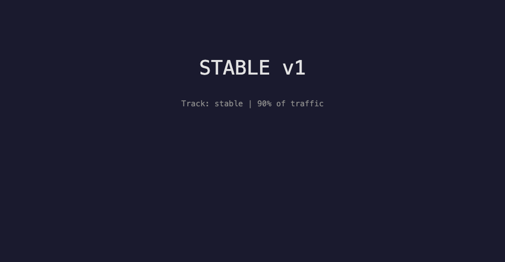
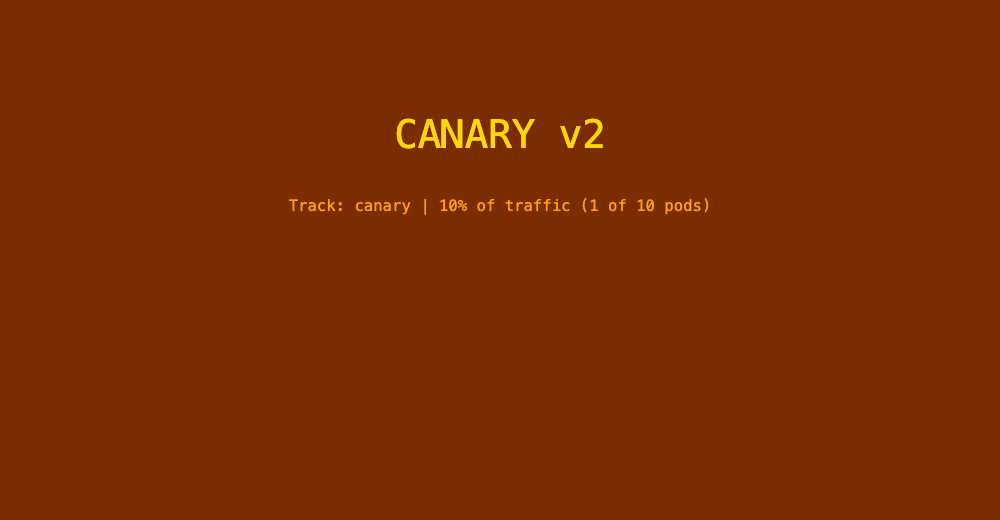
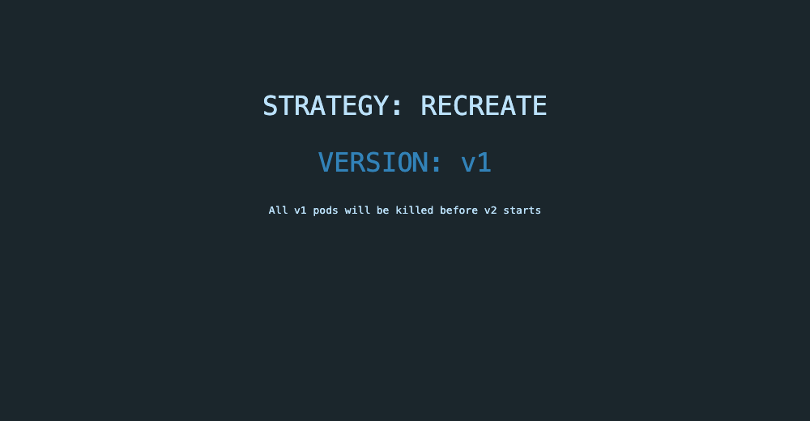
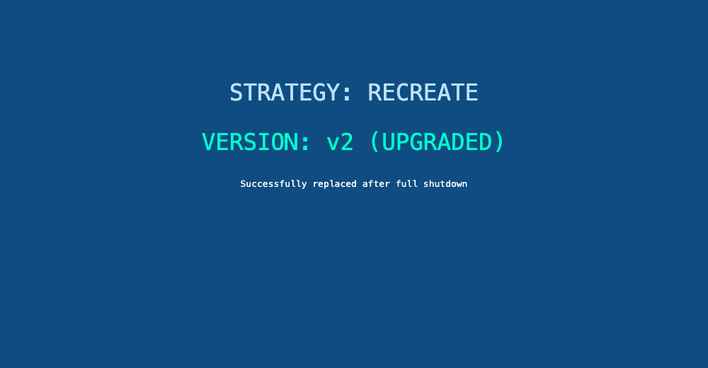

# Session 10 – Kubernetes Core Objects, Pod Lifecycle & Deployment Strategies

**Name:** Kushal Talati  
**Enrollment No:** 24BCS10123  
**Environment:** kind v0.33.0 cluster `kushal-lab` (Kubernetes v1.37.0, 1 control-plane + 2 workers) on Docker Desktop 29.0.1, macOS / Apple Silicon (arm64). Same cluster as [session 9](../../session9-k8s/kushal-24bcs10123); NodePorts 30010–30040 are published to `localhost`, so `curl http://localhost:30010` plays the role of `curl http://$(minikube ip):30010`.

All manifests are the professor's, used **unmodified** (`kubectl apply -f 01-rolling-update/...` exactly as in the course READMEs). Every command was really run; raw output is in [`logs/`](logs), the exact commands in [`scripts/`](scripts), browser screenshots in [`screenshots/`](screenshots).

```text
kushal-24bcs10123/
├── README.md
├── scripts/
│   ├── 01-core-objects.sh      # Pod, ReplicaSet, Deployment (+ broken rollout), DaemonSet, StatefulSet
│   ├── 02-pod-lifecycle.sh     # the 12 pod-lifecycle situations, watched live
│   ├── 03-rolling-update.sh    # 01-rolling-update   (deploy | update | rollback | cleanup)
│   ├── 04-blue-green.sh        # 02-blue-green       (deploy | switch | rollback | cleanup)
│   ├── 05-canary.sh            # 03-canary           (deploy | canary | increase | promote | cleanup)
│   ├── 06-recreate.sh          # 04-recreate         (deploy | update | rollback | cleanup)
│   └── lib.sh
├── logs/                       # raw output; *-watch.txt = `kubectl get pods -w` during the step, *-curl.txt = request loops
└── screenshots/                # the NodePort pages in the browser before/after each switch
```

## 1. Core objects

Log: [logs/01-core-objects.txt](logs/01-core-objects.txt)

### Pod

```text
$ kubectl apply -f pod/nginx-pod.yaml
$ kubectl get pod yatri-demo-pod -o wide --show-labels
NAME             READY   STATUS    IP            NODE               LABELS
yatri-demo-pod   1/1     Running   10.244.3.79   kushal-lab-worker  app=yatri-demo,tier=frontend

$ kubectl apply -f hello.yml                  # restartPolicy: Never -> runs once
$ kubectl get pod hello-pod
NAME        READY   STATUS      RESTARTS   AGE
hello-pod   0/1     Completed   0          6s
$ kubectl logs hello-pod
Hello Kubernetes

$ kubectl apply -f k8s-core-objects/pod.yml   # nginx + busybox logger in ONE pod
$ kubectl exec mypod -c logger -- wget -qO- http://localhost | grep -o '<title>.*</title>'
<title>Welcome to nginx!</title>            <- containers of a pod share the network namespace: localhost is the same
```

### ReplicaSet – keeps N pods alive, nothing more

```text
$ kubectl apply -f replicaset/backend-rs.yaml
$ kubectl delete pod yatri-backend-rs-jzxbq            # kill one on purpose
$ kubectl get pods -l app=yatri-backend
NAME                     READY   STATUS    AGE
yatri-backend-rs-p2hxh   1/1     Running   41s
yatri-backend-rs-scdcs   1/1     Running   38s      <- replacement, created the same second (see 01-replicaset-selfheal-watch.txt)
yatri-backend-rs-wwhld   1/1     Running   41s

$ kubectl scale rs yatri-backend-rs --replicas=5   -> DESIRED 5 CURRENT 5 READY 5
$ kubectl scale rs yatri-backend-rs --replicas=3   -> back to 3

$ kubectl patch rs yatri-backend-rs ... image -> python:3.11-alpine3.19
$ kubectl get pods -l app=yatri-backend -o custom-columns='NAME:.metadata.name,IMAGE:.spec.containers[0].image'
yatri-backend-rs-2pqrb   python:3.11-alpine      <- template changed, existing pods did NOT: a ReplicaSet has no rollout logic
...
```

Side note seen in the watch log: the deleted pod shows `Terminating` for 30 s and then `Error`, because `python3 -c ...` is PID 1 in the container and ignores SIGTERM, so it gets SIGKILL at the end of the grace period.

### Deployment – ReplicaSets with history

```text
$ kubectl apply -f deployment/deployment-v1.yaml && kubectl apply -f deployment/deployment-v2.yaml
$ kubectl get rs -l app=yatri-backend
NAME                       DESIRED   CURRENT   READY
yatri-backend-7554bd5c75   0         0         0        <- v1 RS kept (empty) for rollback
yatri-backend-cbc55c649    3         3         3        <- v2

$ kubectl apply -f troubleshooting/broken-image.yaml   # image tag that does not exist
$ kubectl get pods -l app=yatri-backend
yatri-backend-77dbb657cd-cp56m   0/1     ImagePullBackOff     <- the one surge pod
yatri-backend-cbc55c649-2ld2d    1/1     Running              <- all 3 v2 pods still serving (maxUnavailable: 0)
yatri-backend-cbc55c649-f8m9n    1/1     Running
yatri-backend-cbc55c649-h7d5c    1/1     Running
$ kubectl get deployment yatri-backend
NAME            READY   UP-TO-DATE   AVAILABLE
yatri-backend   3/3     1            3

$ kubectl rollout undo deployment/yatri-backend        -> back on version=2.0.0, broken RS scaled to 0

$ kubectl apply -f troubleshooting/selector-mismatch.yaml
The Deployment "selector-error-demo" is invalid: spec.template.metadata.labels: Invalid value: {"app":"wrong-app-name"}: `selector` does not match template `labels`
```

### DaemonSet – one pod per node

```text
$ kubectl apply -f daemonset/node-agent-ds.yaml
$ kubectl get pods -l app=node-logging-agent -o wide
node-logging-agent-hkzmc   1/1   Running   kushal-lab-worker
node-logging-agent-sb5h7   1/1   Running   kushal-lab-worker2        <- 2 pods for 3 nodes ...
$ kubectl describe node kushal-lab-control-plane | grep -A1 '^Taints'
Taints:  node-role.kubernetes.io/control-plane:NoSchedule            <- ... because of this taint
$ kubectl get daemonset -n kube-system
kindnet      3  3  3     kube-proxy   3  3  3                          <- system DaemonSets tolerate it, so they get 3
```

### StatefulSet – stable names, ordered start, one PVC each

The course manifest uses `mysql:5.7`, which has **no arm64 image**, so on this Apple-Silicon cluster `mysql-0` went to `ImagePullBackOff` (`no match for platform in manifest`). I kept the file unchanged and switched the running object to the multi-arch `mysql:8.0` with `kubectl set image`.

```text
$ kubectl apply -f k8s-core-objects/statefulset.yml
$ kubectl set image statefulset/mysql mysql=mysql:8.0

# 01-statefulset-ordered-watch.txt: strictly one after the other
mysql-0   1/1   Running
mysql-1   0/1   Pending   ->  ContainerCreating  ->  Running
mysql-2   0/1   Pending   ->  ContainerCreating  ->  Running

$ kubectl get pvc
mysql-persistent-storage-mysql-0   Bound   5Gi   RWO   standard     <- volumeClaimTemplates: one PVC per pod
mysql-persistent-storage-mysql-1   Bound   5Gi   RWO   standard
mysql-persistent-storage-mysql-2   Bound   5Gi   RWO   standard

$ kubectl create service clusterip mysql --clusterip=None --tcp=3306   # the headless service `serviceName: mysql` refers to
$ nslookup mysql-1.mysql.default.svc.cluster.local  -> Address: 10.244.3.92   (per-pod DNS name)
$ nslookup mysql | grep -c 'Address: 10.244'         -> 3                       (headless: pod IPs, no VIP)

$ kubectl delete pod mysql-1 && sleep 25 && kubectl get pods -l app=mysql
mysql-1   1/1   Running   25s                     <- same name, same PVC, re-attached
$ kubectl exec mysql-1 -- mysql -uroot -ppassword -e 'SELECT VERSION();'
8.0.46

$ kubectl delete statefulset mysql; kubectl get pvc   -> the 3 PVCs are still there (deliberate: data outlives the pods)
```

## 2. Pod lifecycle – all 12 situations

Log: [logs/02-pod-lifecycle.txt](logs/02-pod-lifecycle.txt) · live watch during the whole run: [logs/02-pod-lifecycle-watch.txt](logs/02-pod-lifecycle-watch.txt)

The script applies `pod-lifecycle/01..12` one after the other with `kubectl get pods -w` running in the background, then inspects each pod with `get`, `describe`, `logs` and a jsonpath that prints the **official phase** and the **container state**, because the `STATUS` column is neither.

| # | Manifest | `STATUS` column | Phase | What actually happened |
|---|---|---|---|---|
| 1 | `01-running` | `Running 1/1` | Running | container state `running` |
| 2 | `02-pending` | `Running` (!) | Running | asks for 9Gi; my kind nodes report 16Gi allocatable, so it **did** schedule. Re-applied through `sed 's/9Gi/900Gi/'` → `Pending`, event `0/3 nodes are available: 1 node(s) had untolerated taint(s), 2 Insufficient memory` |
| 3 | `03-succeeded` | `Completed` | Succeeded | `exit 0`, `restartPolicy: Never` |
| 4 | `04-failed` | `Error` | Failed | `exit 1`, terminated `exitCode: 1` |
| 5 | `05-crashloopbackoff` | `Error` / `CrashLoopBackOff` | **Running** | exits 1 every 3 s, restarted with growing back-off (`Restart Count: 3` after 75 s, `Back-off restarting failed container`) – the *pod* phase stays Running |
| 6 | `06-imagepullbackoff` | `ErrImagePull` → `ImagePullBackOff` | **Pending** | `pull access denied, repository does not exist`; container state `waiting` |
| 7 | `07-readiness` | `Running 0/1` → `1/1` | Running | container ran from second 0, `READY` flipped only after the http probe passed (`delay=5s`) – Running ≠ Ready |
| 8 | `08-liveness` | `Running`, `RESTARTS 1` | Running | app deletes `/tmp/healthy` after 20 s → `Liveness probe failed` ×2 → `Killing … will be restarted`, `RESTARTS 1` after 60 s, last state `Error exit 137`; the pod itself was never rescheduled |
| 9 | `09-startup` | `Running 0/1` for ~30 s → `1/1` | Running | startup probe (`failureThreshold 10 × 5 s`) protects the slow start; without it a liveness probe would have killed it |
| 10 | `10-init-container` | `Init:0/1` → `Running` | Pending → Running | `setup` ran 10 s (`Init container running / Init complete`) before nginx started |
| 11 | `11-multi-container` | `Running 2/2` | Running | two containers, one pod, separate logs (`-c app`, `-c sidecar`) |
| 12 | `12-termination` | `Terminating` | Running → gone | `kubectl delete` returned after **11 s**: the trap printed `SIGTERM received; cleaning up...` / `Cleanup complete`, well inside `terminationGracePeriodSeconds: 20` |

```text
$ kubectl get pods -o custom-columns='NAME:.metadata.name,PHASE:.status.phase,READY:...,RESTARTS:...,WAITING_REASON:...'
NAME                        PHASE       READY    RESTARTS   WAITING_REASON
lifecycle-crashloop         Running     False    5          <none>          <- STATUS says CrashLoopBackOff, phase says Running
lifecycle-failed            Failed      False    0          <none>
lifecycle-image-error       Pending     False    0          ImagePullBackOff
lifecycle-pending-900gi     Pending     <none>   <none>     <none>          <- never scheduled: no containerStatuses at all
lifecycle-succeeded         Succeeded   False    0          <none>
lifecycle-liveness          Running     True     2          <none>          <- restarted in place (last exit code 137 = SIGKILL by the kubelet)
```

The three commands that answered every "why?" in this lab were `kubectl get pod`, `kubectl describe pod` (Events at the bottom) and `kubectl logs` (with `-c` for a specific container).

## 3. Deployment strategies

Each strategy was run with the course manifests, with `kubectl get pods -w` recording pod churn to `logs/0X-*-watch.txt` and a curl loop hammering the NodePort from the Mac to `logs/0X-*-curl.txt`, so the "zero downtime" / "downtime" claims are measured, not assumed.

| Strategy | Requests during the switch | Failed | Pods during the switch | Rollback |
|---|---|---|---|---|
| Rolling update (`maxSurge 1`, `maxUnavailable 0`) | 80 × 0.5 s: 29 × v1, 50 × v2 | **1** | never fewer than 4 ready, briefly 5 | `kubectl rollout undo` → v1, revision 3 |
| Blue-green (Service selector flip) | 20 × 0.3 s: 4 × blue, 16 × green | 0 | 6 pods the whole time, nothing restarted | re-apply `service-blue.yaml` |
| Canary (pod-count ratio) | 100: 13 canary / 87 stable at 1:9 · 31 / 69 at 3:7 | 0 | 10 pods | scale canary to 0 |
| Recreate | 60 × 0.5 s: 1 × v1, **33 × no response**, 26 × v2 | **33 (~16 s outage)** | 0 pods for the gap | `rollout undo` = another full stop/start |

### 3.1 Rolling update – `01-rolling-update/`

Log: [logs/03-rolling-update.txt](logs/03-rolling-update.txt) · watch: [03-rolling-watch.txt](logs/03-rolling-watch.txt) · curl loop: [03-rolling-curl.txt](logs/03-rolling-curl.txt)

```text
$ kubectl apply -f 01-rolling-update/deployment-v2.yaml
$ sleep 4; kubectl get pods -l app=app-rolling            # mid-rollout: 4 desired + 1 surge = 5 pods
app-rolling-56bff6d88c-gddm2   0/1     Running   4s      <- v2 surge pod, not Ready yet (readinessProbe delay 3s)
app-rolling-86d7d44d5b-4sqs4   1/1     Running   46s     <- 4 x v1 still serving
...
```

The watch log shows the pattern the README promised, one pod at a time: **v2 pod Pending → ContainerCreating → Running 0/1 → Running 1/1**, only *then* **one v1 pod Terminating**, repeat four times. The curl loop meanwhile flipped back and forth between versions while both were live, then settled on v2:

```text
$ cat logs/03-rolling-curl.txt | uniq -c
  13 VERSION: v1
   1 VERSION: v2         <- first v2 pod ready
   1 VERSION: v1
   ...
   5 VERSION: v2
$ sort logs/03-rolling-curl.txt | uniq -c
   1 FAIL (no response)
  29 VERSION: v1
  50 VERSION: v2
```

Honest finding: 1 request out of 80 got no response. `maxUnavailable: 0` guarantees the *pod count* never drops, but a pod that is `Terminating` can still be in the NodePort's iptables table for a moment and nginx closes its connections on SIGTERM. Real zero-error rollouts add a `preStop` sleep or a graceful shutdown in the app – a good interview follow-up to this lab.

Rollback is one command and is itself a rolling update in reverse (revision 3 = the old v1 template):

```text
$ kubectl rollout undo deployment/app-rolling && kubectl rollout status deployment/app-rolling
$ curl -s http://localhost:30010 | grep -o 'VERSION: v[0-9]'
VERSION: v1
$ kubectl rollout history deployment/app-rolling
REVISION  CHANGE-CAUSE
2         <none>
3         <none>
```

| before | after |
|---|---|
|  |  |

### 3.2 Blue-green – `02-blue-green/`

Log: [logs/04-blue-green.txt](logs/04-blue-green.txt) · curl loop: [04-blue-green-curl.txt](logs/04-blue-green-curl.txt)

Both environments run at the same time (6 pods, 2× the resources); only the Service's selector decides who is live:

```text
$ kubectl describe svc myapp-service | grep Selector
Selector:                 app=myapp,slot=blue
$ kubectl get endpointslices -l kubernetes.io/service-name=myapp-service -o jsonpath=...
10.244.3.133 app-blue-5c69d7785c-mhbwd
10.244.1.112 app-blue-5c69d7785c-ngp6m
10.244.3.132 app-blue-5c69d7785c-w6dnx

$ kubectl apply -f 02-blue-green/service-green.yaml          # THE SWITCH
service/myapp-service configured
Selector:                 app=myapp,slot=green
10.244.3.135 app-green-84df7f978-m56kr
10.244.3.134 app-green-84df7f978-hkf4g
10.244.1.113 app-green-84df7f978-99xvd

$ cat logs/04-blue-green-curl.txt | uniq -c        # 20 requests 0.3 s apart across the switch
   4 BLUE ENVIRONMENT
  16 GREEN ENVIRONMENT                              <- no mixed period, no failure: one request blue, the next green
```

`kubectl get pods --show-labels` afterwards shows all six pods with their original `AGE`: nothing was restarted, the pods never knew. Rollback (`service-blue.yaml` again) took the same one command.

| blue live | green live |
|---|---|
|  |  |

### 3.3 Canary – `03-canary/`

Log: [logs/05-canary.txt](logs/05-canary.txt)

One Service selects **both** Deployments through the shared label `app=myapp-canary`; the split is purely the pod ratio.

```text
$ kubectl get svc myapp-canary-service -o jsonpath='selector={.spec.selector}'
selector={"app":"myapp-canary"}

9 stable + 0 canary   -> 100 requests:  20 STABLE v1 (of 20)
9 stable + 1 canary   -> 100 requests:  13 CANARY v2 / 87 STABLE v1     (expected ~10 %)
7 stable + 3 canary   -> 100 requests:  31 CANARY v2 / 69 STABLE v1     (expected ~30 %)
0 stable + 9 canary   ->  20 requests:  20 CANARY v2                     (promoted)
9 stable + 0 canary   ->  20 requests:  20 STABLE v1                     (rolled back by scaling)
```

kube-proxy's iptables rules pick an endpoint with equal probability, so 1 of 10 endpoints ≈ 10 % – close but not exact (13 % measured), which is why real canaries use Argo Rollouts / Flagger / an Ingress weight when the percentage has to be precise.

| stable | canary |
|---|---|
|  |  |

### 3.4 Recreate – `04-recreate/`

Log: [logs/06-recreate.txt](logs/06-recreate.txt) · watch: [06-recreate-watch.txt](logs/06-recreate-watch.txt) · curl loop: [06-recreate-curl.txt](logs/06-recreate-curl.txt)

```text
$ kubectl apply -f 04-recreate/deployment-v2.yaml
$ kubectl rollout status deployment/app-recreate
Waiting for deployment "app-recreate" rollout to finish: 0 out of 3 new replicas have been updated...   <- nothing new until everything old is gone
Waiting for deployment "app-recreate" rollout to finish: 0 of 3 updated replicas are available...

# watch: all three v1 pods go Terminating in the same second, v2 pods only appear after the last one is Completed
app-recreate-6c78cb55bb-v4psz   1/1   Terminating
app-recreate-6c78cb55bb-j28jm   1/1   Terminating
app-recreate-6c78cb55bb-94sg5   1/1   Terminating
...
app-recreate-6c78cb55bb-94sg5   0/1   Completed     105s
app-recreate-7bd8d89b8b-scrz2   0/1   Pending       0s
app-recreate-7bd8d89b8b-7cpzh   0/1   Pending       0s
app-recreate-7bd8d89b8b-dwklp   0/1   Pending       0s

$ cat logs/06-recreate-curl.txt | uniq -c            # 60 requests, 0.5 s apart
   1 VERSION: v1
  33 FAIL (no response)                              <- ~16 seconds with nothing listening
  26 VERSION: v2 (UPGRADED)
```

The outage was longer than the pods needed to start because one v1 pod took its full `terminationGracePeriodSeconds` to exit, and Recreate waits for *all* old pods before creating any new one. `kubectl rollout undo` here is another complete stop/start, so rollback also has downtime.

| v1 | v2 |
|---|---|
|  |  |

## What I understood

* **Pod → ReplicaSet → Deployment** is a chain of controllers: the RS only counts pods, the Deployment manages RSs and therefore owns history, rollouts and rollbacks. DaemonSet and StatefulSet are alternatives to the RS for "one per node" and "stable identity + storage".
* `STATUS` in `kubectl get pods` is a helpful summary, not the phase. `CrashLoopBackOff` and `ImagePullBackOff` are container *waiting reasons* inside a pod whose phase is still `Running` / `Pending`.
* Readiness decides traffic, liveness decides restarts, startup delays both – I watched each one flip the `READY` column or the `RESTARTS` column.
* Choosing a strategy is choosing what to spend: rolling = time and a little mixed traffic, blue-green = double resources for an instant flip, canary = careful math and monitoring, recreate = accept downtime for correctness (schema migrations, RWO volumes).
* "Zero downtime" has to be measured. Even with `maxUnavailable: 0` I saw one dropped request; with Recreate I saw 33.
