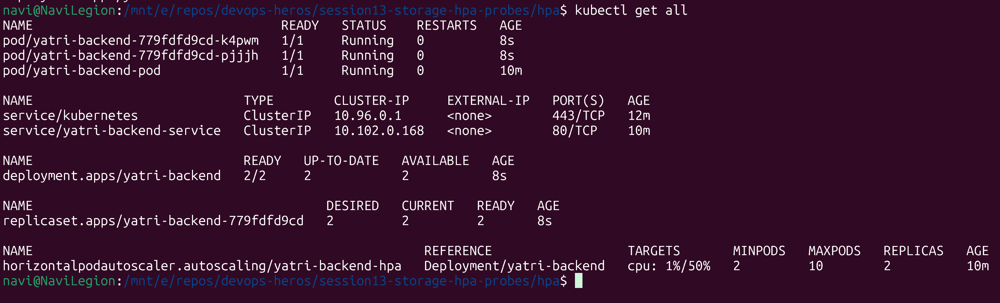
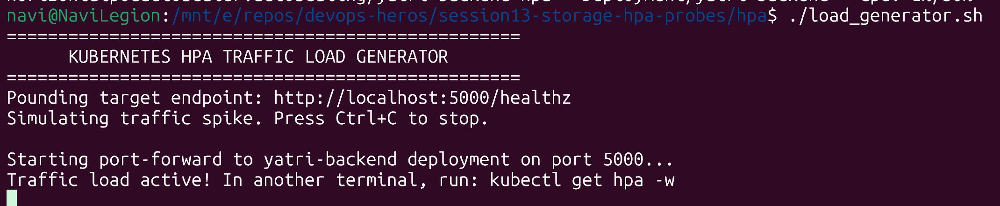
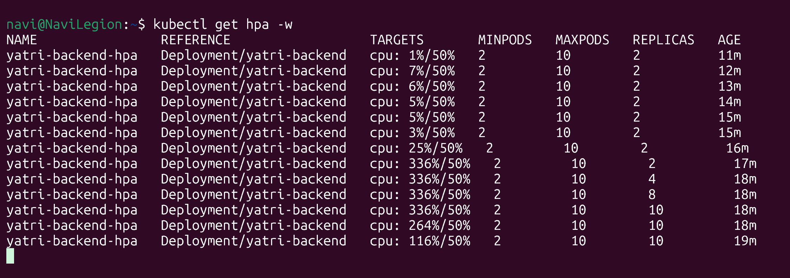
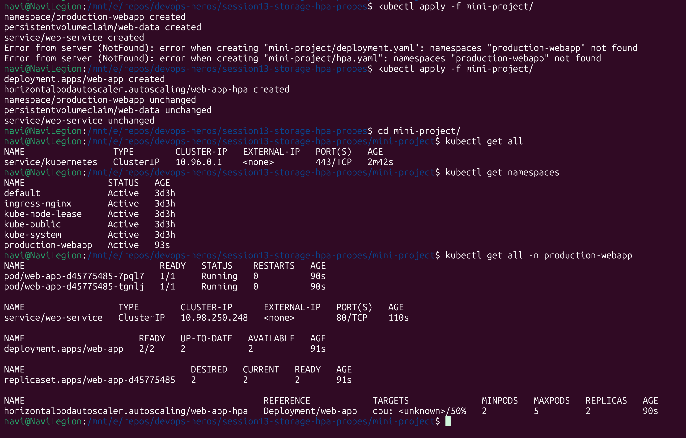
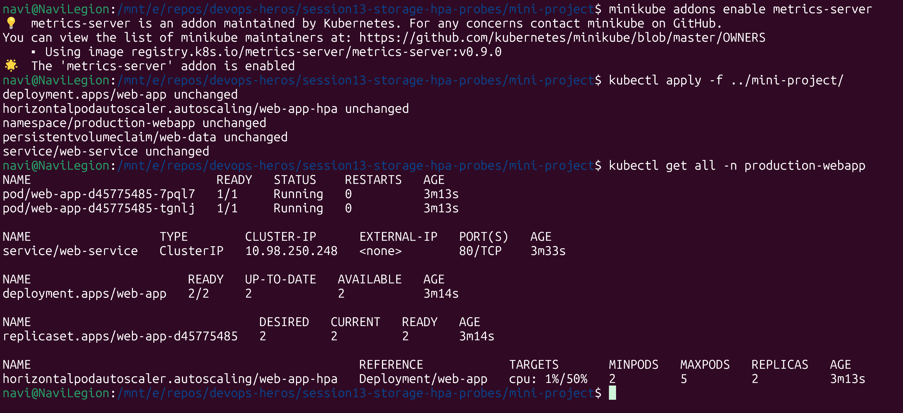
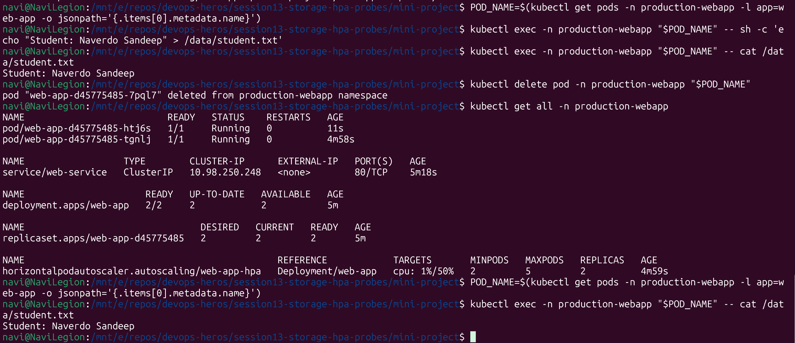
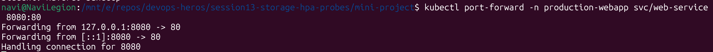
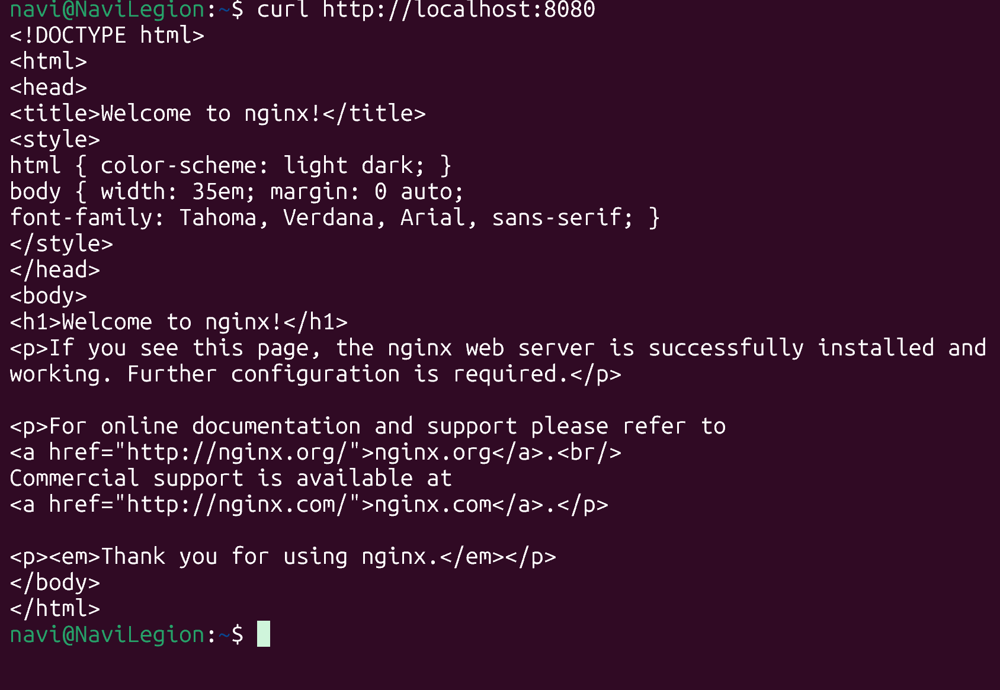
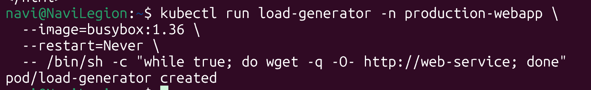
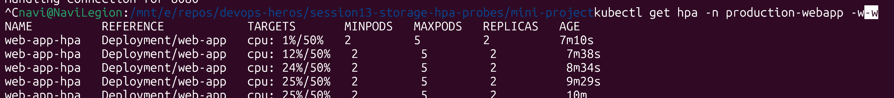

# Task 1

emptyDir: emptyDir is a temporary storage attached to a pod. IT exists only within the lifecycle of the pod and is deleted when the pod is deleted.

hostPath: Mounts a directory on the node to the pod. Similar to Docker bind mount. Storage exists within the lifecycle of the node and data is lost if the node is deleted. All pods within the node can access the storage.

PersistentVolume: A persistent volume is its own k8s object and hence will live as long as the cluster is up, hence the name persistent. It can be accessed by all objects of a k8s cluster.

PersistentVolumeClaim: A PV cannot be accessed by pods directly. Instead a pod makes a claim to the PV via a Persistent Volume CLaim and the PVC allocates a part of the PV to the pod. THe PVC handles allocation and reallocation logic of a PV.

StorageClass: The type of storage a PVC should provision.

Dynamic provisioning: A PVC with a storageCLass automatically creates PVs as need instead of manually assigning PV.

# Task 2

Deploy the application.
Configure HPA.
Verify HPA.

Deploy a load generator.

Increase application load.
Observe CPU utilization.
Observe Pod scaling.
Capture the output.

# Task 3

My load isnt going high, strong cpu