# HW Session 14

## Task 1

### Get

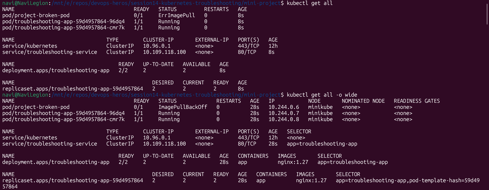

### Describe

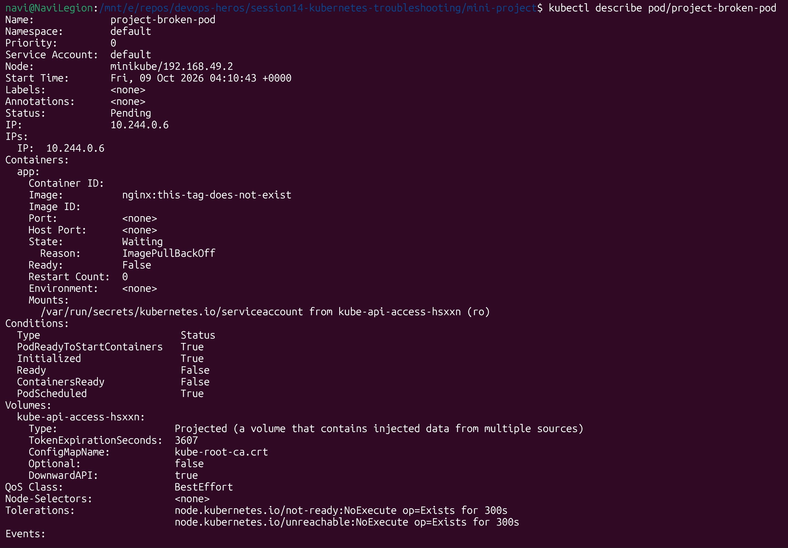

### Exec and Events

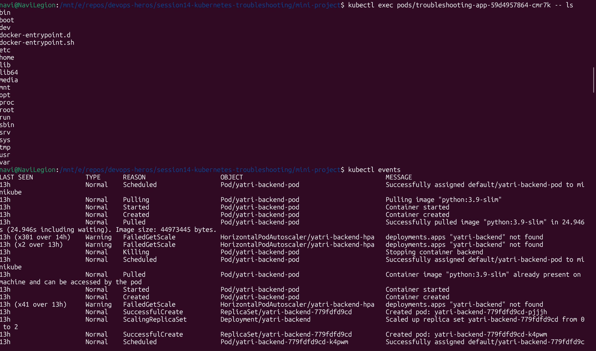

### Explain

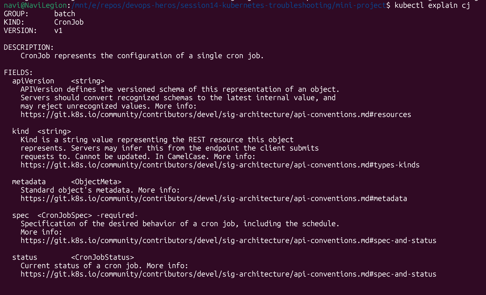

### Top

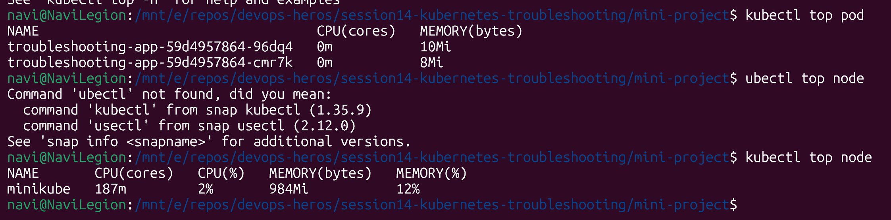

## Task 2

## Kubernetes Troubleshooting Checklist

### 1. CrashLoopBackOff

* **Identify:** `kubectl get pods`
* **Investigate:** `kubectl logs <pod> --previous`
* **Root cause:** Application crashes, incorrect commands, missing configuration, or failed dependencies.
* **Fix:** Correct the application, configuration, or startup command.
* **Verify:** `kubectl get pods`
* **Document:** Record the crash reason and fix.

### 2. ImagePullBackOff

* **Identify:** `kubectl get pods`
* **Investigate:** `kubectl describe pod <pod>`
* **Root cause:** Invalid image name/tag, registry connectivity, or authentication failure.
* **Fix:** Correct the image reference or registry credentials.
* **Verify:** `kubectl get pods`
* **Document:** Record the image-pull error and resolution.

### 3. ErrImagePull

* **Identify:** `kubectl get pods`
* **Investigate:** `kubectl describe pod <pod>`
* **Root cause:** Kubernetes cannot download the container image.
* **Fix:** Check the image name, tag, registry access, and credentials.
* **Verify:** Confirm the container starts successfully.
* **Document:** Record the pull failure and fix.

### 4. Pending

* **Identify:** `kubectl get pods`
* **Investigate:** `kubectl describe pod <pod>`
* **Root cause:** Insufficient resources, scheduling constraints, or unbound PVCs.
* **Fix:** Free resources, adjust scheduling rules, or fix storage configuration.
* **Verify:** `kubectl get pods -o wide`
* **Document:** Record the scheduling or storage issue.

### 5. ContainerCreating

* **Identify:** `kubectl get pods`
* **Investigate:** `kubectl describe pod <pod>`
* **Root cause:** Image downloading, volume mounting, or networking setup delays or failures.
* **Fix:** Resolve the specific error shown in the pod events.
* **Verify:** Confirm the container reaches `Running`.
* **Document:** Record the creation delay and resolution.

### 6. Service Connectivity Issues

* **Identify:** `kubectl get svc`
* **Investigate:** `kubectl describe svc <service>` and `kubectl get endpoints <service>`
* **Root cause:** Incorrect selectors, ports, target ports, or missing ready endpoints.
* **Fix:** Correct the Service configuration and pod labels.
* **Verify:** Test connectivity using `kubectl exec` or `kubectl port-forward`.
* **Document:** Record the connectivity failure and fix.

### 7. DNS Issues

* **Identify:** Test name resolution from a pod.
* **Investigate:** `kubectl exec <pod> -- nslookup <service>`
* **Root cause:** CoreDNS problems, incorrect service names, or DNS configuration errors.
* **Fix:** Verify CoreDNS pods, DNS configuration, and service names.
* **Verify:** Retry DNS resolution.
* **Document:** Record the DNS failure and resolution.

### 8. Pod Networking Issues

* **Identify:** `kubectl get pods -o wide`
* **Investigate:** Check pod IPs, CNI components, network policies, and connectivity.
* **Root cause:** CNI failures, restrictive NetworkPolicies, or routing problems.
* **Fix:** Repair the CNI configuration or correct network policies.
* **Verify:** Test connectivity between affected pods.
* **Document:** Record the networking issue and fix.

### 9. Configuration Issues

* **Identify:** `kubectl describe pod <pod>`
* **Investigate:** Check environment variables, ConfigMaps, Secrets, and mounted volumes.
* **Root cause:** Missing keys, incorrect values, or improperly mounted configuration.
* **Fix:** Correct the configuration and restart or recreate affected pods if necessary.
* **Verify:** Check pod status and application logs.
* **Document:** Record the configuration error and correction.

## Task 3

## mini project

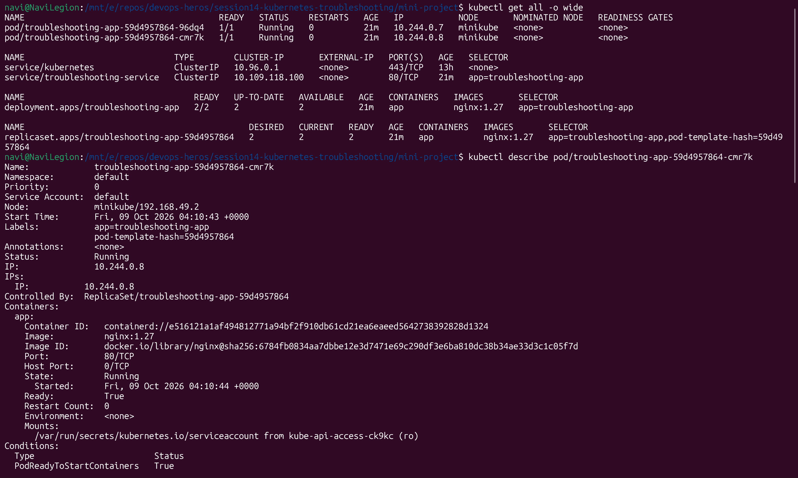

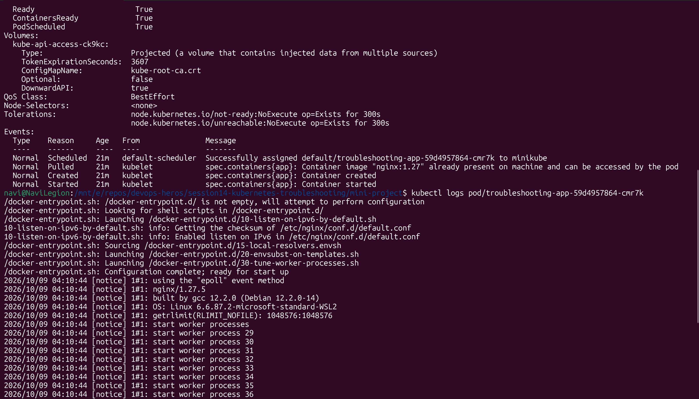

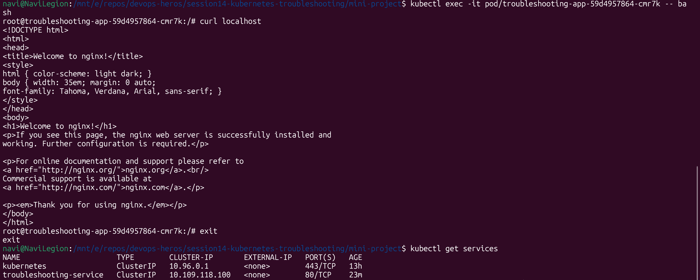

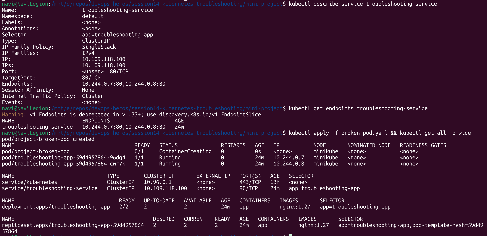

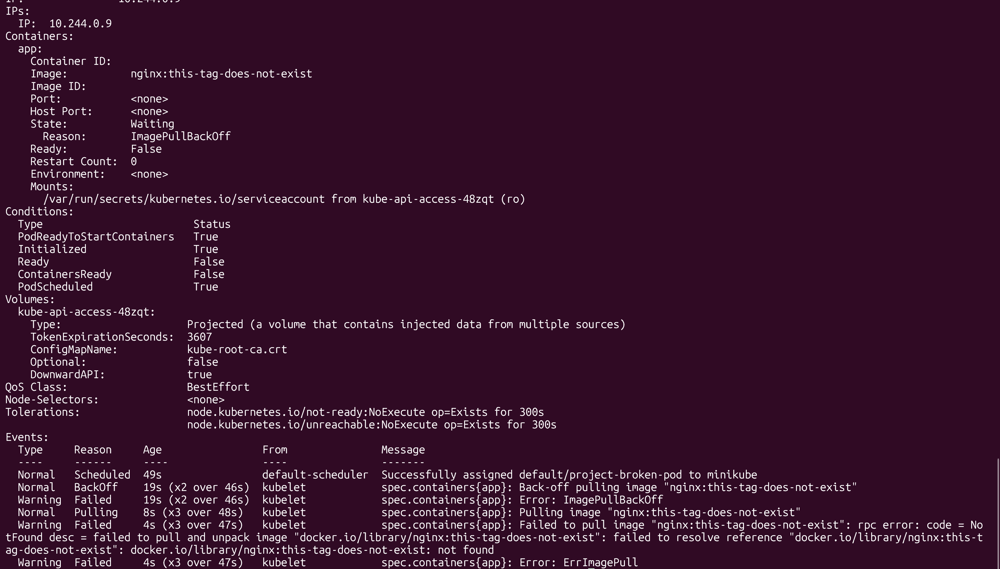

### Failed to unpack image as it doesnt exist acc to event logs, Describe shows wrong tag for image name -> fix correct tag

**Question 1:** What is the Pod status?  
*Answer:*  ImagePullBackOff

**Question 2:** What is the actual error?  
*Answer:*  Failed to pull image "nginx:this-tag-does-not-exist": rpc error: code = NotFound desc = failed to pull and unpack image "docker.io/library/nginx:this-tag-does-not-exist": failed to resolve reference "docker.io/library/nginx:this-tag-does-not-exist": docker.io/library/nginx:this-tag-does-not-exist: not found

**Question 3:** Which command helped you find the reason?  
*Answer:*  kubectl describe -> events

**Question 4:** What is wrong with the image?  
*Answer:*  Tag is incorrect

**Question 5:** How would you fix it?  
*Answer:*  change the tag to a correct one like `latest`

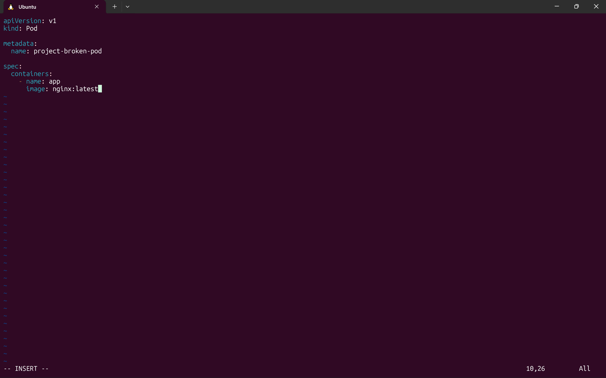

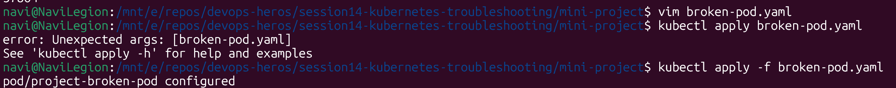

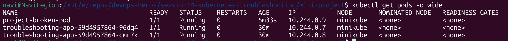

## README Questions

Answer these in your own words:

1. What does `kubectl get` tell us?
    lists the running resources in the cluster
2. What is the difference between `get` and `describe`?
    get lists the resource and their name and status like docker ps. describe shows the resource details like what was in their yaml file like docker describe.
3. Why do we use `kubectl logs`?
   To view what all occured inside the pod lifecycle and also diagnose errors
4. When would you use `kubectl exec`?
    WHen we want to execute a command inside a pod
5. What does `CrashLoopBackOff` mean?
   When the pod has been repeatedly crashing so after retrying few times it stops getting restarted
6. What does `ImagePullBackOff` mean?
   Image doesnt exist/not reachable so after trying to pull a few times, it stops
7. Why can a Pod remain `Pending`?
   Waiting on resources
8. Why can a Service have no endpoints?
   If there are no pods having matching label to its seletor
9.  What is the relationship between a Service selector and Pod labels?
    Service finds pods by matching their labels with its selector
10. What is Kubernetes DNS?
    Kubernetes DNS allows pods and services to discover and communicate with each other using names instead of IP addresses.

    CoreDNS provides DNS resolution