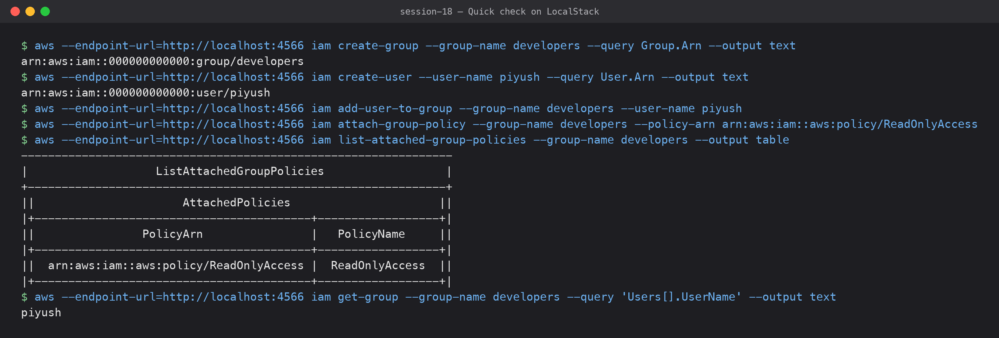

# 01 — IAM (Identity and Access Management): Governance

**Submitted by:** Piyush Bansal

## What is IAM?

IAM is the AWS service that answers two questions for every API call:
**who are you** (authentication) and **are you allowed to do this** (authorization).
It is global (not tied to a region) and free. Every request to AWS, from the console,
CLI, SDK or Terraform, is signed with credentials that belong to an IAM identity, and
IAM evaluates policies to allow or deny it.

The building blocks:

| Concept | One line |
|---|---|
| Root user | The email that created the account. Can do everything. Lock it away. |
| User | A long-lived identity for one person or app, with a password and/or access keys |
| Group | A collection of users that share policies |
| Role | An identity with no long-term credentials, *assumed* to get temporary credentials |
| Policy | A JSON document listing what is allowed or denied |

## Users

- An IAM user is one identity inside the account, e.g. `piyush`.
- Can have a **console password** (for the web UI) and/or up to 2 **access keys**
  (`AKIA...` + secret, for CLI/SDK).
- A new user has **no permissions** at all until a policy is attached (directly or via a group).
- Today AWS recommends human users log in through **IAM Identity Center** (SSO) instead
  of individual IAM users with long-lived keys.

## Groups

- A group is just a container of users. You attach policies to the group, and every
  member inherits them, e.g. `developers`, `admins`, `read-only-auditors`.
- A user can be in several groups (max 10). Groups cannot contain other groups.
- Groups are not identities: you can't log in as a group or reference a group as a
  principal in a resource policy.

## Roles

- A role has permissions but **no password or keys**. Someone or something *assumes* it
  through STS (`sts:AssumeRole`) and gets **temporary credentials** (default 1 hour).
- Every role has two policies:
  - **Trust policy**: who is allowed to assume the role (a service like `ec2.amazonaws.com`,
    another account, a federated/OIDC identity such as GitHub Actions).
  - **Permission policy**: what the role can do once assumed.
- Typical roles: EC2 instance profile, Lambda execution role, cross-account access,
  CI/CD pipeline role via OIDC (no stored keys in GitHub secrets).

## Policies

A policy is JSON with one or more statements:

```json
{
  "Version": "2012-10-17",
  "Statement": [
    {
      "Sid": "ReadOneBucket",
      "Effect": "Allow",
      "Action": ["s3:GetObject", "s3:ListBucket"],
      "Resource": [
        "arn:aws:s3:::piyush-session18-tf-demo",
        "arn:aws:s3:::piyush-session18-tf-demo/*"
      ],
      "Condition": { "Bool": { "aws:SecureTransport": "true" } }
    }
  ]
}
```

Types of policies:

| Type | Attached to | Example |
|---|---|---|
| AWS managed | Users/groups/roles | `AmazonS3ReadOnlyAccess`, `AdministratorAccess` |
| Customer managed | Users/groups/roles | Your own reusable policy, versioned |
| Inline | Exactly one identity | Embedded, deleted with the identity |
| Resource-based | A resource | S3 bucket policy, SQS queue policy, KMS key policy |
| Permissions boundary | User/role | The *maximum* permissions an identity can ever get |
| SCP (Organizations) | Account/OU | Guardrail across many accounts |

## Permissions (how a request is evaluated)

1. Everything starts as an **implicit deny**.
2. If any applicable policy has an **explicit `Deny`** → denied. Explicit deny always wins.
3. Otherwise, if some policy has an `Allow` (and SCPs/boundaries also allow it) → allowed.
4. Otherwise → still implicitly denied.

So: *Deny beats Allow, and no Allow means no access.* The IAM Policy Simulator and
`aws iam simulate-principal-policy` help test this.

## Least privilege

Give each identity only the actions and resources it actually needs, nothing more.
In practice:

- Start from nothing and add, not from `*` and remove.
- Scope `Resource` to specific ARNs, not `"*"`.
- Use conditions (source IP, MFA, tags, `aws:SecureTransport`).
- Use **IAM Access Analyzer** to generate a policy from real CloudTrail activity and to
  find unused permissions.

Example: my Terraform S3 demo only needs `s3:CreateBucket`, `s3:DeleteBucket`,
`s3:PutBucketVersioning`, `s3:Get*`/`s3:List*` on `arn:aws:s3:::piyush-session18-*`,
not `AdministratorAccess`.

## IAM best practices

- Don't use the root user for daily work. Enable MFA on it and delete its access keys.
- Enable MFA for every human user.
- Prefer **roles and temporary credentials** over long-lived access keys
  (EC2 instance profiles, OIDC for CI/CD, Identity Center for people).
- If access keys must exist, rotate them and never commit them to Git.
- Manage permissions through groups/roles, not per-user inline policies.
- Use least privilege and review with Access Analyzer / last-accessed info.
- Use permissions boundaries and SCPs as guardrails in multi-account setups.
- Turn on CloudTrail so every API call is audited.
- Enforce a strong password policy.

## Common use cases

- Give a team of developers read/write access to dev resources but read-only to prod.
- Let an EC2 instance read from an S3 bucket using an instance role (no keys on the box).
- Let GitHub Actions deploy to AWS by assuming a role through OIDC.
- Cross-account access: an auditing account assumes a read-only role in every other account.
- Let a Lambda function write to DynamoDB through its execution role.

## Quick check on LocalStack



LocalStack (a local AWS emulator, not a real AWS account) accepts IAM calls, which is
handy to practise the CLI. It does **not** enforce IAM permissions by default, so this
only shows the API shape:

```text
$ aws --endpoint-url=http://localhost:4566 iam create-group --group-name developers --query Group.Arn --output text
arn:aws:iam::000000000000:group/developers
$ aws --endpoint-url=http://localhost:4566 iam create-user --user-name piyush --query User.Arn --output text
arn:aws:iam::000000000000:user/piyush
$ aws --endpoint-url=http://localhost:4566 iam add-user-to-group --group-name developers --user-name piyush
$ aws --endpoint-url=http://localhost:4566 iam attach-group-policy --group-name developers --policy-arn arn:aws:iam::aws:policy/ReadOnlyAccess
$ aws --endpoint-url=http://localhost:4566 iam list-attached-group-policies --group-name developers --output table
----------------------------------------------------------------
|                   ListAttachedGroupPolicies                  |
+--------------------------------------------------------------+
||                      AttachedPolicies                      ||
|+-----------------------------------------+------------------+|
||                PolicyArn                |   PolicyName     ||
|+-----------------------------------------+------------------+|
||  arn:aws:iam::aws:policy/ReadOnlyAccess |  ReadOnlyAccess  ||
|+-----------------------------------------+------------------+|
$ aws --endpoint-url=http://localhost:4566 iam get-group --group-name developers --query 'Users[].UserName' --output text
piyush
```

`000000000000` is LocalStack's fake account ID.

## What I learned

- A brand new user can do nothing; permissions only come from policies.
- Explicit Deny always wins over Allow.
- Roles + temporary credentials are the default answer; long-lived access keys are the exception.
