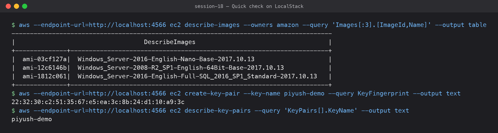

# 02 — EC2 (Elastic Compute Cloud): Compute

**Submitted by:** Piyush Bansal

## What is EC2?

EC2 gives you **virtual servers ("instances") in the cloud**. You pick an OS image, a
size (CPU/RAM), storage, network and firewall rules, and AWS runs the VM on its
hardware in the Availability Zone you choose. You pay per second (Linux) while it runs,
and you are responsible for everything inside the OS (patching, software, hardening).
This is IaaS in the shared responsibility model.

## AMI (Amazon Machine Image)

- The template an instance boots from: root volume snapshot (OS + preinstalled
  software), architecture (`x86_64` / `arm64`), virtualization type, block device mapping
  and launch permissions.
- AMIs are **regional** (copy them to use in another region) and have IDs like
  `ami-0abcd1234...` that differ per region.
- Sources: AWS-provided (Amazon Linux 2023, Ubuntu, Windows), AWS Marketplace, community,
  or your own "golden image" built with Packer or created from an instance.
- In Terraform we normally look up the latest AMI with a `data "aws_ami"` block or an SSM
  parameter instead of hard-coding the ID.

## Instance types

Named like `m7g.large` = **family** `m` + **generation** `7` + **attributes** `g`
(Graviton/ARM) + **size** `large`.

| Family | Optimised for | Examples |
|---|---|---|
| General purpose | Balanced CPU/RAM, web apps | `t3`, `t4g` (burstable), `m6i`, `m7g` |
| Compute optimised | CPU-heavy: batch, gaming, encoding | `c6i`, `c7g` |
| Memory optimised | Databases, caches, in-memory analytics | `r6i`, `x2idn` |
| Storage optimised | High local disk IOPS | `i4i`, `d3` |
| Accelerated | GPU/ML | `p5`, `g5`, `inf2`, `trn1` |

`t` types are **burstable**: they earn CPU credits while idle and spend them under load.

Pricing models: On-Demand, Savings Plans / Reserved Instances (1–3 year commitment,
cheaper), Spot (up to ~90% off, can be reclaimed with 2 min notice), Dedicated Hosts.

## Key pairs

- An SSH key pair: AWS keeps the **public key** and puts it in
  `~/.ssh/authorized_keys` on the instance at first boot; you keep the **private key**
  (`.pem`), downloadable only once at creation.
- Linux login: `ssh -i my-key.pem ec2-user@<public-ip>` (user depends on the AMI:
  `ec2-user`, `ubuntu`, ...). For Windows the key decrypts the Administrator password.
- Types: RSA or ED25519. You can also import your own public key.
- Modern alternative: **SSM Session Manager** or **EC2 Instance Connect**, so no inbound
  port 22 and no long-lived keys.

## Security Groups

- A **stateful virtual firewall at the instance (ENI) level**.
- Only **allow** rules (no deny). Default: all inbound denied, all outbound allowed.
- Stateful: if inbound traffic is allowed, the reply is automatically allowed out.
- Sources can be CIDR blocks or **other security groups** (e.g. "allow 5432 only from the
  app SG").
- Changes apply immediately; one instance can have several SGs.
- Example: web server SG allows 80/443 from `0.0.0.0/0` and 22 only from my IP.

## EBS (Elastic Block Store)

- Network-attached **block storage** volumes for EC2, like a virtual hard disk.
- Lives in **one AZ**, can only attach to an instance in the same AZ (multi-attach only for io1/io2).
- Persists independently of the instance (unless *Delete on termination* is set, which
  is the default for the root volume).
- Volume types: `gp3` (general SSD, default choice), `io2` (provisioned IOPS for
  databases), `st1` (throughput HDD), `sc1` (cold HDD).
- **Snapshots** are incremental backups stored in S3; used to restore, copy across
  regions or create AMIs. Encryption with KMS is one checkbox (can be on by default).
- Different from **instance store**: physically attached, very fast, but data is lost
  when the instance stops.

## Public vs private IP

| | Private IP | Public IP | Elastic IP |
|---|---|---|---|
| From | Subnet CIDR (e.g. `10.0.1.25`) | AWS pool | AWS pool, allocated to your account |
| Reachable from | Inside the VPC / peered / VPN | Internet | Internet |
| On stop/start | Kept | **Changes** | Kept |
| Cost | Free | Charged (since Feb 2024, all public IPv4 is billed) | Charged |

An instance gets a public IP only if it's launched in a subnet with
`map_public_ip_on_launch` (or requested explicitly). The public IP is not configured on
the OS; the Internet Gateway does 1:1 NAT to the private IP.

## Instance lifecycle

```text
          launch
            |
         pending ──────────> running ───reboot───> rebooting ──> running
                              |   ^
                         stop |   | start
                              v   |
                          stopping ──> stopped
                              |
                      terminate (from running or stopped)
                              v
                       shutting-down ──> terminated (gone, visible ~1 h)
```

- **running**: billed for compute.
- **stopped**: not billed for compute, still billed for EBS; public IP released; may move
  to new hardware on start.
- **hibernate**: RAM is saved to the EBS root volume, resumes faster.
- **terminated**: permanent; root EBS deleted by default. Termination protection can
  prevent accidents.

## Common use cases

- Web and application servers (often in an Auto Scaling Group behind a load balancer).
- Self-managed databases or software that needs OS-level control.
- CI/CD build agents (e.g. self-hosted GitHub runners), batch jobs on Spot.
- Kubernetes worker nodes (EKS node groups).
- Bastion hosts, VPN servers, dev/test environments.

## Quick check on LocalStack



EC2 on LocalStack (a local AWS emulator, not a real AWS account) is **mocked**: the API
answers and records resources, but no real VM boots. Useful only to practise the CLI:

```text
$ aws --endpoint-url=http://localhost:4566 ec2 describe-images --owners amazon --query 'Images[:3].[ImageId,Name]' --output table
---------------------------------------------------------------------------------------
|                                   DescribeImages                                    |
+--------------+----------------------------------------------------------------------+
|  ami-03cf127a|  Windows_Server-2016-English-Nano-Base-2017.10.13                    |
|  ami-12c6146b|  Windows_Server-2008-R2_SP1-English-64Bit-Base-2017.10.13            |
|  ami-1812c061|  Windows_Server-2016-English-Full-SQL_2016_SP1_Standard-2017.10.13   |
+--------------+----------------------------------------------------------------------+
$ aws --endpoint-url=http://localhost:4566 ec2 create-key-pair --key-name piyush-demo --query KeyFingerprint --output text
22:32:30:c2:51:35:67:e5:ea:3c:8b:24:d1:10:a9:3c
$ aws --endpoint-url=http://localhost:4566 ec2 describe-key-pairs --query 'KeyPairs[].KeyName' --output text
piyush-demo
```

The AMI list is LocalStack's built-in fake catalogue (old 2017 image names), not real
AMIs. I also tried `ec2 describe-instance-types`, but it timed out on LocalStack
(`Read timeout on endpoint URL`), so I left the instance type table above as research only.
Launching an actual (mocked) instance with Terraform is in my Session 19 homework.

## What I learned

- AMI = what to boot, instance type = how big, key pair = how to log in, security group =
  who can reach it, EBS = its disk.
- Stopping keeps the EBS disk but loses the public IP; terminating deletes the root disk.
- Security groups are stateful and allow-only.
