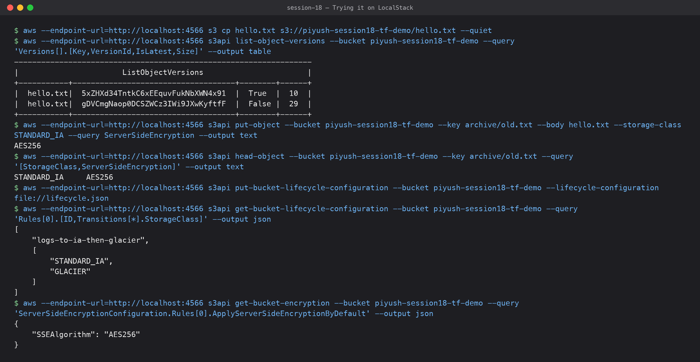

# 03 — S3 (Simple Storage Service): Storage

**Submitted by:** Piyush Bansal

## What is S3?

S3 is AWS's **object storage** service. You store files ("objects") in containers
("buckets") and get them back over HTTPS by key. There are no disks or file systems to
manage, capacity is practically unlimited, and AWS designs it for
**99.999999999% (11 nines) durability** by storing data across multiple Availability Zones.

It is not a file system (no real folders, no in-place edits, no file locking) and not a
block device. It is a key-value store for blobs up to 5 TB each.

## Buckets

- A bucket is the top-level container. Its name is **globally unique** across all AWS
  accounts, 3–63 characters, lowercase letters, numbers, dots and hyphens.
- A bucket lives in **one region** you choose (data stays there unless you replicate it).
- Default limit is 10,000 buckets per account (soft limit).
- Since April 2023 new buckets have **Block Public Access ON** and ACLs disabled
  ("bucket owner enforced") by default.
- ARN format: `arn:aws:s3:::bucket-name`.

## Objects

- An object = **key** (full name, e.g. `logs/2026/10/app.log`) + **data** + **metadata**
  (content-type, custom `x-amz-meta-*`) + optional **tags** + **version ID**.
- "Folders" are just key prefixes separated by `/`; the console draws them as folders.
- Max object size 5 TB; single PUT up to 5 GB, use **multipart upload** above ~100 MB.
- S3 has **strong read-after-write consistency** for all PUTs and DELETEs (since Dec 2020).

## Storage classes

| Class | For | Notes |
|---|---|---|
| S3 Standard | Frequently accessed data | Default, ≥3 AZs, no retrieval fee |
| S3 Intelligent-Tiering | Unknown/changing access patterns | Moves objects between tiers automatically; small monitoring fee |
| S3 Standard-IA | Infrequent access, needs fast retrieval | Cheaper storage, per-GB retrieval fee, 30-day minimum |
| S3 One Zone-IA | Re-creatable infrequent data | Only 1 AZ, ~20% cheaper than Standard-IA |
| S3 Express One Zone | Ultra-low latency, single AZ | Directory buckets, single-digit ms |
| S3 Glacier Instant Retrieval | Archive read once a quarter | Milliseconds retrieval, 90-day minimum |
| S3 Glacier Flexible Retrieval | Archive | Minutes to hours to restore |
| S3 Glacier Deep Archive | Long-term compliance archive | Cheapest, 12–48 h restore, 180-day minimum |

## Versioning

- Off by default. Once **Enabled** it can only be **Suspended**, never fully turned off.
- Every overwrite creates a new version; a delete just adds a **delete marker**, so
  accidental deletes and overwrites can be recovered.
- Old versions still cost money, so combine with a lifecycle rule
  (`NoncurrentVersionExpiration`).
- Required for Cross-Region / Same-Region Replication and Object Lock.
- MFA Delete can be enabled to require MFA for permanently deleting versions.

## Lifecycle policies

Rules that automatically act on objects by age, prefix or tag:

- **Transition** actions: move to a cheaper class (e.g. Standard → Standard-IA after 30
  days → Glacier after 90 days).
- **Expiration** actions: delete objects (e.g. logs after 365 days), delete old
  noncurrent versions, clean up incomplete multipart uploads.

## Encryption

- **In transit**: HTTPS (TLS). Can be enforced with a bucket policy condition
  `aws:SecureTransport = false → Deny`.
- **At rest** (server-side), since Jan 2023 every new object is encrypted by default:
  - **SSE-S3** (`AES256`): keys managed by S3. Default, free.
  - **SSE-KMS** (`aws:kms`): keys in AWS KMS, gives key policies, audit in CloudTrail,
    key rotation. Use S3 Bucket Keys to reduce KMS cost.
  - **DSSE-KMS**: dual-layer KMS encryption for strict compliance.
  - **SSE-C**: you send your own key with each request.
- **Client-side encryption**: you encrypt before uploading.

## Bucket policies

A **resource-based** IAM policy attached to the bucket. It has a `Principal` (who), and
is how you grant cross-account access, enforce HTTPS/encryption, restrict to a VPC
endpoint, or (deliberately) make a static website public.

```json
{
  "Version": "2012-10-17",
  "Statement": [
    {
      "Sid": "DenyInsecureTransport",
      "Effect": "Deny",
      "Principal": "*",
      "Action": "s3:*",
      "Resource": [
        "arn:aws:s3:::piyush-session18-tf-demo",
        "arn:aws:s3:::piyush-session18-tf-demo/*"
      ],
      "Condition": { "Bool": { "aws:SecureTransport": "false" } }
    }
  ]
}
```

Access is the union of identity policies + bucket policy, minus any explicit Deny, and
Block Public Access overrides anything that would make the bucket public.

## Common use cases

- Static website hosting (often behind CloudFront).
- Backups and disaster recovery, database dumps.
- Data lake for analytics (Athena, Glue, EMR, Redshift Spectrum).
- Application assets: user uploads, images, videos.
- Log storage (CloudTrail, ALB, VPC Flow Logs).
- **Terraform remote state backend** (with DynamoDB or S3 native locking).
- Build artifacts for CI/CD pipelines.

## Trying it on LocalStack



I tried versioning, storage classes, lifecycle rules and default encryption against the
bucket from my [Terraform S3 demo](../../terraform-s3-demo/), running on **LocalStack**
(a local AWS emulator, not a real AWS account). LocalStack only stores the settings: a
lifecycle rule never actually moves anything to Glacier there.

```text
$ aws --endpoint-url=http://localhost:4566 s3 cp hello.txt s3://piyush-session18-tf-demo/hello.txt --quiet
$ aws --endpoint-url=http://localhost:4566 s3api list-object-versions --bucket piyush-session18-tf-demo --query 'Versions[].[Key,VersionId,IsLatest,Size]' --output table
------------------------------------------------------------------
|                       ListObjectVersions                       |
+-----------+------------------------------------+--------+------+
|  hello.txt|  5xZHXd34TntkC6xEEquvFukNbXWN4x91  |  True  |  10  |
|  hello.txt|  gDVCmgNaop0DCSZWCz3IWi9JXwKyftfF  |  False |  29  |
+-----------+------------------------------------+--------+------+
$ aws --endpoint-url=http://localhost:4566 s3api put-object --bucket piyush-session18-tf-demo --key archive/old.txt --body hello.txt --storage-class STANDARD_IA --query ServerSideEncryption --output text
AES256
$ aws --endpoint-url=http://localhost:4566 s3api head-object --bucket piyush-session18-tf-demo --key archive/old.txt --query '[StorageClass,ServerSideEncryption]' --output text
STANDARD_IA	AES256
$ aws --endpoint-url=http://localhost:4566 s3api put-bucket-lifecycle-configuration --bucket piyush-session18-tf-demo --lifecycle-configuration file://lifecycle.json
$ aws --endpoint-url=http://localhost:4566 s3api get-bucket-lifecycle-configuration --bucket piyush-session18-tf-demo --query 'Rules[0].[ID,Transitions[*].StorageClass]' --output json
[
    "logs-to-ia-then-glacier",
    [
        "STANDARD_IA",
        "GLACIER"
    ]
]
$ aws --endpoint-url=http://localhost:4566 s3api get-bucket-encryption --bucket piyush-session18-tf-demo --query 'ServerSideEncryptionConfiguration.Rules[0].ApplyServerSideEncryptionByDefault' --output json
{
    "SSEAlgorithm": "AES256"
}
```

The second upload of `hello.txt` kept the first one as a non-latest version (29 bytes vs
10 bytes), which is versioning working. Encryption was `AES256` (SSE-S3) without me
asking for it, same as the AWS default. `lifecycle.json` was:

```json
{
  "Rules": [
    {
      "ID": "logs-to-ia-then-glacier",
      "Status": "Enabled",
      "Filter": { "Prefix": "logs/" },
      "Transitions": [
        { "Days": 30, "StorageClass": "STANDARD_IA" },
        { "Days": 90, "StorageClass": "GLACIER" }
      ],
      "Expiration": { "Days": 365 },
      "NoncurrentVersionExpiration": { "NoncurrentDays": 30 }
    }
  ]
}
```

## What I learned

- Bucket names are global, but the bucket and its data live in one region.
- Versioning can be suspended but never turned off, and old versions keep costing money
  until a lifecycle rule expires them.
- Encryption at rest is on by default now; the real decisions are SSE-S3 vs SSE-KMS and
  enforcing HTTPS.
