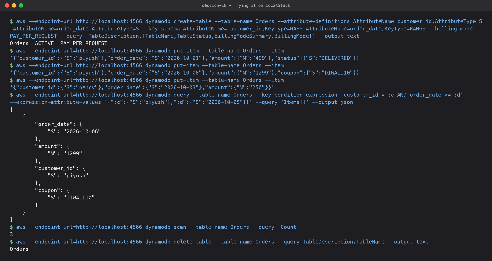
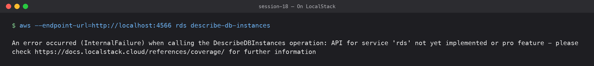

# 05 — DynamoDB & RDS: Database Services

**Submitted by:** Piyush Bansal

AWS has two very different managed databases that come up all the time:
**DynamoDB** (serverless NoSQL key-value/document) and **RDS** (managed relational SQL).

---

## DynamoDB

### NoSQL

DynamoDB is a fully managed, **serverless NoSQL** database. "NoSQL" here means:

- **No fixed schema** beyond the primary key; every item can have different attributes.
- **No joins** and no SQL queries across tables; you design the table around your
  **access patterns** (often one table for many entity types: "single-table design").
- Scales horizontally by partitioning data on the partition key, giving single-digit
  millisecond latency at any scale.
- No servers, versions or patching. Capacity modes: **On-Demand** (pay per request) or
  **Provisioned** (RCU/WCU, with auto scaling).
- Reads are eventually consistent by default; strongly consistent reads and
  ACID **transactions** (`TransactWriteItems`) are available.

### Tables

- A table is a collection of items, created with just a name, a primary key and a
  capacity mode. Regional; replicate across regions with **Global Tables**.
- Extra query paths via **secondary indexes**:
  - **GSI** (Global Secondary Index): different partition + sort key, can be added any time.
  - **LSI** (Local Secondary Index): same partition key, different sort key, only at creation.
- Optional features: TTL (auto-delete expired items), Streams (change events, e.g. to
  Lambda), Point-in-time recovery, encryption with KMS.

### Items

- An item is one record (like a row), identified uniquely by its primary key.
- Max item size **400 KB**.

### Attributes

- An attribute is a name-value pair on an item (like a column, but per item).
- Types: scalar `S` (string), `N` (number), `B` (binary), `BOOL`, `NULL`;
  document `M` (map), `L` (list); sets `SS`, `NS`, `BS`.
- Only the key attributes must be declared at table creation.

### Partition key

- The **hash key**. DynamoDB hashes its value to choose the physical partition.
- If it is the only key ("simple primary key"), it must be unique per item.
- Choose a **high-cardinality** value that spreads traffic evenly (`user_id`,
  `order_id`), otherwise you get **hot partitions**.

### Sort key

- The optional **range key**. With a sort key the primary key is **composite**:
  partition key + sort key together must be unique.
- Items with the same partition key are stored together, sorted by the sort key, so you
  can `Query` ranges: `begins_with`, `between`, `>=` (e.g. all orders of a customer
  after a date).

### Use cases

- Shopping carts, user profiles, session stores.
- Gaming leaderboards, IoT telemetry, ad tech: huge scale with predictable latency.
- Serverless backends (API Gateway + Lambda + DynamoDB).
- Metadata store, idempotency keys, and the classic **Terraform state lock table**.

### Trying it on LocalStack



DynamoDB works well on LocalStack (a local AWS emulator, not a real AWS account), so I
built a small `Orders` table with partition key `customer_id` and sort key `order_date`:

```text
$ aws --endpoint-url=http://localhost:4566 dynamodb create-table --table-name Orders --attribute-definitions AttributeName=customer_id,AttributeType=S AttributeName=order_date,AttributeType=S --key-schema AttributeName=customer_id,KeyType=HASH AttributeName=order_date,KeyType=RANGE --billing-mode PAY_PER_REQUEST --query 'TableDescription.[TableName,TableStatus,BillingModeSummary.BillingMode]' --output text
Orders	ACTIVE	PAY_PER_REQUEST
$ aws --endpoint-url=http://localhost:4566 dynamodb put-item --table-name Orders --item '{"customer_id":{"S":"piyush"},"order_date":{"S":"2026-10-01"},"amount":{"N":"499"},"status":{"S":"DELIVERED"}}'
$ aws --endpoint-url=http://localhost:4566 dynamodb put-item --table-name Orders --item '{"customer_id":{"S":"piyush"},"order_date":{"S":"2026-10-06"},"amount":{"N":"1299"},"coupon":{"S":"DIWALI10"}}'
$ aws --endpoint-url=http://localhost:4566 dynamodb put-item --table-name Orders --item '{"customer_id":{"S":"nency"},"order_date":{"S":"2026-10-03"},"amount":{"N":"250"}}'
$ aws --endpoint-url=http://localhost:4566 dynamodb query --table-name Orders --key-condition-expression 'customer_id = :c AND order_date >= :d' --expression-attribute-values '{":c":{"S":"piyush"},":d":{"S":"2026-10-05"}}' --query 'Items[]' --output json
[
    {
        "order_date": {
            "S": "2026-10-06"
        },
        "amount": {
            "N": "1299"
        },
        "customer_id": {
            "S": "piyush"
        },
        "coupon": {
            "S": "DIWALI10"
        }
    }
]
$ aws --endpoint-url=http://localhost:4566 dynamodb scan --table-name Orders --query 'Count'
3
$ aws --endpoint-url=http://localhost:4566 dynamodb delete-table --table-name Orders --query TableDescription.TableName --output text
Orders
```

The query used the partition key plus a range condition on the sort key, and the second
item has a `coupon` attribute the others don't: no schema needed.

---

## RDS

### Relational database

RDS (Relational Database Service) runs **managed relational (SQL) databases**:
tables with fixed schemas, rows and columns, primary/foreign keys, joins and ACID
transactions. AWS handles provisioning, OS and DB patching, backups, monitoring and
failover; you handle schema, queries, indexes and tuning. You cannot SSH to the host.

### Supported engines

| Engine | Notes |
|---|---|
| **Amazon Aurora** (MySQL- and PostgreSQL-compatible) | AWS-built, storage auto-grows to 128 TiB, 6 copies across 3 AZs, up to 15 replicas, Serverless v2 option |
| PostgreSQL | Open source |
| MySQL | Open source |
| MariaDB | Open source |
| Oracle | BYOL or license-included |
| Microsoft SQL Server | License-included |
| IBM Db2 | Added in 2023 |

### DB instances

- A DB instance is the managed database server: an **instance class** (e.g.
  `db.t4g.micro`, `db.m7g.large`, `db.r7g.xlarge` for memory-heavy), **storage**
  (gp3, io1/io2, with storage autoscaling) and an **endpoint** DNS name you connect to.
- Lives in a **DB subnet group** (private subnets in at least 2 AZs) inside your VPC.
- Settings come from **parameter groups** (engine config) and **option groups**.
- Maintenance windows for patching; can be stopped for up to 7 days.

### Security

- Network: put it in **private subnets**, `publicly_accessible = false`, and allow the
  DB port only from the app's **security group**.
- Encryption at rest with **KMS** (must be chosen at creation; covers storage, backups,
  snapshots, replicas). Encryption in transit with **SSL/TLS** (can be forced).
- Authentication: master user password stored/rotated in **Secrets Manager**,
  or **IAM database authentication** (short-lived tokens, no passwords).
- IAM policies control who can manage the instance; CloudTrail and DB logs for auditing.

### Backups

- **Automated backups**: daily snapshot + transaction logs, retention 0–35 days
  (default 7), giving **point-in-time restore** to any second (usually within the last 5 min).
- **Manual snapshots**: kept until you delete them; can be copied to other regions or
  shared with other accounts.
- Restoring always creates a **new** DB instance with a new endpoint.
- AWS Backup can manage it centrally.

### Multi-AZ

- **High availability**, not performance. RDS keeps a **synchronous standby** in another AZ.
- On failure (AZ outage, instance failure, patching) it **fails over automatically**
  by flipping the endpoint's DNS to the standby, usually in 60–120 s.
- The classic standby can't serve reads. **Multi-AZ DB cluster** (1 writer + 2 readable
  standbys) is the newer option for MySQL/PostgreSQL with faster failover.

### Read replicas

- **Scale reads**: up to 15 replicas (Aurora) / 15 for MySQL, MariaDB, PostgreSQL,
  using **asynchronous** replication, so replicas can lag slightly.
- Each replica has its own endpoint; the app sends read-only queries (reports,
  dashboards) there.
- Can be cross-region (also useful for DR) and can be **promoted** to a standalone
  writable DB.

| | Multi-AZ | Read Replica |
|---|---|---|
| Purpose | High availability / failover | Read scaling |
| Replication | Synchronous | Asynchronous |
| Readable | No (classic) | Yes |
| Region | Same region | Same or cross-region |

### Use cases

- Classic web and business applications: e-commerce, ERP, CRM, banking.
- Anything that needs joins, complex queries, strong consistency and transactions.
- Lift-and-shift of existing MySQL/PostgreSQL/Oracle/SQL Server workloads.
- Backend for CMS like WordPress, or reporting with read replicas.

### On LocalStack



RDS is not part of the free LocalStack community edition, so I couldn't try it locally:

```text
$ aws --endpoint-url=http://localhost:4566 rds describe-db-instances

An error occurred (InternalFailure) when calling the DescribeDBInstances operation: API for service 'rds' not yet implemented or pro feature - please check https://docs.localstack.cloud/references/coverage/ for further information
```

So the RDS part of this page is research only. For reference, this is roughly what a
small, private PostgreSQL instance looks like in Terraform (not applied anywhere):

```hcl
resource "aws_db_instance" "app" {
  identifier                  = "piyush-app-db"
  engine                      = "postgres"
  engine_version              = "16"
  instance_class              = "db.t4g.micro"
  allocated_storage           = 20
  storage_encrypted           = true
  username                    = "app_admin"
  manage_master_user_password = true # password generated and kept in Secrets Manager
  db_subnet_group_name        = aws_db_subnet_group.private.name
  vpc_security_group_ids      = [aws_security_group.db.id]
  publicly_accessible         = false
  multi_az                    = true
  backup_retention_period     = 7
  deletion_protection         = true
}
```

## DynamoDB vs RDS in one table

| | DynamoDB | RDS |
|---|---|---|
| Model | Key-value / document (NoSQL) | Relational (SQL) |
| Schema | Only the key | Fixed tables and columns |
| Queries | By key / index, no joins | Full SQL with joins |
| Scaling | Automatic, horizontal | Vertical (bigger instance) + read replicas |
| Ops | Serverless | You pick instance size, storage, maintenance window |
| Best for | Known access patterns at huge scale | Complex queries and relationships |

## What I learned

- In DynamoDB you design the keys around how you'll read the data, not around the data.
- Partition key + sort key unlocks range queries within one partition.
- RDS Multi-AZ is for availability, read replicas are for read scaling. They solve
  different problems and are often used together.
