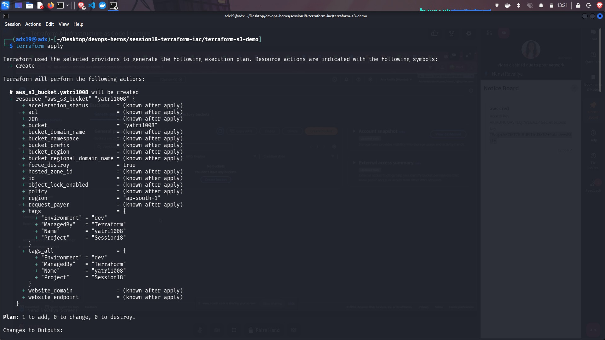
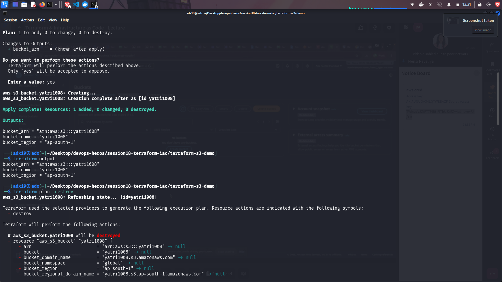
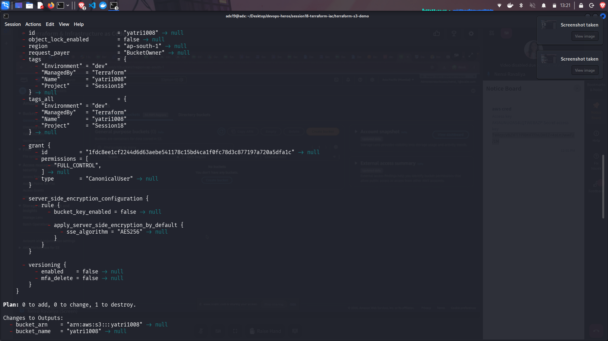
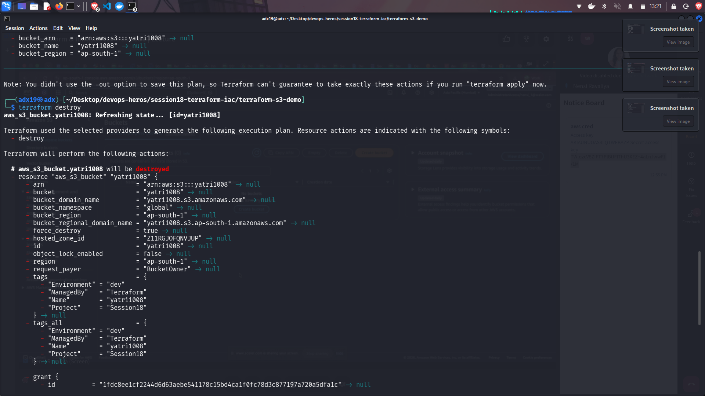
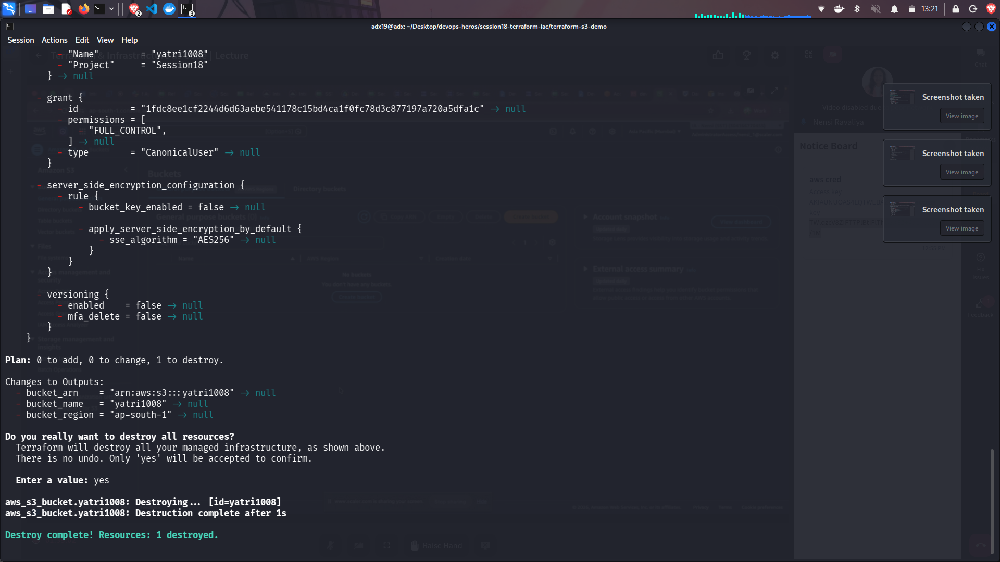

# Terraform & Infrastructure as Code

## Task 1:

- Task 1 was done during the class. The screenshots of the work is attached below.
- What we did was we created an aws s3 bucket and ran the whole terraform workflow.
- The screenshot only contain **terraform apply**, **terraforn output**, **terraform plan -destory**, **terraform destroy**. This is because all other commands where cleared before taking screenshot.
- Below given is the order on how the commands where run:
  - First ran **aws configure** and then inside entered **Access Key Id** and **Secret Key**.
  - Gave the regin as **us-east-1**.
  - Gave the output format as **json**.
  - Then ran the terraform command in the following order:
    - **terraform init**
    - **terraform fmt**
    - **terraform validate**
    - **terraform plan**
    - **terraform apply**
    - **terrafrom output**
    - **terraform plan -destory**
    - **terraform destory**

---

## Screenshots of Task 1:

---

## Task 2:

All the references for Task 2, all the readme are in the following files.

## Links:

- [IAC](./terraform-s3-demo/aws-service/01-iam/README.md)
- [EC2](./terraform-s3-demo/aws-service/02-ec2/README.md)
- [S3](./terraform-s3-demo/aws-service/03-s3/README.md)
- [VPC](./terraform-s3-demo/aws-service/04-vpc/README.md)
- [DYNAMODB-RDS](./terraform-s3-demo/aws-service/05-dynamodb-rds/README.md)
