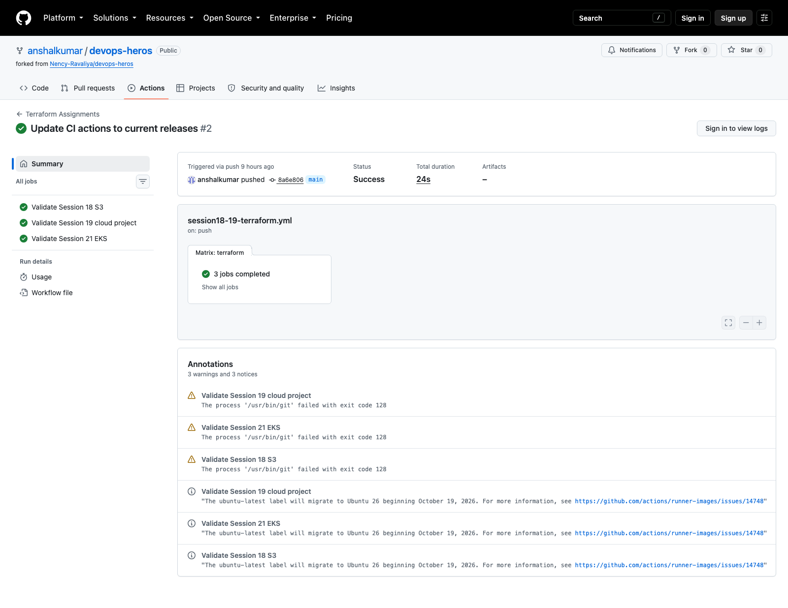

# Session 18 - Terraform and Infrastructure as Code

I used this session to move from individual Terraform examples to one complete S3 configuration. The smaller folders cover providers, variables, outputs, state, apply, and destroy. My main submission is [`terraform-s3-demo/`](terraform-s3-demo/).

## S3 demo

The configuration creates one S3 bucket with a unique prefix, versioning, AES-256 server-side encryption, a public-access block, and project tags.

```bash
cd session18-terraform-iac/terraform-s3-demo
cp terraform.tfvars.example terraform.tfvars
terraform init
terraform fmt -check
terraform validate
terraform plan -out=tfplan
terraform apply tfplan
terraform output
terraform state list
terraform destroy
```

`terraform plan` is the review step; it shows what Terraform intends to change. `apply` creates or updates the infrastructure, and `destroy` removes the resources tracked in state. I keep state files, plan files, `.terraform/`, and my real `terraform.tfvars` out of Git.

## AWS notes

The research part is under [`aws-services/`](aws-services/):

- [IAM](aws-services/01-iam/README.md)
- [EC2](aws-services/02-ec2/README.md)
- [S3](aws-services/03-s3/README.md)
- [VPC](aws-services/04-vpc/README.md)
- [DynamoDB and RDS](aws-services/05-dynamodb-rds/README.md)

I validate the configuration before using any AWS credentials. A real `apply` creates a cloud resource and should only be run in an authorized AWS account, followed by `terraform destroy` after verification.

## Result

GitHub Actions ran formatting and validation for this project without using cloud credentials. The workflow also checks the Session 19 Terraform configuration.


