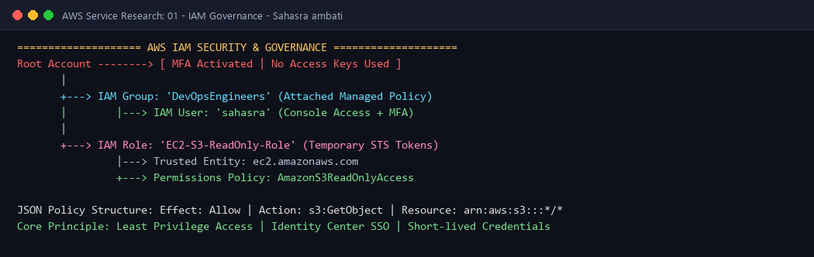

# AWS IAM (Identity and Access Management) - Governance & Security

---

## 👤 Student Information
- **Name:** Sahasra ambati
- **Enrollment Number:** sahasra10241
- **Course / Track:** DevOps & Cloud Engineering
- **Assignment:** Session 18: AWS Services Research - 01. IAM (Governance)

---

## 💡 What I Understood By This Research (My Reflection)

Identity and Access Management (IAM) is the foundational security boundary for everything built in AWS. Before studying IAM in depth, I assumed security was mainly about configuring firewalls or passwords. However, cloud governance relies entirely on identity:
- **Authentication (AuthN)** verifies *who* the entity is (User, Service, or Application).
- **Authorization (AuthZ)** determines *what* actions that authenticated entity is permitted to perform on specific cloud resources.
- In AWS, **every request is denied by default** unless an explicit `Allow` policy grants access, and an explicit `Deny` always overrides any `Allow`.

---

## 1. What is AWS IAM?
**AWS Identity and Access Management (IAM)** is a global, web-based identity service that enables organizations to securely manage access to AWS services and resources. 
- IAM operates globally across all AWS regions without requiring regional deployment.
- It provides fine-grained authorization, centralizing control over API calls, console access, and cross-account access.
- It comes at **no additional cost** in any AWS account.

---

## 2. Core IAM Components

```text
+-------------------------------------------------------------------------------+
|                                  AWS ROOT ACCOUNT                             |
|                           (Locked with Hardware/Virtual MFA)                  |
+-------------------------------------------------------------------------------+
                                      |
       +------------------------------+------------------------------+
       |                                                             |
       v                                                             v
+-----------------------------+                       +-----------------------------+
|          IAM USERS          |                       |          IAM ROLES          |
|  - Long-term credentials    |                       |  - Temporary credentials    |
|  - Console password / MFA   |                       |  - Assumed by EC2, Lambda,  |
|  - Access Key & Secret Key  |                       |    GitHub Actions, or STS   |
+-----------------------------+                       +-----------------------------+
       |                                                             |
       v                                                             v
+-----------------------------+                       +-----------------------------+
|         IAM GROUPS          |                       |        IAM POLICIES         |
|  - Collections of users     |                       |  - JSON permission docs     |
|  - Admin, Developers, Ops   |                       |  - Managed vs Inline        |
+-----------------------------+                       +-----------------------------+
```

### 2.1 IAM Users
- An **IAM User** represents a specific human identity or application service account with long-term credentials.
- Can be assigned:
  1. **AWS Management Console Access:** Protected by a username, password, and mandatory Multi-Factor Authentication (MFA).
  2. **Programmatic Access (CLI / SDK / API):** Authenticated using an **Access Key ID** and **Secret Access Key**.

### 2.2 IAM Groups
- An **IAM Group** is a logical collection of IAM users.
- Groups simplify permission management by allowing administrators to attach policies to the group rather than managing individual users.
- *Key Rules:* A group cannot contain other groups (no nesting), and groups cannot be identified as a `Principal` in resource policies.

### 2.3 IAM Roles
- An **IAM Role** is an identity that does not have long-term credentials (no permanent passwords or access keys).
- Instead, it is dynamically **assumed** by trusted entities (such as EC2 instances, AWS Lambda functions, ECS tasks, or external federated identity providers like Okta or GitHub Actions).
- When assumed via the **AWS Security Token Service (STS)**, temporary security credentials (valid for 15 minutes to 12 hours) are generated and automatically rotated.

### 2.4 IAM Policies
- An **IAM Policy** is a formal JSON document defining permissions.
- There are two primary categories:
  1. **Identity-Based Policies:** Attached directly to Users, Groups, or Roles.
  2. **Resource-Based Policies:** Attached directly to resources (e.g., S3 Bucket Policies, KMS Key Policies).

#### Anatomy of a JSON Policy Document:
```json
{
  "Version": "2012-10-17",
  "Statement": [
    {
      "Sid": "AllowS3ReadSpecificBucket",
      "Effect": "Allow",
      "Action": [
        "s3:GetObject",
        "s3:ListBucket"
      ],
      "Resource": [
        "arn:aws:s3:::sahasra-devops-hero-session18-bucket",
        "arn:aws:s3:::sahasra-devops-hero-session18-bucket/*"
      ],
      "Condition": {
        "Bool": {
          "aws:SecureTransport": "true"
        }
      }
    }
  ]
}
```
- **`Effect`:** Specifies whether the policy allows (`Allow`) or denies (`Deny`) access.
- **`Action`:** The specific API operations permitted (e.g., `s3:GetObject`, `ec2:StartInstances`).
- **`Resource`:** The Amazon Resource Name (ARN) of the target resource.
- **`Condition`:** Context-based rules (e.g., requiring SSL/TLS, specific source IP CIDRs, or MFA presence).

### 2.5 Permissions & Evaluation Logic
When an AWS API request is received, IAM evaluates policies using this hierarchy:
1. **Default Deny:** Every action starts as denied.
2. **Explicit Deny Check:** If any applicable policy contains an explicit `Deny`, the request is immediately rejected.
3. **Explicit Allow Check:** If at least one applicable policy contains an `Allow` and there is no explicit `Deny`, access is granted.

---

## 3. The Principle of Least Privilege
The **Principle of Least Privilege (PoLP)** requires granting an identity *only* the minimum set of permissions necessary to execute its designated responsibilities, and *only* for the duration required.
- **Why it matters:** Limits the blast radius of compromised credentials, prevents accidental deletion of critical infrastructure, and satisfies compliance audits (SOC2, ISO 27001, HIPAA).
- **Anti-pattern:** Attaching `AdministratorAccess` or wildcard `*` actions to application roles.

---

## 4. IAM Best Practices

1. **Lock Down the AWS Root User:**
   - Delete root access keys immediately after account creation.
   - Enable hardware or virtual Multi-Factor Authentication (MFA) on the root account.
   - Use root only for fundamental account maintenance tasks (e.g., billing, closing accounts).
2. **Mandate Multi-Factor Authentication (MFA):** Enforce MFA on all console-accessible IAM users.
3. **Use Roles for Compute Resources:** Never hardcode AWS access keys inside EC2 instances or Docker containers. Always use **IAM Instance Profiles** to vend temporary STS credentials.
4. **Prefer IAM Identity Center (AWS SSO):** Centralize human user access through federated single sign-on rather than creating local IAM users.
5. **Regularly Rotate Credentials & Review Inactive Users:** Automatically revoke or disable access keys unused for over 90 days.
6. **Use Permission Boundaries & Service Control Policies (SCPs):** Set organizational guardrails across AWS Organizations.

---

## 5. Common DevOps Use Cases

- **CI/CD Pipeline Automation (GitHub Actions / GitLab CI):** Using OpenID Connect (OIDC) to assume an IAM Role dynamically, deploying infrastructure via Terraform without storing long-lived AWS secret keys in GitHub secrets.
- **EC2 Instance Profile for S3 / DynamoDB Access:** Granting a backend web server on EC2 access to read S3 static assets securely through instance metadata service (IMDSv2).
- **Cross-Account Role Assumption:** Enabling a central security or deployment account to assume administrative deployment roles inside staging and production AWS accounts.

#### Architecture Diagram:


---

**Submitted by:** Sahasra ambati (`sahasra10241`)
