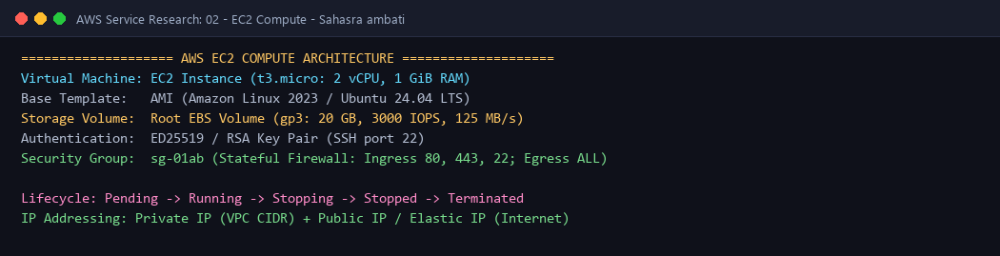

# AWS EC2 (Elastic Compute Cloud) - Scalable Cloud Virtual Machines

---

## 👤 Student Information
- **Name:** Sahasra ambati
- **Enrollment Number:** sahasra10241
- **Course / Track:** DevOps & Cloud Engineering
- **Assignment:** Session 18: AWS Services Research - 02. EC2 (Compute)

---

## 💡 What I Understood By This Research (My Reflection)

Amazon EC2 represents the core Infrastructure-as-a-Service (IaaS) foundation of AWS. Before this research, I thought of EC2 simply as a "virtual private server." Now I understand that EC2 is a highly customizable, on-demand compute ecosystem:
- It decouples compute hardware, block storage (EBS), network interfaces (ENI), and security firewalls (Security Groups).
- It allows resizing instances in seconds, scaling horizontally with Auto Scaling Groups (ASG), and balancing traffic with Application Load Balancers (ALB).

---

## 1. What is Amazon EC2?
**Amazon Elastic Compute Cloud (Amazon EC2)** provides scalable, on-demand computing capacity in the AWS cloud. 
- Eliminates the need to invest in physical hardware upfront.
- Enables launching thousands of virtual machines in minutes with automated provisioning.
- Supports billing by the second, allowing infrastructure to expand or contract based on actual workload demands.

---

## 2. Core Concepts & Architecture

```text
+-----------------------------------------------------------------------------------+
|                                 AMAZON EC2 INSTANCE                               |
|                                                                                   |
|  +--------------------+   +-----------------------+   +------------------------+  |
|  |     AMI IMAGE      |   |     INSTANCE TYPE     |   |       KEY PAIR         |  |
|  | (OS + Software)    |   | (vCPU + RAM + Network)|   | (SSH/RDP Auth via      |  |
|  | Ubuntu 24.04 / AL23|   | t3.micro, c5.xlarge   |   |  Public/Private Keys)  |  |
|  +--------------------+   +-----------------------+   +------------------------+  |
|            |                          |                           |               |
|            +--------------------------+---------------------------+               |
|                                       |                                           |
|                                       v                                           |
|  +-----------------------------------------------------------------------------+  |
|  |                       VIRTUAL HARDWARE HYPERVISOR                           |  |
|  +-----------------------------------------------------------------------------+  |
|            |                                              |                       |
|            v                                              v                       |
|  +--------------------+                       +-----------------------+           |
|  |  EBS BLOCK STORAGE |                       |    SECURITY GROUP     |           |
|  | (Persistent Disk)  |                       |  (Stateful Firewall)  |           |
|  | gp3 / io2 / st1    |                       |  Ports: 22, 80, 443   |           |
|  +--------------------+                       +-----------------------+           |
+-----------------------------------------------------------------------------------+
```

### 2.1 Amazon Machine Image (AMI)
An **AMI** is a pre-configured template containing the operating system, architecture (x86_64 or ARM Graviton), pre-installed software, and initial disk configuration required to launch an instance:
- **AWS Provided AMIs:** Amazon Linux 2023, Ubuntu, Red Hat Enterprise Linux, Windows Server.
- **Custom AMIs (Golden Images):** Created by DevOps engineers with pre-baked security patches, monitoring agents (CloudWatch), and application runtimes using tools like HashiCorp Packer.
- **AWS Marketplace AMIs:** Pre-built commercial appliances (e.g., Cisco firewalls, WordPress stacks).

### 2.2 Instance Types & Sizing Nomenclature
EC2 instances are grouped into specialized families tailored to specific workload profiles:

```text
Example: t3.large
   t  --> Instance Family (t = Burstable General Purpose)
   3  --> Generation (3rd generation hardware)
large --> Instance Size (determines vCPU count, Memory in GiB, and Network Bandwidth)
```

| Family | Focus Area | Example Types | Ideal Workloads |
| :--- | :--- | :--- | :--- |
| **General Purpose** | Balanced Compute, Memory & Network | `t3.micro`, `m6i.large` | Web servers, dev environments, microservices |
| **Compute Optimized** | High-performance processors | `c6i.xlarge`, `c7g.2xlarge` | Batch processing, scientific modeling, game servers |
| **Memory Optimized** | High RAM per vCPU | `r6i.xlarge`, `x2gd.large` | In-memory databases (Redis, Memcached), big data |
| **Storage Optimized** | Low latency, sequential read/write NVMe | `i3.large`, `d2.xlarge` | Distributed file systems, Elasticsearch, data warehouses |
| **Accelerated Computing**| GPU / Hardware accelerators | `p4d.24xlarge`, `g5.xlarge`| Machine learning training, AI inference, 3D rendering |

### 2.3 Key Pairs
- EC2 instances utilize asymmetric public-key cryptography to authenticate logins instead of static passwords.
- **How it works:** AWS places the **Public Key** into `~/.ssh/authorized_keys` inside the instance at boot time. The user retains the private key file (`.pem` or `.ppk`) on their local machine.
- Supported algorithms: **ED25519** (modern, recommended) and **RSA** (legacy).

### 2.4 Security Groups (Virtual Firewalls)
A **Security Group** acts as a virtual firewall controlling inbound and outbound traffic at the **instance network interface (ENI)** level:
- **Stateful Nature:** If an inbound request is permitted (e.g., HTTP on port 80), the return response traffic is automatically allowed outbound, regardless of outbound rules.
- **Allow Rules Only:** Security groups only support explicit `Allow` rules (cannot create explicit deny rules; unmatched traffic is dropped by default).
- Can reference other security groups by ID as a source, allowing secure chaining (e.g., App Tier SG permits traffic only from Web Tier SG).

### 2.5 EBS (Elastic Block Store)
**Amazon EBS** provides persistent, block-level storage volumes attached to EC2 instances over a dedicated storage network:
- Unlike the ephemeral **Instance Store** (which loses data on instance stop/termination), EBS data persists independently of instance lifecycles.
- **Volume Types:**
  - `gp3` (General Purpose SSD): Baseline 3,000 IOPS and 125 MB/s throughput; price-performance leader.
  - `io2` (Provisioned IOPS SSD): Sub-millisecond latency for mission-critical databases.
  - `st1` (Throughput Optimized HDD): Low-cost big data, data warehousing, log processing.
- Supports automated, incremental point-in-time **Snapshots** backed up directly to Amazon S3.

### 2.6 Public vs Private IP Addressing
- **Private IP:** Assigned automatically from the VPC subnet CIDR range (e.g., `10.0.1.15`). Retained for the entire life of the instance, used for internal VPC communication.
- **Public IP:** Dynamically assigned from AWS's public IPv4 pool. **Released and changes every time the instance is stopped and restarted.**
- **Elastic IP (EIP):** A static public IPv4 address allocated to your AWS account that remains constant across instance stop/start cycles.

---

## 3. The EC2 Instance Lifecycle

```text
[ AMI ] ---> [ Pending ] ---> [ Running ] <---> [ Rebooting ]
                                 |     ^
                                 v     |
                             [ Stopping ]
                                 |
                                 v
                             [ Stopped ] ---> [ Shutting-down ] ---> [ Terminated ]
```

1. **Pending:** AWS allocates underlying physical hardware and provisions the virtual machine.
2. **Running:** The instance is fully operational and accessible via SSH/RDP.
3. **Stopping:** OS shutdown is executed. Ephemeral RAM is discarded; EBS root volume remains intact.
4. **Stopped:** Instance is halted and consumes no compute charges (only attached EBS storage is billed).
5. **Shutting-down / Terminated:** Permanent decommission; instance cannot be restarted. Attached EBS volumes marked with `DeleteOnTermination=true` are deleted.

---

## 4. Common DevOps Use Cases

- **Container Host Nodes:** Running Kubernetes worker nodes (Amazon EKS) or Docker Swarm clusters.
- **Self-Hosted CI/CD Runners:** Operating dedicated, auto-scaling GitHub Actions or GitLab CI runners with customized build toolchains.
- **Three-Tier Enterprise Web Applications:** Hosting stateless backend APIs behind Application Load Balancers with Auto Scaling Groups.

#### Architecture Diagram:


---

**Submitted by:** Sahasra ambati (`sahasra10241`)
