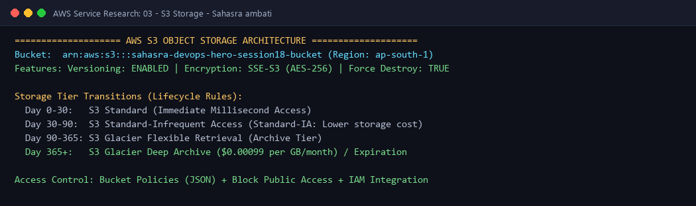

# AWS S3 (Simple Storage Service) - Scalable Cloud Object Storage

---

## 👤 Student Information
- **Name:** Sahasra ambati
- **Enrollment Number:** sahasra10241
- **Course / Track:** DevOps & Cloud Engineering
- **Assignment:** Session 18: AWS Services Research - 03. S3 (Storage)

---

## 💡 What I Understood By This Research (My Reflection)

Amazon S3 is fundamentally different from file systems (EFS/NFS) and block storage (EBS). S3 is an **Object Storage system**:
- Instead of directories and sectors, S3 stores data as discrete objects in a flat namespace identified by unique string keys.
- It delivers **99.999999999% (11 9's) of data durability** by automatically replicating data across a minimum of three geographically separated Availability Zones within an AWS region.
- It acts as the backbone for cloud architectures: hosting static websites, collecting streaming IoT logs, storing Terraform remote state files with DynamoDB state locking, and serving as enterprise data lakes.

---

## 1. What is Amazon S3?
**Amazon Simple Storage Service (Amazon S3)** is an industry-leading object storage service offering high scalability, data availability, security, and performance:
- Can store and retrieve any amount of data from anywhere on the web via simple HTTP/REST API endpoints.
- Supports individual object sizes from 0 bytes up to **5 Terabytes**.
- Serverless architecture: No capacity planning, no filesystem formatting, and virtually unlimited storage elasticity.

---

## 2. Core Concepts & Architecture

```text
+-----------------------------------------------------------------------------------+
|                        AWS S3 BUCKET (Globally Unique Name)                       |
|               e.g., arn:aws:s3:::sahasra-devops-hero-session18-bucket             |
|                                                                                   |
|  +--------------------+   +-----------------------+   +------------------------+  |
|  |     VERSIONING     |   |   SERVER ENCRYPTION   |   |     BUCKET POLICY      |  |
|  | Enabled / Suspended|   | SSE-S3 / SSE-KMS      |   | JSON Resource Security |  |
|  +--------------------+   +-----------------------+   +------------------------+  |
|                                       |                                           |
|                                       v                                           |
|  +-----------------------------------------------------------------------------+  |
|  |                          STORED OBJECTS (Key / Value)                       |  |
|  |  Key: "assets/logo.png"       | Value: Raw Bytes (0B - 5TB)                 |  |
|  |  Version ID: "3/L4kqtJl1"     | Metadata: Content-Type: image/png           |  |
|  +-----------------------------------------------------------------------------+  |
|                                       |                                           |
|                                       v                                           |
|  +-----------------------------------------------------------------------------+  |
|  |                      S3 LIFECYCLE MANAGEMENT RULES                          |  |
|  | Standard (Day 0) -> Standard-IA (Day 30) -> Glacier (Day 90) -> Expire(365)|  |
|  +-----------------------------------------------------------------------------+  |
+-----------------------------------------------------------------------------------+
```

### 2.1 Buckets
- A **Bucket** is a top-level container for objects stored in Amazon S3.
- **Global Uniqueness:** Bucket names are globally unique across all AWS accounts worldwide (e.g., cannot create a bucket named `my-bucket` if another AWS customer already owns it).
- **Regional Deployment:** When creating a bucket, you select a specific AWS region (e.g., `ap-south-1` Mumbai) where all underlying data will physically reside for data residency and latency optimization.

### 2.2 Objects
An **Object** is the fundamental entity stored in Amazon S3, composed of:
1. **Key:** The unique name that identifies the object within the bucket (e.g., `production/logs/2026-10-08.log`). S3 uses prefixes (`/`) to simulate folder hierarchies in UI consoles.
2. **Value:** The actual data payload (binary or text).
3. **Version ID:** Generated by S3 to distinguish iterations of an object when versioning is active.
4. **Metadata:** Key-value pairs describing the object (e.g., `Content-Type: application/json`, custom HTTP headers).
5. **Access Control Information:** Object-level permissions and access tags.

---

## 3. S3 Storage Classes

AWS provides multiple storage tiers to optimize costs based on access frequency and retrieval latency requirements:

| Storage Class | Durability | Availability | Retrieval Latency | Minimum Duration | Best Use Case |
| :--- | :--- | :--- | :--- | :--- | :--- |
| **S3 Standard** | 11 9's | 99.99% | Milliseconds | None | Frequently accessed data, active websites, dynamic mobile apps |
| **S3 Intelligent-Tiering** | 11 9's | 99.9% | Milliseconds | None | Workloads with unknown or changing access patterns (auto-optimizes) |
| **S3 Standard-IA** | 11 9's | 99.9% | Milliseconds | 30 days | Long-term data accessed infrequently (disaster recovery, backups) |
| **S3 One Zone-IA** | 11 9's (1 AZ) | 99.5% | Milliseconds | 30 days | Re-creatable secondary backups stored in a single AZ to save 20% cost |
| **S3 Glacier Instant** | 11 9's | 99.9% | Milliseconds | 90 days | Archive data accessed once a quarter requiring immediate retrieval |
| **S3 Glacier Flexible**| 11 9's | 99.9% | Minutes to Hours | 90 days | Regulatory archives, tape replacements, batch compliance data |
| **S3 Glacier Deep Archive**| 11 9's | 99.9% | 12 to 48 Hours | 180 days | Lowest cost ($0.00099/GB/mo) for 7-10 year compliance records |

---

## 4. Key Advanced Features

### 4.1 Object Versioning
- Keeps multiple variants of an object in the same bucket.
- **Accidental Deletion Protection:** Deleting an object in a versioned bucket inserts a lightweight **Delete Marker** instead of permanently erasing data. The previous version remains restorable.
- Permanent deletion requires explicitly providing the exact `VersionId`.
- Integrates with **MFA Delete** for critical production buckets to prevent unauthorized bucket wipeouts.

### 4.2 Lifecycle Policies
Automated rule engines that transition objects between storage classes or expire (permanently delete) them based on age:
- *Example Rule:*
  - Day 0 to 30: Reside in **S3 Standard**.
  - Day 30: Transition to **S3 Standard-IA**.
  - Day 90: Transition to **S3 Glacier Flexible Retrieval**.
  - Day 365: Expire and permanently delete.

### 4.3 Encryption
- **Encryption at Rest:**
  1. **SSE-S3:** Server-side encryption with Amazon S3-managed keys (AES-256) enabled by default on all new buckets.
  2. **SSE-KMS:** Server-side encryption with AWS Key Management Service keys, providing detailed audit trails in AWS CloudTrail and key rotation.
  3. **SSE-C:** Server-side encryption using customer-provided keys.
- **Encryption in Transit:** Enforced by attaching a bucket policy requiring `aws:SecureTransport: true`, denying all plaintext HTTP requests and mandating TLS/HTTPS.

### 4.4 Bucket Policies vs IAM Policies vs ACLs
- **Bucket Policy:** A JSON resource-based policy attached directly to the S3 bucket. Controls who can access the bucket from any AWS account or public internet.
- **IAM Policy:** Attached to IAM users/roles defining what S3 actions they can execute.
- **Access Control Lists (ACLs):** Legacy access mechanism; AWS recommends disabling ACLs and enforcing **Bucket Owner Enforced** settings.

---

## 5. Common DevOps Use Cases

- **Terraform Remote State Backend:** Storing `terraform.tfstate` in an encrypted, versioned S3 bucket with Amazon DynamoDB state locking to prevent concurrent deployment collisions.
- **Static Website Hosting:** Hosting static SPAs (React, Vue, HTML/CSS) backed by Amazon CloudFront CDN for global caching and low-latency delivery.
- **Centralized CI/CD Artifact Repository:** Uploading build packages, Docker layers, and test reports generated by GitHub Actions pipelines.

#### Architecture Diagram:


---

**Submitted by:** Sahasra ambati (`sahasra10241`)
