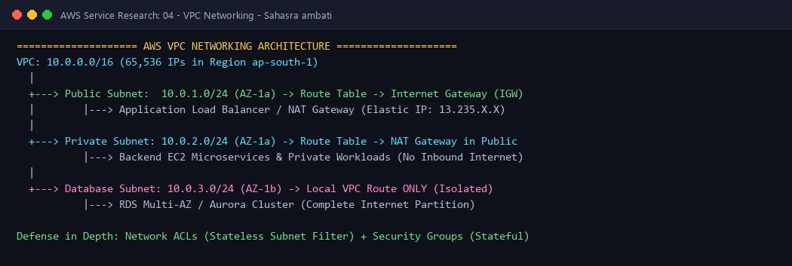

# AWS VPC (Virtual Private Cloud) - Cloud Networking & Isolation

---

## 👤 Student Information
- **Name:** Sahasra ambati
- **Enrollment Number:** sahasra10241
- **Course / Track:** DevOps & Cloud Engineering
- **Assignment:** Session 18: AWS Services Research - 04. VPC (Networking)

---

## 💡 What I Understood By This Research (My Reflection)

Networking in AWS is governed by the Amazon Virtual Private Cloud (VPC). Before this session, I didn't realize how much control engineers have over private cloud topologies:
- A VPC is your own logically isolated private data center inside AWS.
- It gives complete authority over IP address ranges, subnets, route tables, network gateways, and multi-layered security controls.
- Designing a well-architected VPC with public and private subnets is the critical prerequisite for securing web applications, Kubernetes clusters, and databases against unauthorized public exposure.

---

## 1. What is Amazon VPC?
**Amazon Virtual Private Cloud (Amazon VPC)** enables you to provision a logically isolated section of the AWS Cloud where you can launch AWS resources in a virtual network that you define:
- Spans across an entire AWS Region and all its Availability Zones (AZs).
- Gives complete control over IP addressing, routing tables, and network access boundaries.
- Replaces traditional physical switches, routers, and firewalls with software-defined networking (SDN).

---

## 2. Core VPC Networking Building Blocks

```text
+---------------------------------------------------------------------------------------------------+
|                                 AMAZON VPC (CIDR: 10.0.0.0/16)                                    |
|                                                                                                   |
|  +---------------------------------------------------------------------------------------------+  |
|  | [ INTERNET GATEWAY (IGW) ] <======================================================+         |  |
|  +-----------------------------------------------------------------------------------|---------+  |
|                                                                                      |            |
|       AVAILABILITY ZONE 1 (ap-south-1a)                   AVAILABILITY ZONE 2        |            |
|  +-----------------------------------------+     +-----------------------------------|---------+  |
|  | PUBLIC SUBNET (10.0.1.0/24)             |     | PUBLIC SUBNET (10.0.2.0/24)       |         |  |
|  | Route: 0.0.0.0/0 -> IGW                 |     | Route: 0.0.0.0/0 -> IGW           v         |  |
|  |  +------------------+                   |     |  +------------------+        +------------+ |  |
|  |  | NAT GATEWAY      |                   |     |  | NAT GATEWAY      |        | ALB (Pub)  | |  |
|  |  | (Elastic IP)     |                   |     |  | (Elastic IP)     |        +------------+ |  |
|  |  +--------^---------+                   |     |  +------------------+                       |  |
|  +-----------|-----------------------------+     +---------------------------------------------+  |
|              |                                                                                    |
|  +-----------|-----------------------------+     +---------------------------------------------+  |
|  | PRIVATE SUBNET (10.0.11.0/24)           |     | PRIVATE SUBNET (10.0.12.0/24)               |  |
|  | Route: 0.0.0.0/0 -> NAT Gateway         |     | Route: 0.0.0.0/0 -> NAT Gateway             |  |
|  |  +------------------+                   |     |  +------------------+                       |  |
|  |  | EC2 Backend Apps |                   |     |  | EC2 Backend Apps |                       |  |
|  |  +------------------+                   |     |  +------------------+                       |  |
|  +-----------------------------------------+     +---------------------------------------------+  |
|                                                                                                   |
|  +-----------------------------------------+     +---------------------------------------------+  |
|  | ISOLATED DATABASE SUBNET (10.0.21.0/24) |     | ISOLATED DATABASE SUBNET (10.0.22.0/24)     |  |
|  | Route: Local VPC Only                   |     | Route: Local VPC Only                       |  |
|  |  +------------------+                   |     |  +------------------+                       |  |
|  |  | RDS Primary DB   | =======================>|  | RDS Standby (AZ) |                       |  |
|  |  +------------------+  (Sync Replication)|    |  +------------------+                       |  |
|  +-----------------------------------------+     +---------------------------------------------+  |
+---------------------------------------------------------------------------------------------------+
```

### 2.1 CIDR (Classless Inter-Domain Routing)
- When creating a VPC, you assign a primary IPv4 CIDR block from RFC 1918 private ranges (e.g., `10.0.0.0/16`).
- A `/16` mask provides $2^{16} = 65,536$ private IP addresses.
- **AWS Reserved IPs:** In *every* subnet, AWS automatically reserves **5 IP addresses**:
  1. `10.0.X.0`: Network Address.
  2. `10.0.X.1`: VPC Router Gateway.
  3. `10.0.X.2`: Amazon DNS Server (AmazonProvidedDNS).
  4. `10.0.X.3`: Reserved by AWS for future use.
  5. `10.0.X.255`: Network Broadcast Address.
  *(A `/24` subnet has $256 - 5 = 251$ usable host IPs).*

### 2.2 Subnets (Public vs Private)
A subnet is a subdivision of a VPC's IP block that resides entirely within a single **Availability Zone (AZ)**:
- **Public Subnet:** Associated with a Route Table that has a direct route to an **Internet Gateway** (`0.0.0.0/0 -> igw-xxxx`). Instances launched here can receive public IPv4 addresses and communicate directly with the internet.
- **Private Subnet:** Has no direct route to an Internet Gateway (`0.0.0.0/0 -> nat-xxxx` or local only). Instances are shielded from inbound internet connections.

### 2.3 Route Tables
A **Route Table** contains a set of rules (routes) that direct where network traffic from subnets or gateways is routed:
- **Local Route:** Present in all VPC route tables by default (e.g., `10.0.0.0/16 -> local`), allowing all subnets within the same VPC to communicate with each other automatically.
- **Default Route (`0.0.0.0/0`):** Directs all non-VPC traffic to an exit gateway (such as an IGW, NAT Gateway, or Transit Gateway).

### 2.4 Internet Gateway (IGW)
- An **Internet Gateway** is a horizontally scaled, redundant, highly available VPC component that enables communication between instances in your VPC and the internet.
- Performs two roles:
  1. Provides a target in route tables for internet-routable traffic.
  2. Performs Network Address Translation (1:1 NAT) for instances with public IPv4 addresses.

### 2.5 NAT Gateway (Network Address Translation)
- Enables instances in a **private subnet** to initiate outbound traffic to the internet (for software updates, OS patches, external API calls) while **preventing the outside internet from initiating inbound connections** to those private instances.
- Must be deployed in a **Public Subnet** and allocated an **Elastic IP (EIP)**.

---

## 3. Defense-in-Depth: Security Groups vs Network ACLs

AWS uses two distinct firewall layers for defense-in-depth security:

| Feature | Security Group (SG) | Network Access Control List (NACL) |
| :--- | :--- | :--- |
| **Operating Level** | Instance / Network Interface (ENI) | Subnet Boundary Level |
| **State Nature** | **Stateful:** Return traffic is automatically allowed | **Stateless:** Return traffic must be explicitly allowed |
| **Rule Types** | Supports **Allow** rules only | Supports both **Allow** and **Deny** rules |
| **Rule Processing**| All rules evaluated before decision | Evaluated in strict **numerical rule order** (lowest first) |
| **Default Setting** | Inbound denies all; Outbound allows all | Default NACL allows all; Custom NACL denies all |
| **DevOps Purpose** | Fine-grained application & database port firewall | Subnet-wide perimeter defense, blocking malicious IP CIDRs |

---

## 4. Multi-Tier Production Architecture Pattern

The industry standard enterprise architecture divides workloads into three distinct tiers:
1. **Public Presentation Tier (Web/LB):** Application Load Balancers and Bastion Hosts in Public Subnets connected to the IGW.
2. **Private Application Tier (App/Microservices):** Backend container pods or EC2 instances in Private Subnets routing outbound traffic through a NAT Gateway.
3. **Isolated Persistence Tier (Database):** Amazon RDS or Aurora instances in Private Isolated Subnets with **no route to the internet whatsoever**, accessible only by the private Application Tier Security Group.

---

## 5. Common DevOps Use Cases

- **Secure Kubernetes Clusters (Amazon EKS):** Deploying EKS control planes and worker nodes across private subnets with private API server endpoints and NAT gateways.
- **Hybrid Cloud Connectivity:** Establishing private, encrypted site-to-site VPN tunnels or dedicated **AWS Direct Connect** links between corporate on-premises data centers and AWS VPCs.
- **VPC Peering & Transit Gateway:** Connecting hundreds of isolated departmental VPCs across multiple AWS regions and accounts in a hub-and-spoke topology.

#### Architecture Diagram:


---

**Submitted by:** Sahasra ambati (`sahasra10241`)
