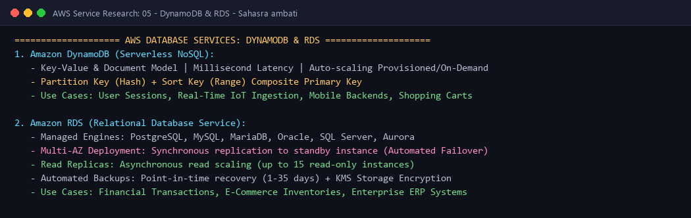

# AWS Database Services: DynamoDB & RDS

---

## 👤 Student Information
- **Name:** Sahasra ambati
- **Enrollment Number:** sahasra10241
- **Course / Track:** DevOps & Cloud Engineering
- **Assignment:** Session 18: AWS Services Research - 05. DynamoDB & RDS (Database Services)

---

## 💡 What I Understood By This Research (My Reflection)

Database choice is one of the most critical architectural decisions in modern cloud software. Before this session, I didn't clearly distinguish when to choose a managed relational database versus a serverless NoSQL datastore:
- **Relational databases (RDS)** prioritize strict ACID compliance, complex multi-table JOINs, and normalized tabular schemas, making them ideal for traditional transactional applications.
- **NoSQL databases (DynamoDB)** trade arbitrary queries and relational joins for virtually unlimited horizontal scalability, single-digit millisecond latency at any throughput scale, and a fully serverless operating model.
- Modern cloud systems rarely choose one exclusively; they practice **polyglot persistence** (e.g., using RDS for transactional user orders, while using DynamoDB for high-throughput session state and shopping carts).

---

## 1. Amazon DynamoDB (Serverless NoSQL)

```text
+-----------------------------------------------------------------------------------+
|                           AMAZON DYNAMODB (Serverless NoSQL)                      |
|                                                                                   |
|  +-----------------------------------------------------------------------------+  |
|  | TABLE: "UserSessions"                                                       |  |
|  |                                                                             |  |
|  |  [PARTITION KEY (Hash)]     [SORT KEY (Range)]      [ATTRIBUTES (Schemaless)]|  |
|  |  UserId (String)             Timestamp (Number)      Data (Map / String / Bool|  |
|  |-----------------------------------------------------------------------------|  |
|  |  "user_101"                  1728364800             { ip: "1.2.3.4", auth:1 }|  |
|  |  "user_101"                  1728368400             { ip: "1.2.3.4", cart:[]}|  |
|  |  "user_202"                  1728372000             { role: "admin", exp:300}|  |
|  +-----------------------------------------------------------------------------+  |
|                                       |                                           |
|       +-------------------------------+-------------------------------+           |
|       v                                                               v           |
|  [ On-Demand Auto-Scaling ]                                [ Single-Digit Millisecond ]
|  (Pay per request, 0 idle)                                 (Consistent fast read/write)
+-----------------------------------------------------------------------------------+
```

### 1.1 What is DynamoDB?
**Amazon DynamoDB** is a fully managed, serverless, key-value and document database designed to deliver single-digit millisecond performance at any scale:
- Multi-region, multi-active database with built-in security, backup, and in-memory caching (DAX).
- Handles over 10 trillion requests per day and can support peaks of more than 20 million requests per second.
- Fully serverless: No servers to provision, patch, or manage; automatically scales throughput up and down based on traffic.

### 1.2 Core Data Model
- **Tables:** A collection of data items (similar to a table in SQL or a collection in MongoDB).
- **Items:** A single record within a table (similar to a row in SQL). Each item can contain an arbitrary set of attributes up to **400 KB** in size.
- **Attributes:** Individual data elements within an item (similar to columns in SQL). Unlike relational tables, DynamoDB is **schemaless**—different items in the same table can possess entirely different attributes.

### 1.3 Keys & Indexing
Every item in a table is uniquely identified by its Primary Key:
1. **Simple Primary Key (Partition Key):**
   - Composed of a single attribute called the **Partition Key (Hash Key)**.
   - DynamoDB runs the partition key value through an internal hash function to determine the physical storage partition where the item resides.
2. **Composite Primary Key (Partition Key + Sort Key):**
   - Composed of two attributes: a **Partition Key (Hash Key)** and a **Sort Key (Range Key)**.
   - All items with the same partition key are stored together in sorted order by their sort key. Allows powerful range queries (`begins_with`, `between`, `>`, `<`).
3. **Secondary Indexes:**
   - **Global Secondary Index (GSI):** An index with a partition key and sort key that can be different from those on the base table.
   - **Local Secondary Index (LSI):** An index that has the same partition key as the table, but a different sort key.

### 1.4 DynamoDB Use Cases
- **User Session & Auth State Management:** Storing active web session tokens, shopping carts, and login state with automatic TTL (Time-To-Live) expiration.
- **Real-Time Gaming Leaderboards:** Ultra-low latency player state updates, inventory tracking, and matchmaking queues.
- **High-Velocity IoT Telemetry:** Ingesting high-frequency sensor readings, smart-meter telemetry, and clickstream feeds.

---

## 2. Amazon RDS (Relational Database Service)

```text
+-----------------------------------------------------------------------------------+
|                        AMAZON RDS (Relational Database Service)                   |
|                                                                                   |
|           [ PRIMARY DB INSTANCE ]                     [ STANDBY DB INSTANCE ]     |
|             (Availability Zone 1)                       (Availability Zone 2)     |
|          +-------------------------+                 +-------------------------+  |
|          | Engine: PostgreSQL/MySQL|                 | Synchronous Standby     |  |
|          | Storage: gp3 / io2 EBS  | ===(Sync Repl)==> Storage: Replicated     |  |
|          | Port: 5432 / 3306       |                 | (Automatic Failover)    |  |
|          +------------+------------+                 +-------------------------+  |
|                       |                                                           |
|                       +=====(Async Replication)=====> [ READ REPLICAS (Up to 15) ]|
|                                                       | Offload Read-Heavy Load  |
|                                                       | Scalable Analytics       |
+-----------------------------------------------------------------------------------+
```

### 2.1 What is Amazon RDS?
**Amazon Relational Database Service (Amazon RDS)** is a managed web service that makes it easy to set up, operate, and scale a relational database in the cloud:
- Automates tedious administrative tasks: hardware provisioning, database setup, software patching, routine OS maintenance, and automated backups.
- Supports six industry-standard database engines:
  1. **PostgreSQL**
  2. **MySQL**
  3. **MariaDB**
  4. **Oracle**
  5. **Microsoft SQL Server**
  6. **Amazon Aurora** (AWS's proprietary cloud-native, high-performance MySQL/PostgreSQL compatible engine).

### 2.2 DB Instances & Storage
- **DB Instance Classes:** Standard (e.g., `db.m6i.large`), Memory-Optimized (`db.r6i.xlarge`), and Burstable (`db.t4g.micro`).
- **Storage Auto-Scaling:** Automatically expands underlying EBS volumes as data grows without requiring downtime.

### 2.3 High Availability & Resilience: Multi-AZ vs Read Replicas

| Feature | Multi-AZ Deployments | Read Replicas |
| :--- | :--- | :--- |
| **Primary Purpose** | **High Availability & Disaster Recovery** | **Horizontal Read Performance Scaling** |
| **Replication Type** | **Synchronous** (zero data loss across AZs) | **Asynchronous** (sub-second replication lag) |
| **Instance Accessibility**| Standby instance is passive and **cannot accept queries** | Replicas are active and **accept read-only queries** |
| **Failover Behavior** | **Automatic failover** in 60-120 seconds (DNS switch) | Manual promotion to standalone master if required |
| **Geographic Scope** | Spans across Availability Zones within the same region | Can be deployed in Same-Region or **Cross-Region** |
| **Maximum Count** | Exactly 1 Standby instance | Up to **15 Read Replicas** per primary instance |

### 2.4 Backups & Security
- **Automated Backups:** Daily volume snapshots combined with transaction logs allow point-in-time recovery (PITR) to any second within the retention window (1 to 35 days).
- **Manual Snapshots:** User-triggered backups that persist indefinitely even if the DB instance is deleted.
- **Security:**
  - Network isolation within private database subnets inside a VPC (no public internet IP).
  - Storage volume encryption at rest using AWS KMS (AES-256).
  - Enforced SSL/TLS encryption for all client connections in transit.

### 2.5 RDS Use Cases
- **Enterprise ERP and CRM Systems:** Relational data requiring strong ACID transactional integrity (Salesforce, SAP, custom internal portals).
- **E-Commerce Transactional Platforms:** Managing complex order catalogs, inventory counts, and relational customer order histories.
- **Financial & Banking Ledger Systems:** Strict schema validation, complex SQL JOIN queries, and regulatory compliance.

---

## 3. Architecture Comparison: DynamoDB vs RDS

| Architectural Criterion | Amazon DynamoDB | Amazon RDS |
| :--- | :--- | :--- |
| **Database Paradigm** | **NoSQL** (Key-Value & Document) | **Relational (RDBMS)** (Tabular & SQL) |
| **Scaling Mechanism** | **Horizontal Scaling** (Automatic partitioning) | **Vertical Scaling** (Master) + Read Replicas |
| **Query Flexibility** | Optimized for Primary Key lookups | Rich, complex queries (`JOIN`, `GROUP BY`, views) |
| **Schema Flexibility**| Schemaless (dynamic attributes per item) | Rigid, predefined schema with DDL migrations |
| **Latency Profile** | Single-digit millisecond latency at any scale | Single-digit to tens of milliseconds |
| **Management Model** | 100% Serverless (zero server patching) | Managed instance (engine upgrades, maintenance windows) |
| **Cost Model** | Pay per request (On-Demand) or provisioned RCU/WCU | Pay per instance hour + allocated EBS storage |

#### Architecture Diagram:


---

**Submitted by:** Sahasra ambati (`sahasra10241`)
