# Session 18, Task 1: Terraform S3 Demo

Creates an **AWS S3 bucket** with Terraform, together with the settings a real bucket should have: versioning, encryption, public-access blocking, a lifecycle rule, tags, and a sample object. It then goes through the complete Terraform workflow, from `init` to `destroy`.

> **Run against LocalStack, not real AWS.** I don't have an AWS account, so this was applied to **[LocalStack](https://www.localstack.cloud/) Community 4.9.2**, a local emulator of the AWS APIs running in Docker. The Terraform code is plain AWS code. `tflocal` (from `terraform-local`) only adds a temporary provider override that points the AWS endpoints at `http://localhost:4566` with test credentials, and `awslocal` is the AWS CLI pointed at LocalStack. With a real account, run the same commands with `terraform` / `aws` instead of `tflocal` / `awslocal`.
>
> One change was needed for LocalStack: the AWS provider is pinned to **`~> 5.0`**. Provider v6 reads bucket tags through the S3 Control `ListTagsForResource` API, which LocalStack Community doesn't implement (`apply` failed with *"No moto route for service s3control"*). Provider v5 uses the regular S3 tagging API.

All screenshots in [`screenshots/`](screenshots/) are real terminal captures.

## Project structure

```text
terraform-s3-demo/
├── main.tf            # bucket + versioning + encryption + public access block + lifecycle + sample object
├── variables.tf       # inputs with types, defaults and validation
├── outputs.tf         # bucket name, ARN, region, versioning status, object URI
├── provider.tf        # terraform{} block (required providers) + AWS provider with default tags
├── terraform.tfvars   # values for the variables (no secrets)
└── README.md
```

## What gets created

| Resource | Purpose |
|---|---|
| `random_id.suffix` | 4-byte random suffix; S3 bucket names are **globally unique** |
| `aws_s3_bucket.demo` | `session18-tf-demo-<suffix>`, tagged via `default_tags` + `Name`/`Environment` |
| `aws_s3_bucket_public_access_block.demo` | blocks all public ACLs and policies |
| `aws_s3_bucket_versioning.demo` | keeps previous object versions |
| `aws_s3_bucket_server_side_encryption_configuration.demo` | SSE-S3 (AES256) for every object |
| `aws_s3_bucket_lifecycle_configuration.demo` | deletes noncurrent versions after 30 days |
| `aws_s3_object.hello` | `hello.txt`, to prove the bucket works |

Concepts used: **provider** with `default_tags`; **variables** with types, defaults and a `validation` rule; **`terraform.tfvars`**; **resources** that reference each other (implicit dependencies) plus `depends_on` (explicit); **outputs**; a conditional expression (`var.versioning_enabled ? "Enabled" : "Suspended"`); string interpolation.

---

## Workflow

### 0. LocalStack running

```bash
docker run -d --name localstack -p 4566:4566 -e SERVICES=s3,s3control,ec2,iam,sts,ssm localstack/localstack:4.9
pip install terraform-local awscli-local awscli
```

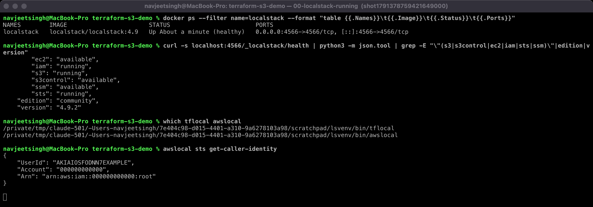

### Files

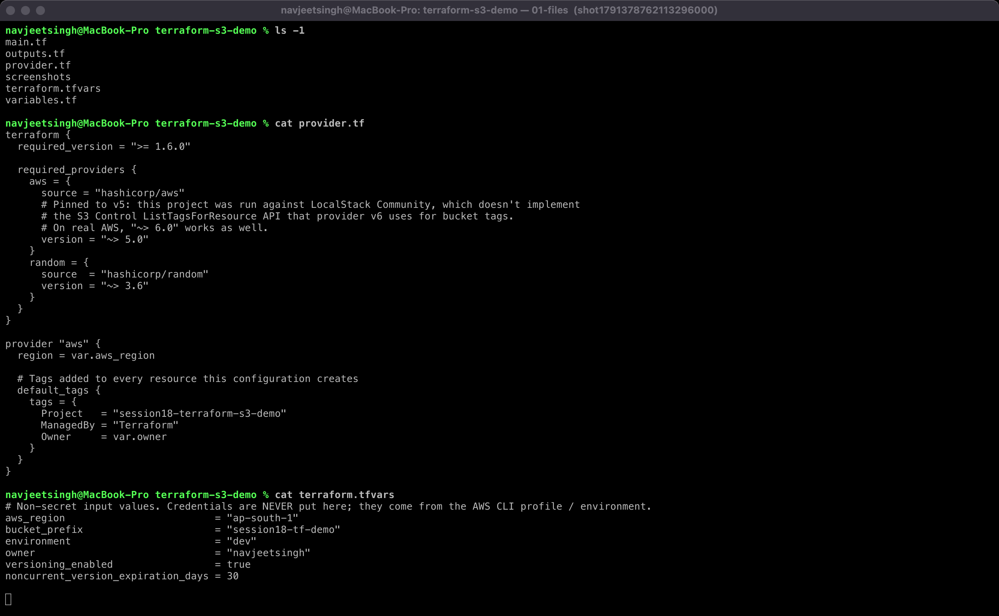

### 1. `terraform init`

Downloads the providers (`hashicorp/aws` v5.100.0, `hashicorp/random`) into `.terraform/` and writes `.terraform.lock.hcl` so every run uses the same versions.

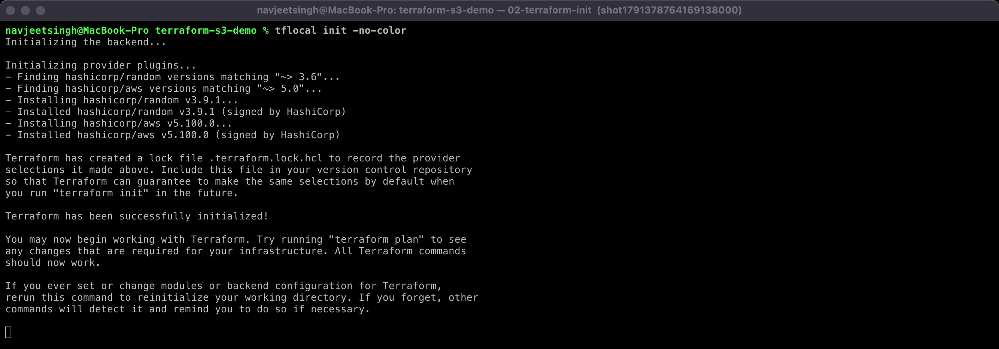

### 2. `terraform fmt` and 3. `terraform validate`

`fmt` rewrites files in canonical style (`-check -diff` only reports). `validate` checks syntax, references and types without contacting AWS.

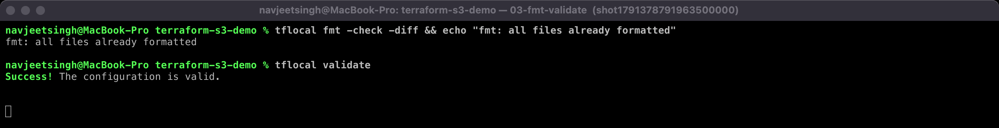

### 4. `terraform plan`

Compares the configuration with the (empty) state and shows what would change: **7 to add**. `-out=tfplan` saves the exact plan, so `apply` does exactly what was reviewed.

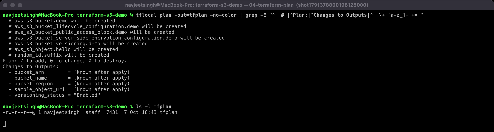

### 5. `terraform apply`

`Apply complete! Resources: 7 added`. Terraform created them in dependency order: random_id → bucket → its configuration resources → object.

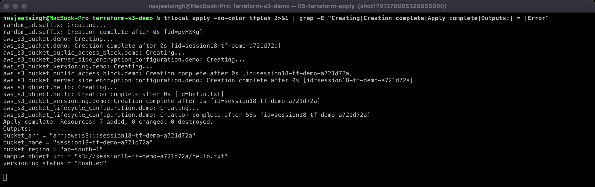

### 6. `terraform show` / state

`terraform state list` shows the 7 tracked resources, and `terraform state show` shows everything Terraform recorded about the bucket (ARN, region, tags including the provider's `default_tags`…). `terraform show` prints the whole state the same way.

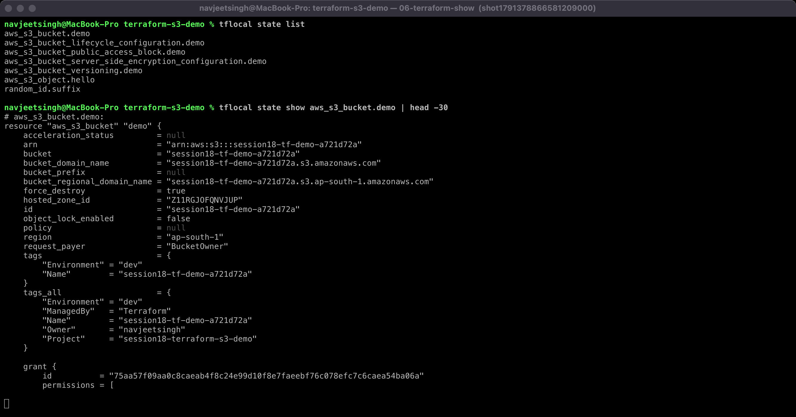

### 7. `terraform output`

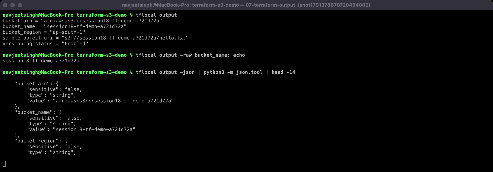

### Verify the bucket independently (AWS CLI)

The bucket exists with `hello.txt` inside, versioning `Enabled`, and the expected tags:

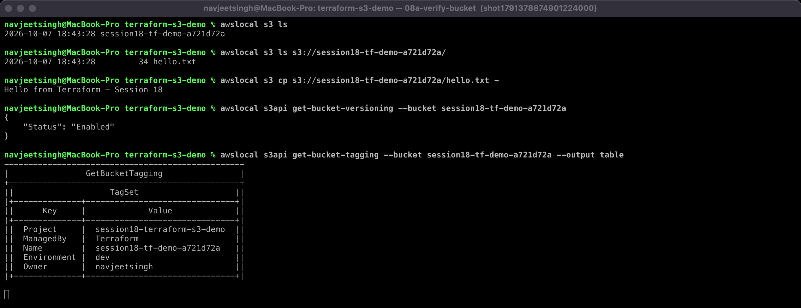

Encryption `AES256`, all four public-access blocks `True`, and the lifecycle rule (noncurrent versions expire after 30 days):

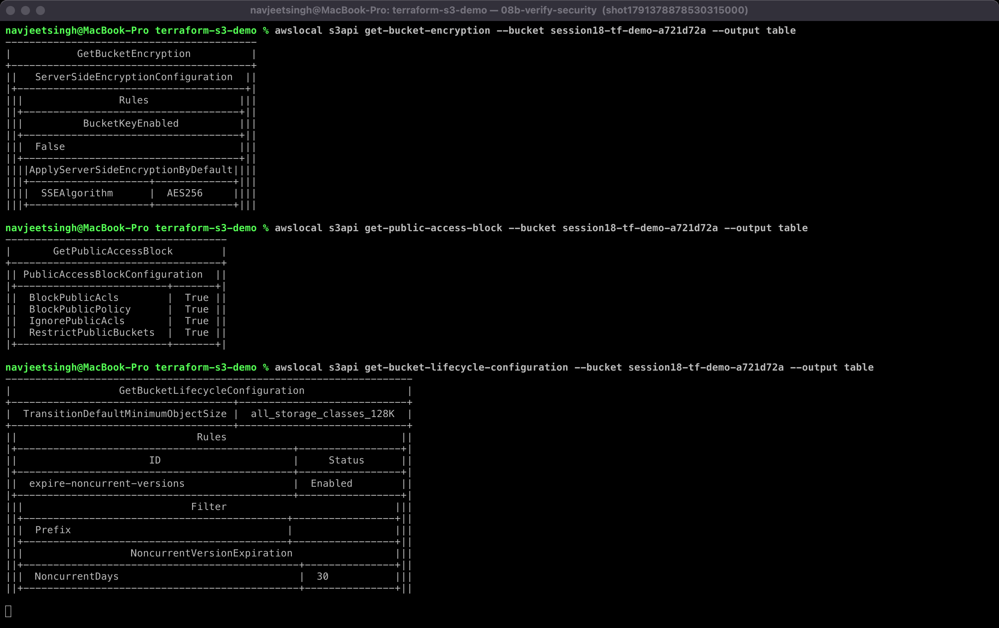

### 8. `terraform destroy`

`Destroy complete! Resources: 7 destroyed`. Nothing is left in the state or in S3. `force_destroy = true` lets Terraform delete the bucket even though it still contains (versioned) objects; that setting is for labs only.

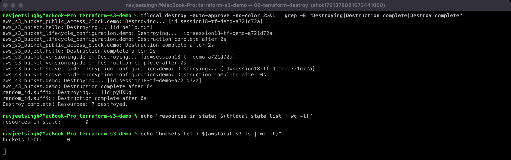

---

## Commands summary

```bash
tflocal init        # terraform init
tflocal fmt         # terraform fmt
tflocal validate    # terraform validate
tflocal plan -out=tfplan
tflocal apply tfplan
tflocal show        # or: state list / state show <addr>
tflocal output
tflocal destroy -auto-approve
```

## Notes

- `terraform.tfvars` is committed on purpose (it holds no secrets). Credentials never go in `.tf`/`.tfvars` files; Terraform reads them from the AWS CLI profile or environment.
- `.terraform/`, `*.tfstate` and plan files are git-ignored. State can contain sensitive values, and in a team it belongs in a remote backend (S3 with locking).
