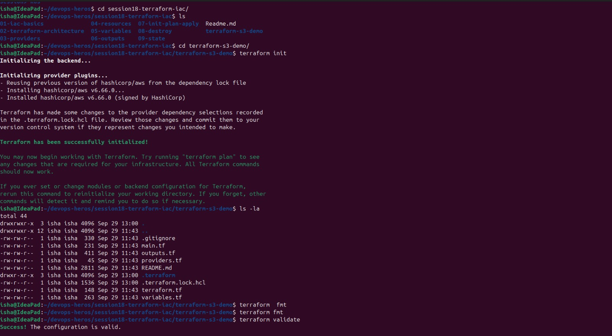
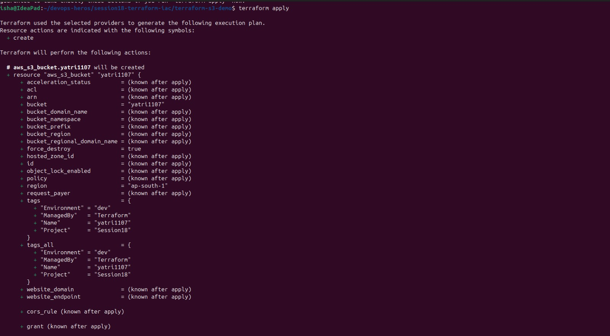

# Session 18 — Terraform S3 Demo

## Overview

This project demonstrates **Infrastructure as Code (IaC)** using Terraform to create and manage an Amazon S3 bucket.

Instead of manually creating the bucket through the AWS Management Console, Terraform is used to define the infrastructure as configuration and provision it automatically.

The complete workflow includes:

```text
Terraform Configuration
        ↓
terraform init
        ↓
terraform fmt
        ↓
terraform validate
        ↓
terraform plan
        ↓
terraform apply
        ↓
AWS S3 Bucket Created
        ↓
terraform show / output
        ↓
terraform destroy
        ↓
AWS S3 Bucket Deleted
```

---

# 1. Objective

The objectives of this task are:

- Understand Infrastructure as Code.
- Install and configure Terraform.
- Configure the AWS provider.
- Create an Amazon S3 bucket using Terraform.
- Use Terraform variables and outputs.
- Understand the Terraform workflow.
- Validate and preview infrastructure changes.
- Apply infrastructure changes to AWS.
- Inspect Terraform-managed infrastructure.
- Destroy the infrastructure using Terraform.

---

# 2. Technologies Used

| Technology | Purpose |
|---|---|
| Terraform | Infrastructure as Code |
| AWS | Cloud infrastructure provider |
| Amazon S3 | Object storage |
| AWS CLI | AWS resource verification |
| Git | Version control |

---

# 3. Project Structure

```text
terraform-s3-demo/
├── main.tf
├── variables.tf
├── outputs.tf
├── provider.tf
├── terraform.tfvars
└── README.md
```

After running Terraform, additional files/directories such as `.terraform/` and `terraform.tfstate` may also be created.

---

# 4. Prerequisites

Before starting, make sure the following are installed.

## Terraform

Check the Terraform installation:

```bash
terraform version
```

Expected output:

```text
Terraform vX.X.X
```

## AWS CLI

Check AWS CLI:

```bash
aws --version
```

## AWS Credentials

Configure AWS credentials using:

```bash
aws configure
```

Provide:

```text
AWS Access Key ID
AWS Secret Access Key
Default region
Output format
```

Verify that the AWS identity is accessible:

```bash
aws sts get-caller-identity
```

Do not commit AWS access keys or secret credentials to GitHub.

---

# 5. Terraform Configuration

## 5.1 provider.tf

The AWS provider tells Terraform that AWS will be used as the infrastructure provider.

```hcl
terraform {
  required_providers {
    aws = {
      source  = "hashicorp/aws"
      version = "~> 6.0"
    }
  }
}

provider "aws" {
  region = var.aws_region
}
```

The AWS region is supplied through the Terraform variable `aws_region`.

---

## 5.2 variables.tf

Variables make the Terraform configuration reusable.

```hcl
variable "aws_region" {
  description = "AWS region where the S3 bucket will be created"
  type        = string
}

variable "bucket_name" {
  description = "Globally unique S3 bucket name"
  type        = string
}
```

---

## 5.3 terraform.tfvars

The variable values are provided through `terraform.tfvars`.

```hcl
aws_region  = "ap-south-1"
bucket_name = "session18-terraform-isha-2026"
```

> The S3 bucket name must be globally unique. If the name already exists, choose another unique name.

---

## 5.4 main.tf

The S3 bucket is created using the `aws_s3_bucket` resource.

```hcl
resource "aws_s3_bucket" "terraform_demo" {
  bucket = var.bucket_name

  tags = {
    Name        = "Session 18 Terraform Demo"
    Environment = "Learning"
    ManagedBy   = "Terraform"
  }
}
```

Terraform uses this configuration to create the S3 bucket in AWS.

---

## 5.5 outputs.tf

Outputs display useful information after Terraform creates the resource.

```hcl
output "bucket_name" {
  description = "Name of the S3 bucket"
  value       = aws_s3_bucket.terraform_demo.bucket
}

output "bucket_arn" {
  description = "ARN of the S3 bucket"
  value       = aws_s3_bucket.terraform_demo.arn
}
```

---

# 6. Terraform Workflow

## Step 1 — Initialize Terraform

Run:

```bash
terraform init
```

This downloads the required provider and initializes the Terraform working directory.

Expected result:

```text
Terraform has been successfully initialized!
```

### Screenshot



---

## Step 2 — Format Terraform Files

Run:

```bash
terraform fmt
```

This formats Terraform configuration files according to Terraform's standard formatting.

Expected result:

```text
provider.tf
variables.tf
main.tf
outputs.tf
```

### Screenshot


---

## Step 3 — Validate Configuration

Run:

```bash
terraform validate
```

Expected output:

```text
Success! The configuration is valid.
```

This checks whether the Terraform configuration is syntactically and structurally valid.

### Screenshot


---

# 7. Terraform Plan

Run:

```bash
terraform plan
```

Terraform compares the desired infrastructure configuration with the current infrastructure state.

You should see an action similar to:

```text
Plan: 1 to add, 0 to change, 0 to destroy.
```

The `+` symbol indicates that Terraform plans to create the S3 bucket.

Example:

```text
+ resource "aws_s3_bucket" "terraform_demo" {
    + bucket = "session18-terraform-isha-2026"
}
```

### Screenshot


---

# 8. Create the S3 Bucket

Run:

```bash
terraform apply
```

Terraform displays the planned changes and asks for confirmation.

Type:

```text
yes
```

Example final output:

```text
Apply complete! Resources: 1 added, 0 changed, 0 destroyed.
```

### Screenshot




---

# 9. Verify S3 Bucket

After Terraform creates the bucket, verify it using AWS CLI.

Run:

```bash
aws s3 ls
```

The created bucket should appear in the output.

Example:

```text
2026-10-07  session18-terraform-isha-2026
```

You can also verify the bucket using the AWS Management Console:

```text
AWS Console
   ↓
S3
   ↓
Buckets
   ↓
session18-terraform-isha-2026
```

---

# 10. Terraform Show

Run:

```bash
terraform show
```

This displays the resources currently managed by Terraform.

The output should contain information about:

```text
aws_s3_bucket.terraform_demo
```

It may include:

- Bucket name
- ARN
- Region
- Tags
- Resource configuration

---

# 11. Terraform Output

Run:

```bash
terraform output
```

Expected output will contain values similar to:

```text
bucket_arn = "arn:aws:s3:::session18-terraform-isha-2026"
bucket_name = "session18-terraform-isha-2026"
```

You can also retrieve an individual output:

```bash
terraform output bucket_name
```

---

# 12. Destroy Infrastructure

When the resource is no longer required, Terraform can remove it.

Run:

```bash
terraform destroy
```

---

# 13. Complete Command Sequence

The complete workflow can be executed using:

```bash
cd terraform-s3-demo

terraform init

terraform fmt

terraform validate

terraform plan

terraform apply

terraform show

terraform output

aws s3 ls

terraform destroy

aws s3 ls
```

---

# 14. Infrastructure Workflow

```text
                 Terraform Files
                       |
                       v
                terraform init
                       |
                       v
                 terraform fmt
                       |
                       v
              terraform validate
                       |
                       v
                 terraform plan
                       |
                       v
                terraform apply
                       |
                       v
                AWS S3 Bucket
                       |
             ┌─────────┴─────────┐
             |                   |
      terraform show      terraform output
             |                   |
             └─────────┬─────────┘
                       |
                       v
                terraform destroy
                       |
                       v
                S3 Bucket Deleted
```

---

# 15. Infrastructure as Code

Infrastructure as Code means managing infrastructure through configuration files instead of manually creating resources.

### Traditional Approach

```text
AWS Console
    ↓
Create Resource
    ↓
Configure Resource
    ↓
Repeat Manually
```

### Terraform Approach

```text
Terraform Configuration
        ↓
terraform plan
        ↓
terraform apply
        ↓
Infrastructure Created
```

Advantages include:

- Repeatability
- Automation
- Version control
- Consistency
- Easier collaboration
- Reduced manual configuration

---

# 16. Terraform State

Terraform maintains a state file:

```text
terraform.tfstate
```

The state file tracks resources managed by Terraform.

For example:

```text
Terraform Configuration
        |
        v
terraform.tfstate
        |
        v
AWS Infrastructure
```

The state file is important because Terraform uses it to determine what infrastructure already exists.

### Important

Do not commit Terraform state files to public repositories.

Recommended `.gitignore`:

```gitignore
.terraform/
*.tfstate
*.tfstate.*
crash.log
*.tfvars
*.tfvars.json
.env
*.pem
```

If `terraform.tfvars` contains only non-sensitive values such as region and bucket name, it may be committed if desired. However, keeping variable files out of Git is safer if they may later contain secrets.

---

# 17. Security Considerations

The following practices should be followed:

- Never hard-code AWS access keys in Terraform files.
- Never commit AWS secret keys to GitHub.
- Do not make the S3 bucket public unless required.
- Use least-privilege IAM permissions.
- Enable appropriate encryption for sensitive data.
- Protect Terraform state.
- Use remote state with access controls for production environments.
- Use separate AWS accounts/environments where appropriate.
- Review resources before running `terraform apply` or `terraform destroy`.

---

# 18. Why Terraform is Useful

Terraform allows infrastructure to be described declaratively.

For example:

```hcl
resource "aws_s3_bucket" "terraform_demo" {
  bucket = var.bucket_name
}
```

Terraform determines how to create and manage the required infrastructure.

This makes infrastructure:

- Reproducible
- Auditable
- Version controlled
- Automated
- Easier to maintain

---

# 19. Expected Final Result

After running:

```bash
terraform apply
```

the following resource should exist:

```text
AWS
 |
 S3
 |
 session18-terraform-isha-2026
```

After running:

```bash
terraform destroy
```

the bucket should be removed.

---

# 22. Final Result

The Terraform S3 demo successfully demonstrates the complete Infrastructure as Code lifecycle:

```text
Initialize
   ↓
Format
   ↓
Validate
   ↓
Plan
   ↓
Apply
   ↓
Verify
   ↓
Inspect
   ↓
Output
   ↓
Destroy
```

Terraform was used to provision and manage an Amazon S3 bucket without manually creating the infrastructure through the AWS Console.

---

# Conclusion

This task demonstrates how Terraform can be used to manage AWS infrastructure using Infrastructure as Code. The S3 bucket was defined using Terraform configuration, validated using `terraform validate`, previewed using `terraform plan`, created using `terraform apply`, inspected using Terraform commands, and finally removed using `terraform destroy`.

The exercise provides a foundation for using Terraform to manage larger AWS infrastructures in a repeatable and automated manner.
