# 09 - Session 19 End-to-End Project: Cloud & Terraform in Action

Build a complete piece of AWS infrastructure with Terraform:

```text
Terraform
   |
   v
VPC -> Public Subnet -> Security Group -> EC2 (nginx)
   |
   +-- S3 Bucket (versioned, encrypted, private)
```

One `terraform apply` creates 13 resources. One `terraform destroy` removes all of them.

This project demonstrates:

```text
Providers | Variables | Resources | Outputs | Dependencies
AWS infrastructure | Terraform state | plan | apply | destroy
```

---

# Architecture

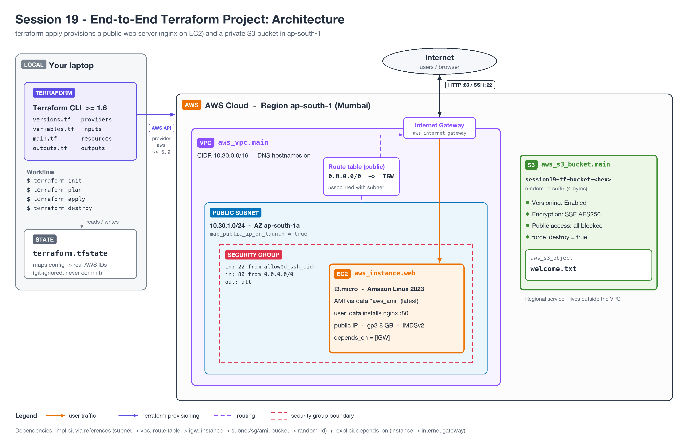

```text
  Your laptop                                AWS - ap-south-1
+-----------------+     AWS API      +------------------------------------------------+
| Terraform CLI   | ---------------> |                     Internet                   |
| *.tf files      |                  |                         |  HTTP :80 / SSH :22  |
|                 |                  |                 Internet Gateway               |
| terraform.tfstate                  |                         |                      |
+-----------------+                  |  +------------- VPC 10.30.0.0/16 ----------+   |
                                     |  |  Route table: 0.0.0.0/0 -> IGW          |   |
                                     |  |  +------ Public Subnet 10.30.1.0/24 --+ |   |
                                     |  |  |  +--- Security Group (22, 80) ---+ | |   |
                                     |  |  |  |  EC2 t3.micro, AL2023, nginx | | |   |
                                     |  |  |  +------------------------------+ | |   |
                                     |  |  +-----------------------------------+ |   |
                                     |  +-----------------------------------------+   |
                                     |                                                |
                                     |  S3: session19-tf-bucket-<hex> / welcome.txt   |
                                     +------------------------------------------------+
```

S3 is a regional service, so the bucket lives outside the VPC.

---

# Project Structure

```text
09-end-to-end-project/
|
|-- README.md
|-- versions.tf                 # terraform block, aws + random providers, default_tags
|-- variables.tf                # inputs with defaults and validation
|-- main.tf                     # VPC, subnet, IGW, route table, SG, AMI lookup, EC2, S3
|-- outputs.tf                  # IDs, public IP, website URL, bucket name/ARN
|-- terraform.tfvars.example    # copy to terraform.tfvars
|-- .gitignore                  # state, tfvars, .terraform/ are never committed
|-- local-mock/
|   |-- mock_aws_override.tf    # optional: point the provider at a local AWS mock
|-- architecture/
|   |-- architecture.png
|-- screenshots/
    |-- 01-terraform-version.png ... 12-after-destroy.png
```

---

# Terraform Concepts Used

## 1. Providers

Defined in `versions.tf`:

| Provider | Version | Used for |
|----------|---------|----------|
| `hashicorp/aws` | `~> 6.0` (installed `v6.67.0`) | VPC, subnet, IGW, route table, SG, EC2, S3 |
| `hashicorp/random` | `~> 3.6` (installed `v3.9.1`) | `random_id` suffix for a globally unique bucket name |

The AWS provider uses `default_tags`, so every AWS resource automatically gets:

```text
Project   = session19
Session   = 19
ManagedBy = Terraform
```

These appear in `tags_all` in the plan, while `tags` holds only the resource's own tags.

## 2. Variables

Defined in `variables.tf`, overridden in `terraform.tfvars`:

| Variable | Default | Validation |
|----------|---------|------------|
| `aws_region` | `ap-south-1` | - |
| `project_name` | `session19` | - |
| `vpc_cidr` | `10.30.0.0/16` | must be a valid IPv4 CIDR (`can(cidrhost(...))`) |
| `public_subnet_cidr` | `10.30.1.0/24` | must be a valid IPv4 CIDR |
| `instance_type` | `t3.micro` | must be one of `t2.micro`, `t3.micro`, `t3.small` |
| `allowed_ssh_cidr` | `0.0.0.0/0` | - (set it to your own IP `/32` in tfvars) |

A bad value fails at `terraform plan` with the custom `error_message`, before anything is created.

## 3. Resources

13 managed resources plus 1 data source:

| # | Resource | Purpose |
|---|----------|---------|
| 1 | `aws_vpc.main` | VPC `10.30.0.0/16`, DNS support and hostnames on |
| 2 | `aws_subnet.public` | Public subnet `10.30.1.0/24` in `ap-south-1a`, auto-assign public IP |
| 3 | `aws_internet_gateway.main` | Internet access for the VPC |
| 4 | `aws_route_table.public` | Route `0.0.0.0/0 -> IGW` |
| 5 | `aws_route_table_association.public` | Attaches the route table to the subnet |
| 6 | `aws_security_group.web` | Ingress 22 (from `allowed_ssh_cidr`) and 80 (from anywhere), all egress |
| 7 | `aws_instance.web` | EC2 `t3.micro`, Amazon Linux 2023, nginx via `user_data`, encrypted gp3 8 GB, IMDSv2 required |
| 8 | `random_id.bucket_suffix` | 4-byte random hex suffix |
| 9 | `aws_s3_bucket.main` | `session19-tf-bucket-<hex>`, `force_destroy = true` (demo only) |
| 10 | `aws_s3_bucket_versioning.main` | Versioning `Enabled` |
| 11 | `aws_s3_bucket_public_access_block.main` | All public access blocked |
| 12 | `aws_s3_bucket_server_side_encryption_configuration.main` | SSE `AES256` |
| 13 | `aws_s3_object.welcome` | Uploads `welcome.txt` |
| - | `data.aws_ami.al2023` | Looks up the latest Amazon Linux 2023 x86_64 AMI (read-only, not counted) |

## 4. Outputs

Defined in `outputs.tf`:

```text
vpc_id, subnet_id, security_group_id
instance_id, instance_public_ip, website_url, ami_id
s3_bucket_name, s3_bucket_arn
```

Read them any time with `terraform output` or `terraform output -raw website_url`.

## 5. Dependencies

**Implicit** - Terraform builds the dependency graph from references:

```text
aws_subnet.public            -> aws_vpc.main.id
aws_internet_gateway.main    -> aws_vpc.main.id
aws_security_group.web       -> aws_vpc.main.id
aws_route_table.public       -> aws_internet_gateway.main.id
aws_route_table_association  -> aws_subnet.public.id, aws_route_table.public.id
aws_instance.web             -> aws_subnet.public.id, aws_security_group.web.id, data.aws_ami.al2023.id
aws_s3_bucket.main           -> random_id.bucket_suffix.hex
aws_s3_bucket_* / s3_object  -> aws_s3_bucket.main.id
```

**Explicit** - `aws_instance.web` has:

```hcl
depends_on = [aws_internet_gateway.main]
```

Nothing in the instance block references the IGW, so Terraform cannot infer this. But `user_data` runs `dnf install -y nginx` at first boot and needs outbound internet, so the IGW must exist first.

Creation order (from the recorded `terraform apply`; independent resources run in parallel):

```text
1. random_id.bucket_suffix, aws_vpc.main, aws_s3_bucket.main
2. aws_internet_gateway.main, aws_subnet.public, aws_security_group.web,
   S3 versioning / public access block / encryption / welcome.txt
3. aws_route_table.public                 (needs IGW)
4. aws_route_table_association.public     (needs subnet + route table)
   aws_instance.web                       (needs subnet + SG + AMI + IGW)
```

`terraform destroy` walks the same graph in reverse: the instance is destroyed before the IGW, subnet and SG, and the VPC is destroyed last.

## 6. State

- State is stored locally in `terraform.tfstate` (about 30 KB after apply). It maps each resource address to the real AWS ID.
- `terraform state list` shows every tracked resource; `terraform state show aws_instance.web` shows all its attributes.
- `terraform.tfstate`, `*.tfstate.*`, `*.tfvars` and `.terraform/` are in `.gitignore` because state can contain sensitive values (IPs, ARNs, sometimes secrets) and must not be shared through Git. In a team, use a remote backend (S3 + locking) instead.

---

# Prerequisites

- Terraform `>= 1.6.0`
- AWS CLI v2
- An AWS account with an IAM user/role allowed to manage EC2, VPC and S3

```bash
brew install terraform awscli      # macOS; see official docs for other OSes
terraform version
aws configure                      # access key, secret key, region ap-south-1
aws sts get-caller-identity        # confirm credentials work
```

---

# Run Against Real AWS

> `t3.micro` is free-tier eligible in `ap-south-1`. Still, run `terraform destroy` when you are done.

Make sure `mock_aws_override.tf` is **not** in the project root (that file redirects the provider to a local mock):

```bash
rm -f mock_aws_override.tf
```

Copy variables and set `allowed_ssh_cidr` to your IP (`curl ifconfig.me`):

```bash
cp terraform.tfvars.example terraform.tfvars
```

Initialize, format, validate:

```bash
terraform init
terraform fmt -check -recursive
terraform validate
```

Expected:

```text
Success! The configuration is valid.
```

Plan and save the plan:

```bash
terraform plan -out=tfplan
```

Expected:

```text
Plan: 13 to add, 0 to change, 0 to destroy.
```

Apply exactly that plan:

```bash
terraform apply tfplan
```

Expected:

```text
Apply complete! Resources: 13 added, 0 changed, 0 destroyed.
```

Inspect outputs and state:

```bash
terraform output
terraform state list
terraform state show aws_instance.web
```

Verify:

```bash
# Wait 1-2 minutes for user_data to install nginx
curl "$(terraform output -raw website_url)"

aws ec2 describe-instances --filters Name=tag:Session,Values=19 \
  --query 'Reservations[].Instances[].[InstanceId,InstanceType,State.Name,PublicIpAddress]' --output table

aws s3 ls "s3://$(terraform output -raw s3_bucket_name)"
```

Expected page:

```text
Hello from Session 19 - deployed with Terraform
```

A second `terraform plan` should report:

```text
No changes. Your infrastructure matches the configuration.
```

Destroy:

```bash
terraform destroy
```

Expected:

```text
Destroy complete! Resources: 13 destroyed.
```

---

# How This Was Executed

The recorded run (outputs and screenshots below) did **not** use a real AWS account.

It used [Moto](https://github.com/getmoto/moto), a free, open-source mock of the AWS APIs that runs locally. No AWS account, credentials or cost was needed.

```bash
pip install "moto[server]"
moto_server -p 4566                       # leave running in another terminal

cp local-mock/mock_aws_override.tf .      # point the aws provider at localhost:4566
terraform init
terraform plan -out=tfplan
terraform apply tfplan
...
terraform destroy -auto-approve
```

How it works:

- `mock_aws_override.tf` uses Terraform's `*_override.tf` merge feature. It adds dummy credentials, skips account/credential checks and sets `endpoints { ec2, s3, sts, iam, ssm = "http://localhost:4566" }`. The real `.tf` files are unchanged.
- The AWS CLI verification commands in the screenshots use `--endpoint-url http://localhost:4566` so they query the mock.
- All resource IDs (`vpc-...`, `i-...`, `sg-...`), the AMI ID and the public IP `54.214.126.124` were generated by the mock. Nothing is reachable on the internet, so `curl website_url` was not part of the recorded run.
- On the mock, a second `terraform plan` showed small in-place drift: `Plan: 0 to add, 2 to change, 0 to destroy.` (`vpc_security_group_ids` on the instance and the `Name` tag on the S3 bucket). This happens because Moto does not fully emulate those read APIs. Against real AWS the same plan reports no changes.

Delete the copied `mock_aws_override.tf` from the root to target real AWS again.

---

# Recorded Results

Terraform `v1.16.4` on `darwin_arm64`.

`terraform init`:

```text
- Installed hashicorp/aws v6.67.0 (signed by HashiCorp)
- Installed hashicorp/random v3.9.1 (signed by HashiCorp)

Terraform has been successfully initialized!
```

`terraform plan -out=tfplan`:

```text
data.aws_ami.al2023: Read complete after 1s [id=ami-0884624fc54d115f3]
...
Plan: 13 to add, 0 to change, 0 to destroy.
```

`terraform apply tfplan`:

```text
aws_vpc.main: Creation complete after 0s [id=vpc-bdbde4c70d1c22167]
aws_s3_bucket.main: Creation complete after 0s [id=session19-tf-bucket-409b0a64]
aws_internet_gateway.main: Creation complete after 0s [id=igw-070451424f936d61d]
aws_security_group.web: Creation complete after 1s [id=sg-6397ecd4174f01d58]
aws_route_table.public: Creation complete after 1s [id=rtb-53dfbc2ec6556afc0]
aws_subnet.public: Creation complete after 10s [id=subnet-19e01386ffdca3399]
aws_route_table_association.public: Creation complete after 0s [id=rtbassoc-1934d297e78d45eaa]
aws_instance.web: Creation complete after 11s [id=i-8ce39c330b8111061]

Apply complete! Resources: 13 added, 0 changed, 0 destroyed.
```

`terraform output`:

```text
ami_id = "ami-0884624fc54d115f3"
instance_id = "i-8ce39c330b8111061"
instance_public_ip = "54.214.126.124"
s3_bucket_arn = "arn:aws:s3:::session19-tf-bucket-409b0a64"
s3_bucket_name = "session19-tf-bucket-409b0a64"
security_group_id = "sg-6397ecd4174f01d58"
subnet_id = "subnet-19e01386ffdca3399"
vpc_id = "vpc-bdbde4c70d1c22167"
website_url = "http://54.214.126.124"
```

`terraform state list`:

```text
data.aws_ami.al2023
aws_instance.web
aws_internet_gateway.main
aws_route_table.public
aws_route_table_association.public
aws_s3_bucket.main
aws_s3_bucket_public_access_block.main
aws_s3_bucket_server_side_encryption_configuration.main
aws_s3_bucket_versioning.main
aws_s3_object.welcome
aws_security_group.web
aws_subnet.public
aws_vpc.main
random_id.bucket_suffix
```

AWS CLI verification (against the mock):

```text
vpc-bdbde4c70d1c22167     10.30.0.0/16   available
subnet-19e01386ffdca3399  10.30.1.0/24   ap-south-1a
security group ingress    tcp 80, tcp 22
i-8ce39c330b8111061       t3.micro       running      54.214.126.124
s3://session19-tf-bucket-409b0a64/welcome.txt  (62 bytes), versioning Enabled
```

`terraform destroy -auto-approve`:

```text
aws_instance.web: Destruction complete after 10s
aws_internet_gateway.main: Destruction complete after 0s
aws_vpc.main: Destruction complete after 0s

Destroy complete! Resources: 13 destroyed.
```

After destroy, `terraform state list` is empty, no running instances are tagged `Session=19`, and `aws s3 ls` lists no buckets.

---

# Screenshots

**1. Terraform version**

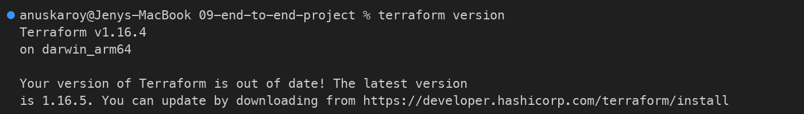

**2. `terraform init` - downloads the aws and random providers**

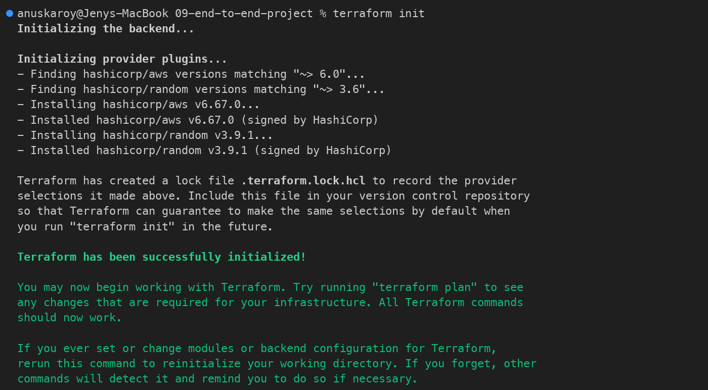

**3. `terraform fmt -check` and `terraform validate`**

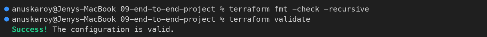

**4a. `terraform plan -out=tfplan` - resources to be created**

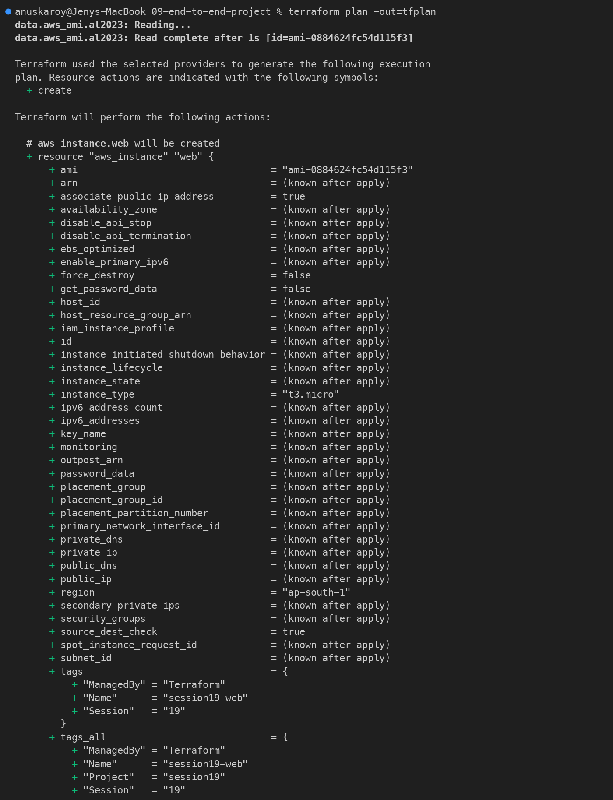

**4b. Plan summary - `Plan: 13 to add, 0 to change, 0 to destroy.`**

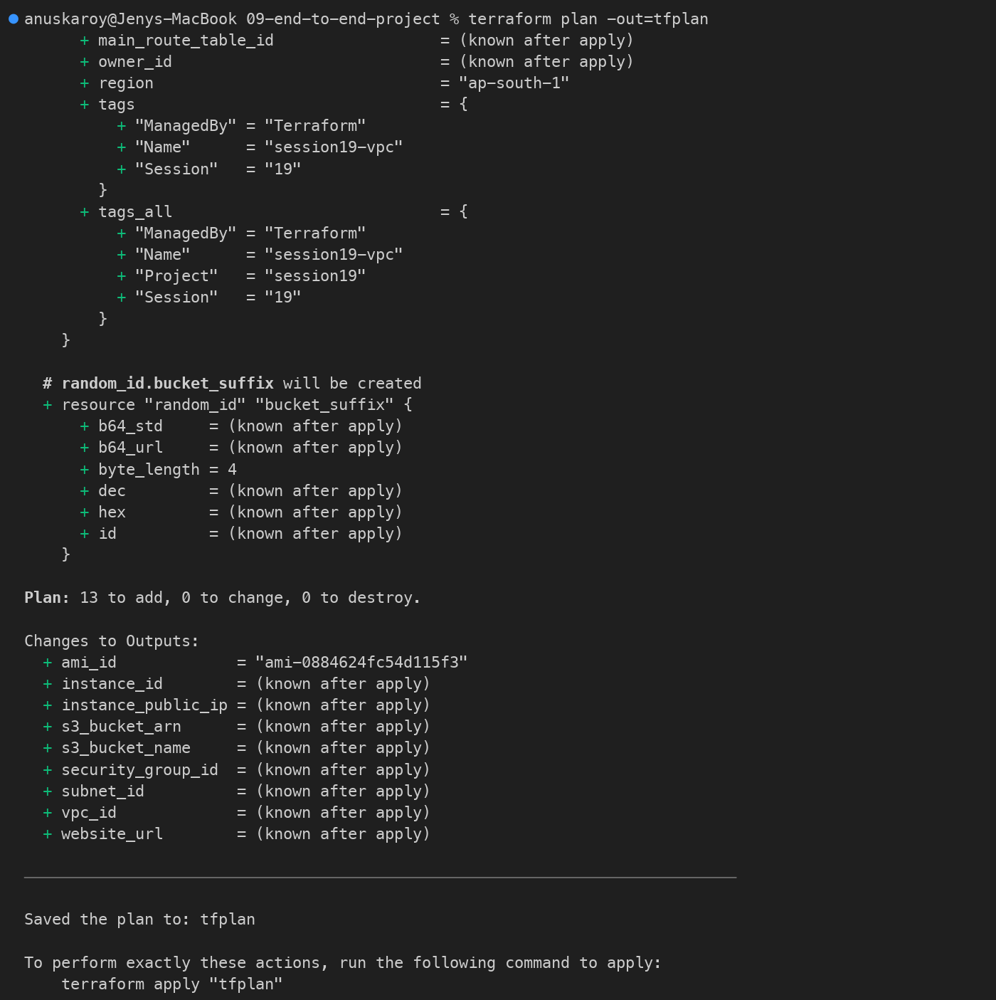

**5. `terraform apply tfplan` - `Apply complete! Resources: 13 added`**

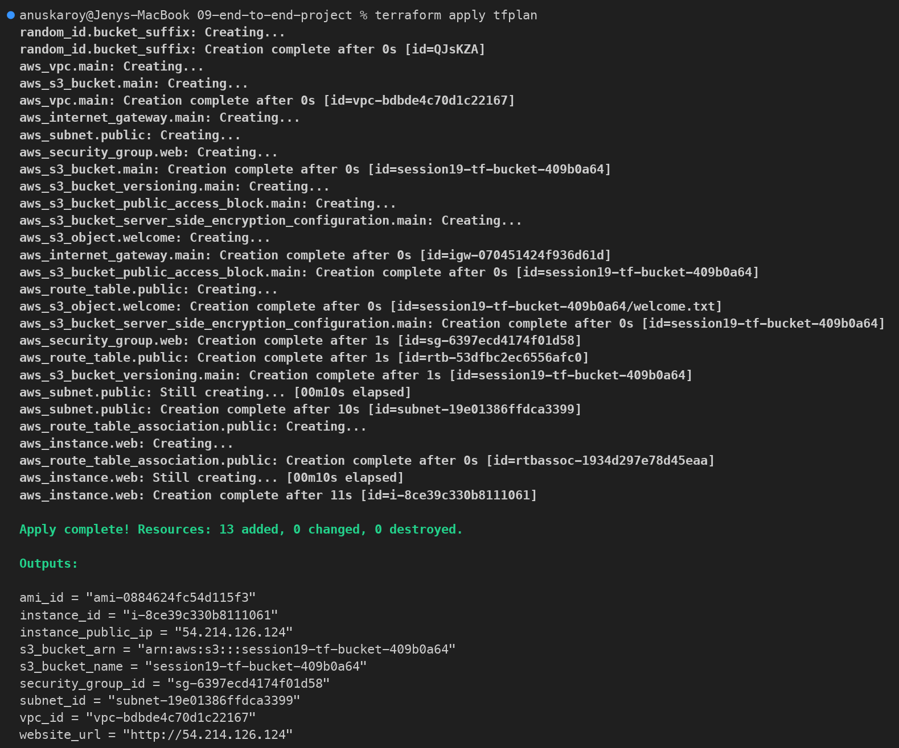

**6. `terraform output`**

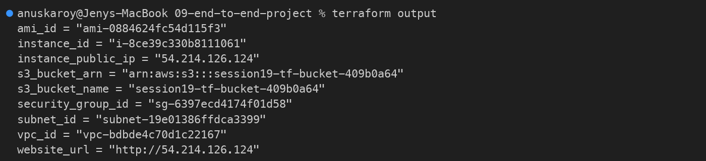

**7. `terraform state list` and the local state file**

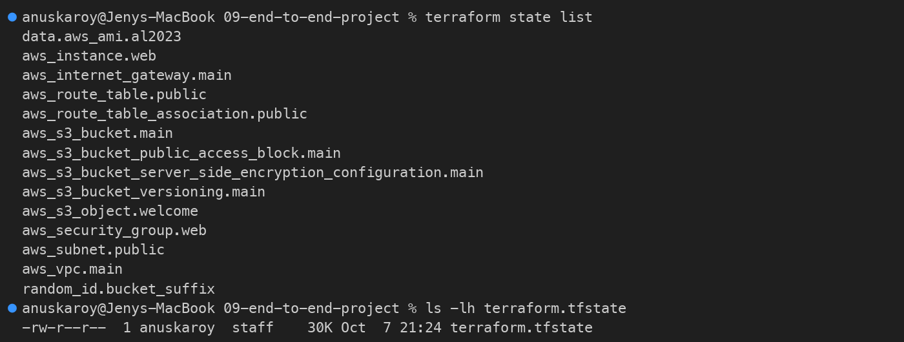

**8. `terraform state show aws_instance.web`**

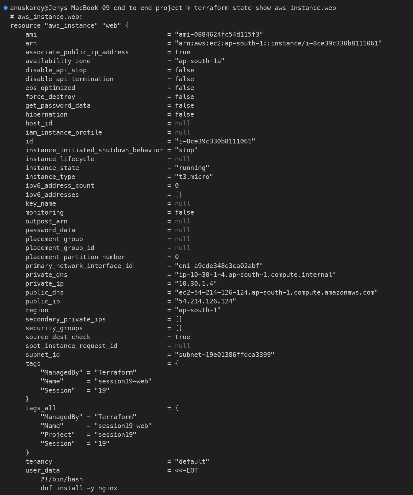

**9. AWS CLI: VPC, subnet, security group and EC2 instance**

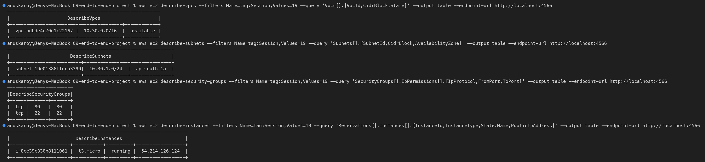

**10. AWS CLI: S3 bucket, `welcome.txt` and versioning**

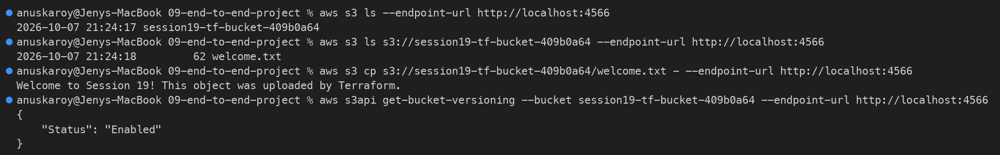

**11. `terraform destroy` - `Destroy complete! Resources: 13 destroyed.`**

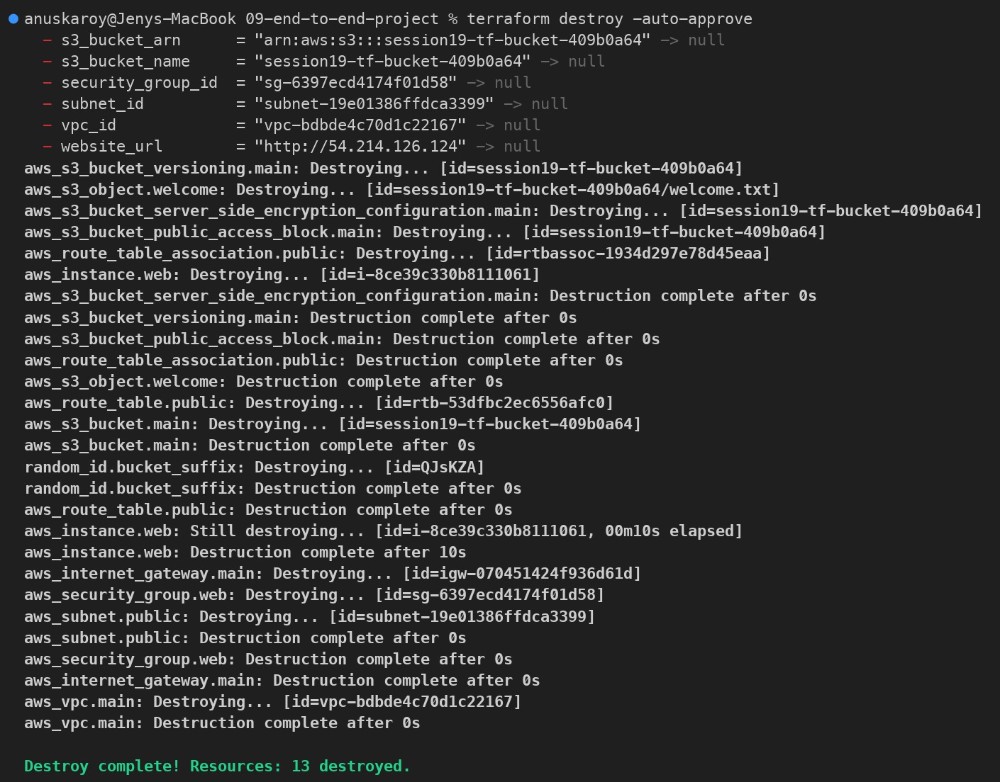

**12. After destroy - empty state, no instances, no buckets**

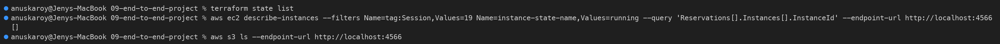

---

# Terraform Commands Cheat Sheet

| Command | What it does |
|---------|--------------|
| `terraform version` | Show Terraform and provider versions |
| `terraform init` | Download providers, create `.terraform/` and the lock file |
| `terraform fmt -check -recursive` | Check formatting (drop `-check` to fix) |
| `terraform validate` | Check syntax and internal consistency |
| `terraform plan` | Preview changes against current state |
| `terraform plan -out=tfplan` | Save the plan to a file |
| `terraform apply tfplan` | Apply exactly the saved plan |
| `terraform apply` | Plan and apply (asks for `yes`) |
| `terraform output` | Show all outputs |
| `terraform output -raw website_url` | Print one output without quotes |
| `terraform state list` | List resources tracked in state |
| `terraform state show <address>` | Show attributes of one resource |
| `terraform graph` | Print the dependency graph (DOT format) |
| `terraform plan -destroy` | Preview what destroy will remove |
| `terraform destroy` | Delete every resource in state |

---

# Cleanup

```bash
terraform destroy
```

Enter:

```text
yes
```

Expected:

```text
Destroy complete! Resources: 13 destroyed.
```

Confirm nothing is left:

```bash
terraform state list                 # should print nothing
aws ec2 describe-instances --filters Name=tag:Session,Values=19 Name=instance-state-name,Values=running
```

Optional local cleanup:

```bash
rm -rf .terraform tfplan terraform.tfstate terraform.tfstate.backup
rm -f mock_aws_override.tf           # only if you used the mock
```

If you used Moto, stop `moto_server` with `Ctrl+C`; all mock data is in memory and disappears.
