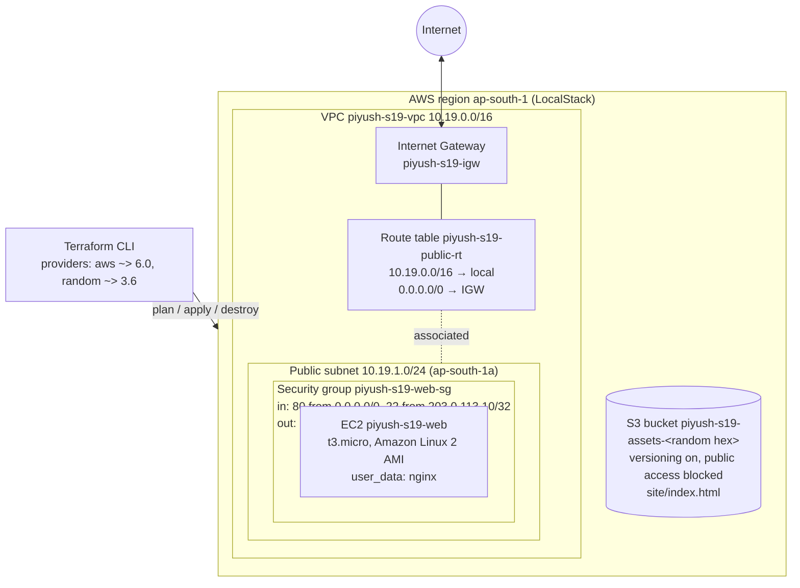
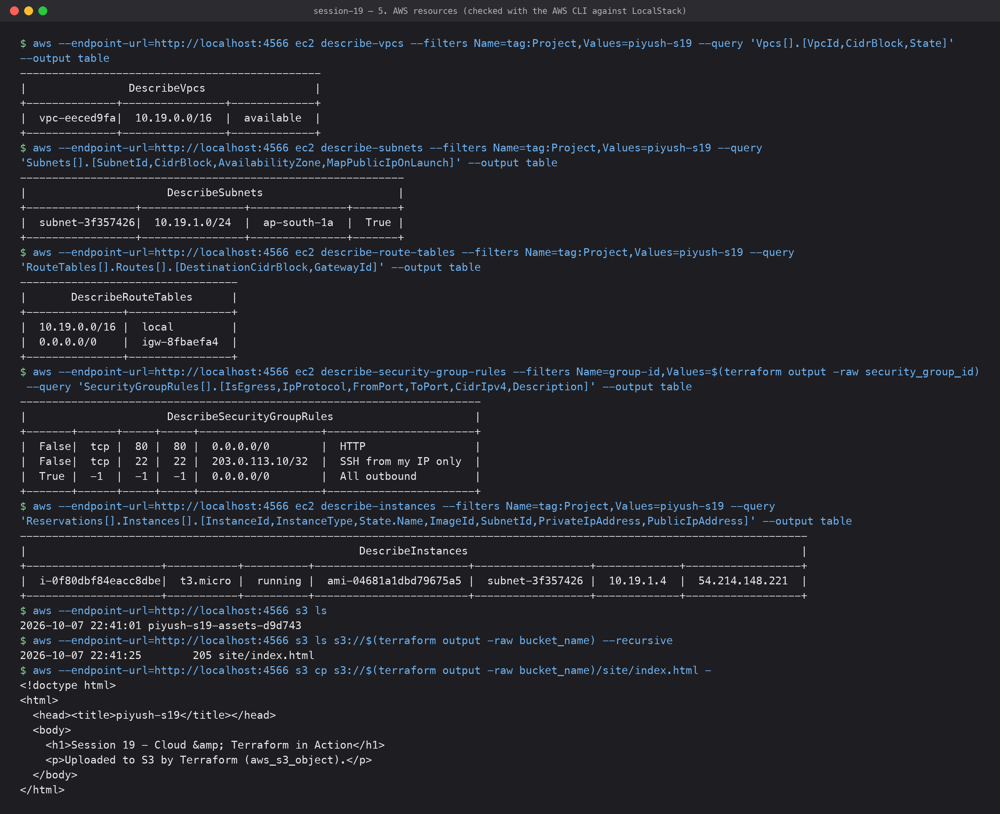
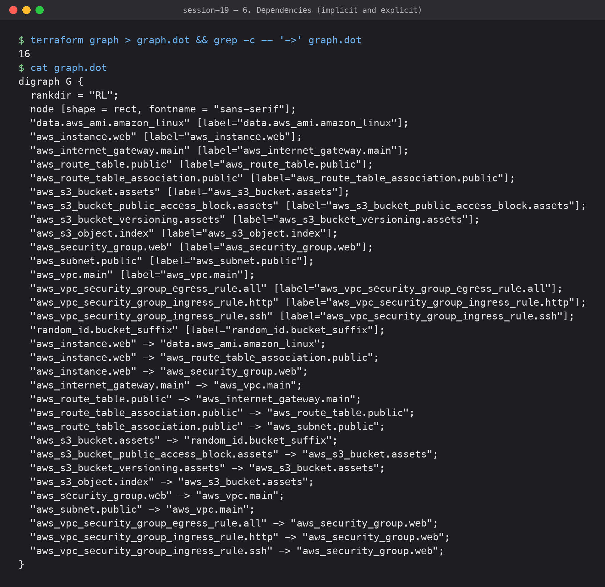
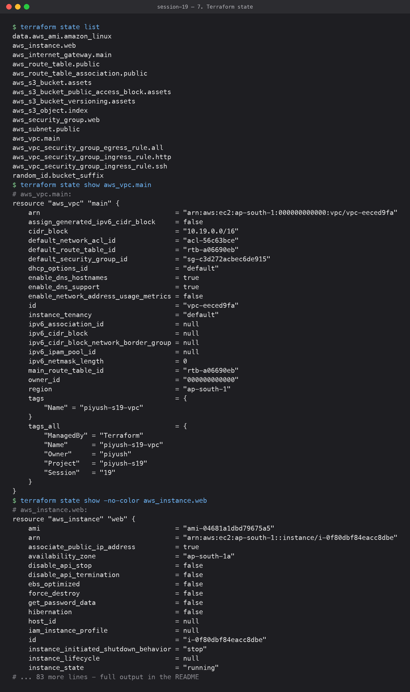
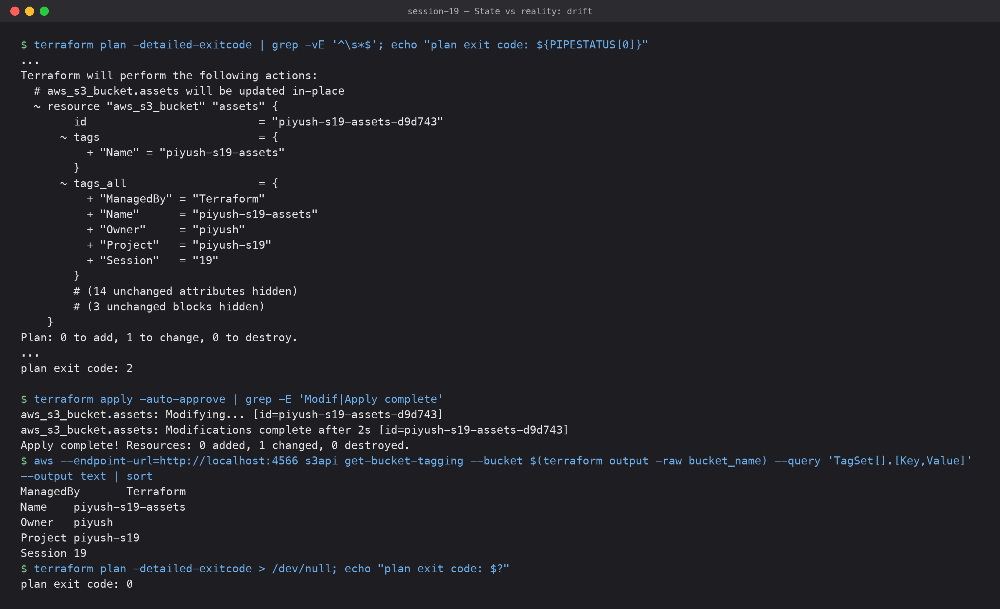
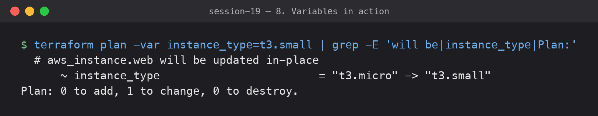

# Session 19 — Cloud & Terraform in Action

**Submitted by:** Piyush Bansal

> **Note: this was applied to LocalStack, not a real AWS account.**
> LocalStack is a local AWS emulator running in Docker on my laptop
> (`localstack/localstack:3.8`, endpoint `http://localhost:4566`). The AWS provider in
> [terraform-project/versions.tf](terraform-project/versions.tf) uses LocalStack's dummy
> credentials (`test`/`test`) and an `endpoints { ec2, s3, sts }` block that sends every
> call to LocalStack. All output below is real, but the resources only existed inside
> LocalStack. In particular **EC2 on LocalStack is mocked**: the instance shows up as
> `running` in `describe-instances` with IPs and a volume, but no VM actually boots, so
> the nginx `user_data` never runs and there is no web page to open. The public IP
> (`54.214.148.221`) is a fake address LocalStack handed out, not something I own.
>
> **To run this against real AWS**: in `versions.tf` delete the `endpoints` block, the
> dummy `access_key`/`secret_key`, the `skip_*` flags and `s3_use_path_style`, then use
> your own credentials and set `ssh_allowed_cidr` to your own IP. On real AWS this
> creates a running `t3.micro` and a public IPv4 address, which cost money, so
> `terraform destroy` afterwards.

## What I built

One `terraform apply` builds a small web stack: a VPC with a public subnet, internet
gateway and route table, a security group, an EC2 web server and an S3 bucket for
static assets with a page uploaded into it.

## Architecture



Same thing in plain text:

```text
                         Terraform (aws + random providers)
                                       |
          +----------------------------+-----------------------------+
          |                AWS ap-south-1 (LocalStack)               |
          |                                                          |
 Internet <--> Internet Gateway                                      |
          |         |                                                |
          |   +-----|---------------- VPC 10.19.0.0/16 ---------+    |
          |   |  Route table: 0.0.0.0/0 -> IGW, 10.19/16 local  |    |
          |   |     |                                           |    |
          |   |  Public subnet 10.19.1.0/24 (ap-south-1a)       |    |
          |   |     +-- Security group (80 any, 22 my IP) --+   |    |
          |   |     |   EC2 t3.micro  piyush-s19-web        |   |    |
          |   |     +---------------------------------------+   |    |
          |   +-------------------------------------------------+    |
          |                                                          |
          |   S3 bucket piyush-s19-assets-<hex>  (site/index.html)   |
          +----------------------------------------------------------+
```

## Project files ([terraform-project/](terraform-project/))

| File | What it shows |
|---|---|
| [versions.tf](terraform-project/versions.tf) | **Providers**: `required_providers` for `hashicorp/aws ~> 6.0` and `hashicorp/random ~> 3.6`; the `aws` provider block (LocalStack endpoints, `default_tags` applied to every AWS resource) |
| [variables.tf](terraform-project/variables.tf) | **Variables** with types, descriptions, defaults and a `validation` block on `vpc_cidr` |
| [terraform.tfvars](terraform-project/terraform.tfvars) | The values I used |
| [main.tf](terraform-project/main.tf) | **Resources**: VPC, subnet, IGW, route table + association, security group + 3 rules, `data "aws_ami"`, EC2 instance, `random_id`, S3 bucket, versioning, public access block, `aws_s3_object` |
| [outputs.tf](terraform-project/outputs.tf) | **Outputs**: VPC/subnet/IGW/SG IDs, AMI, instance ID and IPs, bucket name, object URI |
| [files/index.html](terraform-project/files/index.html) | Page uploaded to S3 |
| [terraform-project/graph.dot](terraform-project/graph.dot) | `terraform graph` output (Graphviz DOT) |
| `.terraform.lock.hcl` | Provider lock file, committed |

`.terraform/`, `*.tfstate*`, plan files and crash logs are ignored by [.gitignore](.gitignore).
The session folder's own `.gitignore` ignores `.terraform.lock.hcl` and `*.tfvars`, so
mine un-ignores those two on purpose.

## Setup

```bash
docker run -d --name piyush-localstack -p 4566:4566 localstack/localstack:3.8
export AWS_ACCESS_KEY_ID=test AWS_SECRET_ACCESS_KEY=test AWS_DEFAULT_REGION=ap-south-1   # dummy, LocalStack only
cd terraform-project
```

## 1. `terraform init` — providers


```text
$ terraform init
Initializing the backend...

Initializing provider plugins...
- Finding hashicorp/aws versions matching "~> 6.0"...
- Finding hashicorp/random versions matching "~> 3.6"...
- Installing hashicorp/aws v6.67.0...
- Installed hashicorp/aws v6.67.0 (signed by HashiCorp)
- Installing hashicorp/random v3.9.1...
- Installed hashicorp/random v3.9.1 (signed by HashiCorp)

Terraform has created a lock file .terraform.lock.hcl to record the provider
selections it made above. Include this file in your version control repository
so that Terraform can guarantee to make the same selections by default when
you run "terraform init" in the future.

Terraform has been successfully initialized!

You may now begin working with Terraform. Try running "terraform plan" to see
any changes that are required for your infrastructure. All Terraform commands
should now work.

If you ever set or change modules or backend configuration for Terraform,
rerun this command to reinitialize your working directory. If you forget, other
commands will detect it and remind you to do so if necessary.
```

Two providers: `aws` for the infrastructure and `random` for a unique bucket suffix
(bucket names are global on real AWS).

## 2. `terraform fmt` and `terraform validate`


```text
$ terraform fmt -check -diff; echo "fmt exit=$?"
fmt exit=0
$ terraform validate
Success! The configuration is valid.
```

My laptop was very busy during this run, and the first `validate` failed with
`timeout while waiting for plugin to start..` (the AWS provider binary didn't start in
time). Re-running with `TF_PLUGIN_TIMEOUT=300` worked; nothing in the code changed.

## 3. `terraform plan`


```text
$ terraform plan -out=tfplan
data.aws_ami.amazon_linux: Reading...
data.aws_ami.amazon_linux: Read complete after 7s [id=ami-04681a1dbd79675a5]

Terraform used the selected providers to generate the following execution
plan. Resource actions are indicated with the following symbols:
  + create

Terraform will perform the following actions:
...
  # aws_vpc.main will be created
  + resource "aws_vpc" "main" {
      + arn                                  = (known after apply)
      + cidr_block                           = "10.19.0.0/16"
      ...
      + enable_dns_hostnames                 = true
      + enable_dns_support                   = true
      ...
      + tags                                 = {
          + "Name" = "piyush-s19-vpc"
        }
      + tags_all                             = {
          + "ManagedBy" = "Terraform"
          + "Name"      = "piyush-s19-vpc"
          + "Owner"     = "piyush"
          + "Project"   = "piyush-s19"
          + "Session"   = "19"
        }
    }
...
Plan: 15 to add, 0 to change, 0 to destroy.

Changes to Outputs:
  + ami_id              = "ami-04681a1dbd79675a5"
  + bucket_name         = (known after apply)
  + index_object        = (known after apply)
  + instance_id         = (known after apply)
  + instance_private_ip = (known after apply)
  + instance_public_ip  = (known after apply)
  + internet_gateway_id = (known after apply)
  + public_subnet_id    = (known after apply)
  + security_group_id   = (known after apply)
  + vpc_id              = (known after apply)

─────────────────────────────────────────────────────────────────────────────

Saved the plan to: tfplan
```

The full plan is ~400 lines, so I cut it (`...`). The 15 resources it creates:

```text
$ grep -E '^  # ' plan.txt     # plan.txt = the saved output of the plan above
  # aws_instance.web will be created
  # aws_internet_gateway.main will be created
  # aws_route_table.public will be created
  # aws_route_table_association.public will be created
  # aws_s3_bucket.assets will be created
  # aws_s3_bucket_public_access_block.assets will be created
  # aws_s3_bucket_versioning.assets will be created
  # aws_s3_object.index will be created
  # aws_security_group.web will be created
  # aws_subnet.public will be created
  # aws_vpc.main will be created
  # aws_vpc_security_group_egress_rule.all will be created
  # aws_vpc_security_group_ingress_rule.http will be created
  # aws_vpc_security_group_ingress_rule.ssh will be created
  # random_id.bucket_suffix will be created
```

`tags_all` shows `default_tags` from the provider merged with each resource's own `Name`
tag. The data source ran during plan and picked `ami-04681a1dbd79675a5`, which is from
LocalStack's fake AMI catalogue (`amzn2-ami-hvm-2.0.20180810-x86_64-gp2`); on real AWS the
same filter returns the current Amazon Linux 2 AMI in the region.

## 4. `terraform apply`


```text
$ terraform apply tfplan
random_id.bucket_suffix: Creating...
random_id.bucket_suffix: Creation complete after 0s [id=2ddD]
aws_vpc.main: Creating...
aws_s3_bucket.assets: Creating...
aws_vpc.main: Still creating... [00m10s elapsed]
aws_s3_bucket.assets: Still creating... [00m10s elapsed]
aws_vpc.main: Still creating... [00m20s elapsed]
aws_s3_bucket.assets: Still creating... [00m20s elapsed]
aws_s3_bucket.assets: Creation complete after 30s [id=piyush-s19-assets-d9d743]
aws_vpc.main: Still creating... [00m30s elapsed]
aws_s3_bucket_public_access_block.assets: Creating...
aws_s3_bucket_versioning.assets: Creating...
aws_s3_object.index: Creating...
aws_s3_bucket_public_access_block.assets: Creation complete after 2s [id=piyush-s19-assets-d9d743]
aws_s3_bucket_versioning.assets: Creation complete after 6s [id=piyush-s19-assets-d9d743]
aws_vpc.main: Creation complete after 36s [id=vpc-eeced9fa]
aws_internet_gateway.main: Creating...
aws_security_group.web: Creating...
aws_subnet.public: Creating...
aws_s3_object.index: Creation complete after 9s [id=piyush-s19-assets-d9d743/site/index.html]
aws_internet_gateway.main: Creation complete after 10s [id=igw-8fbaefa4]
aws_subnet.public: Still creating... [00m10s elapsed]
aws_security_group.web: Still creating... [00m10s elapsed]
aws_route_table.public: Creating...
aws_security_group.web: Creation complete after 10s [id=sg-ad87a955caee5c90a]
aws_route_table.public: Creation complete after 1s [id=rtb-397b0f8e]
aws_vpc_security_group_egress_rule.all: Creating...
aws_vpc_security_group_ingress_rule.ssh: Creating...
aws_vpc_security_group_ingress_rule.http: Creating...
aws_vpc_security_group_egress_rule.all: Creation complete after 1s [id=sgr-0612e77c0d802973b]
aws_vpc_security_group_ingress_rule.http: Creation complete after 2s [id=sgr-f574ae9843a22674d]
aws_vpc_security_group_ingress_rule.ssh: Creation complete after 2s [id=sgr-a893aceb533d66ce3]
aws_subnet.public: Still creating... [00m20s elapsed]
aws_subnet.public: Creation complete after 21s [id=subnet-3f357426]
aws_route_table_association.public: Creating...
aws_route_table_association.public: Creation complete after 1s [id=rtbassoc-e085428e]
aws_instance.web: Creating...
aws_instance.web: Still creating... [00m10s elapsed]
aws_instance.web: Still creating... [00m20s elapsed]
aws_instance.web: Still creating... [00m30s elapsed]
aws_instance.web: Still creating... [00m41s elapsed]
aws_instance.web: Creation complete after 41s [id=i-0f80dbf84eacc8dbe]

Apply complete! Resources: 15 added, 0 changed, 0 destroyed.

Outputs:

ami_id = "ami-04681a1dbd79675a5"
bucket_name = "piyush-s19-assets-d9d743"
index_object = "s3://piyush-s19-assets-d9d743/site/index.html"
instance_id = "i-0f80dbf84eacc8dbe"
instance_private_ip = "10.19.1.4"
instance_public_ip = "54.214.148.221"
internet_gateway_id = "igw-8fbaefa4"
public_subnet_id = "subnet-3f357426"
security_group_id = "sg-ad87a955caee5c90a"
vpc_id = "vpc-eeced9fa"
```

You can see the dependency order in the log: the VPC and the bucket start in parallel
(they don't depend on each other), the IGW/SG/subnet wait for the VPC, the route table
waits for the IGW, and `aws_instance.web` is the very last thing, only after
`aws_route_table_association.public` is complete.

## 5. AWS resources (checked with the AWS CLI against LocalStack)



```text
$ aws --endpoint-url=http://localhost:4566 ec2 describe-vpcs --filters Name=tag:Project,Values=piyush-s19 --query 'Vpcs[].[VpcId,CidrBlock,State]' --output table
-----------------------------------------------
|                DescribeVpcs                 |
+--------------+----------------+-------------+
|  vpc-eeced9fa|  10.19.0.0/16  |  available  |
+--------------+----------------+-------------+
$ aws --endpoint-url=http://localhost:4566 ec2 describe-subnets --filters Name=tag:Project,Values=piyush-s19 --query 'Subnets[].[SubnetId,CidrBlock,AvailabilityZone,MapPublicIpOnLaunch]' --output table
------------------------------------------------------------
|                      DescribeSubnets                     |
+-----------------+----------------+---------------+-------+
|  subnet-3f357426|  10.19.1.0/24  |  ap-south-1a  |  True |
+-----------------+----------------+---------------+-------+
$ aws --endpoint-url=http://localhost:4566 ec2 describe-route-tables --filters Name=tag:Project,Values=piyush-s19 --query 'RouteTables[].Routes[].[DestinationCidrBlock,GatewayId]' --output table
----------------------------------
|       DescribeRouteTables      |
+---------------+----------------+
|  10.19.0.0/16 |  local         |
|  0.0.0.0/0    |  igw-8fbaefa4  |
+---------------+----------------+
$ aws --endpoint-url=http://localhost:4566 ec2 describe-security-group-rules --filters Name=group-id,Values=$(terraform output -raw security_group_id) --query 'SecurityGroupRules[].[IsEgress,IpProtocol,FromPort,ToPort,CidrIpv4,Description]' --output table
------------------------------------------------------------------------
|                      DescribeSecurityGroupRules                      |
+-------+------+-----+-----+-------------------+-----------------------+
|  False|  tcp |  80 |  80 |  0.0.0.0/0        |  HTTP                 |
|  False|  tcp |  22 |  22 |  203.0.113.10/32  |  SSH from my IP only  |
|  True |  -1  |  -1 |  -1 |  0.0.0.0/0        |  All outbound         |
+-------+------+-----+-----+-------------------+-----------------------+
$ aws --endpoint-url=http://localhost:4566 ec2 describe-instances --filters Name=tag:Project,Values=piyush-s19 --query 'Reservations[].Instances[].[InstanceId,InstanceType,State.Name,ImageId,SubnetId,PrivateIpAddress,PublicIpAddress]' --output table
---------------------------------------------------------------------------------------------------------------------------
|                                                    DescribeInstances                                                    |
+---------------------+-----------+----------+------------------------+------------------+-------------+------------------+
|  i-0f80dbf84eacc8dbe|  t3.micro |  running |  ami-04681a1dbd79675a5 |  subnet-3f357426 |  10.19.1.4  |  54.214.148.221  |
+---------------------+-----------+----------+------------------------+------------------+-------------+------------------+
$ aws --endpoint-url=http://localhost:4566 s3 ls
2026-10-07 22:41:01 piyush-s19-assets-d9d743
$ aws --endpoint-url=http://localhost:4566 s3 ls s3://$(terraform output -raw bucket_name) --recursive
2026-10-07 22:41:25        205 site/index.html
$ aws --endpoint-url=http://localhost:4566 s3 cp s3://$(terraform output -raw bucket_name)/site/index.html -
<!doctype html>
<html>
  <head><title>piyush-s19</title></head>
  <body>
    <h1>Session 19 - Cloud &amp; Terraform in Action</h1>
    <p>Uploaded to S3 by Terraform (aws_s3_object).</p>
  </body>
</html>
```

The instance says `running`, but as noted at the top that is LocalStack's mock: there
is no VM, so I could not `curl` nginx on it. The private IP `10.19.1.4` is from my subnet
(`.1`–`.3` are reserved by AWS), and the instance got a public IP because the subnet has
`map_public_ip_on_launch = true`.

## 6. Dependencies (implicit and explicit)



**Implicit**: whenever one resource references another's attribute, Terraform knows it
must create the referenced one first. Examples from `main.tf`:

| Resource | References | So it waits for |
|---|---|---|
| `aws_subnet.public` | `aws_vpc.main.id` | VPC |
| `aws_route_table.public` | `aws_internet_gateway.main.id` | IGW |
| `aws_route_table_association.public` | `aws_subnet.public.id`, `aws_route_table.public.id` | subnet + route table |
| `aws_instance.web` | `data.aws_ami...id`, `aws_subnet.public.id`, `aws_security_group.web.id` | AMI lookup, subnet, SG |
| `aws_s3_bucket.assets` | `random_id.bucket_suffix.hex` | random suffix |
| `aws_s3_object.index` | `aws_s3_bucket.assets.id` | bucket |

**Explicit**: the instance doesn't reference the route table or the IGW anywhere, but its
`user_data` runs `yum install nginx` on first boot, which needs the internet route to
already exist. Terraform can't see that, so I told it:

```hcl
resource "aws_instance" "web" {
  ...
  depends_on = [aws_route_table_association.public]
}
```

Without it, Terraform could start the instance in parallel with the route table and the
first-boot install could fail.

`terraform graph` prints the dependency graph (I saved it as
[graph.dot](terraform-project/graph.dot); paste it into any Graphviz viewer to draw it).
An arrow `A -> B` means "A depends on B":

```text
$ terraform graph > graph.dot && grep -c -- '->' graph.dot
16
$ cat graph.dot
digraph G {
  rankdir = "RL";
  node [shape = rect, fontname = "sans-serif"];
  "data.aws_ami.amazon_linux" [label="data.aws_ami.amazon_linux"];
  "aws_instance.web" [label="aws_instance.web"];
  "aws_internet_gateway.main" [label="aws_internet_gateway.main"];
  "aws_route_table.public" [label="aws_route_table.public"];
  "aws_route_table_association.public" [label="aws_route_table_association.public"];
  "aws_s3_bucket.assets" [label="aws_s3_bucket.assets"];
  "aws_s3_bucket_public_access_block.assets" [label="aws_s3_bucket_public_access_block.assets"];
  "aws_s3_bucket_versioning.assets" [label="aws_s3_bucket_versioning.assets"];
  "aws_s3_object.index" [label="aws_s3_object.index"];
  "aws_security_group.web" [label="aws_security_group.web"];
  "aws_subnet.public" [label="aws_subnet.public"];
  "aws_vpc.main" [label="aws_vpc.main"];
  "aws_vpc_security_group_egress_rule.all" [label="aws_vpc_security_group_egress_rule.all"];
  "aws_vpc_security_group_ingress_rule.http" [label="aws_vpc_security_group_ingress_rule.http"];
  "aws_vpc_security_group_ingress_rule.ssh" [label="aws_vpc_security_group_ingress_rule.ssh"];
  "random_id.bucket_suffix" [label="random_id.bucket_suffix"];
  "aws_instance.web" -> "data.aws_ami.amazon_linux";
  "aws_instance.web" -> "aws_route_table_association.public";
  "aws_instance.web" -> "aws_security_group.web";
  "aws_internet_gateway.main" -> "aws_vpc.main";
  "aws_route_table.public" -> "aws_internet_gateway.main";
  "aws_route_table_association.public" -> "aws_route_table.public";
  "aws_route_table_association.public" -> "aws_subnet.public";
  "aws_s3_bucket.assets" -> "random_id.bucket_suffix";
  "aws_s3_bucket_public_access_block.assets" -> "aws_s3_bucket.assets";
  "aws_s3_bucket_versioning.assets" -> "aws_s3_bucket.assets";
  "aws_s3_object.index" -> "aws_s3_bucket.assets";
  "aws_security_group.web" -> "aws_vpc.main";
  "aws_subnet.public" -> "aws_vpc.main";
  "aws_vpc_security_group_egress_rule.all" -> "aws_security_group.web";
  "aws_vpc_security_group_ingress_rule.http" -> "aws_security_group.web";
  "aws_vpc_security_group_ingress_rule.ssh" -> "aws_security_group.web";
}
```

`aws_instance.web -> aws_route_table_association.public` is the explicit `depends_on`.
There is no direct `aws_instance.web -> aws_subnet.public` arrow even though the instance
references the subnet: the graph is simplified (transitive reduction), and the subnet is
already reached through the route table association. The graph also shows two
independent chains (network+EC2 and random+S3), which is why they were created in
parallel.

## 7. Terraform state



State is the JSON file where Terraform remembers which real resource IDs belong to which
resource blocks. Here it's local (`terraform.tfstate`, git-ignored); in a team it would
go in a remote backend (S3 + locking) so everyone shares one copy.

```text
$ terraform state list
data.aws_ami.amazon_linux
aws_instance.web
aws_internet_gateway.main
aws_route_table.public
aws_route_table_association.public
aws_s3_bucket.assets
aws_s3_bucket_public_access_block.assets
aws_s3_bucket_versioning.assets
aws_s3_object.index
aws_security_group.web
aws_subnet.public
aws_vpc.main
aws_vpc_security_group_egress_rule.all
aws_vpc_security_group_ingress_rule.http
aws_vpc_security_group_ingress_rule.ssh
random_id.bucket_suffix
$ terraform state show aws_vpc.main
# aws_vpc.main:
resource "aws_vpc" "main" {
    arn                                  = "arn:aws:ec2:ap-south-1:000000000000:vpc/vpc-eeced9fa"
    assign_generated_ipv6_cidr_block     = false
    cidr_block                           = "10.19.0.0/16"
    default_network_acl_id               = "acl-56c63bce"
    default_route_table_id               = "rtb-a06690eb"
    default_security_group_id            = "sg-c3d272acbec6de915"
    dhcp_options_id                      = "default"
    enable_dns_hostnames                 = true
    enable_dns_support                   = true
    enable_network_address_usage_metrics = false
    id                                   = "vpc-eeced9fa"
    instance_tenancy                     = "default"
    ipv6_association_id                  = null
    ipv6_cidr_block                      = null
    ipv6_cidr_block_network_border_group = null
    ipv6_ipam_pool_id                    = null
    ipv6_netmask_length                  = 0
    main_route_table_id                  = "rtb-a06690eb"
    owner_id                             = "000000000000"
    region                               = "ap-south-1"
    tags                                 = {
        "Name" = "piyush-s19-vpc"
    }
    tags_all                             = {
        "ManagedBy" = "Terraform"
        "Name"      = "piyush-s19-vpc"
        "Owner"     = "piyush"
        "Project"   = "piyush-s19"
        "Session"   = "19"
    }
}
$ terraform state show -no-color aws_instance.web
# aws_instance.web:
resource "aws_instance" "web" {
    ami                                  = "ami-04681a1dbd79675a5"
    arn                                  = "arn:aws:ec2:ap-south-1::instance/i-0f80dbf84eacc8dbe"
    associate_public_ip_address          = true
    availability_zone                    = "ap-south-1a"
    disable_api_stop                     = false
    disable_api_termination              = false
    ebs_optimized                        = false
    force_destroy                        = false
    get_password_data                    = false
    hibernation                          = false
    host_id                              = null
    iam_instance_profile                 = null
    id                                   = "i-0f80dbf84eacc8dbe"
    instance_initiated_shutdown_behavior = "stop"
    instance_lifecycle                   = null
    instance_state                       = "running"
    instance_type                        = "t3.micro"
    ipv6_address_count                   = 0
    ipv6_addresses                       = []
    key_name                             = null
    monitoring                           = false
    outpost_arn                          = null
    password_data                        = null
    placement_group                      = null
    placement_group_id                   = null
    placement_partition_number           = 0
    primary_network_interface_id         = "eni-425676f9"
    private_dns                          = "ip-10-19-1-4.ap-south-1.compute.internal"
    private_ip                           = "10.19.1.4"
    public_dns                           = "ec2-54-214-148-221.ap-south-1.compute.amazonaws.com"
    public_ip                            = "54.214.148.221"
    region                               = "ap-south-1"
    secondary_private_ips                = []
    security_groups                      = []
    source_dest_check                    = true
    spot_instance_request_id             = null
    subnet_id                            = "subnet-3f357426"
    tags                                 = {
        "Name" = "piyush-s19-web"
    }
    tags_all                             = {
        "ManagedBy" = "Terraform"
        "Name"      = "piyush-s19-web"
        "Owner"     = "piyush"
        "Project"   = "piyush-s19"
        "Session"   = "19"
    }
    tenancy                              = "default"
    user_data                            = <<-EOT
        #!/bin/bash
        yum install -y nginx
        echo "<h1>piyush-s19 - deployed with Terraform</h1>" > /usr/share/nginx/html/index.html
        systemctl enable --now nginx
    EOT
    user_data_replace_on_change          = false
    vpc_security_group_ids               = [
        "sg-ad87a955caee5c90a",
    ]

    primary_network_interface {
        delete_on_termination = true
        network_interface_id  = "eni-425676f9"
    }

    root_block_device {
        delete_on_termination = true
        device_name           = "/dev/sda1"
        encrypted             = false
        iops                  = 0
        kms_key_id            = null
        tags                  = {
            "ManagedBy" = "Terraform"
            "Owner"     = "piyush"
            "Project"   = "piyush-s19"
            "Session"   = "19"
        }
        tags_all              = {
            "ManagedBy" = "Terraform"
            "Owner"     = "piyush"
            "Project"   = "piyush-s19"
            "Session"   = "19"
        }
        throughput            = 0
        volume_id             = "vol-5f41716b"
        volume_size           = 8
        volume_type           = "gp2"
    }
}
$ ls -la terraform.tfstate* | awk '{print $5, $9}'
32890 terraform.tfstate
31389 terraform.tfstate.backup
$ jq '{version, terraform_version, serial, lineage, resources: (.resources | length)}' terraform.tfstate
{
  "version": 4,
  "terraform_version": "1.16.4",
  "serial": 18,
  "lineage": "babae20d-1edb-d928-3983-3b95461cc770",
  "resources": 16
}
```

`serial` goes up on every write; `lineage` identifies this particular state; 16 = 15
managed resources + 1 data source. `terraform.tfstate.backup` is the previous version.
State can contain secrets (passwords, keys), which is one more reason it must never be
committed.

### State vs reality: drift



Right after the first apply, a second `terraform plan` was not clean:

```text
$ terraform plan -detailed-exitcode | grep -vE '^\s*$'; echo "plan exit code: ${PIPESTATUS[0]}"
...
Terraform will perform the following actions:
  # aws_s3_bucket.assets will be updated in-place
  ~ resource "aws_s3_bucket" "assets" {
        id                          = "piyush-s19-assets-d9d743"
      ~ tags                        = {
          + "Name" = "piyush-s19-assets"
        }
      ~ tags_all                    = {
          + "ManagedBy" = "Terraform"
          + "Name"      = "piyush-s19-assets"
          + "Owner"     = "piyush"
          + "Project"   = "piyush-s19"
          + "Session"   = "19"
        }
        # (14 unchanged attributes hidden)
        # (3 unchanged blocks hidden)
    }
Plan: 0 to add, 1 to change, 0 to destroy.
...
plan exit code: 2
```

The bucket tags didn't stick on create. I saw the same thing in Session 18: AWS provider
v6 seems to send S3 tags with `CreateBucket`, which LocalStack 3.8 ignores. Refresh
compared state with the real bucket, found the difference, and one more apply fixed it:

```text
$ terraform apply -auto-approve | grep -E 'Modif|Apply complete'
aws_s3_bucket.assets: Modifying... [id=piyush-s19-assets-d9d743]
aws_s3_bucket.assets: Modifications complete after 2s [id=piyush-s19-assets-d9d743]
Apply complete! Resources: 0 added, 1 changed, 0 destroyed.
$ aws --endpoint-url=http://localhost:4566 s3api get-bucket-tagging --bucket $(terraform output -raw bucket_name) --query 'TagSet[].[Key,Value]' --output text | sort
ManagedBy	Terraform
Name	piyush-s19-assets
Owner	piyush
Project	piyush-s19
Session	19
$ terraform plan -detailed-exitcode > /dev/null; echo "plan exit code: $?"
plan exit code: 0
```

## 8. Variables in action



Overriding a variable on the command line changes the plan without touching any file:

```text
$ terraform plan -var instance_type=t3.small | grep -E 'will be|instance_type|Plan:'
  # aws_instance.web will be updated in-place
      ~ instance_type                        = "t3.micro" -> "t3.small"
Plan: 0 to add, 1 to change, 0 to destroy.
```

(I didn't apply it.) Precedence, lowest to highest: default in `variables.tf` →
`terraform.tfvars` → `*.auto.tfvars` → `-var-file` / `-var` on the command line.
`TF_VAR_<name>` environment variables sit just above defaults.

## 9. `terraform output`


```text
$ terraform output
ami_id = "ami-04681a1dbd79675a5"
bucket_name = "piyush-s19-assets-d9d743"
index_object = "s3://piyush-s19-assets-d9d743/site/index.html"
instance_id = "i-0f80dbf84eacc8dbe"
instance_private_ip = "10.19.1.4"
instance_public_ip = "54.214.148.221"
internet_gateway_id = "igw-8fbaefa4"
public_subnet_id = "subnet-3f357426"
security_group_id = "sg-ad87a955caee5c90a"
vpc_id = "vpc-eeced9fa"
```

`terraform output -raw <name>` gives just the value for scripts; I used it above in the
AWS CLI commands.

## 10. `terraform destroy`


Destroy runs in the reverse order of the graph: rules, object and instance first, then
the association, subnet, route table and SG, and the VPC last.

```text
$ terraform destroy -auto-approve
...
Plan: 0 to add, 0 to change, 15 to destroy.
...
aws_vpc_security_group_egress_rule.all: Destroying... [id=sgr-0612e77c0d802973b]
aws_vpc_security_group_ingress_rule.ssh: Destroying... [id=sgr-a893aceb533d66ce3]
aws_s3_bucket_public_access_block.assets: Destroying... [id=piyush-s19-assets-d9d743]
aws_vpc_security_group_ingress_rule.http: Destroying... [id=sgr-f574ae9843a22674d]
aws_s3_bucket_versioning.assets: Destroying... [id=piyush-s19-assets-d9d743]
aws_s3_object.index: Destroying... [id=piyush-s19-assets-d9d743/site/index.html]
aws_instance.web: Destroying... [id=i-0f80dbf84eacc8dbe]
...
aws_vpc_security_group_egress_rule.all: Destruction complete after 18s
aws_vpc_security_group_ingress_rule.ssh: Destruction complete after 18s
aws_s3_bucket_versioning.assets: Destruction complete after 18s
aws_vpc_security_group_ingress_rule.http: Destruction complete after 19s
aws_s3_bucket_public_access_block.assets: Destruction complete after 21s
aws_s3_object.index: Destruction complete after 24s
aws_s3_bucket.assets: Destroying... [id=piyush-s19-assets-d9d743]
aws_s3_bucket.assets: Destruction complete after 3s
random_id.bucket_suffix: Destroying... [id=2ddD]
random_id.bucket_suffix: Destruction complete after 1s
...
aws_instance.web: Destruction complete after 51s
aws_route_table_association.public: Destroying... [id=rtbassoc-e085428e]
aws_security_group.web: Destroying... [id=sg-ad87a955caee5c90a]
aws_route_table_association.public: Destruction complete after 3s
aws_route_table.public: Destroying... [id=rtb-397b0f8e]
aws_subnet.public: Destroying... [id=subnet-3f357426]
aws_subnet.public: Destruction complete after 1s
aws_route_table.public: Destruction complete after 2s
aws_security_group.web: Destruction complete after 6s
aws_internet_gateway.main: Destroying... [id=igw-8fbaefa4]
aws_internet_gateway.main: Destruction complete after 1s
aws_vpc.main: Destroying... [id=vpc-eeced9fa]
aws_vpc.main: Destruction complete after 1s
Destroy complete! Resources: 15 destroyed.
```

(`...` = refresh lines, the destroy plan and "Still destroying" lines cut.) After destroy:

```text
$ terraform state list | wc -l
       0
$ aws --endpoint-url=http://localhost:4566 ec2 describe-instances --filters Name=tag:Project,Values=piyush-s19 --query 'Reservations[].Instances[].[InstanceId,State.Name]' --output text
i-0f80dbf84eacc8dbe	terminated
$ aws --endpoint-url=http://localhost:4566 ec2 describe-vpcs --filters Name=tag:Project,Values=piyush-s19 --query 'Vpcs[].VpcId' --output text
$ aws --endpoint-url=http://localhost:4566 s3 ls
```

The terminated instance stays visible for a while, just like on real AWS; everything
else is gone. Finally I stopped and removed the LocalStack container.

## Commands used

| Command | Purpose |
|---|---|
| `terraform init` | Download providers, create lock file |
| `terraform fmt -check -diff` | Check formatting |
| `terraform validate` | Check syntax and references |
| `terraform plan -out=tfplan` | Preview and save the change set |
| `terraform apply tfplan` | Create exactly what was planned |
| `terraform output [-raw name]` | Read outputs |
| `terraform state list / show` | Inspect state |
| `terraform graph` | Dependency graph (DOT) |
| `terraform plan -detailed-exitcode` | Drift check (0 none, 2 changes) |
| `terraform plan -var name=value` | Override a variable |
| `terraform destroy` | Delete everything in state |

## What I learned

- References between resources build the dependency graph for free; `depends_on` is
  only for dependencies Terraform can't see, like "this boot script needs internet".
- Independent parts of the graph (network vs S3) are created in parallel.
- State maps resource blocks to real IDs. `plan` refreshes it against reality, which is
  how drift like the missing S3 tags shows up.
- `default_tags` on the provider saves repeating tags on every resource.
- LocalStack is great for practising the Terraform workflow for free, but it's an
  emulator: EC2 is only a record, not a real VM.
