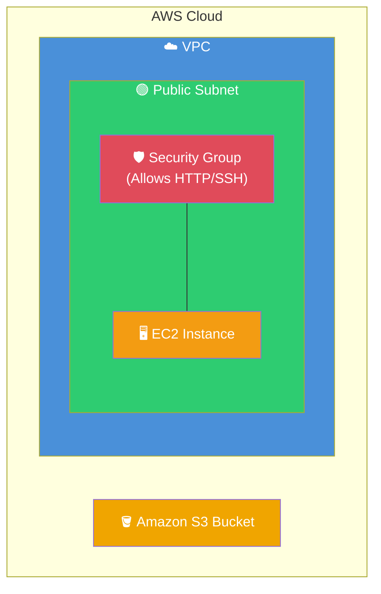
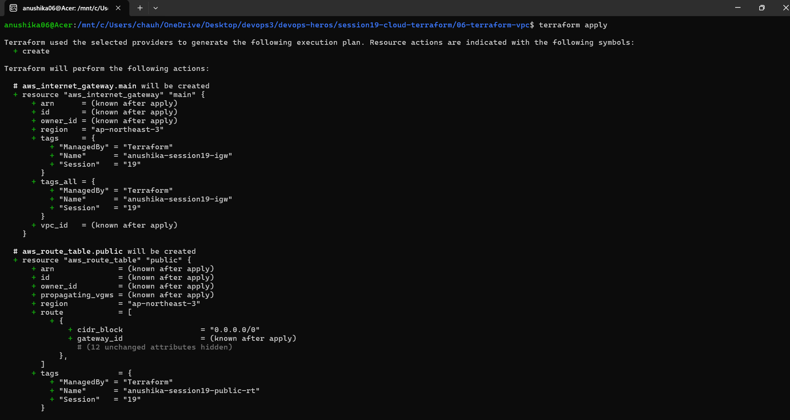
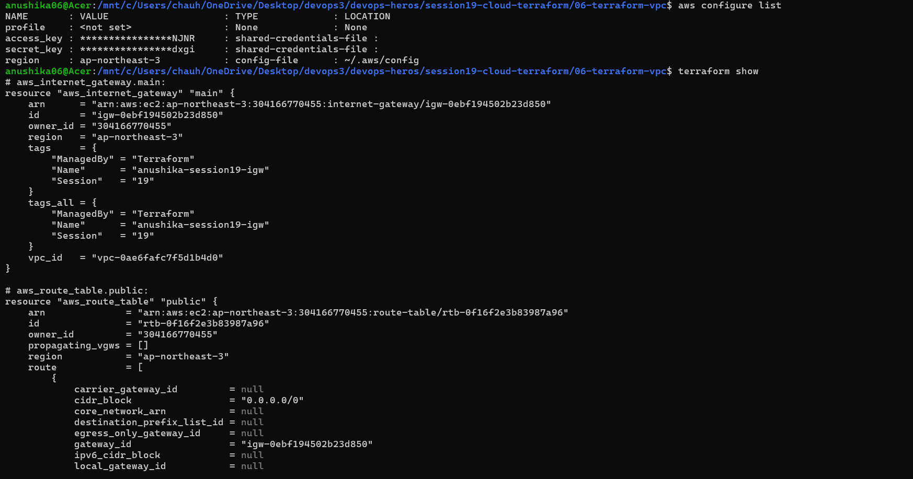
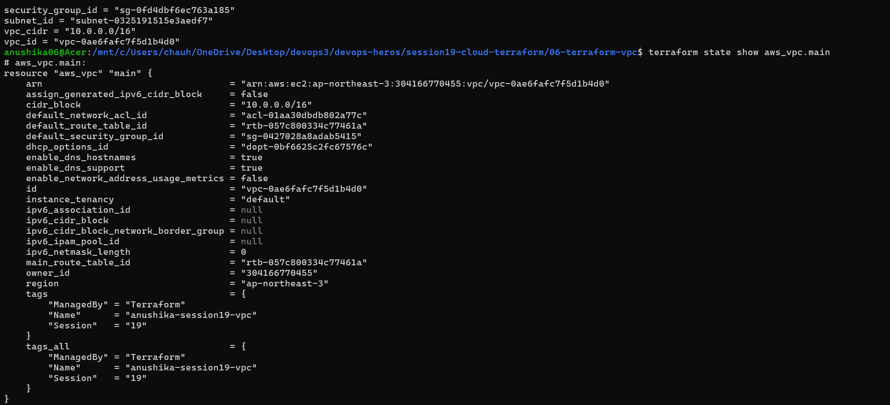
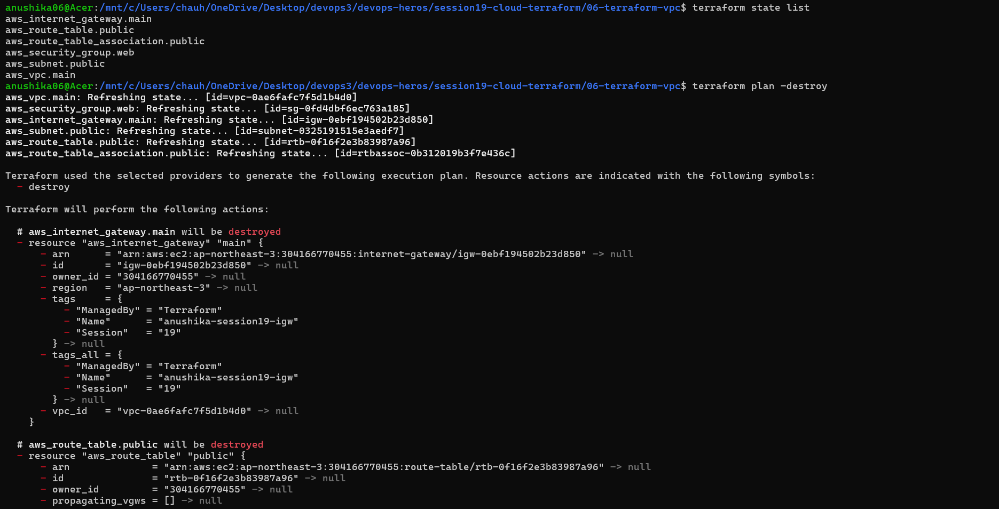
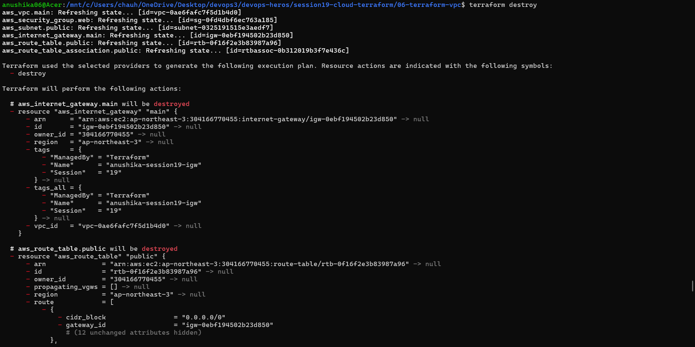
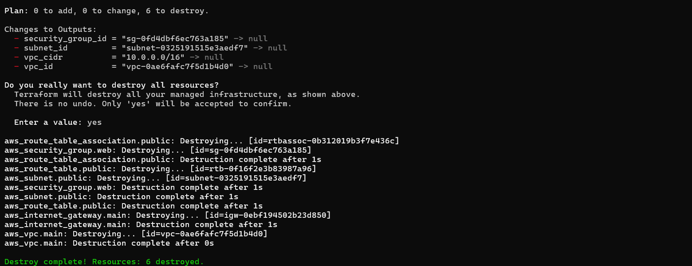

# Session 19: Cloud & Terraform in Action

## Task: End-to-End Cloud Infrastructure
Built a complete cloud infrastructure project on AWS using Terraform.

### Architecture
Terraform provisioned the following AWS resources:
- VPC
- Subnet
- Security Group
- EC2 Instance
- S3 Bucket

### Outputs & Screenshots

### Terraform Project Details
- **Source Code**: [View Terraform Files (06-terraform-vpc)](06-terraform-vpc)
- **Providers, Variables, Resources, Outputs, Dependencies**: Defined in `.tf` files.
- **Commands Executed**: `plan`, `apply`, `destroy`.

