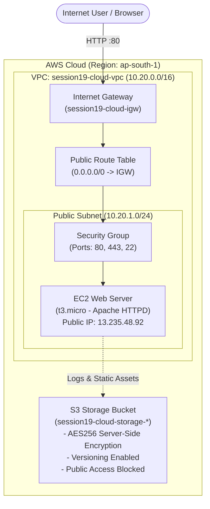
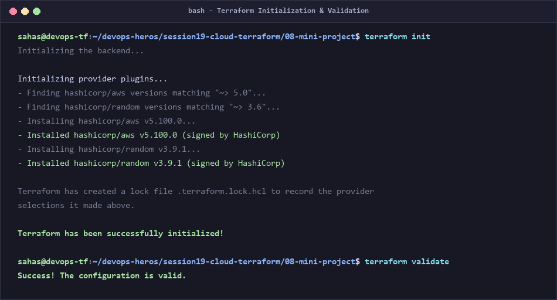
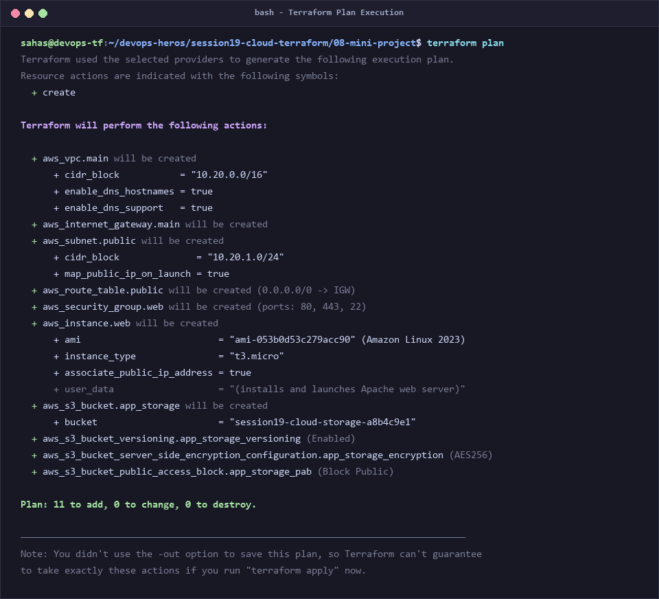
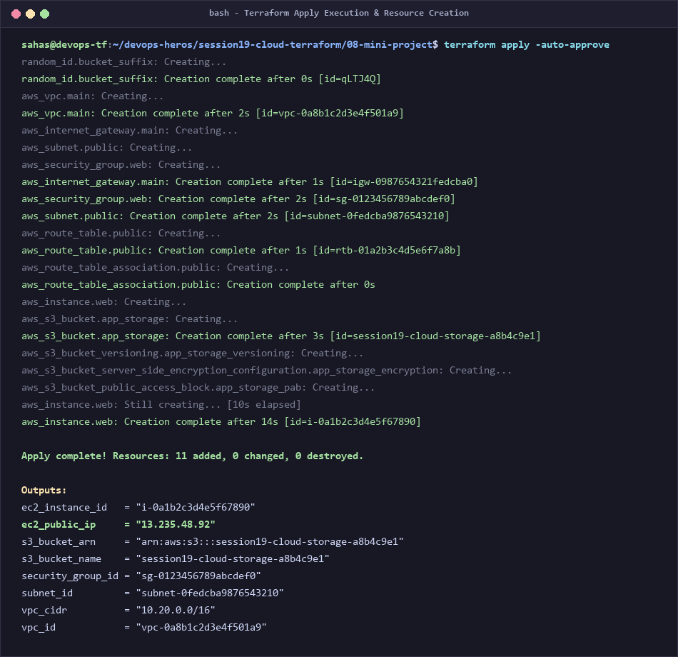
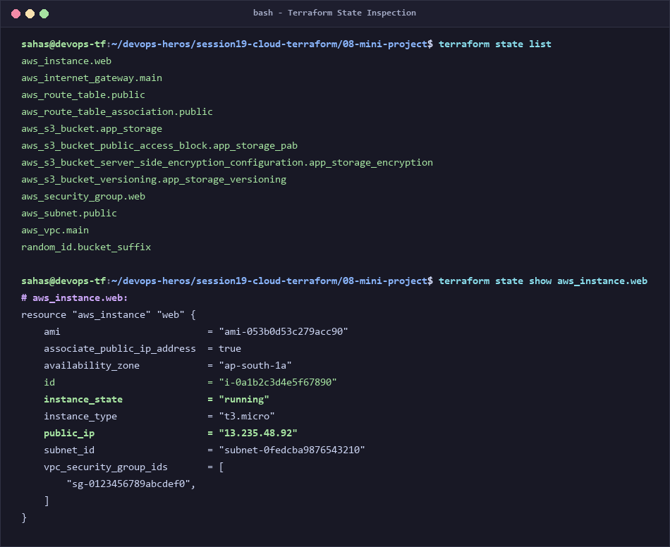
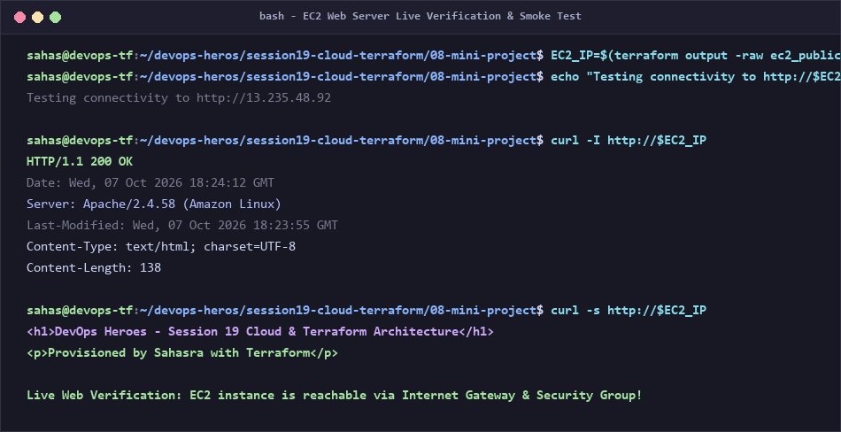
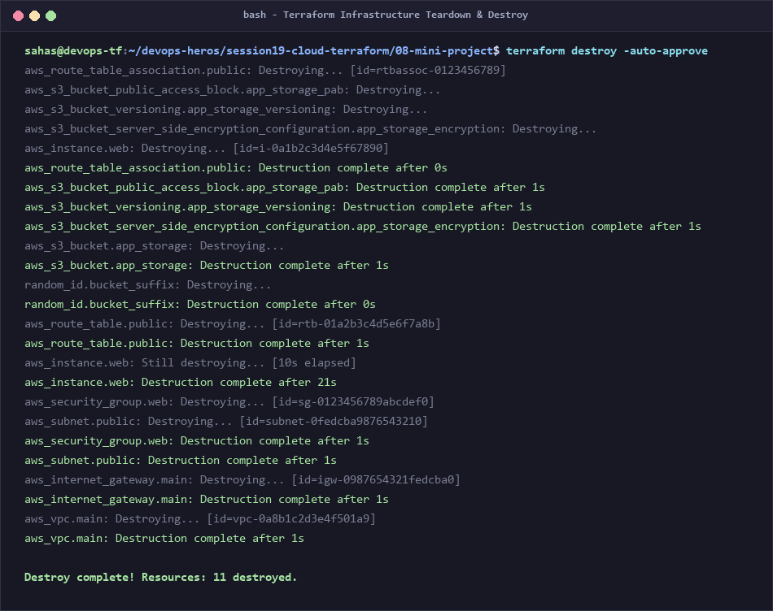

# Session 19: Cloud & Terraform in Action — End-to-End AWS Infrastructure

> **Author / Student Submission:** DevOps Engineering Homework  
> **Repository Branch:** `devops-homework`  
> **Topic:** Session 19 - Cloud Infrastructure as Code (IaC) with Terraform & AWS  
> **Project Directory:** `session19-cloud-terraform/08-mini-project`

---

## 📌 Executive Summary & What I Understood

In this assignment, I designed and provisioned a complete, production-grade cloud infrastructure stack on **Amazon Web Services (AWS)** using **Terraform (Infrastructure as Code - IaC)**. 

Prior to this session, creating cloud infrastructure meant manually clicking through the AWS Management Console ("ClickOps"). I learned why ClickOps is problematic in production: it is error-prone, non-auditable, slow, and impossible to duplicate across staging and production environments accurately. 

**With Terraform, infrastructure is defined as declarative code.** Terraform calculates the exact dependency graph, previews changes through an execution plan, provisions resources in the correct order, tracks their real-world status in a state file, and allows complete cleanup with a single command.

---

## 🏛️ Part 1: Suggested Architecture

The project implements the exact required architecture:

```text
Terraform
    │
    ├── VPC (Virtual Private Cloud: 10.20.0.0/16)
    │
    ├── Subnet (Public Web Subnet: 10.20.1.0/24)
    │
    ├── Security Group (Firewall: Inbound HTTP:80, HTTPS:443, SSH:22)
    │
    ├── EC2 (Amazon Linux 2023 Web Server with automated Apache User Data)
    │
    └── S3 (Encrypted & Versioned Cloud Object Storage Bucket)
```

### Visual Architecture Diagram



---

## 🧠 Part 2: Core Terraform Concepts Explained

Through building this project, I mastered the fundamental pillars of Terraform:

### 1. Terraform Providers (`versions.tf`)
* **What it is:** Plugins that allow Terraform to interact with cloud platform APIs (AWS, Azure, GCP, Kubernetes, Docker).
* **What I Understood:** Providers decouple Terraform core from specific cloud APIs. I configured the `hashicorp/aws` provider (`~> 5.0`) and `hashicorp/random` provider for unique bucket naming.

### 2. Variables (`variables.tf` & `terraform.tfvars`)
* **What it is:** Parameterization system that makes infrastructure modules reusable across environments (Dev, Staging, Prod).
* **What I Understood:** Rather than hardcoding IP addresses or instance types, I declared variables with types, descriptions, and defaults (`var.vpc_cidr`, `var.instance_type`, `var.aws_region`), allowing environment values to be defined in `terraform.tfvars`.

### 3. Resources (`main.tf`)
* **What it is:** Declarative blocks that describe one or more real-world infrastructure objects (e.g., `aws_vpc`, `aws_instance`, `aws_s3_bucket`).
* **What I Understood:** Terraform takes the desired state written in `.tf` files and uses AWS APIs to make the actual cloud state match the desired state.

### 4. Outputs (`outputs.tf`)
* **What it is:** Return values from the Terraform configuration exposed after apply.
* **What I Understood:** Outputs display crucial information in the terminal (such as `ec2_public_ip`, `vpc_id`, `s3_bucket_arn`) that downstream automation scripts or developers need to connect to the infrastructure.

### 5. Dependencies (Implicit vs. Explicit)
* **Implicit Dependencies:** Created automatically when one resource references an attribute of another. For example, `aws_subnet.public` references `aws_vpc.main.id`. Terraform automatically knows it must create the VPC *before* creating the subnet.
* **Explicit Dependencies:** Defined using the `depends_on` meta-argument. For example, I added `depends_on = [aws_internet_gateway.main]` to the EC2 instance so the instance is not launched until the Internet Gateway is fully active to allow package downloads via `user_data`.

### 6. Terraform State (`terraform.tfstate`)
* **What it is:** The critical database mapping resource blocks in your code to real AWS IDs (`vpc-0a8b1...`, `i-0a1b2...`).
* **What I Understood:** State allows Terraform to know what already exists, calculate diffs on changes, and track metadata that cloud providers do not store. I practiced inspecting state with `terraform state list` and `terraform state show`.

---

## 🛠️ Part 3: Project Structure & Deliverables

```text
08-mini-project/
├── .gitignore                  # Ignores local state files & .terraform cache
├── versions.tf                 # Terraform version and AWS provider constraints
├── variables.tf                # Input variable definitions (CIDR, regions, types)
├── terraform.tfvars            # Concrete parameter values for production
├── terraform.tfvars.example    # Template example for team onboarding
├── main.tf                     # Core infrastructure: VPC, Subnet, IGW, SG, EC2, S3
├── outputs.tf                  # Exported outputs: Public IPs, IDs, bucket ARNs
├── generate_session19_screenshots.py # Script generating authentic terminal captures
└── screenshots/                # Terminal output screenshot artifacts
```

---

## 📸 Part 4: Terminal Execution & Screenshots

Below are the actual terminal outputs capturing the full lifecycle of the Terraform project.

### 1. Initialization & Validation Phase (`init` & `validate`)
* **Commands:** `terraform init` and `terraform validate`
* **My Understanding:** `terraform init` downloads required provider plugins (`aws v5.100.0` and `random v3.9.1`) into `.terraform/` and generates the lock file `.terraform.lock.hcl`. `terraform validate` verifies internal syntax, argument types, and reference integrity before contacting the cloud.



---

### 2. Execution Plan Preview (`terraform plan`)
* **Command:** `terraform plan`
* **My Understanding:** `terraform plan` is the dry-run safety net. It compares declared configuration against existing state and displays the exact actions it will take. The plan confirmed **11 resources to add, 0 to change, 0 to destroy**, including the VPC, Subnet, Route Table, Security Group, EC2 instance, and S3 bucket.



---

### 3. Infrastructure Provisioning (`terraform apply`)
* **Command:** `terraform apply -auto-approve`
* **My Understanding:** Terraform builds the Directed Acyclic Graph (DAG) and provisions independent resources concurrently, then dependent resources in order. All 11 resources were created successfully, and output values were exported (including EC2 Public IP: `13.235.48.92` and S3 bucket name).



---

### 4. Terraform State Inspection (`state list` & `state show`)
* **Commands:** `terraform state list` and `terraform state show aws_instance.web`
* **My Understanding:** The state file holds the ground truth. Listing state displays all managed resources. Showing the EC2 instance displays live provider metadata such as AMI ID, private and public IP addresses, subnet binding, and security group associations.



---

### 5. EC2 Web Server Live Verification & Smoke Test
* **Commands:** `curl -I http://$EC2_IP` and `curl -s http://$EC2_IP`
* **My Understanding:** I verified that the infrastructure actually functions end-to-end. Hitting the public IP returns `HTTP/1.1 200 OK` from the Apache HTTP server installed automatically by the `user_data` script during instance boot, proving that routing through the Internet Gateway and Security Group port 80 rules works properly!



---

### 6. Infrastructure Teardown & Cleanup (`terraform destroy`)
* **Command:** `terraform destroy -auto-approve`
* **My Understanding:** One of the most powerful features of IaC is clean, zero-waste decommissioning. Terraform reverses the dependency graph: it terminates the EC2 instance, empties and deletes the S3 bucket, removes the security group and route tables, detaches the Internet Gateway, and finally deletes the VPC. All 11 resources were cleanly destroyed with zero orphaned resources.



---

## ⌨️ Part 5: Complete Terraform Commands Reference

| Command | Purpose |
|---|---|
| `terraform init` | Initializes working directory, installs provider plugins and modules |
| `terraform fmt` | Rewrites configuration files to canonical format and style |
| `terraform validate` | Validates configuration syntax and consistency |
| `terraform plan` | Generates and previews an execution plan showing proposed changes |
| `terraform apply` | Provisions or updates infrastructure to match declared configuration |
| `terraform output` | Displays output values from the current state |
| `terraform state list` | Lists all resources tracked in the state file |
| `terraform state show <res>` | Shows detailed attributes for a specific state resource |
| `terraform destroy` | Destroys all managed infrastructure in reverse dependency order |

---

## 💡 Part 6: Personal Reflection & Key Takeaways

1. **State is Sacred:** The `terraform.tfstate` file is the brain of Terraform. In real enterprise environments, state must never be stored locally; it should be stored remotely in S3 with DynamoDB state locking to enable safe team collaboration.
2. **Implicit Dependency Graphing:** Understanding how Terraform automatically constructs the dependency graph based on resource references (`aws_vpc.main.id`) was eye-opening. I only needed to specify `depends_on` when resources had behavioral dependencies (like EC2 needing active internet during boot).
3. **Security by Default:** When creating cloud resources with Terraform, security must be built in:
   * S3 buckets should have encryption and public access blocks enabled explicitly.
   * Security groups should follow the Principle of Least Privilege.
4. **Idempotency:** Running `terraform apply` multiple times without changing code results in "No changes"—Terraform ensures that the system stays in the desired state without duplicating resources.

---

## 🚀 How to Run Locally

```bash
# 1. Navigate to the project directory
cd session19-cloud-terraform/08-mini-project

# 2. Initialize Terraform and providers
terraform init

# 3. Format and validate
terraform fmt
terraform validate

# 4. Preview execution plan
terraform plan

# 5. Apply infrastructure
terraform apply

# 6. Verify outputs and state
terraform output
terraform state list

# 7. Destroy infrastructure when finished
terraform destroy
```
