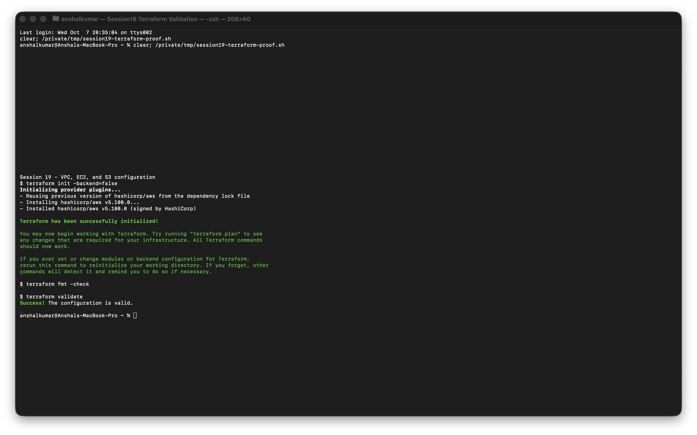
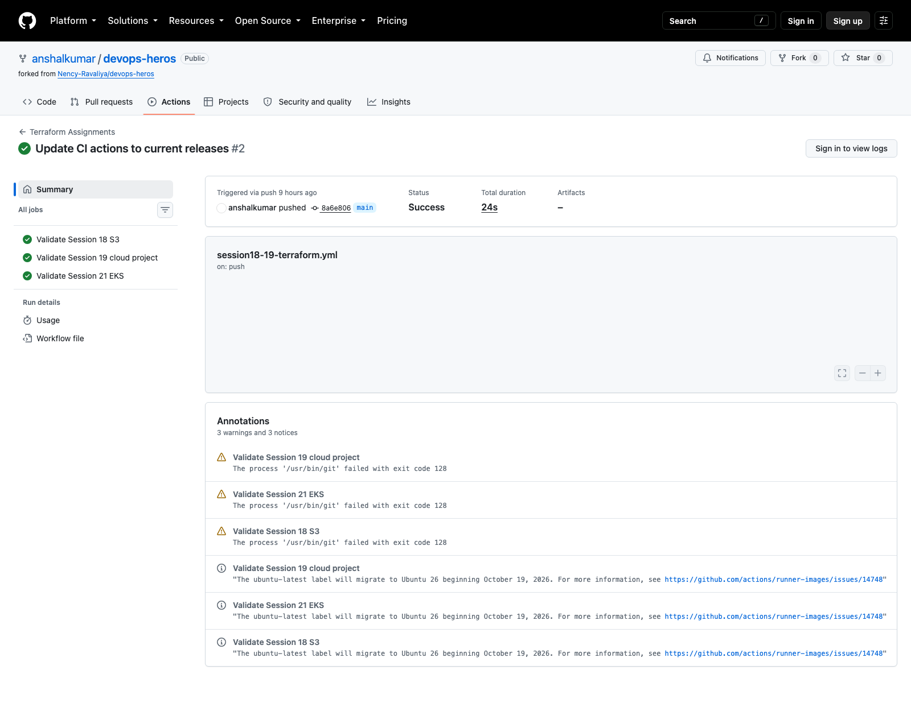

# Session 19 - Cloud and Terraform in Action

For this session I combined the individual networking examples into one Terraform project under [`08-mini-project/`](08-mini-project/). It models the path from the internet to an EC2 web server and also creates a private S3 bucket.

```text
Internet
   |
Internet Gateway
   |
Public route table
   |
VPC 10.20.0.0/16
   └── Public subnet 10.20.1.0/24
          ├── Security Group: HTTP allowed, outbound allowed
          └── EC2 web server

S3 bucket: versioning + encryption + public access blocked
```

The project demonstrates providers, variables, resources, outputs, implicit dependencies, and Terraform state. The network IDs flow between resources through references such as `aws_subnet.public.id`, so Terraform can build the dependency graph without a manual order.

## Workflow

```bash
cd session19-cloud-terraform/08-mini-project
cp terraform.tfvars.example terraform.tfvars
terraform init
terraform fmt -check
terraform validate
terraform plan -out=tfplan
terraform apply tfplan
terraform output
terraform state list
terraform destroy
```

I keep credentials, state, plans, and the real variable file outside Git. Before a real apply, the AMI ID in `terraform.tfvars` must be checked for the selected AWS region. After capturing the resource IDs and web response, I run `terraform destroy` so the learning environment does not keep generating cost.

I reran the free local checks with the official Terraform container. Provider initialization, `fmt -check`, and `validate` all succeeded. This checks the configuration without creating VPC, EC2, or S3 resources.



The earlier folders contain my notes on cloud service models, Regions and Availability Zones, VPCs, routes, Internet Gateways, Security Groups, and the Terraform workflow.

## Result

The shared Terraform workflow completed successfully and validated this configuration. I have kept the real AWS apply as a separate step because it creates billable resources in the account used for the lab.


