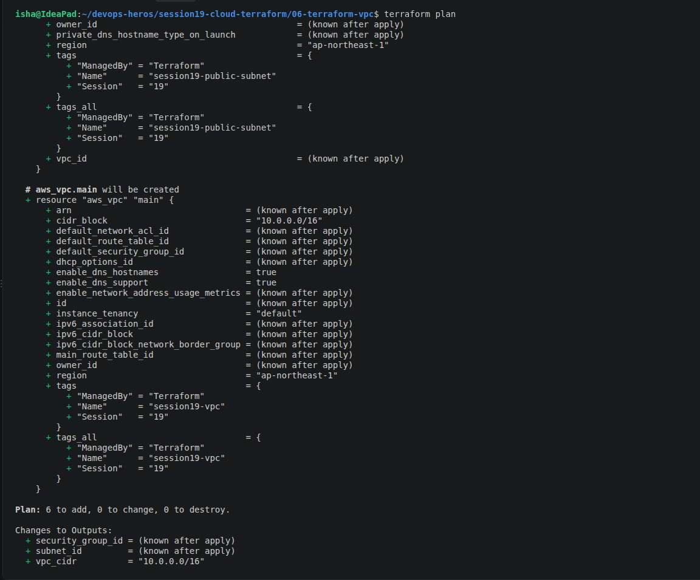
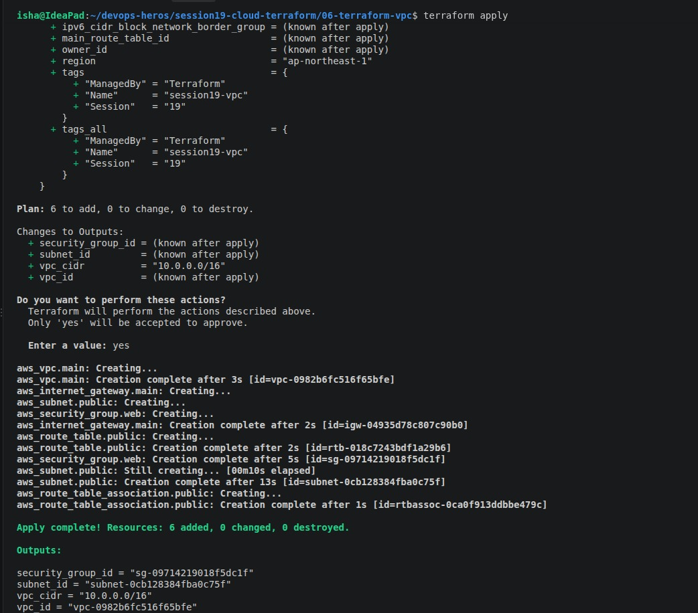
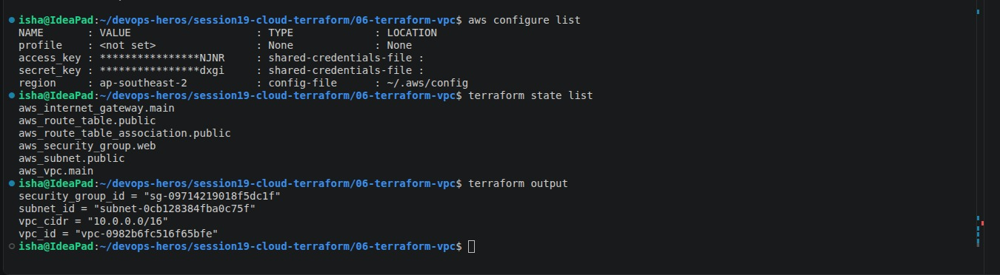
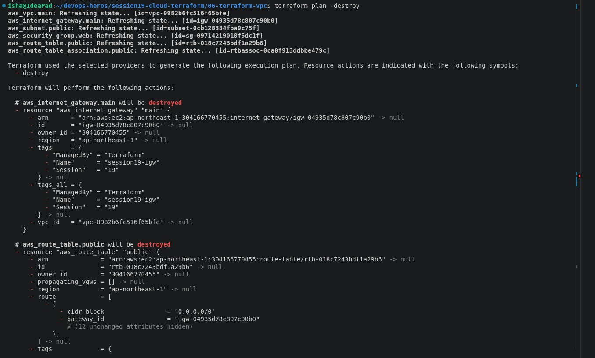
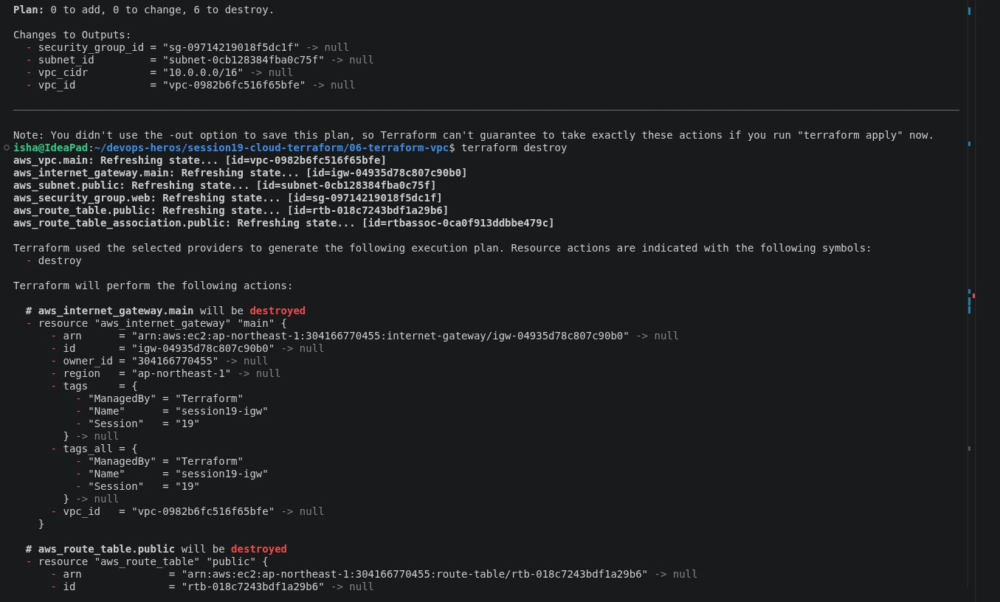
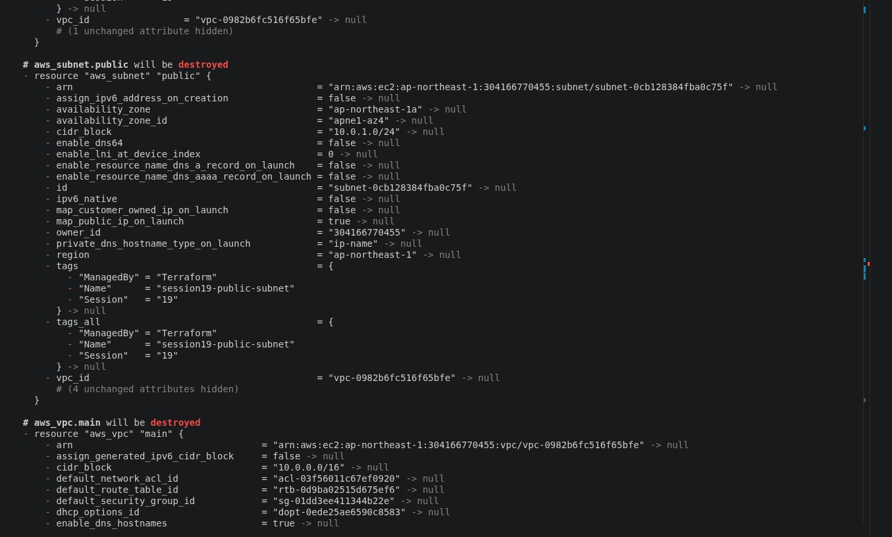
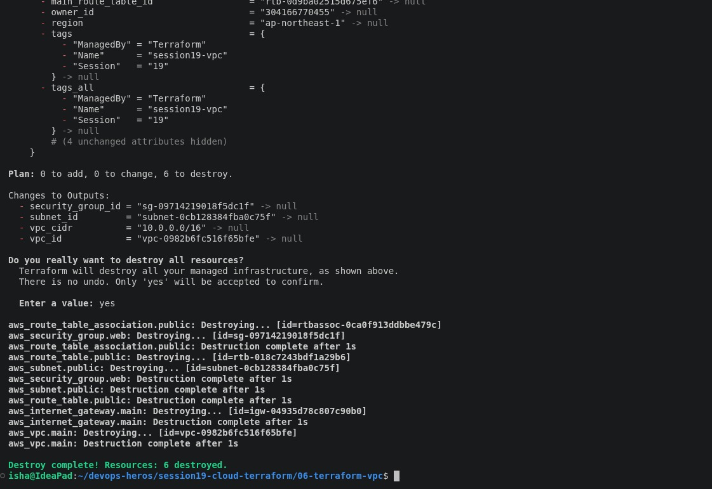

# Session 19 — Cloud & Terraform in Action

## Overview

This project demonstrates an end-to-end AWS cloud infrastructure deployment using **Terraform**.

The infrastructure is created and managed as Infrastructure as Code (IaC), rather than manually creating every resource through the AWS Management Console.

The project demonstrates:

- Terraform providers
- Terraform variables
- Terraform resources
- Terraform outputs
- Resource dependencies
- AWS VPC
- AWS subnet
- AWS Security Group
- AWS EC2
- AWS S3
- Terraform state
- `terraform plan`
- `terraform apply`
- `terraform destroy`

---

# 1. Objective

The main objective of this task is to build a complete AWS infrastructure using Terraform.

The project creates:

```text
                    Terraform
                        |
                        v
                       VPC
                        |
                  ┌─────┴─────┐
                  |           |
               Subnet      Security Group
                  |           |
                  └─────┬─────┘
                        |
                       EC2
                        |
                       S3
```

The project also demonstrates how Terraform tracks infrastructure using its state file and manages the complete infrastructure lifecycle.

---

# 2. Technologies Used

| Technology | Purpose |
|---|---|
| Terraform | Infrastructure as Code |
| AWS | Cloud infrastructure |
| Amazon VPC | Virtual network |
| Amazon Subnet | Network segmentation |
| Security Group | Network security |
| Amazon EC2 | Compute instance |
| Amazon S3 | Object storage |
| AWS CLI | Resource verification |
| Git | Version control |

---

# 3. Project Structure

```text
session19-cloud-terraform/
│
├── provider.tf
├── variables.tf
├── main.tf
├── outputs.tf
├── terraform.tfvars
├── README.md
```

---

# 4. Prerequisites

Before starting, install the following:

- Terraform
- AWS CLI
- An AWS account
- AWS credentials with appropriate permissions
- Git

Check Terraform:

```bash
terraform version
```

Check AWS CLI:

```bash
aws --version
```

Check AWS identity:

```bash
aws sts get-caller-identity
```

If AWS CLI credentials have not been configured:

```bash
aws configure
```

Never paste AWS secret keys into the Terraform files or commit them to GitHub.

---

# 5. Architecture

The infrastructure follows this architecture:

```text
                         AWS
                          |
                         VPC
                    10.0.0.0/16
                          |
                    Public Subnet
                    10.0.1.0/24
                          |
              ┌───────────┴───────────┐
              |                       |
          Security Group           Route Table
              |                       |
              |                Internet Gateway
              |
             EC2
              |
        Application Server

             +----------------+
             |       S3       |
             | Object Storage |
             +----------------+
```

### Architecture Flow

```text
Terraform
   |
   +---- Provider
   |
   +---- VPC
           |
           +---- Subnet
           |
           +---- Route Table
           |
           +---- Internet Gateway
           |
           +---- Security Group
                    |
                    +---- EC2

   +---- S3 Bucket
```

---

# 6. Terraform Provider

The AWS provider allows Terraform to communicate with AWS APIs.

Example `provider.tf`:

```hcl
terraform {
  required_providers {
    aws = {
      source  = "hashicorp/aws"
      version = "~> 6.0"
    }
  }
}

provider "aws" {
  region = var.aws_region
}
```

The provider is initialized using:

```bash
terraform init
```

---

# 7. Terraform Variables

Variables make the configuration reusable.

Example `variables.tf`:

```hcl
variable "aws_region" {
  description = "AWS region"
  type        = string
}

variable "vpc_cidr" {
  description = "CIDR block for the VPC"
  type        = string
}

variable "subnet_cidr" {
  description = "CIDR block for the public subnet"
  type        = string
}

variable "instance_type" {
  description = "EC2 instance type"
  type        = string
}

variable "bucket_name" {
  description = "Globally unique S3 bucket name"
  type        = string
}
```

Example `terraform.tfvars`:

```hcl
aws_region    = "ap-south-1"
vpc_cidr      = "10.0.0.0/16"
subnet_cidr   = "10.0.1.0/24"
instance_type = "t2.micro"
bucket_name   = "session19-terraform-cloud-isha-2026"
```

> Change the AWS region and bucket name according to your AWS account. S3 bucket names must be globally unique.

---

# 8. AWS VPC

The VPC provides an isolated virtual network for the infrastructure.

Example:

```hcl
resource "aws_vpc" "main" {
  cidr_block = var.vpc_cidr

  tags = {
    Name      = "session19-vpc"
    ManagedBy = "Terraform"
  }
}
```

The VPC CIDR is:

```text
10.0.0.0/16
```

---

# 9. Subnet

A subnet is created inside the VPC.

```hcl
resource "aws_subnet" "public" {
  vpc_id                  = aws_vpc.main.id
  cidr_block              = var.subnet_cidr
  map_public_ip_on_launch = true

  tags = {
    Name      = "session19-public-subnet"
    ManagedBy = "Terraform"
  }
}
```

The subnet depends on the VPC.

Terraform understands this dependency because:

```hcl
vpc_id = aws_vpc.main.id
```

references the VPC resource.

---

# 10. Internet Gateway

The Internet Gateway provides Internet connectivity to the public subnet.

```hcl
resource "aws_internet_gateway" "main" {
  vpc_id = aws_vpc.main.id

  tags = {
    Name      = "session19-igw"
    ManagedBy = "Terraform"
  }
}
```

---

# 11. Route Table

A route table controls network traffic.

```hcl
resource "aws_route_table" "public" {
  vpc_id = aws_vpc.main.id

  route {
    cidr_block = "0.0.0.0/0"
    gateway_id = aws_internet_gateway.main.id
  }

  tags = {
    Name      = "session19-public-route-table"
    ManagedBy = "Terraform"
  }
}
```

The route:

```text
0.0.0.0/0
```

allows Internet-bound traffic through the Internet Gateway.

---

# 12. Route Table Association

The route table is associated with the public subnet.

```hcl
resource "aws_route_table_association" "public" {
  subnet_id      = aws_subnet.public.id
  route_table_id = aws_route_table.public.id
}
```

This establishes the relationship:

```text
VPC
 |
Public Subnet
 |
Public Route Table
 |
Internet Gateway
 |
Internet
```

---

# 13. Security Group

The Security Group controls traffic to the EC2 instance.

Example:

```hcl
resource "aws_security_group" "web" {
  name        = "session19-web-sg"
  description = "Security group for Session 19 EC2"
  vpc_id      = aws_vpc.main.id

  ingress {
    description = "SSH"
    from_port   = 22
    to_port     = 22
    protocol    = "tcp"
    cidr_blocks = ["YOUR_IP/32"]
  }

  ingress {
    description = "HTTP"
    from_port   = 80
    to_port     = 80
    protocol    = "tcp"
    cidr_blocks = ["0.0.0.0/0"]
  }

  egress {
    from_port   = 0
    to_port     = 0
    protocol    = "-1"
    cidr_blocks = ["0.0.0.0/0"]
  }

  tags = {
    Name      = "session19-web-sg"
    ManagedBy = "Terraform"
  }
}
```

Replace:

```text
YOUR_IP/32
```

with your own public IP address.

For example:

```text
203.0.113.25/32
```

Do not use `0.0.0.0/0` for SSH in a real production environment unless there is a specific security requirement.

---

# 14. EC2 Instance

The EC2 instance is deployed inside the Terraform-created subnet.

Example:

```hcl
resource "aws_instance" "web" {
  ami           = var.ami_id
  instance_type = var.instance_type

  subnet_id                   = aws_subnet.public.id
  vpc_security_group_ids     = [aws_security_group.web.id]
  associate_public_ip_address = true

  tags = {
    Name      = "session19-web-server"
    ManagedBy = "Terraform"
  }
}
```

The EC2 instance depends on:

```text
VPC
 |
Subnet
 |
Security Group
 |
EC2
```

Terraform automatically determines these dependencies from resource references.

---

# 15. S3 Bucket

The S3 bucket provides object storage.

```hcl
resource "aws_s3_bucket" "storage" {
  bucket = var.bucket_name

  tags = {
    Name      = "Session 19 S3"
    ManagedBy = "Terraform"
  }
}
```

The S3 bucket is independent of the VPC and EC2 networking resources.

---

# 16. Terraform Outputs

Outputs expose useful information after deployment.

Example `outputs.tf`:

```hcl
output "vpc_id" {
  description = "ID of the VPC"
  value       = aws_vpc.main.id
}

output "subnet_id" {
  description = "ID of the public subnet"
  value       = aws_subnet.public.id
}

output "security_group_id" {
  description = "ID of the security group"
  value       = aws_security_group.web.id
}

output "ec2_instance_id" {
  description = "ID of the EC2 instance"
  value       = aws_instance.web.id
}

output "ec2_public_ip" {
  description = "Public IP of the EC2 instance"
  value       = aws_instance.web.public_ip
}

output "s3_bucket_name" {
  description = "S3 bucket name"
  value       = aws_s3_bucket.storage.bucket
}
```

---

# 17. Terraform Dependencies

Terraform automatically creates a dependency graph from resource references.

Example:

```hcl
resource "aws_subnet" "public" {
  vpc_id = aws_vpc.main.id
}
```

This tells Terraform:

```text
VPC
 |
 v
Subnet
```

Similarly:

```hcl
resource "aws_instance" "web" {
  subnet_id = aws_subnet.public.id

  vpc_security_group_ids = [
    aws_security_group.web.id
  ]
}
```

This creates:

```text
VPC
 ├── Subnet
 └── Security Group
        \       /
          EC2
```

Terraform therefore knows the correct creation and destruction order.

---

# 18. Terraform Initialization

Initialize the project:

```bash
terraform init
```

This downloads the AWS provider and initializes the Terraform working directory.

Expected result:

```text
Terraform has been successfully initialized!
```

### Screenshot


---

# 19. Terraform Formatting

Run:

```bash
terraform fmt
```

This formats Terraform configuration files.

---

# 20. Terraform Validation

Run:

```bash
terraform validate
```

Expected result:

```text
Success! The configuration is valid.
```

---

# 21. Terraform Plan

Run:

```bash
terraform plan
```

Terraform calculates the changes required to match the configuration.

You should see resources such as:

```text
aws_vpc.main
aws_subnet.public
aws_internet_gateway.main
aws_route_table.public
aws_route_table_association.public
aws_security_group.web
aws_instance.web
aws_s3_bucket.storage
```

Expected summary will be similar to:

```text
Plan: 8 to add, 0 to change, 0 to destroy.
```

The exact number may differ depending on the configuration.

### Screenshot



---

# 22. Terraform Apply

Deploy the infrastructure:

```bash
terraform apply
```

Review the plan and type:

```text
yes
```

Terraform will create the AWS resources.

Expected result:

```text
Apply complete!
```

### Screenshot


---

# 23. Terraform State

Terraform creates a state file:

```text
terraform.tfstate
```

The state file records the resources managed by Terraform.

Check the state:

```bash
terraform state list
```

Example:

```text
aws_vpc.main
aws_subnet.public
aws_internet_gateway.main
aws_route_table.public
aws_route_table_association.public
aws_security_group.web
aws_instance.web
aws_s3_bucket.storage
```

You can inspect the state using:

```bash
terraform show
```

### Screenshot



---

# 24. Terraform Outputs

Run:

```bash
terraform output
```

Example:

```text
ec2_instance_id = "i-xxxxxxxxxxxxxxxxx"
ec2_public_ip = "xx.xx.xx.xx"
s3_bucket_name = "session19-terraform-cloud-isha-2026"
security_group_id = "sg-xxxxxxxx"
subnet_id = "subnet-xxxxxxxx"
vpc_id = "vpc-xxxxxxxx"
```

To retrieve one output:

```bash
terraform output ec2_public_ip
```

### Screenshot


---

# 25. Architecture Diagram

The final architecture should show:

```text
                         AWS
                          |
                   ┌──────VPC──────┐
                   | 10.0.0.0/16   |
                   |                |
                   | Public Subnet  |
                   | 10.0.1.0/24   |
                   |                |
                   |    ┌─────┐     |
                   |    | EC2 |     |
                   |    └─────┘     |
                   |       |        |
                   | Security Group |
                   |                |
                   └────────────────┘
                          |
                  Internet Gateway

             Terraform
                 |
          ┌──────┴──────┐
          |             |
         VPC            S3
          |
       Subnet
          |
    Security Group
          |
         EC2
```

---

# 26. Terraform Destroy

After completing the demonstration, remove all resources:

```bash
terraform destroy
```

Terraform displays the resources that will be deleted.

Confirm:

```text
yes
```

Expected result:

```text
Destroy complete!
```

### Screenshot






---

# 27. Verify Resource Deletion

Verify that the resources have been removed.

Check Terraform state:

```bash
terraform state list
```

It should return no managed resources after a successful destroy.

Check S3:

```bash
aws s3 ls
```

Check EC2:

```bash
aws ec2 describe-instances
```

Check VPC resources from the AWS Console if required.

---

# 28. Complete Terraform Command Sequence

The complete workflow is:

```bash
terraform init

terraform fmt

terraform validate

terraform plan

terraform apply

terraform state list

terraform show

terraform output

terraform destroy
```

---

# 29. Terraform Lifecycle

```text
               Terraform Configuration
                        |
                        v
                 terraform init
                        |
                        v
                  terraform fmt
                        |
                        v
                terraform validate
                        |
                        v
                  terraform plan
                        |
                        v
                 terraform apply
                        |
                        v
                AWS Infrastructure
                        |
             ┌──────────┼──────────┐
             |          |          |
            VPC        EC2         S3
             |
          Subnet
             |
      Security Group
                        |
                        v
                terraform state
                        |
                        v
                 terraform output
                        |
                        v
                terraform destroy
                        |
                        v
             Infrastructure Removed
```

---

# 30. Terraform State Management

Terraform state is important because it maps the Terraform configuration to real AWS resources.

```text
Terraform Configuration
        |
        v
terraform.tfstate
        |
        v
AWS Infrastructure
```

Terraform uses the state to determine:

- Which resources already exist
- Which resources need to be created
- Which resources need modification
- Which resources need deletion

The local state file should not be committed to Git.

Recommended `.gitignore`:

```gitignore
.terraform/
*.tfstate
*.tfstate.*
crash.log
*.tfvars
*.tfvars.json
.env
*.pem
```

For production projects, remote state storage with appropriate locking and access control should be considered.

---

# 31. Resource Dependency Graph

Terraform automatically builds a dependency graph.

```text
                  VPC
                /     \
               /       \
          Subnet     Security Group
             |            |
             |            |
             └─────┬──────┘
                   |
                  EC2

        S3 Bucket
        Independent
```

The dependencies ensure that resources are created and destroyed in the correct order.

---

# 32. Security Considerations

The following security practices should be followed:

- Never hard-code AWS credentials.
- Never commit secret keys to GitHub.
- Use least-privilege IAM permissions.
- Restrict SSH access to your IP address.
- Avoid exposing unnecessary ports.
- Keep S3 buckets private unless public access is required.
- Protect Terraform state files.
- Review `terraform plan` before applying changes.
- Destroy unused resources to avoid unnecessary AWS charges.
- Use appropriate encryption for sensitive production data.

---

# 33. Cost Considerations

Some AWS resources may incur charges depending on account configuration and usage.

In particular:

- EC2 instances can incur compute charges.
- EBS storage can incur storage charges.
- Public IPv4 addresses can incur charges.
- NAT Gateways can incur significant charges.
- S3 storage and requests may incur charges.

For a learning assignment, destroy the infrastructure after completing the required screenshots:

```bash
terraform destroy
```

Always verify that resources were actually deleted.

---

# 34. Expected Final Result

The completed project demonstrates an AWS infrastructure consisting of:

```text
AWS
 |
 ├── VPC
 │    |
 │    ├── Subnet
 │    ├── Route Table
 │    ├── Internet Gateway
 │    └── Security Group
 │             |
 │            EC2
 |
 └── S3 Bucket
```

All resources are managed through Terraform.

---

# 35. Final Result

The project successfully demonstrates an end-to-end Infrastructure as Code workflow using Terraform and AWS.

The infrastructure lifecycle is:

```text
Define
  ↓
Initialize
  ↓
Format
  ↓
Validate
  ↓
Plan
  ↓
Apply
  ↓
Verify
  ↓
Inspect State
  ↓
View Outputs
  ↓
Destroy
```

The project demonstrates Terraform providers, variables, resources, outputs, dependencies, AWS infrastructure, state management, planning, deployment, and destruction.

---