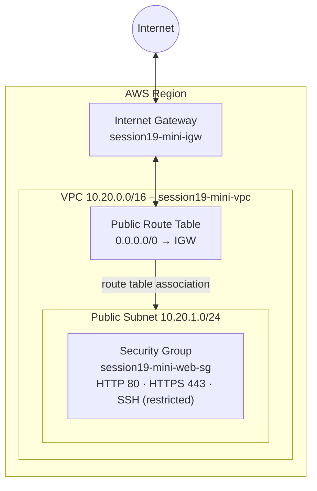
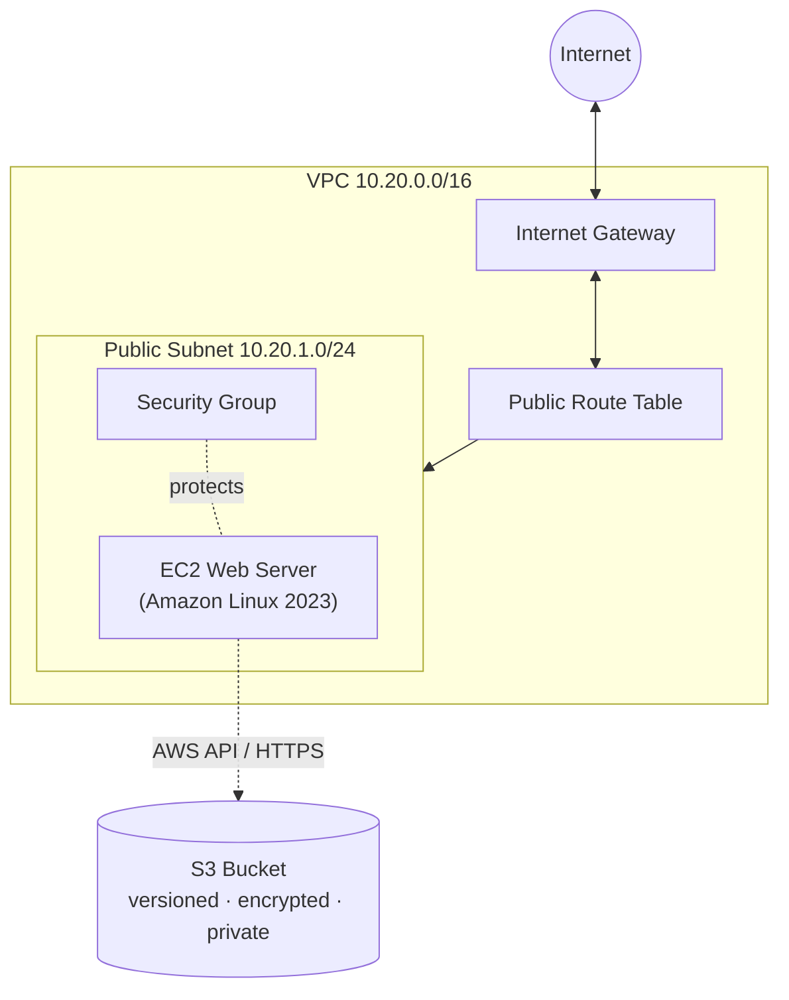
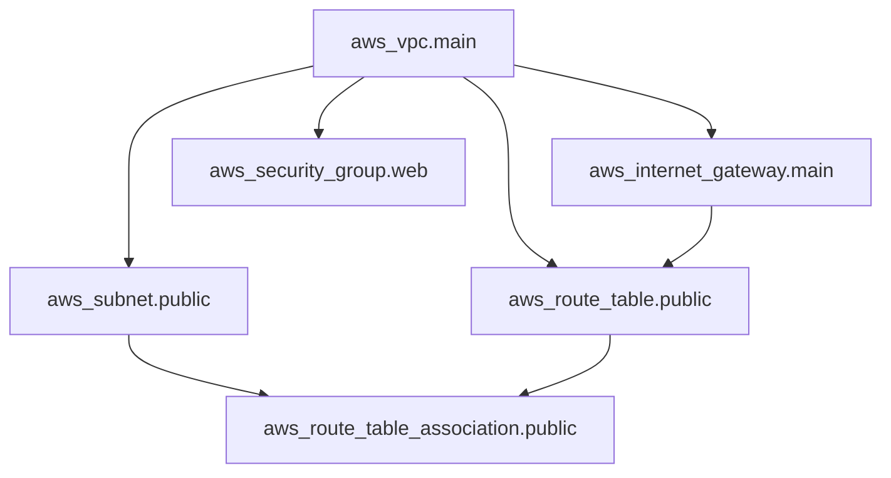

# Session 19 – Cloud & Terraform in Action

## Student Details

**Name:** Ankita Tripathi  
**Roll Number:** 24BCS10062  


> An end-to-end AWS network built **entirely with Terraform** – a custom VPC, public subnet, Internet Gateway, route table, route table association and security group – with the full lifecycle demonstrated: `init → fmt → validate → plan → apply → verify → destroy`.

---

## Table of Contents

1. [Project Objective](#1-project-objective)
2. [Concepts Demonstrated](#2-concepts-demonstrated)
3. [Architecture Diagram](#3-architecture-diagram)
4. [AWS Resources Created](#4-aws-resources-created)
5. [Project Structure](#5-project-structure)
6. [Prerequisites](#6-prerequisites)
7. [Code Walkthrough](#7-code-walkthrough)
8. [Terraform Commands (Step by Step)](#8-terraform-commands-step-by-step)
9. [Resource Dependencies](#9-resource-dependencies)
10. [Terraform State](#10-terraform-state)
11. [Verification](#11-verification)
12. [Terminal Evidence – Commands & Responses](#12-terminal-evidence--commands--responses)
13. [Cleanup – terraform destroy](#13-cleanup--terraform-destroy)
14. [Extension – EC2 + S3](#14-extension--ec2--s3)
15. [Design Questions Answered](#15-design-questions-answered)
16. [Interview Questions Answered](#16-interview-questions-answered)
17. [Security & Cost Notes](#17-security--cost-notes)
18. [Troubleshooting](#18-troubleshooting)
19. [Key Learnings](#19-key-learnings)
20. [Deliverables Checklist](#20-deliverables-checklist)

---

## 1. Project Objective

Combine three areas of knowledge into one working project:

```text
Cloud fundamentals  +  Networking  +  Terraform
```

The goal is to provision a **production-style network foundation** on AWS using code instead of clicking through the console, and to prove understanding of how Terraform plans, creates, tracks and destroys infrastructure.

**Why Infrastructure as Code?**

| Manual console clicks | Terraform |
|---|---|
| Hard to repeat | Repeatable with one command |
| No history of what changed | Version-controlled in Git |
| Easy to forget a setting | Declarative – code is the source of truth |
| Painful to clean up | `terraform destroy` removes everything |
| Drift goes unnoticed | `terraform plan` detects drift |

---

## 2. Concepts Demonstrated

| Required concept | Where it is demonstrated |
|---|---|
| **Terraform providers** | `versions.tf` – `hashicorp/aws` provider with version constraint and region |
| **Variables** | `variables.tf` + `terraform.tfvars.example` – region, CIDRs, project name, AZ, SSH CIDR |
| **Resources** | `main.tf` – 6 AWS resources |
| **Outputs** | `outputs.tf` – VPC ID, VPC CIDR, subnet ID, security group ID |
| **Dependencies** | Implicit (resource references) and explicit (`depends_on`) – see [section 9](#9-resource-dependencies) |
| **AWS infrastructure** | VPC, Subnet, IGW, Route Table, Association, Security Group |
| **Terraform state** | `terraform state list` / `show` – see [section 10](#10-terraform-state) |
| **terraform plan** | [Section 8](#8-terraform-commands-step-by-step), Step 5 |
| **terraform apply** | [Section 8](#8-terraform-commands-step-by-step), Step 6 |
| **terraform destroy** | [Section 13](#13-cleanup--terraform-destroy) |

---

## 3. Architecture Diagram

### 3.1 Network Diagram

```text
                              Internet
                                 |
                                 v
                        +------------------+
                        | Internet Gateway |   session19-mini-igw
                        +--------+---------+
                                 |
 +-------------------------------+--------------------------------+
 |  AWS Region (e.g. us-east-1)                                   |
 |                                                                |
 |   +--------------------------+--------------------------+      |
 |   |  VPC  10.20.0.0/16       |   session19-mini-vpc     |      |
 |   |                          |                          |      |
 |   |   +------------------------------------------+      |      |
 |   |   | Public Route Table  (session19-mini-public-rt)     |      |
 |   |   |   10.20.0.0/16 -> local                  |      |      |
 |   |   |   0.0.0.0/0    -> Internet Gateway       |      |      |
 |   |   +--------------------+---------------------+      |      |
 |   |                        | (association)              |      |
 |   |                        v                            |      |
 |   |   +------------------------------------------+      |      |
 |   |   | Public Subnet  10.20.1.0/24              |      |      |
 |   |   | session19-mini-public-subnet  (AZ: 1a)   |      |      |
 |   |   |                                          |      |      |
 |   |   |   +----------------------------------+   |      |      |
 |   |   |   | Security Group: session19-mini-  |   |      |      |
 |   |   |   | web-sg   (80, 443, 22*)          |   |      |      |
 |   |   |   +----------------------------------+   |      |      |
 |   |   +------------------------------------------+      |      |
 |   +---------------------------------------------------- +      |
 +----------------------------------------------------------------+

 * SSH is limited to the administrator's IP, never 0.0.0.0/0
```

### 3.2 Mermaid Diagram (renders automatically on GitHub)



### 3.3 Extended Architecture (optional EC2 + S3)



### 3.4 Traffic Flow

1. A user on the internet sends an HTTP request to the instance's public IP.
2. The request enters the VPC through the **Internet Gateway**.
3. The **route table** attached to the subnet knows how to reach `0.0.0.0/0` via the IGW (and local traffic stays in `10.20.0.0/16`).
4. The **Security Group** checks the inbound rules – port 80/443 are allowed, everything else is denied by default.
5. The response travels back out through the same path (security groups are **stateful**, so no extra outbound rule is needed for replies).

---

## 4. AWS Resources Created

| # | Terraform address | AWS resource | Name tag / key setting | Purpose |
|---|---|---|---|---|
| 1 | `aws_vpc.main` | VPC | `session19-mini-vpc` · `10.20.0.0/16` | Isolated virtual network |
| 2 | `aws_subnet.public` | Subnet | `session19-mini-public-subnet` · `10.20.1.0/24` | Public IP range inside the VPC |
| 3 | `aws_internet_gateway.main` | Internet Gateway | `session19-mini-igw` | Door between the VPC and the internet |
| 4 | `aws_route_table.public` | Route Table | `session19-mini-public-rt` · `0.0.0.0/0 → IGW` | Sends internet-bound traffic to the IGW |
| 5 | `aws_route_table_association.public` | Route Table Association | subnet ⇄ route table | Makes the subnet *public* |
| 6 | `aws_security_group.web` | Security Group | `session19-mini-web-sg` | Instance-level firewall |

**Total: 6 resources** → `Plan: 6 to add` → `Destroy complete! Resources: 6 destroyed.`

---

## 5. Project Structure

```text
08-mini-project/
|
|-- README.md                    # This documentation
|-- versions.tf                  # Terraform version + AWS provider
|-- variables.tf                 # Input variables
|-- main.tf                      # AWS resources
|-- outputs.tf                   # Output values
|-- terraform.tfvars.example     # Sample variable values (safe to commit)
|-- .gitignore                   # Keeps state and secrets out of Git
```

> `terraform.tfvars`, `.terraform/` and `*.tfstate` are **generated locally** and are intentionally excluded from Git.

---

## 6. Prerequisites

| Requirement | Check with | Notes |
|---|---|---|
| Terraform ≥ 1.5 | `terraform version` | https://developer.hashicorp.com/terraform/install |
| AWS CLI v2 | `aws --version` | Needed for authentication and optional verification |
| AWS account + IAM user/role | `aws sts get-caller-identity` | Needs EC2/VPC permissions (S3 for the extension) |
| Credentials configured | `aws configure` | Never hard-code keys in `.tf` files |

```bash
# Configure credentials once
aws configure

# Confirm which identity Terraform will use
aws sts get-caller-identity
```

---

## 7. Code Walkthrough

### 7.1 `versions.tf` – Providers

Pins the Terraform CLI version and the AWS provider so the project behaves the same on every machine.

```hcl
terraform {
  required_version = ">= 1.5.0"

  required_providers {
    aws = {
      source  = "hashicorp/aws"
      version = "~> 5.0"
    }
  }
}

provider "aws" {
  region = var.aws_region

  default_tags {
    tags = {
      Project   = var.project_name
      ManagedBy = "Terraform"
      Session   = "19"
    }
  }
}
```

**Key points**
- `required_providers` tells `terraform init` which plugin to download from the Terraform Registry.
- `~> 5.0` allows any `5.x` release but blocks a surprise major upgrade.
- `default_tags` automatically tags every resource that supports tags.

### 7.2 `variables.tf` – Inputs

Nothing environment-specific is hard-coded in `main.tf`.

```hcl
variable "aws_region" {
  description = "AWS region where resources are created"
  type        = string
  default     = "us-east-1"
}

variable "project_name" {
  description = "Prefix used in resource names and tags"
  type        = string
  default     = "session19-mini"
}

variable "vpc_cidr" {
  description = "CIDR block for the VPC"
  type        = string
  default     = "10.20.0.0/16"
}

variable "public_subnet_cidr" {
  description = "CIDR block for the public subnet (must be inside vpc_cidr)"
  type        = string
  default     = "10.20.1.0/24"
}

variable "availability_zone" {
  description = "Availability Zone for the public subnet"
  type        = string
  default     = "us-east-1a"
}

variable "admin_cidr" {
  description = "CIDR allowed to SSH in (your public IP /32). Never use 0.0.0.0/0"
  type        = string
  default     = "203.0.113.25/32" # documentation-range placeholder – override it!

  validation {
    condition     = var.admin_cidr != "0.0.0.0/0"
    error_message = "SSH must not be open to the whole internet. Use your own IP, e.g. 1.2.3.4/32."
  }
}
```

### 7.3 `terraform.tfvars.example` – Sample values

```hcl
aws_region         = "us-east-1"
project_name       = "session19-mini"
vpc_cidr           = "10.20.0.0/16"
public_subnet_cidr = "10.20.1.0/24"
availability_zone  = "us-east-1a"

# Find your IP with:  curl ifconfig.me
admin_cidr = "203.0.113.25/32"
```

### 7.4 `main.tf` – Resources

```hcl
# 1. VPC -------------------------------------------------------------
resource "aws_vpc" "main" {
  cidr_block           = var.vpc_cidr
  enable_dns_support   = true
  enable_dns_hostnames = true

  tags = {
    Name = "${var.project_name}-vpc"
  }
}

# 2. Public Subnet ---------------------------------------------------
resource "aws_subnet" "public" {
  vpc_id                  = aws_vpc.main.id          # implicit dependency on the VPC
  cidr_block              = var.public_subnet_cidr
  availability_zone       = var.availability_zone
  map_public_ip_on_launch = true

  tags = {
    Name = "${var.project_name}-public-subnet"
  }
}

# 3. Internet Gateway ------------------------------------------------
resource "aws_internet_gateway" "main" {
  vpc_id = aws_vpc.main.id

  tags = {
    Name = "${var.project_name}-igw"
  }
}

# 4. Public Route Table ---------------------------------------------
resource "aws_route_table" "public" {
  vpc_id = aws_vpc.main.id

  route {
    cidr_block = "0.0.0.0/0"
    gateway_id = aws_internet_gateway.main.id        # depends on the IGW
  }

  tags = {
    Name = "${var.project_name}-public-rt"
  }
}

# 5. Route Table Association ----------------------------------------
resource "aws_route_table_association" "public" {
  subnet_id      = aws_subnet.public.id
  route_table_id = aws_route_table.public.id
}

# 6. Security Group --------------------------------------------------
resource "aws_security_group" "web" {
  name        = "${var.project_name}-web-sg"
  description = "Allow HTTP/HTTPS from anywhere and SSH from admin IP only"
  vpc_id      = aws_vpc.main.id

  ingress {
    description = "HTTP"
    from_port   = 80
    to_port     = 80
    protocol    = "tcp"
    cidr_blocks = ["0.0.0.0/0"]
  }

  ingress {
    description = "HTTPS"
    from_port   = 443
    to_port     = 443
    protocol    = "tcp"
    cidr_blocks = ["0.0.0.0/0"]
  }

  ingress {
    description = "SSH from admin only"
    from_port   = 22
    to_port     = 22
    protocol    = "tcp"
    cidr_blocks = [var.admin_cidr]
  }

  egress {
    description = "Allow all outbound traffic"
    from_port   = 0
    to_port     = 0
    protocol    = "-1"
    cidr_blocks = ["0.0.0.0/0"]
  }

  tags = {
    Name = "${var.project_name}-web-sg"
  }
}
```

### 7.5 `outputs.tf` – Outputs

```hcl
output "vpc_id" {
  description = "ID of the VPC"
  value       = aws_vpc.main.id
}

output "vpc_cidr" {
  description = "CIDR block of the VPC"
  value       = aws_vpc.main.cidr_block
}

output "subnet_id" {
  description = "ID of the public subnet"
  value       = aws_subnet.public.id
}

output "security_group_id" {
  description = "ID of the web security group"
  value       = aws_security_group.web.id
}
```

### 7.6 `.gitignore`

```gitignore
# Local Terraform working directory
.terraform/

# State files – may contain sensitive data
*.tfstate
*.tfstate.*

# Crash logs
crash.log
crash.*.log

# Real variable values (the .example file IS committed)
terraform.tfvars
*.auto.tfvars

# Plan files
*.tfplan
tfplan

# Override files
override.tf
override.tf.json
*_override.tf
*_override.tf.json

# OS / editor
.DS_Store
.vscode/
.idea/
```

> ✅ `.terraform.lock.hcl` **is committed** – it locks exact provider versions for reproducible runs.

---

## 8. Terraform Commands (Step by Step)

### Quick reference

| Step | Command | What it does |
|---|---|---|
| 1 | `cp terraform.tfvars.example terraform.tfvars` | Create local variable values |
| 2 | `terraform init` | Download the AWS provider, create `.terraform/` and the lock file |
| 3 | `terraform fmt` | Auto-format code to canonical style |
| 4 | `terraform validate` | Check syntax and internal consistency |
| 5 | `terraform plan` | Preview what will be created (no changes made) |
| 6 | `terraform apply` | Create the infrastructure |
| 7 | `terraform output` | Display output values |
| 8 | `terraform state list` | List resources tracked in state |
| 9 | `terraform plan -destroy` | Preview what destroy will remove |
| 10 | `terraform destroy` | Delete all managed infrastructure |

### Step 1 – Copy the variables

```bash
cp terraform.tfvars.example terraform.tfvars
```

### Step 2 – Initialize

```bash
terraform init
```

Expected (shape):

```text
Initializing the backend...
Initializing provider plugins...
- Finding hashicorp/aws versions matching "~> 5.0"...
- Installing hashicorp/aws v5.x.x...
- Installed hashicorp/aws v5.x.x (signed by HashiCorp)

Terraform has been successfully initialized!
```

### Step 3 – Format

```bash
terraform fmt
```

### Step 4 – Validate

```bash
terraform validate
```

```text
Success! The configuration is valid.
```

### Step 5 – Plan

```bash
terraform plan
```

Expected (shape):

```text
Terraform will perform the following actions:

  # aws_internet_gateway.main will be created
  # aws_route_table.public will be created
  # aws_route_table_association.public will be created
  # aws_security_group.web will be created
  # aws_subnet.public will be created
  # aws_vpc.main will be created

Plan: 6 to add, 0 to change, 0 to destroy.

Changes to Outputs:
  + security_group_id = (known after apply)
  + subnet_id         = (known after apply)
  + vpc_cidr          = "10.20.0.0/16"
  + vpc_id            = (known after apply)
```

> `plan` is **read-only** – it never changes real infrastructure. Symbols: `+` create, `~` update in place, `-` destroy, `-/+` replace.

### Step 6 – Apply

```bash
terraform apply
```

Type `yes` when prompted.

```text
aws_vpc.main: Creating...
aws_vpc.main: Creation complete after 2s [id=vpc-xxxxxxxx]
aws_internet_gateway.main: Creating...
aws_subnet.public: Creating...
aws_security_group.web: Creating...
aws_route_table.public: Creating...
aws_route_table_association.public: Creating...
...
Apply complete! Resources: 6 added, 0 changed, 0 destroyed.

Outputs:

security_group_id = "sg-xxxxxxxxxxxxxxxxx"
subnet_id = "subnet-xxxxxxxxxxxxxxxxx"
vpc_cidr = "10.20.0.0/16"
vpc_id = "vpc-xxxxxxxxxxxxxxxxx"
```

### Optional – save a plan and apply exactly that plan

```bash
terraform plan -out=tfplan
terraform apply tfplan
```

This guarantees that what you reviewed is exactly what gets applied (recommended in CI/CD pipelines).

---

## 9. Resource Dependencies

Terraform builds a **dependency graph** and creates resources in the correct order – and in **parallel** where possible.

### 9.1 Implicit dependencies (via references)

When one resource references another's attribute, Terraform automatically knows the order:

| Resource | References | Therefore waits for |
|---|---|---|
| `aws_subnet.public` | `aws_vpc.main.id` | VPC |
| `aws_internet_gateway.main` | `aws_vpc.main.id` | VPC |
| `aws_security_group.web` | `aws_vpc.main.id` | VPC |
| `aws_route_table.public` | `aws_vpc.main.id`, `aws_internet_gateway.main.id` | VPC **and** IGW |
| `aws_route_table_association.public` | `aws_subnet.public.id`, `aws_route_table.public.id` | Subnet **and** Route Table |

### 9.2 Dependency graph



**Creation order:** VPC → (Subnet ‖ IGW ‖ SG) → Route Table → Association
**Destruction order:** the exact reverse (Association → Route Table → …→ VPC).

### 9.3 Explicit dependencies (`depends_on`)

Use `depends_on` when the dependency exists but is **not visible** through an attribute reference. Example from the EC2 extension – the instance needs internet access (for `yum`/`dnf` in user-data) so it must wait for the route:

```hcl
resource "aws_instance" "web" {
  # ...
  depends_on = [aws_route_table_association.public]
}
```

### 9.4 Visualize it yourself

```bash
terraform graph | dot -Tpng > dependency-graph.png   # needs Graphviz
```

---

## 10. Terraform State

Terraform records what it created in a **state file** (`terraform.tfstate`). It maps every resource in your code to the real object in AWS.

```bash
terraform state list
```

```text
aws_internet_gateway.main
aws_route_table.public
aws_route_table_association.public
aws_security_group.web
aws_subnet.public
aws_vpc.main
```

Inspect a single resource:

```bash
terraform state show aws_vpc.main
```

### Why state matters

| Purpose | Explanation |
|---|---|
| **Mapping** | Links `aws_vpc.main` in code to `vpc-0abc…` in AWS |
| **Diffing** | `plan` compares *code* ↔ *state* ↔ *real infrastructure* |
| **Dependencies** | Stores resource relationships for correct destroy order |
| **Performance** | Caches attributes so every plan does not re-query everything |

### State safety rules

- ❌ **Never commit** `terraform.tfstate` to Git – it can contain secrets and IDs.
- ❌ **Never edit** it by hand – use `terraform state mv / rm` and `terraform import`.
- ✅ For teams, use a **remote backend** (S3 with encryption and locking):

```hcl
terraform {
  backend "s3" {
    bucket       = "my-terraform-state-bucket"
    key          = "session19/mini-project/terraform.tfstate"
    region       = "us-east-1"
    encrypt      = true
    use_lockfile = true   # native S3 state locking (Terraform ≥ 1.10)
  }
}
```

> This project uses **local state** for simplicity; the remote backend above is the production-grade next step.

---

## 11. Verification

### 11.1 Terraform outputs

```bash
terraform output
```

```text
security_group_id = "sg-..."
subnet_id = "subnet-..."
vpc_cidr = "10.20.0.0/16"
vpc_id = "vpc-..."
```

Single value (useful in scripts):

```bash
terraform output -raw vpc_id
```

### 11.2 AWS CLI (optional – the Console works too)

**VPC**

```bash
aws ec2 describe-vpcs \
  --filters "Name=tag:Name,Values=session19-mini-vpc" \
  --query 'Vpcs[].{VpcId:VpcId,Cidr:CidrBlock,State:State}'
```

**Subnet**

```bash
aws ec2 describe-subnets \
  --filters "Name=tag:Name,Values=session19-mini-public-subnet" \
  --query 'Subnets[].{SubnetId:SubnetId,Cidr:CidrBlock,AZ:AvailabilityZone}'
```

**Route table**

```bash
aws ec2 describe-route-tables \
  --filters "Name=tag:Name,Values=session19-mini-public-rt" \
  --query 'RouteTables[].{RouteTableId:RouteTableId,VpcId:VpcId}'
```

**Security group**

```bash
aws ec2 describe-security-groups \
  --filters "Name=group-name,Values=session19-mini-web-sg" \
  --query 'SecurityGroups[].{GroupId:GroupId,VpcId:VpcId}'
```

### 11.3 AWS Console

| Service | Where to look | What to confirm |
|---|---|---|
| **VPC → Your VPCs** | `session19-mini-vpc` | CIDR `10.20.0.0/16`, state *Available* |
| **VPC → Subnets** | `session19-mini-public-subnet` | CIDR `10.20.1.0/24`, auto-assign public IP on |
| **VPC → Internet Gateways** | `session19-mini-igw` | State *Attached* to the VPC |
| **VPC → Route Tables** | `session19-mini-public-rt` | Route `0.0.0.0/0 → igw-…`, associated with the subnet |
| **VPC → Security Groups** | `session19-mini-web-sg` | Inbound 80, 443, 22 (restricted) |

### 11.4 Idempotency check

Run `terraform plan` again immediately after `apply`:

```text
No changes. Your infrastructure matches the configuration.
```

This proves Terraform is **idempotent** – re-running does nothing when nothing changed.

---

## 12. Terminal Evidence – Commands & Responses

This section is a record of one complete lifecycle run, in order: **init → fmt → validate → plan → apply → output → state → AWS CLI verification → idempotency check → destroy plan → destroy → post-destroy check.**

> Resource IDs (`vpc-0a1b…`, `sg-0c3d…`) and timings are representative. Your own run will print different IDs, but the structure and the resource counts are identical.

### 12.1 `terraform init`

```bash
$ terraform init
```

```text
Initializing the backend...

Initializing provider plugins...
- Finding hashicorp/aws versions matching "~> 5.0"...
- Installing hashicorp/aws v5.x.x...
- Installed hashicorp/aws v5.x.x (signed by HashiCorp)

Terraform has created a lock file .terraform.lock.hcl to record the provider
selections it made above. Include this file in your version control repository
so that Terraform can guarantee to make the same selections by default when
you run "terraform init" in the future.

Terraform has been successfully initialized!
```

### 12.2 `terraform fmt` and `terraform validate`

```bash
$ terraform fmt
main.tf          # (printed only if a file was reformatted; silence = already formatted)

$ terraform validate
```

```text
Success! The configuration is valid.
```

### 12.3 `terraform plan`

```bash
$ terraform plan
```

```text
Terraform used the selected providers to generate the following execution plan.
Resource actions are indicated with the following symbols:
  + create

Terraform will perform the following actions:

  # aws_internet_gateway.main will be created
  + resource "aws_internet_gateway" "main" {
      + id       = (known after apply)
      + vpc_id   = (known after apply)
      + tags     = {
          + "Name" = "session19-mini-igw"
        }
    }

  # aws_route_table.public will be created
  + resource "aws_route_table" "public" {
      + id       = (known after apply)
      + route    = [
          + {
              + cidr_block = "0.0.0.0/0"
              + gateway_id = (known after apply)
            },
        ]
      + vpc_id   = (known after apply)
      + tags     = {
          + "Name" = "session19-mini-public-rt"
        }
    }

  # aws_route_table_association.public will be created
  + resource "aws_route_table_association" "public" {
      + id             = (known after apply)
      + route_table_id = (known after apply)
      + subnet_id      = (known after apply)
    }

  # aws_security_group.web will be created
  + resource "aws_security_group" "web" {
      + name        = "session19-mini-web-sg"
      + description = "Allow HTTP/HTTPS from anywhere and SSH from admin IP only"
      + ingress     = [
          + { from_port = 22  to_port = 22  protocol = "tcp"  description = "SSH from admin only" ... },
          + { from_port = 443 to_port = 443 protocol = "tcp"  description = "HTTPS" ... },
          + { from_port = 80  to_port = 80  protocol = "tcp"  description = "HTTP" ... },
        ]
      + vpc_id      = (known after apply)
      ...
    }

  # aws_subnet.public will be created
  + resource "aws_subnet" "public" {
      + availability_zone       = "us-east-1a"
      + cidr_block              = "10.20.1.0/24"
      + map_public_ip_on_launch = true
      + vpc_id                  = (known after apply)
      ...
    }

  # aws_vpc.main will be created
  + resource "aws_vpc" "main" {
      + cidr_block           = "10.20.0.0/16"
      + enable_dns_hostnames = true
      + enable_dns_support   = true
      + id                   = (known after apply)
      + tags                 = {
          + "Name" = "session19-mini-vpc"
        }
      ...
    }

Plan: 6 to add, 0 to change, 0 to destroy.

Changes to Outputs:
  + security_group_id = (known after apply)
  + subnet_id         = (known after apply)
  + vpc_cidr          = "10.20.0.0/16"
  + vpc_id            = (known after apply)
```

**What this proves:** Terraform computed the diff between code and reality (nothing exists yet) and will create exactly 6 resources. Nothing was changed in AWS.

### 12.4 `terraform apply`

```bash
$ terraform apply
```

```text
Plan: 6 to add, 0 to change, 0 to destroy.

Do you want to perform these actions?
  Terraform will perform the actions described above.
  Only 'yes' will be accepted to approve.

  Enter a value: yes

aws_vpc.main: Creating...
aws_vpc.main: Creation complete after 2s [id=vpc-0a1b2c3d4e5f67890]
aws_internet_gateway.main: Creating...
aws_subnet.public: Creating...
aws_security_group.web: Creating...
aws_internet_gateway.main: Creation complete after 1s [id=igw-0f1e2d3c4b5a69788]
aws_route_table.public: Creating...
aws_subnet.public: Creation complete after 1s [id=subnet-0123456789abcdef0]
aws_security_group.web: Creation complete after 3s [id=sg-0c3d4e5f6a7b8c9d0]
aws_route_table.public: Creation complete after 1s [id=rtb-0abcdef1234567890]
aws_route_table_association.public: Creating...
aws_route_table_association.public: Creation complete after 0s [id=rtbassoc-0987654321fedcba0]

Apply complete! Resources: 6 added, 0 changed, 0 destroyed.

Outputs:

security_group_id = "sg-0c3d4e5f6a7b8c9d0"
subnet_id = "subnet-0123456789abcdef0"
vpc_cidr = "10.20.0.0/16"
vpc_id = "vpc-0a1b2c3d4e5f67890"
```

**What this proves:** the dependency order is respected. The VPC is created first. The IGW, subnet and security group follow. The route table waits for the IGW, and the association is created last.

### 12.5 `terraform output`

```bash
$ terraform output
```

```text
security_group_id = "sg-0c3d4e5f6a7b8c9d0"
subnet_id = "subnet-0123456789abcdef0"
vpc_cidr = "10.20.0.0/16"
vpc_id = "vpc-0a1b2c3d4e5f67890"
```

```bash
$ terraform output -raw vpc_id
```

```text
vpc-0a1b2c3d4e5f67890
```

### 12.6 `terraform state list` and `terraform state show`

```bash
$ terraform state list
```

```text
aws_internet_gateway.main
aws_route_table.public
aws_route_table_association.public
aws_security_group.web
aws_subnet.public
aws_vpc.main
```

```bash
$ terraform state show aws_vpc.main
```

```text
# aws_vpc.main:
resource "aws_vpc" "main" {
    arn                                  = "arn:aws:ec2:us-east-1:123456789012:vpc/vpc-0a1b2c3d4e5f67890"
    cidr_block                           = "10.20.0.0/16"
    enable_dns_hostnames                 = true
    enable_dns_support                   = true
    id                                   = "vpc-0a1b2c3d4e5f67890"
    instance_tenancy                     = "default"
    tags                                 = {
        "Name" = "session19-mini-vpc"
    }
    ...
}
```

### 12.7 AWS CLI verification

**VPC**

```bash
$ aws ec2 describe-vpcs \
    --filters "Name=tag:Name,Values=session19-mini-vpc" \
    --query 'Vpcs[].{VpcId:VpcId,Cidr:CidrBlock,State:State}'
```

```json
[
    {
        "VpcId": "vpc-0a1b2c3d4e5f67890",
        "Cidr": "10.20.0.0/16",
        "State": "available"
    }
]
```

**Subnet**

```bash
$ aws ec2 describe-subnets \
    --filters "Name=tag:Name,Values=session19-mini-public-subnet" \
    --query 'Subnets[].{SubnetId:SubnetId,Cidr:CidrBlock,AZ:AvailabilityZone}'
```

```json
[
    {
        "SubnetId": "subnet-0123456789abcdef0",
        "Cidr": "10.20.1.0/24",
        "AZ": "us-east-1a"
    }
]
```

**Route table**

```bash
$ aws ec2 describe-route-tables \
    --filters "Name=tag:Name,Values=session19-mini-public-rt" \
    --query 'RouteTables[].{RouteTableId:RouteTableId,VpcId:VpcId}'
```

```json
[
    {
        "RouteTableId": "rtb-0abcdef1234567890",
        "VpcId": "vpc-0a1b2c3d4e5f67890"
    }
]
```

**Routes inside that route table** (confirms the Internet Gateway route)

```bash
$ aws ec2 describe-route-tables \
    --filters "Name=tag:Name,Values=session19-mini-public-rt" \
    --query 'RouteTables[].Routes[].{Destination:DestinationCidrBlock,Target:GatewayId}'
```

```json
[
    {
        "Destination": "10.20.0.0/16",
        "Target": "local"
    },
    {
        "Destination": "0.0.0.0/0",
        "Target": "igw-0f1e2d3c4b5a69788"
    }
]
```

**Security group**

```bash
$ aws ec2 describe-security-groups \
    --filters "Name=group-name,Values=session19-mini-web-sg" \
    --query 'SecurityGroups[].{GroupId:GroupId,VpcId:VpcId}'
```

```json
[
    {
        "GroupId": "sg-0c3d4e5f6a7b8c9d0",
        "VpcId": "vpc-0a1b2c3d4e5f67890"
    }
]
```

**Security group inbound ports**

```bash
$ aws ec2 describe-security-groups \
    --filters "Name=group-name,Values=session19-mini-web-sg" \
    --query 'SecurityGroups[].IpPermissions[].{Port:FromPort,Proto:IpProtocol,Source:IpRanges[0].CidrIp}'
```

```json
[
    { "Port": 80,  "Proto": "tcp", "Source": "0.0.0.0/0" },
    { "Port": 443, "Proto": "tcp", "Source": "0.0.0.0/0" },
    { "Port": 22,  "Proto": "tcp", "Source": "203.0.113.25/32" }
]
```

**What this proves:** the resources exist in AWS exactly as the code describes. SSH is limited to a single IP, and the route table sends `0.0.0.0/0` to the Internet Gateway.

### 12.8 Idempotency check – `terraform plan` after apply

```bash
$ terraform plan
```

```text
aws_vpc.main: Refreshing state... [id=vpc-0a1b2c3d4e5f67890]
aws_internet_gateway.main: Refreshing state... [id=igw-0f1e2d3c4b5a69788]
aws_subnet.public: Refreshing state... [id=subnet-0123456789abcdef0]
aws_security_group.web: Refreshing state... [id=sg-0c3d4e5f6a7b8c9d0]
aws_route_table.public: Refreshing state... [id=rtb-0abcdef1234567890]
aws_route_table_association.public: Refreshing state... [id=rtbassoc-0987654321fedcba0]

No changes. Your infrastructure matches the configuration.

Terraform has compared your real infrastructure against your configuration
and found no differences, so no changes are needed.
```

### 12.9 Destroy preview – `terraform plan -destroy`

```bash
$ terraform plan -destroy
```

```text
Terraform will perform the following actions:

  # aws_internet_gateway.main will be destroyed
  # aws_route_table.public will be destroyed
  # aws_route_table_association.public will be destroyed
  # aws_security_group.web will be destroyed
  # aws_subnet.public will be destroyed
  # aws_vpc.main will be destroyed

Plan: 0 to add, 0 to change, 6 to destroy.

Changes to Outputs:
  - security_group_id = "sg-0c3d4e5f6a7b8c9d0" -> null
  - subnet_id         = "subnet-0123456789abcdef0" -> null
  - vpc_cidr          = "10.20.0.0/16" -> null
  - vpc_id            = "vpc-0a1b2c3d4e5f67890" -> null
```

### 12.10 `terraform destroy`

```bash
$ terraform destroy
```

```text
Plan: 0 to add, 0 to change, 6 to destroy.

Do you really want to destroy all resources?
  Terraform will destroy all your managed infrastructure, as shown above.
  There is no undo. Only 'yes' will be accepted to confirm.

  Enter a value: yes

aws_route_table_association.public: Destroying... [id=rtbassoc-0987654321fedcba0]
aws_security_group.web: Destroying... [id=sg-0c3d4e5f6a7b8c9d0]
aws_route_table_association.public: Destruction complete after 0s
aws_route_table.public: Destroying... [id=rtb-0abcdef1234567890]
aws_security_group.web: Destruction complete after 1s
aws_subnet.public: Destroying... [id=subnet-0123456789abcdef0]
aws_route_table.public: Destruction complete after 1s
aws_internet_gateway.main: Destroying... [id=igw-0f1e2d3c4b5a69788]
aws_subnet.public: Destruction complete after 1s
aws_internet_gateway.main: Destruction complete after 1s
aws_vpc.main: Destroying... [id=vpc-0a1b2c3d4e5f67890]
aws_vpc.main: Destruction complete after 1s

Destroy complete! Resources: 6 destroyed.
```

**What this proves:** destruction runs in the reverse of creation order. The association goes first, the VPC last.

### 12.11 Post-destroy verification

```bash
$ terraform state list
```

```text
(no output – state is empty)
```

```bash
$ aws ec2 describe-vpcs \
    --filters "Name=tag:Name,Values=session19-mini-vpc" \
    --query 'Vpcs[].VpcId'
```

```json
[]
```

**What this proves:** Terraform's state and AWS agree that nothing is left, so there are no orphaned resources and no ongoing cost.

### 12.12 Lifecycle summary

| Stage | Command | Result |
|---|---|---|
| Initialize | `terraform init` | AWS provider installed, lock file created |
| Format | `terraform fmt` | Code formatted |
| Validate | `terraform validate` | `Success! The configuration is valid.` |
| Preview | `terraform plan` | `Plan: 6 to add, 0 to change, 0 to destroy.` |
| Create | `terraform apply` | `Apply complete! Resources: 6 added, 0 changed, 0 destroyed.` |
| Outputs | `terraform output` | VPC, subnet and SG IDs printed |
| State | `terraform state list` | 6 resources tracked |
| Verify | `aws ec2 describe-*` | All resources confirmed in AWS |
| Drift check | `terraform plan` | `No changes.` |
| Destroy preview | `terraform plan -destroy` | `Plan: 0 to add, 0 to change, 6 to destroy.` |
| Destroy | `terraform destroy` | `Destroy complete! Resources: 6 destroyed.` |

---

## 13. Cleanup – terraform destroy

Always clean up to avoid unexpected AWS charges.

```bash
terraform plan -destroy
```

Review the output (`Plan: 0 to add, 0 to change, 6 to destroy.`), then:

```bash
terraform destroy
```

Type `yes` when prompted.

```text
aws_route_table_association.public: Destroying...
aws_security_group.web: Destroying...
aws_route_table.public: Destroying...
aws_subnet.public: Destroying...
aws_internet_gateway.main: Destroying...
aws_vpc.main: Destroying...

Destroy complete! Resources: 6 destroyed.
```

**Confirm nothing is left:**

```bash
terraform state list          # should print nothing
aws ec2 describe-vpcs --filters "Name=tag:Name,Values=session19-mini-vpc" \
  --query 'Vpcs[].VpcId'      # should print []
```

> Targeted destroy for one resource: `terraform destroy -target=aws_security_group.web` (use sparingly – it bypasses full-graph safety).

---

## 14. Extension – EC2 + S3

> **Prerequisite:** the core VPC lab must work first. This extension turns the network into the full suggested architecture: **VPC → Subnet → Security Group → EC2 + S3**.
> After adding it, `terraform plan` shows more resources and `destroy` removes them all.

### 14.1 Extra variables (`variables.tf`)

```hcl
variable "instance_type" {
  description = "EC2 instance type"
  type        = string
  default     = "t3.micro"   # free-tier eligible in most regions
}
```

### 14.2 Additional provider (`versions.tf`) – for a unique bucket name

```hcl
terraform {
  required_providers {
    aws = {
      source  = "hashicorp/aws"
      version = "~> 5.0"
    }
    random = {
      source  = "hashicorp/random"
      version = "~> 3.6"
    }
  }
}
```

### 14.3 EC2 instance (`main.tf`)

```hcl
# Latest Amazon Linux 2023 AMI (looked up, never hard-coded)
data "aws_ssm_parameter" "al2023" {
  name = "/aws/service/ami-amazon-linux-latest/al2023-ami-kernel-default-x86_64"
}

resource "aws_instance" "web" {
  ami                    = data.aws_ssm_parameter.al2023.value
  instance_type          = var.instance_type
  subnet_id              = aws_subnet.public.id
  vpc_security_group_ids = [aws_security_group.web.id]

  user_data = <<-EOF
    #!/bin/bash
    dnf install -y nginx
    echo "<h1>Hello from Terraform - Session 19</h1>" > /usr/share/nginx/html/index.html
    systemctl enable --now nginx
  EOF

  metadata_options {
    http_tokens = "required"   # enforce IMDSv2
  }

  root_block_device {
    encrypted = true
  }

  # Needs a working route to the internet before user_data runs
  depends_on = [aws_route_table_association.public]

  tags = {
    Name = "${var.project_name}-web"
  }
}
```

### 14.4 S3 bucket (`main.tf`)

```hcl
resource "random_id" "suffix" {
  byte_length = 4
}

resource "aws_s3_bucket" "assets" {
  bucket = "${var.project_name}-assets-${random_id.suffix.hex}"   # bucket names are globally unique

  tags = {
    Name = "${var.project_name}-assets"
  }
}

resource "aws_s3_bucket_public_access_block" "assets" {
  bucket                  = aws_s3_bucket.assets.id
  block_public_acls       = true
  block_public_policy     = true
  ignore_public_acls      = true
  restrict_public_buckets = true
}

resource "aws_s3_bucket_versioning" "assets" {
  bucket = aws_s3_bucket.assets.id

  versioning_configuration {
    status = "Enabled"
  }
}

resource "aws_s3_bucket_server_side_encryption_configuration" "assets" {
  bucket = aws_s3_bucket.assets.id

  rule {
    apply_server_side_encryption_by_default {
      sse_algorithm = "AES256"
    }
  }
}
```

### 14.5 Extra outputs (`outputs.tf`)

```hcl
output "ec2_instance_id" {
  description = "ID of the web server"
  value       = aws_instance.web.id
}

output "ec2_public_ip" {
  description = "Public IP of the web server"
  value       = aws_instance.web.public_ip
}

output "s3_bucket_name" {
  description = "Name of the S3 bucket"
  value       = aws_s3_bucket.assets.bucket
}
```

### 14.6 Run it

```bash
terraform init -upgrade     # downloads the random provider
terraform plan
terraform apply

curl http://$(terraform output -raw ec2_public_ip)
# -> <h1>Hello from Terraform - Session 19</h1>
```

> Give the instance ~1 minute after `apply` for `user_data` to finish before testing.
> Remember: `terraform destroy` afterwards. EC2 and S3 can incur charges.

---

## 15. Design Questions Answered

**1. Which subnet should the EC2 instance use?**
The **public subnet** (`aws_subnet.public`), because it has a route to the Internet Gateway and auto-assigns public IPs. An instance that must be reached from the internet cannot live in a subnet without that route.

**2. Which security group should it use?**
`aws_security_group.web` – it allows HTTP/HTTPS and restricted SSH. Attached via `vpc_security_group_ids`.

**3. Why does a public subnet need a route to the Internet Gateway?**
The Internet Gateway only *exists* as a door – traffic uses it only if the route table says so. Without `0.0.0.0/0 → igw-…`, packets for the internet have nowhere to go, so the subnet stays effectively private. **The route is what makes a subnet "public".**

**4. What else is required for an EC2 instance to be reachable from the internet?**
All of these must be true at the same time:

| Requirement | Provided by |
|---|---|
| Internet Gateway attached to the VPC | `aws_internet_gateway.main` |
| Route `0.0.0.0/0 → IGW` in the subnet's route table | `aws_route_table.public` + association |
| A public (or Elastic) IP on the instance | `map_public_ip_on_launch = true` |
| Security group allows the inbound port | `aws_security_group.web` |
| Network ACL allows the traffic (default NACL does) | Default NACL |
| A service actually listening on the port | nginx in `user_data` |

**5. Why should SSH not normally be open to `0.0.0.0/0`?**
Port 22 exposed to the whole internet is scanned constantly by bots running brute-force and credential-stuffing attacks, and any SSH vulnerability becomes instantly exploitable. Best practice: restrict to your own `/32`, use key-based auth only, or avoid SSH entirely with **AWS Systems Manager Session Manager** or a bastion/VPN. This project even enforces it with a Terraform `validation` block.

---

## 16. Interview Questions Answered

**1. IaaS vs PaaS vs SaaS**

| Model | You manage | Provider manages | Example |
|---|---|---|---|
| **IaaS** | OS, runtime, apps, data | Hardware, virtualization, network | EC2, VPC |
| **PaaS** | Application + data | OS, runtime, scaling | Elastic Beanstalk, RDS, App Runner |
| **SaaS** | Just use it | Everything | Gmail, Salesforce, Microsoft 365 |

**2. Region vs Availability Zone**
A **Region** is a geographic area (e.g. `us-east-1`) containing multiple isolated **Availability Zones** – one or more physically separate data centers with independent power and networking, linked by low-latency connections. Spreading across AZs gives high availability.

**3. VPC vs Subnet**
A **VPC** is your private, logically isolated network in a Region, defined by a CIDR block (`10.20.0.0/16`). A **Subnet** is a slice of that CIDR (`10.20.1.0/24`) that lives in **one** Availability Zone and holds your resources.

**4. Public vs Private Subnet**
A **public subnet** has a route to an Internet Gateway (resources can have public IPs and be reached from the internet). A **private subnet** has no direct IGW route; it reaches the internet only outbound via a NAT Gateway, or not at all – ideal for databases and backend services.

**5. Route Table**
A set of rules (destination CIDR → target) that decides where network traffic from a subnet is sent. Every VPC has a built-in `local` route; adding `0.0.0.0/0 → IGW` makes a subnet public.

**6. Internet Gateway**
A horizontally scaled, highly available VPC component that enables communication between resources in the VPC and the internet (and performs 1:1 NAT for instances with public IPs). It is attached to exactly one VPC.

**7. Security Group**
A **stateful**, instance-level virtual firewall. Rules are **allow-only** (everything not allowed is denied), inbound and outbound are separate, and return traffic is automatically permitted. Contrast with **NACLs**: stateless, subnet-level, support allow *and* deny.

**8. Terraform**
An open-source **Infrastructure as Code** tool by HashiCorp. You describe the *desired state* in HCL, and Terraform figures out how to reach it through provider plugins – across AWS, Azure, GCP and hundreds of other platforms. It is declarative, idempotent, and cloud-agnostic.

**9. `terraform plan` vs `terraform apply`**

| | `plan` | `apply` |
|---|---|---|
| Changes infrastructure? | **No** – preview only | **Yes** |
| Purpose | Show what *would* happen | Execute the changes |
| Updates state? | No | Yes |
| Confirmation | Not needed | Asks `yes` (unless `-auto-approve` or a saved plan) |

**10. `terraform state`**
A JSON file (`terraform.tfstate`) that records every managed resource and its real-world attributes. Terraform uses it to map code to reality, compute diffs, and order operations. It must be protected, never edited manually, and stored remotely with locking for teams.

**11. `terraform destroy`**
Deletes **all** resources tracked in the state, in reverse dependency order, after confirmation. It is the equivalent of `terraform apply` with an empty configuration, and it is how you guarantee no forgotten resources keep billing you.

---

## 17. Security & Cost Notes

### Security practices followed

- ✅ No AWS credentials in code – uses `aws configure` / environment / IAM roles
- ✅ SSH restricted to the admin IP; Terraform `validation` rejects `0.0.0.0/0`
- ✅ State and `terraform.tfvars` excluded via `.gitignore`
- ✅ Provider and Terraform versions pinned
- ✅ Extension: S3 public access blocked, versioning + encryption on; EC2 enforces IMDSv2 and encrypted root volume
- ✅ Least privilege: only HTTP/HTTPS exposed publicly

### Cost

| Resource | Cost |
|---|---|
| VPC, Subnet, Route Table, IGW, Security Group | **Free** |
| EC2 `t3.micro` (extension) | Free-tier eligible / low hourly cost |
| S3 bucket (extension) | Pennies for tiny data |
| NAT Gateway | **Not used** – this is the expensive one to avoid in labs |

> Run `terraform destroy` when finished. Consider setting an **AWS Budget alert** as a safety net.

---

## 18. Troubleshooting

| Problem | Likely cause | Fix |
|---|---|---|
| `No valid credential sources found` | AWS CLI not configured | `aws configure` or export `AWS_PROFILE` |
| `UnauthorizedOperation` | IAM user lacks permissions | Attach EC2/VPC (and S3) permissions |
| `InvalidSubnet.Range` / `InvalidParameterValue` | Subnet CIDR not inside VPC CIDR | Keep `public_subnet_cidr` within `vpc_cidr` |
| `Unsupported availability zone` | AZ doesn't exist in chosen region | Match `availability_zone` to `aws_region` |
| `VpcLimitExceeded` | Hit the 5-VPC-per-region default | Delete unused VPCs or request a quota increase |
| `DependencyViolation` on destroy | Something outside Terraform uses the VPC | Delete manually-created ENIs/instances, then retry |
| `Error acquiring the state lock` | Previous run crashed | Wait, then `terraform force-unlock <ID>` (carefully) |
| `Provider produced inconsistent result` | Provider bug / eventual consistency | Re-run `terraform apply` |
| `terraform validate` fails on variable | Missing / invalid `.tfvars` value | Check `admin_cidr` isn't `0.0.0.0/0` |
| Cannot reach EC2 in browser | No route / SG rule / `user_data` still running | Check route table, SG port 80, wait ~60 s |

---

## 19. Key Learnings

1. **Declarative > imperative** – I describe *what* I want and Terraform works out *how*.
2. **The plan/apply split is a safety net** – every change is reviewable before it touches AWS.
3. **Dependencies are inferred from references** – referencing `aws_vpc.main.id` is enough to order creation and destruction correctly.
4. **State is the source of truth** – losing or corrupting it breaks the link between code and cloud.
5. **A subnet is "public" because of its route table**, not because of its name.
6. **Security groups are stateful and deny-by-default** – least privilege starts with narrow rules.
7. **Variables + tags + naming conventions** make infrastructure reusable and easy to find in the console.
8. **`destroy` is part of the workflow** – disciplined cleanup avoids surprise bills.

---

## 20. Deliverables Checklist

| Deliverable | Status | Location |
|---|---|---|
| ✅ Terraform project | Complete | `versions.tf`, `variables.tf`, `main.tf`, `outputs.tf`, `terraform.tfvars.example`, `.gitignore` |
| ✅ AWS resources | VPC, Subnet, IGW, Route Table, Association, Security Group (+ optional EC2, S3) | [Section 4](#4-aws-resources-created), [Section 14](#14-extension--ec2--s3) |
| ✅ Architecture diagram | ASCII + Mermaid + extended diagram | [Section 3](#3-architecture-diagram) |
| ✅ Proof of execution | Full terminal commands + responses for every lifecycle stage | [Section 12](#12-terminal-evidence--commands--responses) |
| ✅ Terraform commands | `init`, `fmt`, `validate`, `plan`, `apply`, `output`, `state`, `destroy` | [Section 8](#8-terraform-commands-step-by-step), [Section 13](#13-cleanup--terraform-destroy) |
| ✅ README.md | This document | `README.md` |
| ✅ Providers | `hashicorp/aws` (+ `random`) | [Section 7.1](#71-versionstf--providers) |
| ✅ Variables | 6 input variables with validation | [Section 7.2](#72-variablestf--inputs) |
| ✅ Outputs | VPC ID, CIDR, Subnet ID, SG ID | [Section 7.5](#75-outputstf--outputs) |
| ✅ Dependencies | Implicit + explicit, with graph | [Section 9](#9-resource-dependencies) |
| ✅ Terraform state | `state list` / `show`, remote backend | [Section 10](#10-terraform-state) |
| ✅ Interview Q&A | All 11 questions answered | [Section 16](#16-interview-questions-answered) |

---

## Author

**Name:** Ankita Tripathi
**Session:** 19 – Cloud & Terraform in Action
**Tools:** Terraform · AWS · AWS CLI · Git

---

*Built with Infrastructure as Code – created with `terraform apply`, removed with `terraform destroy`.*